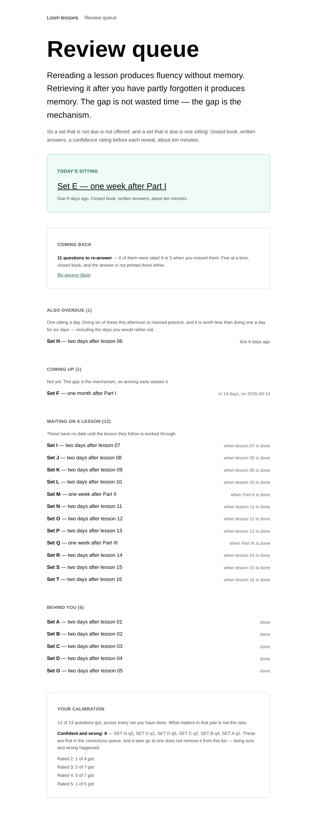
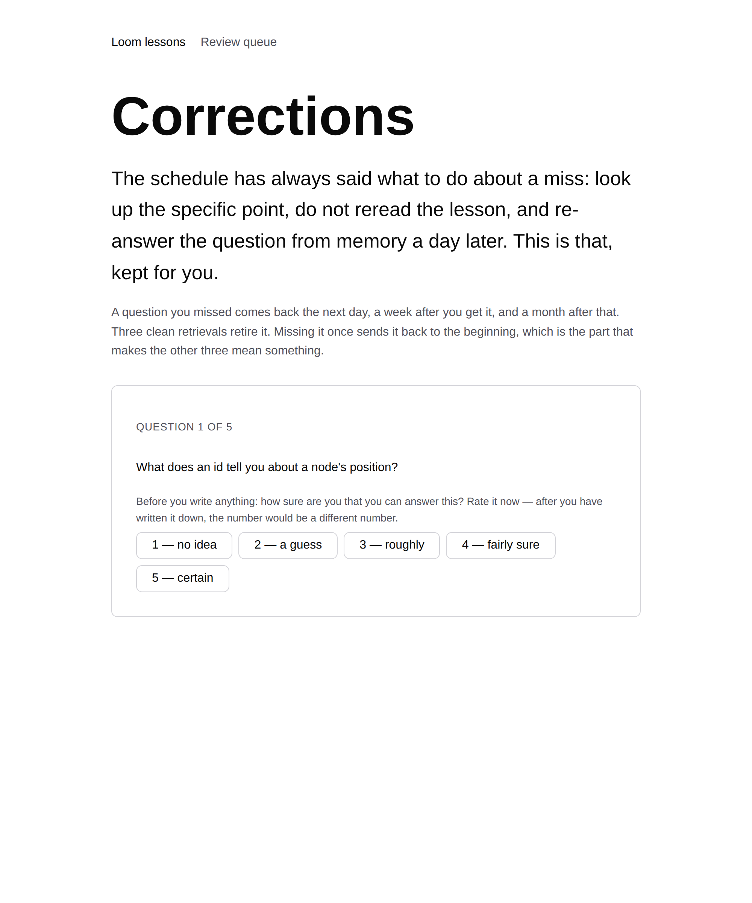
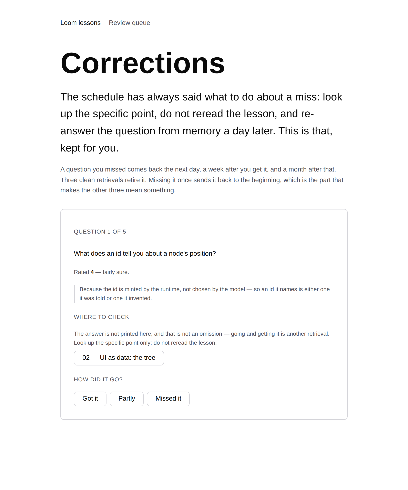

# 2026-08-31 — Machinery: the questions that come back

**Landed:** `apps/loom/app/(lessons)/_lib/corrections.ts` and its tests, the
`Corrections` runner and the `Coming back` panel in `_components/`, a new route
at `/lessons/review/corrections`, a `corrections` field on the stored record in
`_lib/progress.ts`, one shared `reviewPointers` in `_lib/links.ts`, and a
paragraph each in `lessons/README.md` and `lessons/review-schedule.md` saying
what now happens to a miss.

`pnpm install && pnpm verify`: **1741 runtime tests across 111 files green**;
**1992 of 1993 app tests across 136 files**, the one failure being
`(marketing)/_lib/facts.test.ts` — red on `main`, not this lane's file, see
below. `next build` prerenders **70 pages**, one more than before: the new route
is the only page this run adds.

Roughly **five to ten minutes per sitting** for the reader, which is the whole
argument for it — this is the part of the course that has always been asked for
and never done, precisely because doing it by hand takes longer than it is
worth.

## Machinery rather than a lesson, and why it was not close

The syllabus is finished. Lesson 17 completes it and **lesson 17 is not on
`main`** — it is in #168, along with lesson 09's seventh rung in #176, the
exercise runner in #184, and the lessons 07/08 corrections in #192. Nothing in
this lane has merged since **25 August**. Yesterday's run
([the pile](2026-08-30-the-pile-that-could-not-merge.md)) unblocked two of those
branches and wrote no course content; two runs in a row producing nothing would
be worse than the pile is.

So: not a lesson. Writing lesson 18 would mean opening Part V — which is one of
the maintainer's two standing questions and not a routine's to answer — and it
would mean a lesson whose warm-ups reach back into a lesson 17 that a reader of
`main` cannot read. The dependency runs the wrong way.

That leaves machinery, and there was exactly one piece of it worth building.

## What was missing, and it was not a nice-to-have

`review-schedule.md` has said this since the first lesson, in the *How to use
it* section, above every set:

> If you miss something: **do not reread the lesson.** Look up only the specific
> point, then re-answer that question from memory a day later.

**Nothing did that.** The surface counts the misses. It prints them. It calls
them "the list the schedule calls your real study plan". The set runner's
closing panel told the reader in as many words to "re-answer these from memory
in a day" — and then offered them nothing to re-answer, ever. The set is marked
done and does not come round again; the question becomes a line of text in a
summary, and looking at a line of text is not retrieving it.

That is the largest hole in this surface and it is worse than an unbuilt feature,
because the course was **asserting** the behaviour. Of the seven principles in
`lessons/README.md`, this is the one *Make It Stick* is least equivocal about:
successive relearning — the same item retrieved again after a gap, more than
once — is most of the difference between knowing something in the session and
knowing it in six months. The course had spacing between *lessons* and none at
all between a question and the next time you fail it.

The brief's own four asks for this surface are all now built or in flight
(write-before-reveal, confidence-before-reveal and the due queue in #136; the
exercise runner in #184). This is the fifth thing, and the schedule asked for it
before any of them.

## What it does

A question graded anything but *got it* enters a queue and comes back:

| Retrievals so far | Comes back in |
| --- | --- |
| 0 — just missed | **1 day** |
| 1 clean | **7 days** |
| 2 clean | **30 days** |
| 3 clean | retired |

Missing it at any point sends it back to one day, and the streak restarts. The
first gap is the schedule's own sentence; the two after it are the cadence the
schedule already uses everywhere else. **The exact intervals matter less than
that there are three of them and that they are separated** — expanding and equal
gaps come out close in the literature, and a re-test the same afternoon does
not, which is the version this replaces.

Five questions per sitting, most-overdue first within bands, and the bands are:
what the reader was **confident and wrong** about, then a clean miss, then a
partial one. Five is the same argument the set queue already makes about a
backlog — thirty questions handed over at once is massed practice wearing the
costume of catching up.

**Six decisions worth arguing with, because each of them could have gone the
easy way:**

1. **A correction is stored beside the attempt, never over it.** This is the one
   I would defend hardest. `withAttempt` replaces a prior attempt at the same
   question — right for a sitting the reader came back to, catastrophic here.
   Overwriting the miss would delete the confidence rating that made the
   question worth returning to, so **finally getting it right would erase the
   evidence that you were ever confident and wrong about it**, which is the one
   number this whole surface exists to keep. Corrections accumulate in their own
   append-only list. `calibrationOf` is untouched and the confident-and-wrong
   count never goes down. There is a test that says so.
2. **The sitting does not name which set a question came from until it has been
   answered.** In its own set the reader knows the subject from the heading and
   that is fine, because the set is the unit. Here five questions arrive from
   five different sets, and "Set D" is a pointer at *identity* — most of the
   answer to a question about what an id survives. The pointer appears where it
   appears everywhere else on this surface: after the writing.
3. **"Partly" resets the streak.** A half-remembered answer is exactly what the
   fluency illusion feels like from the inside, and it is what a reader grades
   themselves when they are being generous. Counting it as progress would let
   the queue be emptied by generosity.
4. **A question missed again after being retired starts from zero.** Corrections
   only count if they were recorded on or after the day of the miss they answer.
   Without that, a reader who redoes a set in June has it retired instantly on
   the strength of three retrievals from March.
5. **No new questions.** A correction is one of the schedule's own questions,
   asked again. Inventing an easier restatement of a question the reader missed
   is how a course starts teaching recognition.
6. **It is a separate queue on the page, not folded into the set backlog.**
   A set comes round once and is then behind you. A missed question comes round
   until you have got it three times. Putting them in one list would make the
   second look like something to clear.

## What the screenshots caught that the tests did not

The middle screenshot is the one that earned its place. Twelve component tests
and eighteen unit tests were green, and the second question in the sitting said
**"Question 2 of 6"** on a sitting of five.

The bug is a good one and it is the same shape as the thing the queue is for. A
question just answered is no longer *due* — its next gap has already started —
so recomputing "the top five that are due" after each answer hands out a sixth,
and a seventh, and the sitting grows as the reader works it. The five-at-a-time
cap, which exists specifically to refuse massed practice, was quietly not a cap.

Fixed by fixing the size at the start of the sitting rather than counting what
is left: `Math.min(due.length + answered.length, SITTING)`, since everything
answered has left `due` and has to be added back to mean the same five.
`correctionSitting` now takes how many the caller still has room for. There is a
test now — `counts the sitting from where it started, not from what is left` —
and there was not one before, because every test I had written asked about one
question at a time.

**Nothing in the test suite was going to find that.** It needed a real sitting,
worked through in a browser, and read.

## Where this run did not smooth the path

The corrections page **ships every question in the course to the browser** —
136 of them, to show five. That is the honest cost of keeping the reader's study
history in their own machine: which five come back is derived from a record the
server has never seen, so the server cannot pick them. The review index makes
the opposite trade for the opposite reason, and both are written down where they
happen.

The empty state says *nothing is due today* and then says why arriving early
wastes it, rather than offering a way to practise anyway. A corrections queue
that let you drill everything on a Sunday afternoon would be a worse version of
the printed list it replaces.

## Conflicts: none, and deliberately

This branch **does not touch `FINDINGS.md`**, which is the file yesterday's run
identified as acting like a global lock on this lane — every collision between
the four open lessons pull requests is that one file and nothing else. Tested
against all five open lessons branches: clean against every one, in any order.

The markdown edits were placed with the pile in mind. `review-schedule.md` gains
a paragraph at line 29, in *How to use it*; the four open branches touch that
file at lines 201, 233, 266, 368, 689 and 723. `README.md` gains a bullet at
line 93; #168 touches line 167 and #184 touches lines 60 and 109.

## Found while teaching

**Nothing new for another lane.** No lesson was written this run, so nothing was
explained hard enough to turn up a defect in someone else's code, and I would
rather say that than file something to have filed something.

Two things found in this lane, both fixed here and neither a finding:

- The sitting-count bug above.
- `withAttempt` silently discarding a prior attempt's confidence rating. It is
  correct for what it does and it is a trap for anything built on top of it,
  which is why corrections went beside the record rather than into it. Said in a
  doc comment on `Correction` so the next person to reach for `withAttempt`
  reads it there.

One thing that is not mine and is now a week old: **`main` is still red.**
`(marketing)/_lib/copy.ts:25` says `decisions: "94"` and `decisions/` holds 95 —
counted directly this run, not taken from a report. #182, #184, #192 and #200
have each already reported it, so it is not filed again. Every lane now writes
"red on `main`" in its verification section as a matter of routine, which is the
shared merge gate having quietly stopped gating.

## What is next

If the next run is a lesson, it is Part V and that means the maintainer's
standing question has to have an answer. If it is machinery again, this queue
has an obvious second half that this run deliberately did not build: **the
lessons' own Predict and Self-check questions do not enter it.** Only review sets
do. A prediction graded at Reflect is the same kind of event as a missed review
question and is currently kept and never revisited, which is the same hole one
level down.
