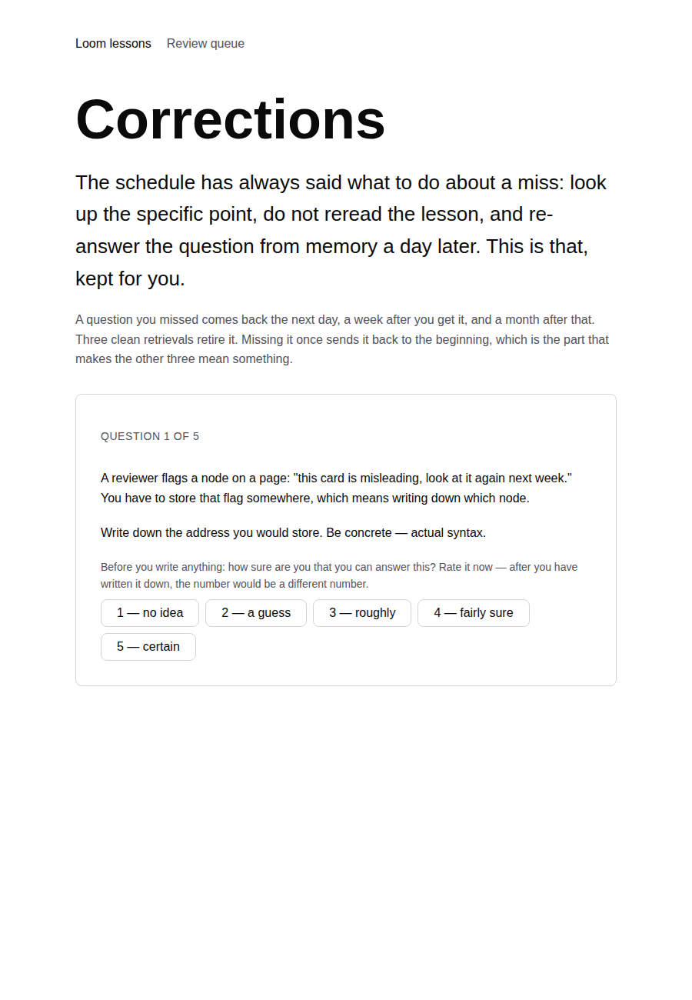
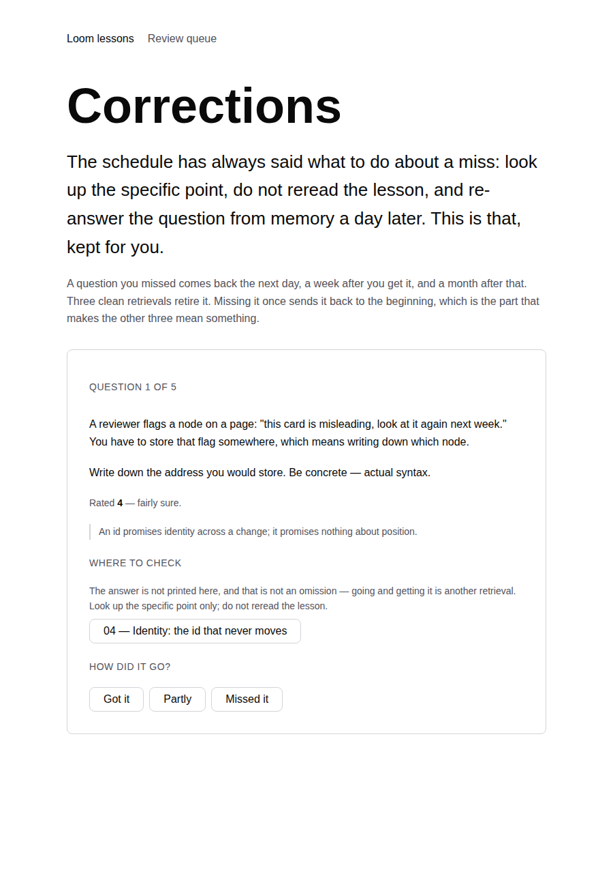

# 2026-09-02 — Machinery: the lesson's own questions, coming back

**Landed:** `apps/loom/app/(lessons)/_lib/slugs.ts` and `_lib/questions.ts`, both
new and both with tests; a `comesBack` rule and a shared `knownOnly` filter in
`_lib/corrections.ts`; `lessonQuestionPointers` in `_lib/links.ts`; a `keys`
prop on `CorrectionsPanel` and `DueSummary` so the index counts what the sitting
can render; the corrections page rebuilt on the whole course rather than on the
review sets; and a paragraph each in `lessons/README.md` and
`lessons/review-schedule.md`.

`pnpm install && pnpm verify`: **green, all of it** — 1860 runtime tests across
119 files, 2526 application tests across 160 files, `next build` prerendering 77
pages. **`main` is no longer red.** The `(marketing)/_lib/facts.test.ts` failure
that four lessons pull requests in a row reported, and that this lane had
started writing into its verification section as a matter of routine, is fixed
and gone. The merge gate gates again.

Roughly **five to ten minutes per sitting**, unchanged — this run does not add a
thing to do, it adds most of the course to a thing that already existed.

## Machinery again, and the reason is on `main` rather than in the syllabus

The syllabus is complete and, since the backlog merged, **all seventeen lessons
are readable on `main`** — which was the blocker the last two runs wrote about
and it is gone. Writing lesson 18 is now possible for the first time in a week.
It is still not this run's job: lesson 18 means opening Part V, and which Part V
is one of the maintainer's two standing questions.

What decided it instead was finding that the thing yesterday's run described as
unbuilt was worse than unbuilt.

## The bug, which was live and was mine

[Yesterday's report](2026-08-31-the-questions-that-come-back.md) closed by naming
the obvious second half: *the lessons' own Predict and Self-check questions do
not enter the corrections queue — only review sets do.* That was the wrong
diagnosis, and the right one is a defect rather than a gap.

`correctionQueue` walks **every** slug in the reader's record. It always did —
it iterates `progress.sets` and never asked what kind of key it was holding. A
lesson's Warm-up and Self-check answers are recorded under
`lesson-04-self-check` by the same `withAttempt` a review set uses, so they have
been entering that queue from the day the lesson route shipped.

What could not render them was the corrections *page*, which built its question
list out of `REVIEW_SETS` and dropped anything it did not recognise. The panel
on the review index did no such filtering. So:

> A reader who missed two Self-check questions in lesson 09 and nothing else was
> told on `/lessons/review`: **"2 questions to re-answer — 2 of them were rated 4
> or 5 when you missed them."** They clicked through and were told **"Nothing has
> come back."**

That is the worst failure mode this surface has, because it is the one that
teaches the reader the machinery is decorative. The first probe of the run was a
throwaway test asserting the queue was empty for a lesson miss; it failed with
`["lesson-04-self-check#2"]` in the diff, and the run changed shape there.

## What it does now

Every graded question in the course is one list — 151 review-set questions and
**211 lesson questions**, addressed identically — and a miss anywhere enters the
same queue on the same terms: back the next day, a week after you get it, a
month after that, three clean retrievals to retire it.

**Five decisions worth arguing with:**

1. **A missed prediction only comes back if you were sure.** This is the one
   judgement in the run and the one I would most like disagreement on. Predict
   is written to be got wrong — the README calls being wrong the mechanism
   rather than a waste of time — so a reader who rates a prediction 2, misses
   it, and is handed it back tomorrow has been told off for doing the exercise
   correctly. Nothing was forgotten; they said they did not know and they did
   not know, and their calibration was perfect. Worse, a lesson generates three
   of those by design, so admitting them would bury the misses that are real
   under the misses that are the method working. **A prediction rated 4 or 5 and
   missed is a different animal**: not a gap but a belief about how the system
   works, held confidently, that turned out to be false — and those are exactly
   the ones that survive being contradicted once. So the same threshold that
   already orders this queue now decides entry to it.
2. **Warm-up and Self-check come back unconditionally.** No exception, no
   confidence filter. The reader had met the material, was asked for it, and it
   did not come. That is the definition the queue was built on.
3. **The question carries the scenario it was posed with, and nothing else.**
   See below — this is what a browser found and no test was going to.
4. **The sitting still does not say where a question came from until it is
   answered.** "Lesson 04 Self-check" is most of the answer to a question about
   identity, exactly as "Set D" was. The label moved from a set letter to a free
   string and appears in the same place it always did: after the writing.
5. **A prediction gets a place to check that it could not have on the day.** On
   the lesson page a Predict question points nowhere, because the reader is
   standing above the explanation. A day later they have read it, so the
   correction points at the lesson. Sending them to a page that is now the
   answer is the correction working rather than a leak.

## What the browser caught, again, and it was the whole point of looking

Every test I had written was green. Then a real sitting, seeded and worked
through in a browser, offered this as its first question:

> **Write down the address you would store. Be concrete — actual syntax.**

The address of *what*. On the lesson page that question is the first item under
a paragraph in which a reviewer flags a card and you have to write down which
node — and lifted out of its section, it is not a hard question, it is not a
question. Five of the seventeen Predict sections pose a scenario like that, and
`lesson.ts` has said so in a doc comment since it was written: lesson 02's three
questions are unanswerable without "React has dozens of node types. Loom has
three."

**That is difficulty from a missing sentence, not desirable difficulty**, and it
is precisely the distinction the brief asks this routine to be able to tell
apart. So the framing travels with the question now.

The rule for what counts as framing is the interesting part. Every one of the 50
prompt sets in the course opens with exactly one paragraph of rubric — *in
writing, before reading on*, *closed book, five minutes, mixed across five
lessons*, *rate your confidence 1–5, then reveal* — and anything after it is the
scenario. So the first paragraph is dropped and the rest is kept. Dropping it is
not a tidy-up either: **"mixed across five lessons" is a lie in a corrections
sitting**, which mixes across seventy-two sources and states its own terms three
paragraphs above. A test asserts no carried framing ever contains those phrases,
so the convention this depends on is checked rather than hoped for.

## Where this run pays, and it is not free

The corrections page prerenders **every question in the course** to show five,
and this run took that from 151 questions to 362 — the prerendered HTML went from
**142 KB to 325 KB**, measured both ways rather than estimated. That is the honest cost of the trade this surface has
already made twice: *which* five come back is derived from a study history that
exists only in the reader's browser, so the server cannot pick them and has to
send all of them.

The mitigation exists and was deliberately not taken. The five keys could be
sent to the server and the five questions sent back, and the page would drop to
a few kilobytes — **and the server would then know which questions this reader
gets wrong.** A course that measures your confident-and-wrong count and keeps it
where you can see it and nobody else can is worth 325 KB of static HTML. If that
ever stops being true, the fix is that request, and it should be an explicit
decision rather than a page-weight optimisation that happens to take the record
off the reader's machine.

## Found while teaching

**Nothing for another lane.** No lesson was written this run, so nothing was
explained hard enough to turn up a defect in someone else's code. The three
things found were all in this lane and all are fixed here:

- The panel/page disagreement above.
- `slugFor` living privately in `lessons/[lesson]/page.tsx` while
  `corrections.ts` parsed the same strings by iterating a map. Two files agreeing
  about a string by coincidence is how the first bug happened, so the shape now
  lives in `_lib/slugs.ts` with a round-trip test, and the lesson route imports
  it.
- `DueSummary` on `/lessons` had the same unfiltered count as the panel and was
  found only because the type error from adding the prop pointed at it. It is a
  second copy of the same sentence in a second component, which is worth noting:
  the reason it was wrong is that it was a copy.

## What is next

The syllabus is complete, `main` is green, and all seventeen lessons are
readable on it. The blocker that has justified building machinery for three runs
running is gone, and the next run is a lesson unless the maintainer says
otherwise — which means Part V, which means his standing question needs an
answer or this routine picks one and starts.
