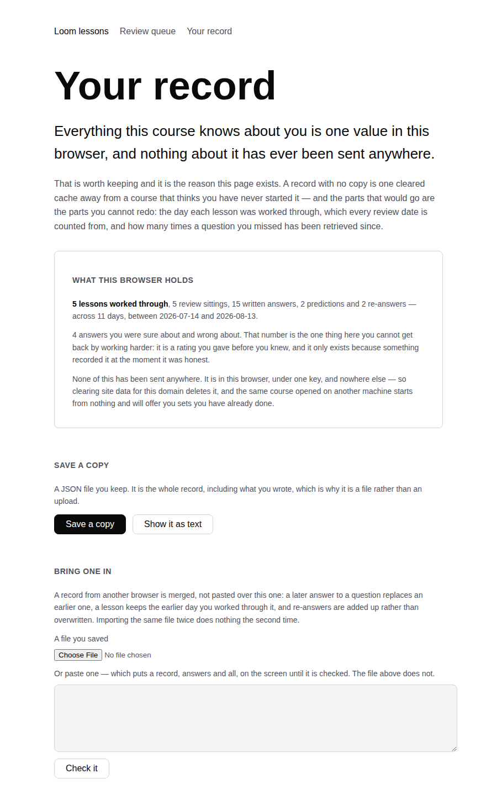
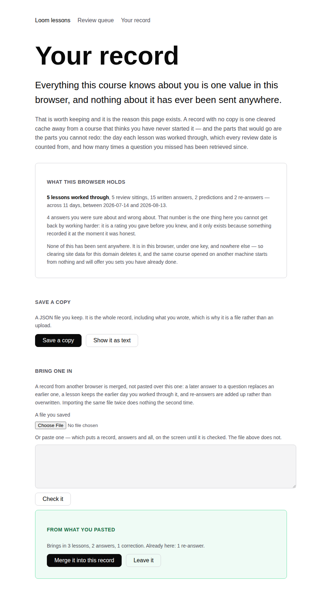
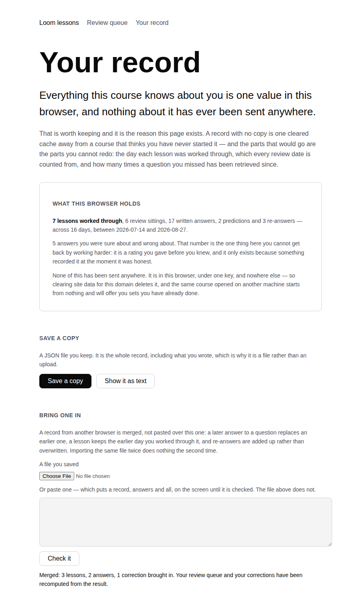

# 2026-09-04 — Machinery: the record you can keep

**Landed:** `apps/loom/app/(lessons)/_lib/record.ts` and its tests, a
`StudyRecord` component and its tests in `_components/`, a new route at
`/lessons/record`, one nav link in `layout.tsx`, and a paragraph in
`lessons/README.md` saying that the study history is the reader's to keep.

`pnpm install && pnpm verify`: **green in full.** 1860 runtime tests across 119
files; **2522 app tests across 160 files**, 25 of them new here. `next build`
prerenders **78 pages**, one more than before — the record page is the only page
this run adds, and it is static, because everything on it is computed in the
reader's browser out of a value the server has never seen.

**Five minutes, once**, and then never again until the day it matters. This is
not a sitting.

## Machinery, not a lesson, and the reason is the same one as 31 August

The syllabus is complete on `main` and Part V is not. Lesson 18 is in **#233**,
opened yesterday, along with the lesson-question corrections in **#226** from the
day before; neither has merged. A lesson 19 written today would take its
Warm-ups from a lesson 18 that a reader of `main` cannot open, which is the
dependency running the wrong way — the exact argument #207's run made for not
writing lesson 18 while 17 was unmerged, and it has not got any weaker by being
made twice. The brief permits alternating between a lesson and a piece of
machinery once `(lessons)/` exists; yesterday was a lesson, so this is the
alternation working rather than a dodge.

Rule 5 first, as always: nothing on `main` has gone wrong. No decision record has
been superseded since the lessons that cite them were written — 0004 and 0029 are
the only superseded records and both predate the course — and the exercise runner
asserts every Try it program still compiles and runs, which the suite did for me
this run rather than my remembering to.

## What was missing, and it is not a feature

The surface derives everything from one `localStorage` key. That was a deliberate
trade, `store.ts` argues for it well, and it is right: what somebody typed when
they could not remember something is the most unflattering data this project
holds, and it is worth keeping it where nobody but them can read it.

What nobody had written down is the other half of that sentence. **A record that
exists in one browser profile and nowhere else is one clearance of site data away
from zero**, and the things that would go are precisely the ones this surface
exists to hold:

- the day each lesson was worked through, which **every** review date is counted
  from;
- the retrieval streak on every missed question — a queue that only lets go after
  three clean retrievals across a month, and starts again from one day when it is
  missed;
- the confident-and-wrong count, which the course calls the real study plan, and
  which cannot be reconstructed by working harder because it is a rating given
  before the answer was known.

And it is stuck. A course read on a laptop and on a train is one course; two
records that each believe the other's sittings never happened will each offer
sets the reader has already sat, which is the failure the whole queue is built to
prevent — massed practice, arrived at by accident.

So: a file. The record goes out as JSON the reader keeps, and comes back in as a
**replay** rather than a paste.

## Replay is the whole design

An import does not overwrite the record and does not blindly append to it. It
applies the incoming events under the rules the surface already applies when
those events happen live:

| The rule | Where it comes from |
| --- | --- |
| A later attempt at a question replaces an earlier one | `withAttempt` — a set you came back to is a set you did, not two |
| A correction is added, never replaced | `withCorrection` — two goes a week apart are two retrievals, and the count is the measurement |
| A lesson keeps the **earliest** day it was worked through | it is when it happened, and every set's date is derived from it |

Nothing new was invented to merge with, which is the point: a merge that used its
own rules would be a second, quieter definition of what the record means.

**Five decisions worth arguing with:**

1. **Importing the same file twice does nothing the second time.** Corrections
   carry no id, so identity is every field — set, question, day, confidence,
   grade, and the answer text. Two genuinely distinct retrievals that agree in
   all six collapse into one. That is the safe direction to be wrong in: an
   inflated streak **retires a question the reader has not earned**, and this
   queue is the one part of the course that is supposed to keep coming back.
2. **A tie goes to the record being imported into.** Two machines share no order
   of events, so the day is all there is; when even that is equal, changing
   nothing beats silently preferring whichever file was opened second.
3. **An unfamiliar version number is not a refusal.** The file carries a version
   so a future format can tell, and it is deliberately not checked — refusing to
   read a record because its number is unfamiliar would lose exactly the history
   this exists to preserve. Reading is total, like everything else that touches
   this data.
4. **A bare record is accepted, not just a file this page wrote.** Before today
   the only way to get the history out of a browser was to copy the
   `localStorage` value in devtools, and somebody who did that a month ago should
   not be told their own record is not a record.
5. **The import is checked before it is applied.** It says what it would bring in
   and what is already here, and then waits. It is the one action on this surface
   that can change what the course asks the reader next.

## The rule that shaped the page: nothing here is an answer

This page is reachable from every other one, and roughly half the answers in the
record belong to questions the corrections queue is about to ask again. So the
record is shown as **counts and dates** — lessons, sittings, written answers,
re-answers, the span of days, and the confident-and-wrong number. Not a word of
what was written.

There are exactly two ways to see the record itself and both say what they cost.
*Show it as text* is behind a control whose own paragraph says it contains
answers to questions that are coming back, and asks the reader to copy it without
reading it. The paste box, which is the other one, says that the file route does
not put anything on screen.

That box is where the browser earned its place again. **A pasted record sits
there, answers and all** — the reader's own doing, but a screenful of exactly
what this page refuses to print, an inch below the paragraph refusing to print
it. It now empties the moment the record parses, and stays put when it does not,
since then it is something to correct rather than something to look away from.
There is a test for it now and there was never going to be one before: it is not
a failure, it just looks wrong, and looking wrong is only visible to something
that looks.

The middle screenshot is a real merge, worked through in a browser: a five-lesson
laptop record taking in a three-lesson tablet one that shares a lesson, shares a
correction, and dates that shared lesson three days earlier. It brought in three
lessons, two answers and one correction, held one re-answer it already had, and
moved lesson 04 back to the earlier date — which is the whole of the design,
visible in one sentence.

## Where this run did not smooth the path

The page does not offer to reset the record, and that is deliberate. Every other
control here adds; a clear button on the page you visit to protect something is a
loaded gun beside a fire extinguisher. The browser already has one, in settings,
where it belongs.

There is no sync, no account and no upload, and the file is the reason there does
not have to be. `store.ts` said the day the record needs to follow somebody
between machines is the day it earns a table. It needed to today, and it earned a
file instead — which does the job, keeps the property that made the trade worth
making, and stays honest about what it costs: you have to press the button.

## Conflicts: none

Tested against both open lessons branches, in either order. Five of the seven
files are new, `layout.tsx` is touched by neither, and the `README.md` addition
is one hunk after line 134 — #226 edits line 101 and #233 edits line 188.
`FINDINGS.md`, `review-schedule.md` and every existing component are untouched.

## Found while teaching

**Nothing for another lane, and no lesson was written this run**, so nothing was
explained hard enough to turn up a defect in somebody else's code. I would rather
say that than file something to have filed something.

One thing found in this lane and fixed here, and it is not a finding: the paste
box above, which the tests were never going to see and a browser showed in the
first minute.

## What is next

Both open branches are course content and both are waiting. If the next run is a
lesson it is Part V, which is still the maintainer's question to answer. If it is
machinery again, the honest answer is that the four asks in the brief are built,
the queue is built, the corrections are built, and this was the last piece of
plumbing I can defend building without knowing where the course is going.
