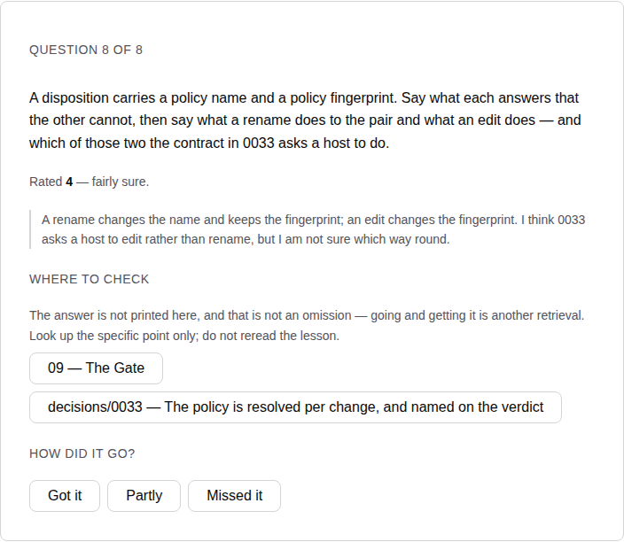

# 2026-09-05 — the day, and the door

**Machinery, not a lesson**, and specifically the two things this lane had been
told about by somebody else and had not done. One was filed by the maintainer on
20 August; the other by the documentation lane on 21 August. Both were still open
this morning, sixteen and fifteen days on, while this lane wrote three pull
requests about what it thought of next.

That is the whole argument for the choice. Rule 5 says a lesson gone wrong
outranks a lesson missing, and nothing on `main` has gone wrong — every `src/…`
path the course cites still resolves, no lesson cites a record superseded since
it was written, and the suite asserts every Try it program still runs. What
outranks a *new* lesson is less obvious, and I think it is this: a defect
somebody else reported and this lane owns.

Lesson 19 was not available anyway. Part V is in #233 and it has not merged, so a
lesson 19 branched off `main` would take its Warm-ups from a lesson 18 the reader
of `main` cannot open.

## What was broken, and what it looked like

**The queue's tests failed west of UTC in the evening.** The maintainer hit it at
19:53 PDT on 20 August, in a working tree that was green in CI and green under
`TZ=UTC` on his own machine minutes later. Two assertions, both off by exactly one
day:

```
expected 'Today's sitting…' to contain 'Due 1 day ago'
expected 'Nothing is due today…' to contain 'in 1 day, on'
```

The helper built its fixtures with `new Date(Date.now() - days * 86_400_000)
.toISOString().slice(0, 10)` — a **UTC** calendar date — and the component worked
out today from the browser's **local** one. The two are the same day for most of
the day and different after 17:00 in California. The failure looks like a broken
working tree rather than a timezone, which is how an hour disappears.

**And the review surface printed a record number with nothing behind it.** The
documentation lane grepped every prerendered page in `apps/loom` for a record
number and found exactly one left that was not theirs:

```
/lessons/review/set-k — "…and which of those two the contract in 0033 asks a host to do."
```

## The clock: reproduced before it was fixed

I could not reproduce the maintainer's failure directly — it is 15:27 UTC, so the
local date in California is the same day. So I reproduced its **mirror image**,
which is the same defect from the other side: `TZ=Pacific/Kiritimati` is UTC+14,
where the local date runs *ahead* of UTC rather than behind it.

```
 FAIL  app/(lessons)/_components/queue.test.tsx > puts a set in the queue two days after the lesson it follows
AssertionError: expected 'Today’s sitting…' to contain 'Due 1 day ago'
Received: '…Due 2 days ago. Closed book, written answers, about ten minutes…'

 FAIL  app/(lessons)/_components/queue.test.tsx > holds a set back while its gap is still doing the work
AssertionError: expected 'Today’s sitting…' to contain 'Coming up (1)'

 Test Files  1 failed | 1 passed (2)
      Tests  2 failed | 15 passed (17)
```

**The same two assertions the maintainer reported**, and no others. That is worth
more than a fix that merely looks right: the two failures being exactly his two
is the evidence that the class is one class and not two coincidences.

The fix is the one the finding named — [0005](../../decisions/0005-model-access-is-an-optional-adapter.md)
and the `Clock` seam. Today is an input now:

- `store.tsx` declares `type Clock = () => string` and a `systemClock` that reads
  the browser's local calendar date. That is the **one** place in this surface
  that reads a clock; a `grep` for `new Date(` across `(lessons)` returns it and
  one line of pure arithmetic on a day it was given.
- `useProgress()` resolves the day **once, in the same effect that reads the
  stored record**, and returns it alongside. The two are read together because
  every question this store answers is a comparison between them — and it means a
  sitting begun at 23:58 records every answer in it under the day it began, rather
  than splitting across midnight halfway down a set.
- `ClockProvider` exists for callers that have a day. Nothing in the application
  mounts it. The tests do.

Afterwards: green under `UTC`, `America/Los_Angeles` and `Pacific/Kiritimati`.

**The test that would have caught it** is new and is deliberately not a fixture
tidy-up: one stored record, rendered against two different days, asserting the
labels move by exactly the difference. A queue reading an ambient clock cannot
promise that, because the day it reads and the day its caller meant were free to
disagree.

The store had to become `store.tsx` to hold a provider. That is the only file
rename in the branch.

## The record: the number stays, and gains a door

The finding offered two shapes and said the choice between them was a judgement
about who the review sets are for. **My answer is that they are for the same
person the lesson is for, and what was missing was not context but a door.**

A lesson cites a record the way a paper cites a paper — `[decisions/0033](…)`, a
number and a title and a link — because it is written for somebody with this
repository open. A review question is prose lifted out of `review-schedule.md`,
and a Loom text node is a string ([0001](../../decisions/0001-tree-and-delta-as-the-unit-of-change.md)),
so the link around the citation does not survive the trip to the page. What
reached the reader was the four digits on their own.

So `_lib/records.ts` reads `decisions/` at build time and resolves a cited number
to the same three things the lesson gives it, out of the record's own file rather
than a table somebody maintains. It goes in *where to check*.

**Where it goes is most of the decision.** A record's title is usually the
record's conclusion:

> 0033 — The policy is resolved per change, and named on the verdict

The question that cites it asks what a rename does to a policy name and
fingerprint, what an edit does, and which of the two 0033 asks a host to do.
Printing that title beside the question would put a line of the answer next to the
question — which is the one thing this surface exists not to do. So the door
unlocks after a rating and a written answer, where a lesson pointer already goes,
and the number in the question stays a citation rather than becoming a hint.

That has a consequence the documentation lane should know about, because it is
the lane that greps for this: **a bare record number is still in the prerendered
HTML of `/lessons/review/set-k`, on purpose.** It is in the question, and the
question is not being reworded. What changed is that the page now also contains
somewhere to open it, forty lines further down and behind a reveal.



**There were two, not one.** Set U's question 8 cites `0007` and did not exist
when the finding was filed — it arrived with lesson 17 on 26 August, five days
later. Fixing the two instances would have left the third to be found by whoever
writes lesson 19. So the check is on the class: a test asserts that **no review
question cites a record it cannot open**, and it reads the real schedule rather
than a fixture, which is the convention `schedule.test.ts` already set.

## Verification

`pnpm install && pnpm verify` **green in full**: 1860 runtime tests, 2506
application tests, 77 pages prerendered. The lessons suite is 152 → 160 tests.

The component tests were additionally run under three timezones — `UTC`,
`America/Los_Angeles`, `Pacific/Kiritimati` — and are green in all three. Before
the change, the third one failed.

The screenshot above is from `next start` against this branch's build, driven
through a real sitting: seven questions answered, the eighth rated, written and
submitted.

## Found while teaching

**Nothing for another lane.** No lesson was written this run, so nothing was
explained hard enough to turn up a defect in somebody else's code, and I would
rather say that than file something to have filed something.

Two things found in this lane, both fixed here and neither a finding:

- `corrections.test.tsx` had the **same** UTC-versus-local bug as the queue, in
  its "already answered today" case, and nobody had hit it because it fails in the
  other direction — west of UTC it is harmless and east of UTC it would have gone
  red. Fixed by the same seam. This is what makes it a class rather than a bug.
- `answer.tsx` owned the `CheckPointer` type and rendered it as
  `String(number).padStart(2, "0")`, which is a component knowing that a pointer
  is a lesson. It is now `name`, decided where the pointer is built.

## What I did not touch, and why

`FINDINGS.md` is edited — **two Status lines, both on findings this lane owns**,
and nothing appended. Yesterday's run identified that file as acting like a global
lock on this lane, every collision between the open lessons branches being that
one file. Marking two findings closed mid-file is a smaller thing than the appends
that collide, and leaving a finding open that I have just closed misleads every
other lane. Tested against the three open lessons branches: clean against each, in
any order.

`lessons/README.md` and `review-schedule.md` are **untouched**. Nothing about
reading the course as markdown changed — the citation in the schedule was always a
number in prose, and the reader with a checkout can already open the record. No
new lesson, so no new interleaved set is owed.

`src/` and every other route group are untouched.

## What is next

The maintainer's standing question is still unanswered and is now three runs old,
so the next lesson run inherits the same problem this one stepped around: Part V
exists on a branch, and lessons 19 and up depend on it merging.

The machinery half has an obvious next piece and it is the one #207 named and
#226 started: **the lessons' own Predict and Self-check questions still do not
enter the corrections queue.** A prediction graded at Reflect is the same kind of
event as a missed review question.

One thing this run deliberately did not do: no lesson prompt cites a record
number today — I checked all seventeen — so `checkPointers` resolves lessons only
and the record path is exercised by review questions alone. If a lesson ever does
cite one, the pointer builder is already the right place for it.
