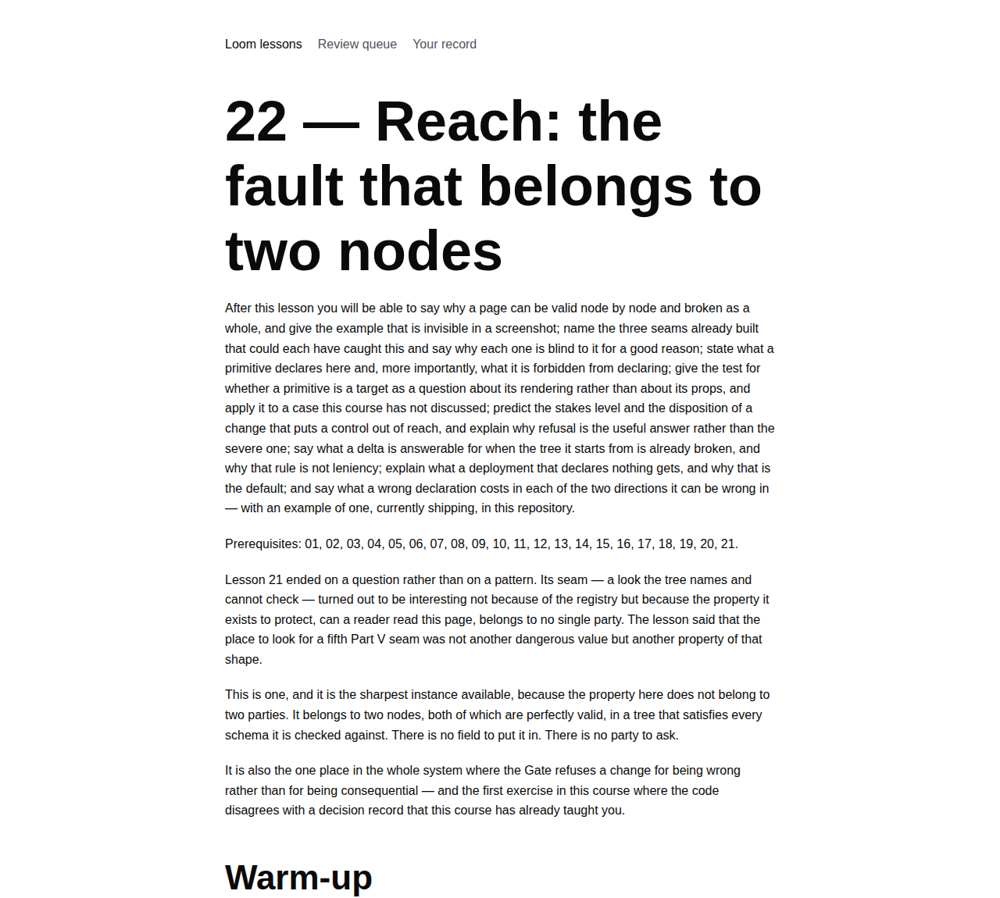
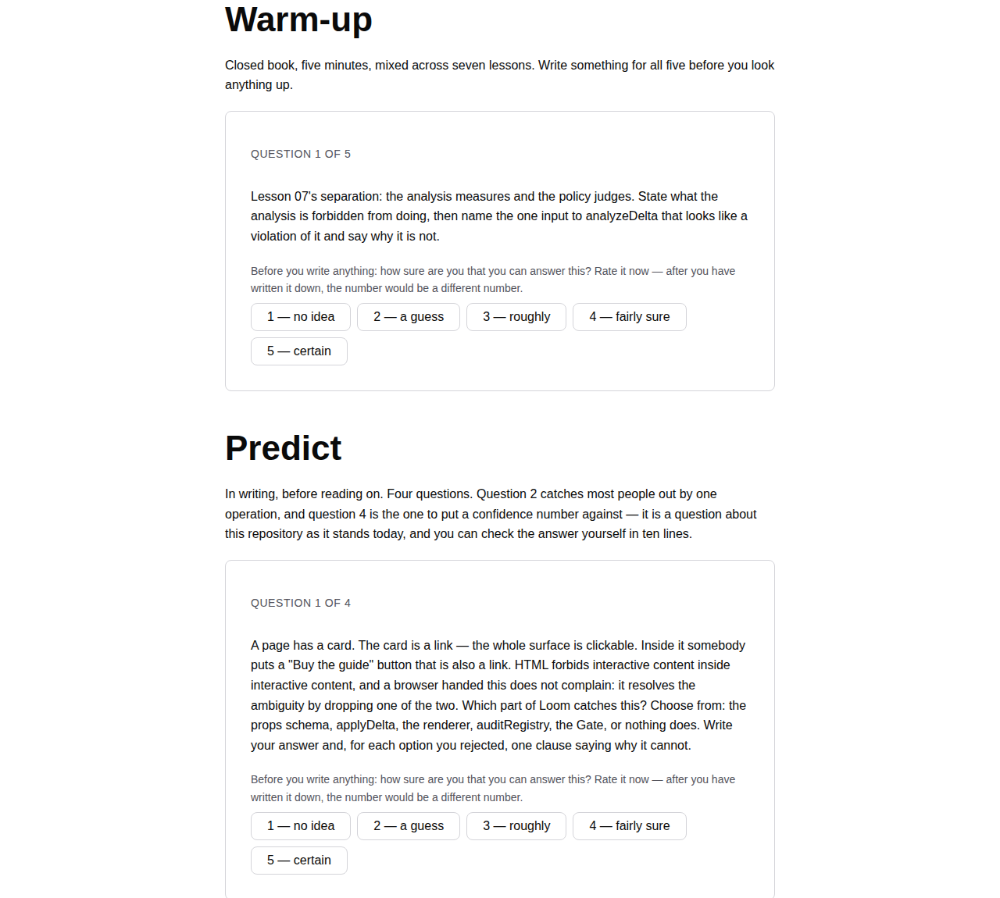
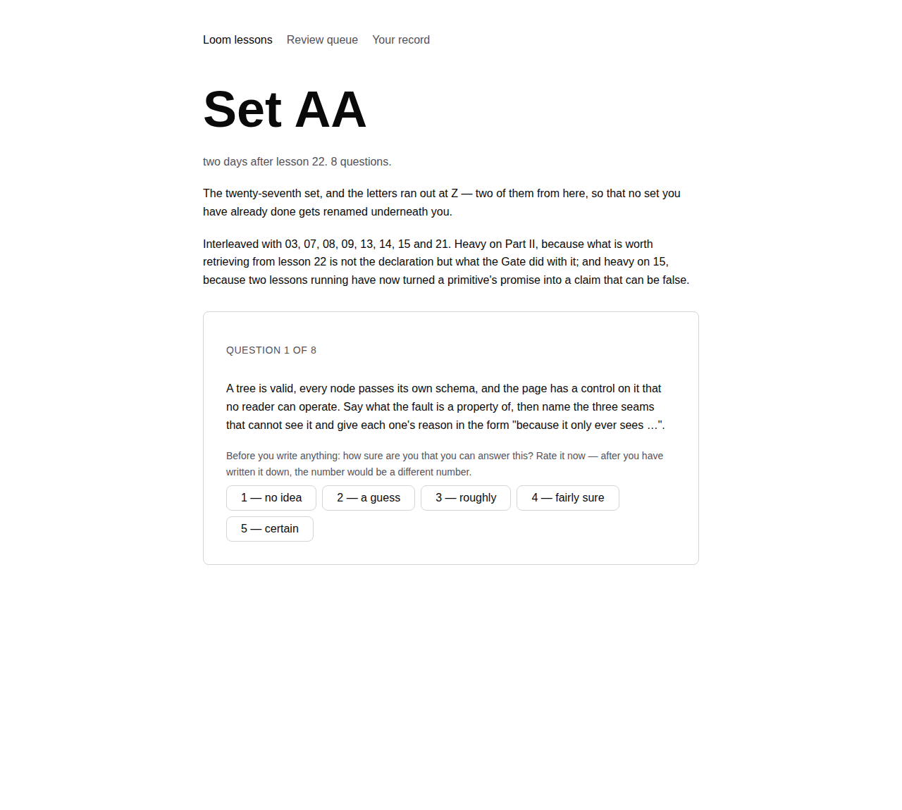

# 2026-09-10 — Lesson 22, and the letters that ran out

**Landed:** `lessons/22-reach.md`, `Set AA` in `lessons/review-schedule.md`, the
syllabus row and Part V paragraph in `lessons/README.md`, two-letter set support
in `apps/loom/app/(lessons)/_lib/` (`schedule.ts`, `slugs.ts`, `queue.ts` and
their tests), and one finding in `FINDINGS.md` for `Loom primitives`.

`pnpm install && pnpm verify`: **green, all of it.** Runtime 1860 tests across
119 files; app 2582 tests across 165 files; `next build` prerenders **128
pages**, two more than before — `/lessons/22` and `/lessons/review/set-aa`.
`main` was red for a fortnight and is not any more, so for the first time in a
while this lane has nothing to report under that heading.

**60–75 minutes** to work through properly, in line with 19, 20 and 21. About
25 of that is the seven exercises, which run.

## Two units, and the small one had to go first

[Yesterday's report](2026-09-09-appearance.md) ended by saying the letters had
run out: `SET_HEADING` read `/^## Set ([A-Z]) — (.+)$/`, Set Z was the
twenty-sixth, and lesson 22's set had nowhere to go. It said the next run should
do that first, and this is that run.

It was worse than "cannot read the next set". A one-letter pattern does not
*reject* `## Set AA` — it does not match it at all, so the line becomes prose
inside Set Z and the eight questions under it are silently appended to a set
about lesson 21. A parser that reads a course and quietly keeps part of it under
the wrong name is the worst of the three available failures, and it was the one
on the shelf. There is a test now that reads Set AA by name and checks the
question counts of both sets, because a count alone is what the old parser would
still have got right.

Two letters rather than numbers, for a reason that is about the reader's record
rather than about tidiness: the letter is the slug (`/lessons/review/set-z`), and
the slug is the key their study history is filed under. Numbering the sets would
have renamed twenty-six of them and orphaned every attempt, confidence rating and
correction recorded against the old names — which nothing in this surface can
reconstruct. `AA` costs nobody anything.

Two things came out of doing it that were not in the plan:

- **`compareSetLetters` could not live in `schedule.ts`.** `"AA".localeCompare("B")`
  is negative, so within a band the queue would have offered lesson 22's set
  second, between A and B. The obvious home for the fix is beside the parser —
  and `queue.ts` runs in the reader's browser, while `schedule.ts` reads
  `review-schedule.md` off the filesystem at module scope. Importing a *value*
  from it would have pulled `node:fs` into the client bundle. It went into
  `slugs.ts`, which exists for exactly this: what a key looks like, once, where
  both sides can see it.
- **`setSlug` was being minted in two places.** `schedule.ts` built
  `set-${letter.toLowerCase()}` and so did `queue.test.ts`. One function now,
  same file as the comparator.

## The lesson: a fault that is in neither node

Lesson 21 closed by saying the place to look for a fifth Part V seam was not
another dangerous value but another **property that belongs to no single party**.
This is the sharpest instance in the system, and it sharpens the question: the
property here does not belong to two *parties*, it belongs to **two nodes**.

A linked `loom.card` with a `loom.action` inside it is invalid HTML. The browser
does not report it — it drops one of the two links. The page renders, the
screenshot is correct, and one thing on it silently does not work. And the fault
is in neither node: a linked card is fine, a button that links somewhere is fine,
and an action inside an *unlinked* card is the commonest correct composition on
any page. It is a relation, conditional on one prop of one of the two.

Which is why nothing built before it could catch it, and the four reasons are
each worth having: a props schema sees one node; the renderer is total (0008) and
may not refuse; `auditRegistry` probes a primitive in isolation, which is what
makes it cheap; `applyDelta` is vocabulary-free by construction.

What I emphasised, in order of how much I would defend it:

1. **The declaration is about the node and never about the parent.** This is
   0054 holding — a `childType` field was rejected because it makes the registry
   a place where page structure is legislated. `interactive` says what the
   primitive *is*; the relation is derived from the tree by something else; the
   renderer never reads any of it. The rule *interactive content does not nest*
   is stated once, in the runtime, rather than fifty times in registry entries
   that could each get it wrong.
2. **`critical` stake factor, not a Gate rule** — and the argument is the one
   sentence I most wanted a reader to leave with. Every other factor measures a
   change that might be right, so it is held for a person who can say yes. This
   one measures a change that is wrong however it was meant. There is no yes
   available, so there is nobody to ask, and refusal is also the *useful*
   disposition rather than the severe one, because a refused proposal is the one
   a repairer gets to try again with the refusal's own sentence as input.
3. **Measured on both trees, and only the difference counts.** Exercise E. A
   change is answerable for the breakage it causes and not for the breakage it
   found — not leniency: the alternative refuses the first proposal to touch a
   legacy page for a fault nobody in the conversation created, and gives the
   model no operation to point at.
4. **`configure` is in the list.** Most readers predict `insert` and `move`.
   Giving a card an `href` breaks every link already inside it, with one
   operation against one node and no children touched, which is why the analysis
   measures the resulting tree rather than reading the operations.
5. **The empty string.** `isSet` treats `""` as not-a-link so that the change
   which *fixes* a nesting — clearing the card's `href` — is not itself refused
   for producing one. A check that refuses its own repair is worse than no check.

Predict 4 asks whether the starter library declares `loom.nav` a target, with a
confidence rating. That is the lesson.

## What the exercises revealed, and it is not small

Exercise F was written to be a clean application of 0068's test — *is there
anywhere inside this node where a reader could put a second control and have it
work?* — to a primitive where the answer is obviously yes. Run against `main`:

```
  loom.nav declares:  "always"
  in the tree:        loom.link n_2 inside loom.nav n_3
  insert a menu item           nested=1 stakes=critical gate=rejected
  what it renders:    <nav class="loom-nav" …
  render diagnostics: []
```

**Adding a menu item to a navigation bar is refused as damage.** Exercise G then
builds the shape the library ships in its own chrome fixture — four menu links,
a logo in `brand`, an action in `actions` — and gets **six pairs**, and a
proposal to build it comes back `critical`, `rejected`. A deployment running the
starter library, with the vocabulary the SDK tells it to derive, cannot build the
starter library's own navigation bar through the Gate.

The cause is two decision records that are each right and were written without
the other in view. 0068 defines `interactive` as *the whole of this node is the
target*, and lists `loom.nav` among the containers that arrange targets and are
not one. 0086 then gave a nav a disclosure button, and the registry refuses a
primitive that takes a control-rendering behavior without declaring
`interactive` — a real hazard, correctly identified, needing a claim the field
does not make. One field, two converse claims: *is a target* and *places a
control*. A primitive can satisfy either without the other, and this one
satisfies the second.

Filed for `Loom primitives`; not fixed here, and the fix is a record rather than
an edit. Details, transcripts and the one-assertion test that would have caught
it are in `FINDINGS.md`.

It is worth saying how it was found, because it was not by reading. Both records
read as correct — I read them both closely while drafting, and quoted them. This
lane has filed findings from reading before (`deriveBrandPalette` yesterday, and
the lesson that filed the bug on 29 August); this one could not have been found
that way. It took **running the two records together against a tree** and looking
at a number, which is the exercise discipline doing something the discipline of
reading carefully cannot.

## What the screenshots caught that the tests did not







Nothing broken this time, and one thing worth confirming rather than assuming:
the rendered body of `/lessons/22` before any prediction is committed is **4,125
characters** and contains neither `nested-target (critical)` nor the sentence
"Adding a menu item…". The lesson's answer to Predict 4 is a transcript, the
transcript is held, and the held part is fetched from its own address rather than
hidden in the page — so the one lesson in this course whose central claim is
checkable in ten lines does not hand the reader the answer while asking for the
prediction.

The build ran the exercises itself, against this checkout's `src/`, and its
transcripts match the file's printed outputs line for line. I checked that rather
than trusting it: every non-blank line of all seven output blocks in
`22-reach.md` appears verbatim in the run, and the built
`lessons/22/held/transcripts.body` carries the same numbers.

## Conflicts

Cut from `lessons-30-appearance` (#252), which is cut from #251 → #249 → #247,
carrying #226, #233, #239 and #244. **Nine units of this lane are now in one
tree.** `main` has not moved since 1 September.

This run touches `FINDINGS.md`, which the 30 August report identified as the file
that behaves like a global lock on this lane — every collision between open
lessons pull requests has been that file and nothing else. It is appended at the
end, which is where every other lane appends too, so the conflict (if any) is one
hunk of pure addition and resolvable by keeping both. That is the right trade
here: the finding is the most valuable thing this run produced for anybody other
than the reader.

## What is next

Part V has five lessons. Four are *a name in the tree, a document in a registry,
resolved before the walk*; this one has no document and nothing to resolve. If
there is a sixth the thing to look for is another fact that exists only between
two things, and the question to bring to it is the one exercise F answered the
hard way: **who is allowed to declare it, and what happens when they are wrong?**

On the machinery side I have nothing queued that is worth a run. The brief's four
asks for this surface are built — write-before-reveal, confidence-before-reveal,
the due queue, and exercises that run — and the two pieces beyond them that the
schedule itself asked for are built too: missed questions coming back (#207), and
the lessons' own questions entering that queue (#226). So unless the maintainer
names something, the next unit is lesson 23.
