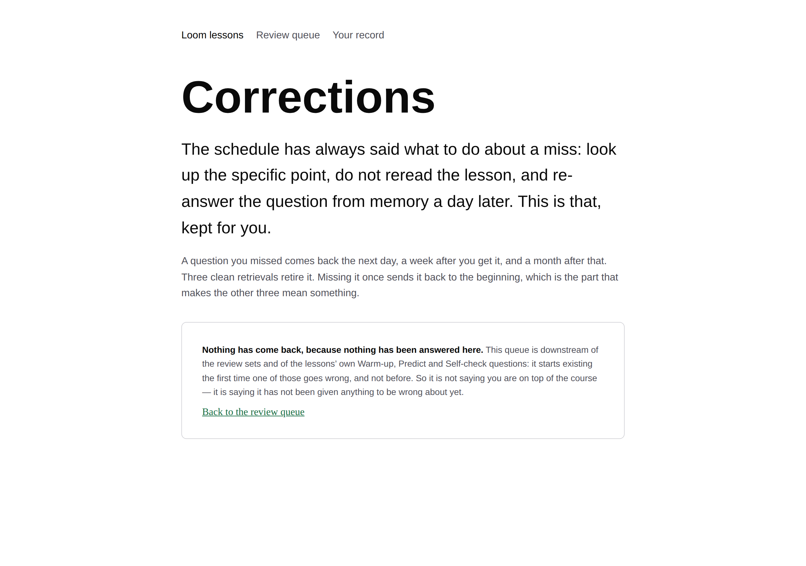
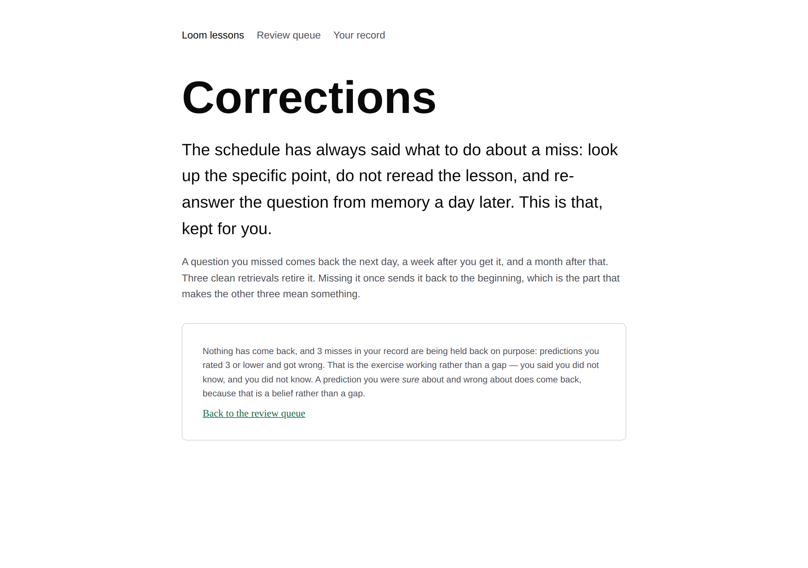
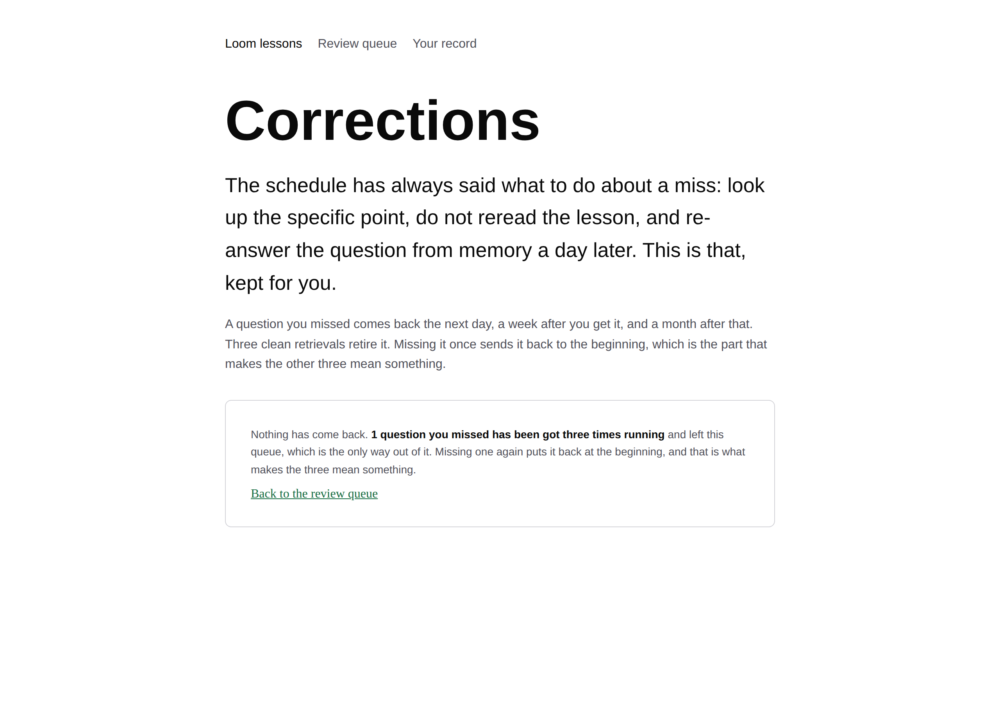
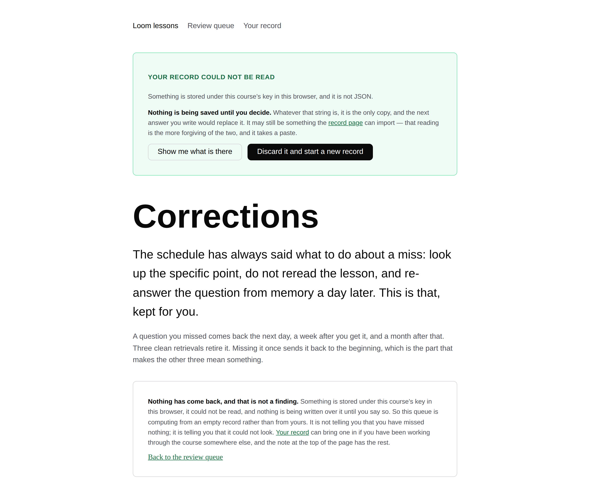

# 2026-09-21 — The queue that could not say why it was empty

**Landed:** course machinery, no new lesson. The corrections sitting at
`/lessons/review/corrections` now says *which* of five situations it is in when
it has nothing to hand over, where it used to have one sentence for all of them;
`whyNothingComesBack` and `everyCorrection` in the surface's
`_lib/corrections.ts`; `recordWillKeep` in `_lib/reading.ts`, now the single
spelling of *will this write land*; a warning before a corrections sitting that
will not be stored; one finding; and two paragraphs in
[`lessons/README.md`](../README.md).

**Machinery rather than a lesson, and that was not a free choice.** The last
three runs said so in writing, each louder than the last, and the 20 September
report committed this lane in public: *unless you say otherwise, the next run is
that and nothing else, and Part V's eleventh seam waits.* Nothing said
otherwise. There is no open lessons pull request and no reader feedback on #350.
So this is the whole run, Part V's eleventh seam is still waiting, and the thing
that was four runs overdue is done.

`pnpm install && pnpm verify`: **green, exit 0**, read from a file rather than
through a pipe. Runtime **2,844** tests across 156 files — `src/` was not
opened. Application **5,031** across 284 files, against **5,013** across the
same 284 files measured on this checkout with the branch stashed: **+18 tests
and no new test file**, which is what a change to a surface that already had
tests around it should look like. **718** findings, 0 malformed, against 717
stashed — the one entry below. **109 prerendered pages, 859 text junctions**,
both unchanged: this run adds no route.

Roughly **ten minutes** to review, which is the other half of why it is a run on
its own.

## What it looks like

Four of the five states, photographed against the built application at 1280.

| | |
| --- | --- |
|  |  |
| **Nothing has been answered here** — and the sentence ends by saying what it is not claiming. | **Three misses held back on purpose**, with the rule that declines them said out loud. |
|  |  |
| **Retired** — the other half of the old `or`, settled. | **Could not look**, under the notice that already said so. The two do not repeat each other. |

The fifth, *answered and missed none*, is beside this report as
[`-unmissed.png`](2026-09-21-the-queue-that-could-not-say-why-unmissed.png).

## What was wrong

One sentence, shown to everybody who arrived at the corrections page with
nothing to re-answer:

> Nothing has come back. Either you have not missed anything yet, or everything
> you missed has been got three times running — which is the only other way out
> of this queue.

It is true, and it is five situations wide, and **its own `or` admits it.** An
*either/or* in a sentence about the reader's own record is the author saying
they did not go and look — and the record was two lines away, holding the
answer. Three of the five were being reported as facts about the reader that the
page was in no position to know:

| what is true | what the page said |
| --- | --- |
| you have answered questions here and missed none | the sentence, correctly |
| questions you missed have retired | the sentence, with the wrong half of the `or` still attached |
| you have missed things, and this queue declines them on purpose | *you have not missed anything yet* |
| your record is on another machine, or site data is off | *you have not missed anything yet* |
| something is stored here and nothing could read it | *you have not missed anything yet* |

The bottom two are the ones the 17 September run fixed for the review queue and
the syllabus index, one page along, and did not fix here. That run's own report
named this page as the next thing to do; four runs went by.

## What it says now

The storage reading is asked **first**, and it is asked as *could I look* rather
than as *what did I find*, because an answer from a page that could not look is
not a wrong answer — it is not an answer. Then `whyNothingComesBack` settles the
rest from the record.

- **Nothing answered here.** *Nothing has come back, because nothing has been
  answered here.* This queue is downstream of the review sets and of the
  lessons' own Warm-up, Predict and Self-check questions; it starts existing the
  first time one of them goes wrong. The sentence ends by saying what it is
  **not** claiming: that you are on top of the course.
- **Answered, missed none.** The count is printed, because the count is the
  evidence. This is the one empty queue that is a result rather than an absence.
- **Held back on purpose.** The arm worth building. A reader who missed three
  Predict questions and rated them 2 has three misses in the record and an empty
  queue, and being told *you have not missed anything* by a page looking
  straight at all three reads as the page being broken. It is not broken:
  `comesBack` declines them, because a prediction you knew you were guessing at
  is the exercise working rather than a gap. The page now says so, and says that
  a prediction you were **sure** about and wrong about does come back — which
  teaches the rule instead of making the reader infer it.
- **Retired.** *N questions you missed have been got three times running and
  left this queue, which is the only way out of it.* The disjunction's other
  half, now settled rather than offered.
- **Could not look.** Two wordings, because there are two things to do: a
  browser that would not say what it holds points at the record page and the
  import; something stranded and unreadable under the key says that nothing is
  being written over it until the reader decides.

## The one thing said here and nowhere else

A set worked in a browser that will not store anything **still happened**. The
reader retrieved seven things closed-book, and retrieval is the thing that works
whether or not anybody writes it down. The banner in the layout says as much on
every page, and on every other page it is right.

A correction is different in kind. What it buys is a **gap** — the question goes
away for a day, then a week, then a month — and a gap nobody recorded does not
start. Answer five corrections in a browser that will not keep them and the same
five are due tomorrow at the count they are at now. That is the one arrangement
in which this course asks for ten minutes and returns nothing at all, so the
corrections sitting now says it **before the first question** rather than
leaving it to be discovered after the fifth. The shared banner was left alone:
its sentence is true everywhere else, and weakening it to cover one page would
have made it vaguer on all of them.

## What building it revealed

**Every number on the page has to count the same things, and one of them did
not.** The queue drops a miss whose question the course no longer contains —
renumbered, reworded, deleted — because nothing can render it. The first version
of `whyNothingComesBack` counted *answered* and *held back* straight off
`progress`, unfiltered, so a reader whose only recorded miss was on a question
that no longer exists would have been told they had answered one question and
got every one of them. Both counts now run through the same key set as the
queue. The component's own comment had already stated the rule — *dropped here
rather than filtered out further down, so that every number on this page counts
the same things* — and the new code broke it within twenty lines of it. The test
that says so is `counts nothing the course no longer contains`.

**Two fixtures were wrong before the code was.** The component test's course
contained no Predict question at all, so the held-back arm classified as
*unanswered* and the assertion failed — correctly. The retired arm failed on
`has` versus `have`. Both were my fixtures rather than the code, and both are
the same discipline the lessons' exercises run under: the assertion was written
from what I expected the page to say, and the page was right twice.

**A redundant condition, named rather than removed.** The lost-write warning is
guarded by `recordWillKeep`, which is two conditions, and only one of them can
ever fire there: a question is being offered, so the queue is not empty, so the
record was read, so nothing is stranded and `wouldOverwrite` is false. Lesson 27
filed a finding against precisely this shape — a `var()` fallback that cannot
fire, sitting unremarked in a rule. The remedy here is not to narrow the
condition to `!held.writable`, because the shared predicate is the half worth
keeping; it is one sentence in the comment admitting the other half is redundant
*at this call site*. A repository that teaches a rule and then does the thing
the rule is about, silently, is worse off than one that never wrote the rule
down.

## Found while teaching

**One, and it is a second sighting rather than a new defect.**

`tools/screenshot/plan.ts` still gives a shot list two steps, `click` and
`wait`, and every state this run needed photographing is one the browser is
already in when the page loads. None of the five is reachable by clicking, so
the pictures above were again taken by a short Playwright script in a scratch
directory rather than by `pnpm shoot` — which is exactly the arrangement
[0116](../../decisions/0116-a-screenshot-is-taken-by-the-repository-and-playwright-is-never-a-dependency.md)
exists to stop being normal. This lane filed it on 17 September, offered two
designs and picked neither because `tools/` is not its directory. It is filed
again today only because a gap that costs the same run twice is evidence about
the gap, and because the second sighting names the field: five of the five
states here need **a value in storage before navigation**, and none of them
needs arbitrary JavaScript, which settles the `storage` map against the
`initScript` for this lane's purposes at least.

**Nothing from `src/`.** This run read `apps/loom/app/(lessons)/` and nothing
else, so the usual crop of framework findings is not here to be had.

## What is next

**Part V's eleventh seam.** The syllabus stopped moving for one run by
arrangement, and the arrangement is now discharged. The question lesson 27 left
for whoever writes it still stands, and nothing in this run touched it: *a
decision record argues for a behaviour in the present tense, in an `Accepted`
record, and a schema three files away quietly disagrees with it — and nothing in
this repository compares a record's argument to the code that is supposed to
implement it.*

**No machinery is being carried forward.** For the first time since 16 August
this lane ends a run with nothing on the list it has been meaning to build, and
that is worth writing down so the next run does not invent something to have
been owed.
