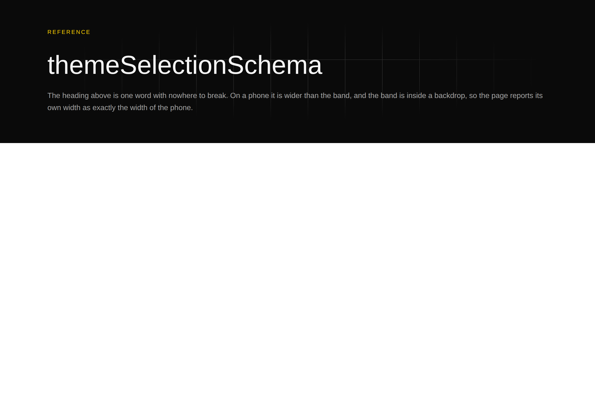

# 2026-10-01 — The fault that does not exist yet, and the half of an instrument nothing can test

**Chose a lesson, not machinery, and the alternation asked for it.** The 30
September run was course machinery — `Explain it back` became a part of its own —
and the three before that were lessons 29, 30 and 31. A second machinery run
would have been the first time this lane spent two consecutive runs away from the
course itself.

**Landed:** [lesson 32, *Layout: the fault that exists only after a browser has
made it*](../32-layout.md). Part V's fifteenth seam. Roughly **55 minutes** to
work through, which puts it beside lessons 29 and 31 — seven exercises, four of
them a few seconds and three of them worth stopping on.

## Why this subject, and what makes it a seam rather than a tool

Lesson 31 handed the next lesson a question: *what is the last moment at which
this is still visible, and is anything checking it there?* For a behaviour the
answer was registration, because a behaviour leaves no trace in a pure function of
the tree.

This seam answers the same question and **the answer comes out backwards.** A
heading whose longest word is wider than a phone has no earlier moment to lose. It
is not in the tree, not in the registry, not in a declaration, not in the markup —
it does not exist until a layout engine has been handed that markup, a viewport
width and whichever font actually loaded, and it stops existing when the reader
turns the phone sideways. The last moment it is visible is also the **first**.

That makes it the first Part V seam where **nothing in the system is missing
anything.** Every seam above is a fact somewhere a checker cannot reach, interpret,
compare, or is asked the wrong question about. Here the tree is valid, the
primitive is correct, the render is the pure total projection lesson 14 promised,
and the Gate is not failing to refuse anything — exercise B runs it and the delta
that inserts a word that fits and the delta that inserts a two-hundred-character
word are identical in every number the analysis takes, because they *are* the same
change.

So the remedy is the sixth one this part has used: not reach further, not
manufacture a second copy, not instrument a place in the code, not ask an author,
not close a set — **stand where the fact is and take a reading.**

## What I emphasised, and the reason

**The expensive half is not the measuring.** This is the lesson's spine and it is
what keeps it from being a tour of a tool. Measuring is one `page.evaluate`.
Deciding *which readings are defects* cannot be done without knowing the system
being measured, and [0202](../../decisions/0202-the-harness-measures-the-content-a-clip-hides-and-it-is-not-scrollwidth.md)
is three worked instances of that in a row: a `loom.halo` is a rim drawn four
pixels outside its box on purpose, a `loom.code` block scrolls sideways on
purpose, and a one-by-one box holding a sentence is how a visually-hidden
announcement is written everywhere. All three are indistinguishable from the real
fault in the numbers alone, and `scrollWidth` — one property access, the browser's
own answer — reports all three.

**The line between the two halves, and what it costs on each side.** Reading which
boxes clip needs a laid-out page; deciding which reading is a defect is arithmetic.
So they are two functions in two files, and the arithmetic half is testable in two
seconds without a browser. The honest consequence is exercise G: what stays on the
browser's side is checkable by **nothing**, and the suite that drives the code path
around it hands its double a function and gets back
`{ scrollWidth: 390, innerWidth: 390, clipped: [] }` — a clean reading somebody
typed. What that suite asserts is *that the measurement was requested* and nothing
whatsoever about what it would return. That is not a defect and there is nothing to
fix; it is what an instrument costs, said out loud in the place where a reader
would otherwise discover it by trusting a green suite.

**The decision that looks like a bug every time you read it.** The per-box reading
deliberately does not change the exit code, so the committed specimen whose entire
reason for existing is to be a page with a word off the edge of it exits 0.
Exercise F prints that. The argument is in the record and the lesson gives both
sides: folding it in would have turned a measurement nobody had ever taken into a
merge-gate failure on every page it happened to find one on, *in the same change
that first made it visible*, which is how an instrument gets switched off rather
than fixed. I made the lesson say the general version — **a new check and a new
gate are two changes, and shipping them as one is how you lose both** — and also
say that this one has a shelf life rather than being a principle.

**Why `tools/` rather than `src/`.** Three rows of the *In the code* table are
outside `src/`, and the lesson argues that this is the seam rather than an accident
of filing: everything a pure function can know about a page is in `src/`, a browser
is not a dependency of the thing that ships
([0116](../../decisions/0116-a-screenshot-is-taken-by-the-repository-and-playwright-is-never-a-dependency.md)),
so the directory boundary *is* the line.

## What the exercises turned up

**The only occurrence of a viewport width in the rendered page is a remark.**
Exercise A's first draft tested the markup for `390` and printed `true` for the
wrapped page, which I did not believe. It is in a `/* */` comment inside the
stylesheet the library emits — a developer's sentence about what a 390-pixel reader
sees, shipped to the browser. So the number is in the document as somebody's prose
about the problem and in no other form. The exercise now strips comments and prints
both rows, because the pair says the thing better than either does: *the markup
contains the clip and not the overflow.* `overflow:hidden` is right there in a
style attribute; the half that decides whether anything is wrong is absent.

**Two of the four exclusions could not have been filters.** Exercise E hands
`clippedFrom` the halo's reading and the sideways scroller's reading and it reports
both as defects — correctly, because the five fields it receives carry no position
and no overflow. The rule that generalises: **a filter downstream can only be
arithmetic if the fact it needs survived the trip.** Decide what to exclude at the
point where you still know why.

**`2 x 1: 0` is the row that earns the visually-hidden rule.** Both dimensions have
to be under the minimum, which reads as fussiness until you see that the first page
the instrument was pointed at measured `24 x 17` as a client box and `1 x 1` as a
content box — `sr-only` with padding put back on it.

**And one of the three page functions is named in the suite.** `pinNavigation`
appears in `specimen.test.ts` because the double's journal records
`evaluate ${body.name}`, so a test can assert the adapter asked the page to run it.
That is a real assertion and it is the whole of what is available: the suite knows
the function's **name** and can never know its **result**. Lesson 29's remedy —
instrument the place the read happens — has no equivalent here, because the place
is not in this process.

## Every exercise executed, and the harness run for real

Seven exercises, written into `src/scratch.test.ts`, run with
`pnpm vitest run src/scratch.test.ts`, output transcribed from the run, and the
file deleted before committing. Two transcripts were wrong in my first
transcription and both were caught by reading the captured run against the
markdown: exercise C's fence was missing its last line, and exercise F's seven-box
list had the second shortfall as 480 when the run printed 490.

Beyond the exercises, **the harness this lesson is about was run against its own
committed specimen**, because a lesson whose subject is an instrument should not be
written out of the instrument's source code:

```bash
mkdir -p /tmp/shot && (cd /tmp/shot && PLAYWRIGHT_SKIP_BROWSER_DOWNLOAD=1 npm install playwright-core)
LOOM_PLAYWRIGHT=/tmp/shot/node_modules PLAYWRIGHT_BROWSERS_PATH=/opt/pw-browsers \
  pnpm specimen tools/specimen/a-clip-hides-an-overflow.specimen.ts --out <dir>
```

```
a-clip-hides-an-overflow-bold-phone  390x844@2x  scrollWidth 390 / innerWidth 390  ← 1 clipping box hides content
    div > div > div  "ReferencethemeSelectionSchemaThe heading above …"  content reaches 370 in 346
a-clip-hides-an-overflow-bold-wide  1280x900@2x  scrollWidth 1280 / innerWidth 1280
```

Exit code **0**. That is the lesson, in the tool's own voice.

The two numbers in exercise F's first fence are that run's, and the pictures are
beside this report: the phone shot is `themeSelectionSchem` with the last letter
off the right edge of a page reporting itself exactly 390 wide, and the wide shot
is the control.




## Found while reading: this course's declaration check has a scope, and it is `src/`

The first draft of the lesson printed `ClippedOverflow` in a `ts` fence, because a
type with three fields and a doc comment arguing for each of them is the clearest
way to show what survives the trip out of the browser.

`declarations.test.ts` holds every type a lesson prints against the declaration in
`src/` it claims to be. Its population is `RUNTIME_SRC`. So a fence printing
`ClippedOverflow` is not held — it is classified as a declaration the lesson
**invented for its own exercise**, held to nothing, and counted against
`LOCAL_DECLARATIONS`. Correct by the check's own rules, and wrong about this fence:
the type is real, in a real file, and the lesson would be quoting it.

That is [lesson 23](../23-anchors.md)'s question — *what is the scope of the thing
you just named, and is the checker allowed to see all of it?* — arriving in this
course's own machinery, in the one lesson whose subject is a fact living outside
the place everything checks.

**Nothing is broken, and the remedy taken is the cheaper one.** The lesson does not
print the type. Exercise E derives the field list at run time —
`Object.keys(halo).sort()` — which is not a second copy of the declaration and
cannot drift from it, because it *is* it. That is [lesson
28](../28-corroboration.md)'s own preference acted on rather than described, and it
is written into the lesson under *Found by running it* rather than only here,
because a reader who notices the missing type deserves the reason.

Widening the checker to a second source root is the other remedy and it is a real
one. It is deliberately not in this pull request: it is a change to the surface,
this one is a lesson, and the second root brings a name-collision question with it
— `declarations.test.ts` requires each held name to resolve to exactly one file,
and nothing has ever checked `tools/` against `src/` for that.

## Found while teaching

**Nothing for another lane this run.** No `src/` file was changed and none needed
changing: everything this lesson teaches about `src/` is the system working, which
is the lesson.

The two findings lesson 31 filed for `Loom primitives` on 29 September have both
been **acted on**, between that lesson landing and this one starting. `Loom
primitives` wired `adjust` to `loom.before-after`, built the three primitives
`present` and `dismiss` had unblocked, split the gap inventory's first Tier B
group, and — the part worth noticing here — **edited lesson 31 itself**, because
its exercise G prints which primitives declare a behaviour and the answer changed
underneath it. That lesson's *nothing declares it* has become six primitives and a
paragraph saying what it read when the exercise was written.

That is this course's own machinery doing what lesson 28 argues for and the
course's `README` has said for a while: a second copy of a fact is somebody's to
keep true, and the somebody is whoever next moves the original. Five lessons were
edited from outside this lane in that one change — 22, 23, 24, 30 and 31 — and
every one of them was a count this lane could not have kept current. Both entries
still carry `Status: open` in `FINDINGS.md`; closing them is their owner's and not
this lane's, and this run changes nothing in that file.

One thing that is **not** a finding and is worth a sentence so the next run does not
re-file it: `tools/specimen/README.md` says the harness *runs in no CI job*, and
that is still true and still correct. The clip measurement does not belong in CI
until somebody has read a few weeks of its output, which is the same argument as the
exit code's.

## Mutations

Four deliberate breakages, one at a time against the finished files, each restored
from a byte-for-byte copy with `diff` clean afterwards:

| mutation | caught by |
| --- | --- |
| one digit changed in exercise D's transcript (`348` → `347`) | `transcripts.test.ts`: `expected [ '347: 1' ] to deeply equal []` |
| the lesson pointer removed from `Explain it back` | `elaboration.test.ts`: `expected 30 to be 31` |
| a question dropped from Set AK | `schedule.test.ts`: `expected … to have a length of 9 but got 8` |
| the derivation pointer removed from the prompt's **bold line only** | **nothing — see below** |

The last row is the one with something in it, and it was my first attempt at the
second. Rewording only the bold line left the census at 31, and the reason is not
that the check is weak: the *Predict, before writing* paragraph under the prompts
also names lesson 14, and I had assumed the parser read the whole section. It does
not — it reads the numbered prompts and nothing else, which is right, and my
mutation had simply not touched them. Removing the pointer from the prompt's body
as well failed the census immediately.

Worth recording for its own sake, because it is this course's own subject one floor
down: **a mutation that survives is not evidence a check is weak until you have
confirmed the mutation reached the thing the check reads.** Lesson 31's report has
the same shape with a fixture numbered 99.

## Gate

`pnpm install && pnpm verify` — **green, exit 0**, on a deleted `dist` and
`.next`, rebased onto `origin/main` at `269e604` and re-run there, with the status
written to a file as the last thing on its own line and read in a separate
command, per `docs/routines.md`.

| | this branch |
| --- | --- |
| `@jam-overture/loom` | 171 files / 3,439 tests |
| `@loom/app` | **345 / 6,004**, 1 skipped |
| findings ledger | 919 entries, 0 malformed |

121 prerendered pages, 1,383 text junctions, 0 run together; 3 metadata
conventions, 0 unserved. The new page is `/lessons/32`. The one skipped test is
`app/(docs)/_lib/signals/page.test.ts`, which arrived on `main` this morning and
is not this lane's; nothing here is skipped, weakened or deleted.

The three suites that loop the written lessons — `transcripts.test.ts`,
`run.test.ts` and `elaboration.test.ts` — each gained a case for lesson 32, and no
new test file was added. Everything else this run touched in
`apps/loom/app/(lessons)/_lib/` is a pin moving.

Course machinery this lesson moved: Set AK, `RECOGNISED_TRANSCRIPTS` 133 → **140**,
the queue's whole-course length 36 → **37**, the last-three letters
`["AI", "AJ", "AK"]`, `LESSONS_WITH_A_DERIVATION` 30 → 31, and the set count in
`syllabus.ts`'s doc comment. **No new `claims.test.ts` entry**, deliberately: the
lesson's two numbers that could drift are `CLIP_TOLERANCE` and
`CLIP_VISIBLE_MINIMUM` and both are printed from the constants rather than typed,
which is the registry's own stated preference — *where a sentence can be written so
it carries no count, that is better than being checked.*

Scope is `lessons/` and `apps/loom/app/(lessons)/_lib/`. `git diff origin/main` is
empty for `src/`, `decisions/`, `tools/` and every other route group.

## What is next

**The machinery, now four runs deferred and still true.** `transcripts.test.ts`
cannot say that a block's red is *expected*, and lesson 29's exercise C is the one
block that has signed up for it.

**Or the declaration check's second source root**, which this run found and did not
take: `tools/` holds types two lessons now have reason to print, and letting
`declarations.test.ts` see them means answering what happens when a name exists in
both roots.

**Or Part V's sixteenth seam**, on this lesson's question rather than lesson 31's:
*what is this fact a function of, and which of those inputs does anybody in this
system own?* Of the two candidates lesson 31's report named, one is now five runs
carried — a composition's stated `max` against the magnitudes inside it — and the
other, the conformance probe's reach over a behaviour placed conditionally, has
become considerably more interesting since 1 October, because there are now
behaviours placed conditionally for it to reach over.
A third arrived with this run and may be the better one: **contrast**
([0204](../../decisions/0204-a-rule-with-no-fill-beside-it-is-measured-in-delta-e.md),
[0205](../../decisions/0205-a-line-the-library-declares-is-measured-against-every-ground-it-is-drawn-on.md))
is the same family — a fact that does not exist until two colours are drawn next to
each other — but its inputs are owned differently, because a palette is a
deployment's declaration and a layout engine is nobody's. That difference is the
whole of the next lesson if it holds up, and both records are a day or two old, so
it is a candidate rather than a plan.
