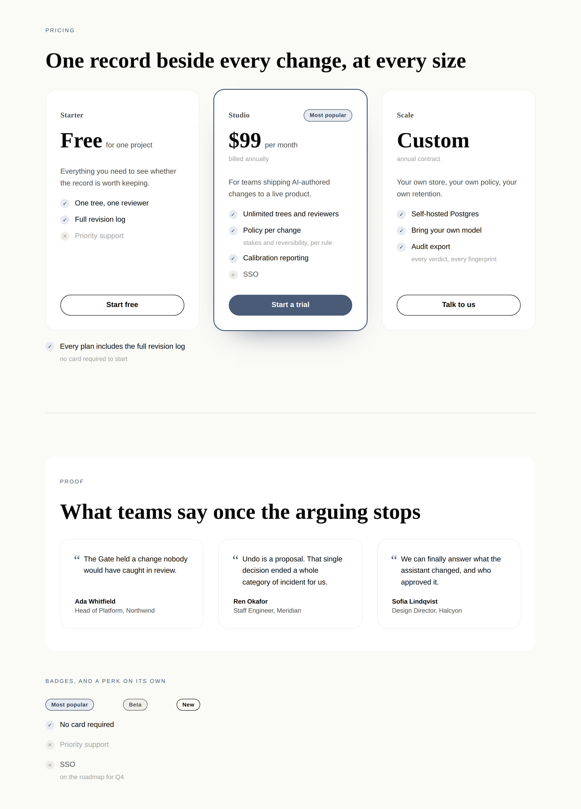
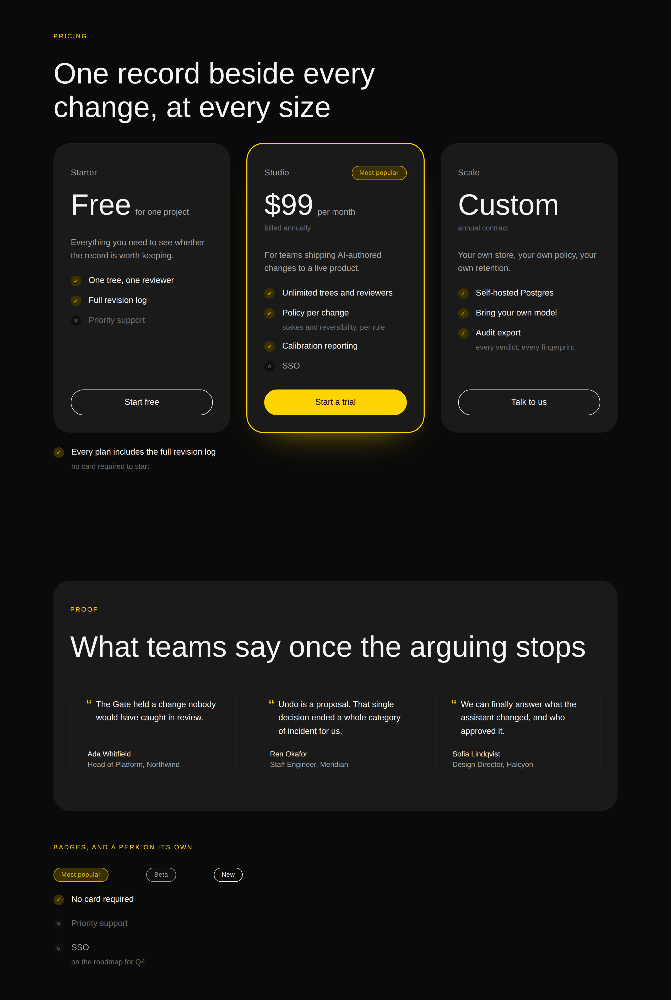

# 16 August 2026 — a perk, and a perk-list-item

**Routine:** `Loom primitives` (second run, same day) · **Section:** §4b step 5 ·
**Branch:** `primitives-02-a-perk-and-a-perk-list-item`

**Specimen sheet:** https://claude.ai/code/artifact/b40adb64-d97b-4f3d-aa21-bc53d5d97b0a
— every primitive from both runs, live under both palettes. Not a screenshot;
see the finding below for why that matters.

This run exists to answer the maintainer's review of #75. It is not planned
work, and everything in it traces to one of his three points.

## What he said, and what I did

### 1. "It actually should be a `perk-list-item`"

> *"For `loom.perk`, I think it is more a matter for an incorrectly named
> primitive. It actually should be a 'perk-list-item'. This is more semantically
> correct as it is indeed a perk but was designed to be used in the context of a
> list…so hence a list item. Now this opens up the use of a `loom.perk` which may
> be a stand alone perk div."*

Done, both halves.

| | | |
| --- | --- | --- |
| `loom.perk-list-item` | `<li>` | the row inside a `loom.perk-list` — this is #75's `loom.perk`, renamed |
| `loom.perk` | `
` | the same content standing alone |

The library goes 24 → 25. `perk-content.ts` holds the Zod schema, the three
state markers and the row's layout, so the two primitives are a root element
around one shared content model and a fourth state cannot be added to one and
forgotten in the other. A test asserts the schema on both halves for exactly
that reason.

**He was right, and the PR question I raised was the wrong question.** I had
asked whether `<ul>`/`<li>` was worth a "soft coupling" — a perk outside a list
being a stray `<li>` — and offered to move it to a `div` for consistency. Both
of my options were wrong, because both kept *one* primitive doing two jobs. The
coupling was not a cost to accept or trade away; it was a signal that the thing
had been under-decomposed. Which is, uncomfortably, the exact failure
`docs/primitive-granularity.md` says to watch for, arrived at from a direction
the doc does not cover: not a prop that should have been structure, but two
markups sharing one registration.

The standalone case is real and now expressible: **"✓ No card required"** under a
call to action, a qualifier beside a price, one line in a split's column. All
three are on the specimen sheet.

### 2. "I can't see your screen shots… the link comes back as 404"

Diagnosed, and it is worse than a bad link. **The repository is private**, so
GitHub's image proxy — which is unauthenticated — cannot fetch
`raw.githubusercontent.com` URLs into a rendered comment. Verified from this
session: a raw URL for a file that exists on `main` answers **404**.

So **no image in any report or pull request has ever rendered**, for anyone.
This is not a primitives problem: #72 embedded three screenshots the same way, so
the portal routine's before/after images were almost certainly never seen either.
Every brief asks for a visual and every routine delivers it in a way that cannot
work.

The preview 404 is a second, separate cause: Vercel preview deployments are
protected by default and the portal's `/` requires an actor besides.

Fixed for this run by **publishing the visual outside the repository** as a live
page rather than an image. It is better than a screenshot regardless — the
primitives are real DOM, the hover states work, and resizing shows the intrinsic
reflow that no static image can. Filed as a finding for the maintainer with three
options, since the durable fix is his.

### 3. "If 21st.dev is blocked just because of not being added to a white list, then I can add it"

Acknowledged; nothing for me to do until the allowlist entry exists. I moved the
answer out of the merged PR thread and into `FINDINGS.md`, because a merged PR's
comments are not something the next run reads. Two things in his sentence sharpen
the brief and are worth carrying: **21st.dev is a reference for the visual bar,
not a catalogue to port**, and **breadth is the main objective**, basic through
elaborate.

## The decision recorded — and it needs a word from him

[**0061 — a suffix that names the markup earns its place; a suffix that names the
parent does not.**](../decisions/0061-a-suffix-that-names-the-markup-earns-its-place.md)
**Status: `Proposed`.**

The rename contradicts an `Accepted` record.
[0054](../decisions/0054-a-container-is-its-childs-name-plus-the-arrangement.md)
says, in as many words: **"No `-item` suffix, ever."**

`decisions/README.md` is unambiguous about what happens next: *"A change that
contradicts an `Accepted` record is an escalation, not a refactor: write the
replacement with status `Proposed`, flag it for review, and leave the existing
record standing until someone decides."* So 0054 is untouched and 0061 is
`Proposed`.

I built the rename anyway, because the maintainer asked for it directly and
maintainer comments outrank the plan. That leaves a deliberate inconsistency —
the code follows a `Proposed` record while an `Accepted` one says otherwise —
and it is his to close with one word: accept 0061, or revert.

**The argument in 0061, briefly.** 0054 was defending against a suffix carrying
*no information*: `faq-item` tells a reader only that it goes inside a `faq`,
which the tree already shows. This suffix carries a different fact — that
`loom.perk-list-item` is an `<li>` and `loom.perk` is a `
` — and nothing
else in the tree states it. So the amended rule is: **a suffix is permitted when
it names the markup, and forbidden when it only names where the primitive sits.**

**The cost, stated plainly.** 0054's stem rule stops uniquely identifying the
pair. Strip `-list` from `loom.perk-list` and you get `loom.perk`, which is now
the standalone `
`, not the list's child. A model guessing the pair from the
container's name gets a registered primitive that renders the wrong element.
There is a test named after this that pins it as deliberate rather than
accidental, and it is the one to delete if 0061 is rejected.

**Blast radius of the rename: zero.** `loom.perk` reached `main` in #75 hours
before this, and no demo tree, portal fixture or `apps/` code references it.

## Rebased onto five merges, and two things changed underneath

`main` moved from `3a1e419` to `55165a9` while this branch was open — #76 through
#80. Two of them bear on this work.

**The record number collided.** `Loom daily build` took **0060** the same day, so
this run's record is **0061**. That is the collision `FINDINGS.md` already has an
entry about; the practical lesson is that a record number is not reserved by
writing the file, and the check that catches it is `pnpm decisions:index`
failing rather than anything at review time.

**0060 is the answer to this routine's own finding**, filed twelve hours earlier:
*a primitive owns a string, and a deployment may replace it*. The framework
routine built the seam and — correctly — did not reach into `src/primitives/` to
adopt it, filing a finding back instead. **So this run adopts it.** `PERK_TEXT`
declares the two keys, both primitives pass `loom.text` into the marker, and the
strings are no longer inline. That finding is now closed.

Adopting it cost one red test, and the red test is the interesting part — see the
findings below.

## Real test numbers

`pnpm verify` — green, on `55165a9`.

| | Files | Tests |
| --- | --- | --- |
| `@loom/runtime` | 89 passed | 1228 passed |
| `@loom/portal` | 48 passed | 484 passed |

Build and typecheck clean. Nothing skipped, no test weakened.
`library.test.ts` 46 → 49 tests. What is new:

- **The `<ul>`/`<li>`/`
` split asserted directly** — three lists, ten `<li>`,
  and the standalone perk positioned after the last `</ul>`. Before the rename
  the eleventh perk was an `<li>` outside any list: markup that renders correctly
  and says something untrue about the page.
- **The schema asserted on both halves of the pair**, which is what makes sharing
  `perk-content.ts` worth doing rather than merely tidy.
- **The stem-rule exception pinned by name**, so 0061's cost stays visible.
- **The declared strings asserted on both halves** — two keys, `excluded` and
  `coming`, and no key for `included`.

One test failed on the way, and again the fix was in the test: adding the
standalone perk to the fixture made nine ticks where the assertion said eight.

## Findings

Three filed, one closed.

- **Closed: the first primitive-owned string now has somewhere to be translated.**
  The framework routine's finding, answered by adopting 0060 in both halves of
  the perk pair.
- **A render that omits `options.text` loses an accessible name silently.** This
  is what the red test was. `renderLoomTree`'s `text` parameter is optional, and
  a host that wires `resolver` and `validator` but not `text` hands every
  primitive an empty map — so the *declared* string does not arrive either, and
  the marker falls through to its no-name branch. `library.test.ts` had been
  passing `resolver`, `validator` and `themes` since long before the seam
  existed, so the perk's "Not included" simply vanished. The separate interface
  is deliberate and well argued in `text.ts`; the observation is only about which
  way the default fails, and it fails towards the nameless control the seam was
  built to prevent. Owned by the framework routine, with two options offered.
- **The repository is private, so no embedded image has ever rendered.** Owned by
  the maintainer; three options given, cheapest first.
- **21st.dev — answered.** Recorded in `FINDINGS.md` so it survives the merged PR
  thread.

## Open questions

**1. 0061 itself.** Accept or revert — the one thing in this run that is
genuinely blocked on him.

**2. Should the specimen sheet become a repeatable thing?** This run generated it
with an ad-hoc script that was deleted afterwards, which means the next run
rebuilds it from scratch. A small harness under `tools/` would fix that, and
`tools/` is not this routine's lane, so I have not added one. Worth a line in
someone's brief.

**3. `loom.perk`'s standalone styling is currently identical to the row's**, plus
`align-self: flex-start`. That is the predictable choice and possibly the timid
one — a standalone reassurance under a CTA might want to be smaller and quieter
than a row in a priced checklist. Left alone until a real page argues otherwise.

## What the library still cannot express

Unchanged from this morning's report, and the ordering I would work in:
**the compose-and-arrange layer** (`loom.stack`, `loom.grid`, `loom.card`) —
every container today is a *named band*, so "these things, in a column, with this
gap" has to borrow a band that means something else. Then **chrome** (nav,
footer): a page built from this library still has no way in and no way out. Then
the comparison matrix, the small leaves (`icon`, `avatar`, `kbd`, `code`), the
behavioural bands, and the five Hermes blocks that need the data seam.
