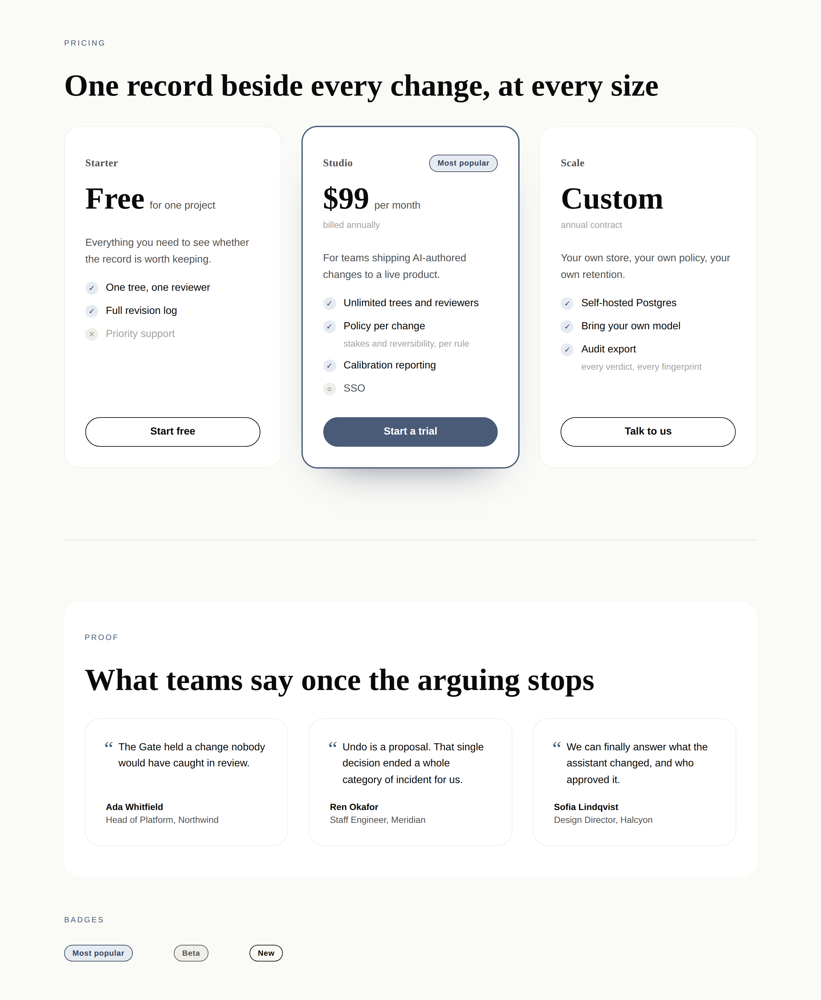

# 16 August 2026 — the price and the proof

**Routine:** `Loom primitives` (first run) · **Section:** §4b step 5 ·
**Branch:** `primitives-01-pricing-and-proof`

## What shipped

Six primitives, taking the starter library from eighteen to twenty-four. They
are three pairs and a leaf, and they are one unit rather than six items: the two
bands that close a sale, which the first eighteen could not build.

| Primitive | What it is |
| --- | --- |
| `loom.tier-table` | The pricing band — plans side by side |
| `loom.tier` | One plan: name, price, badge region, action region |
| `loom.perk-list` | A checklist |
| `loom.perk` | One line of it — included, excluded, or coming |
| `loom.quote-grid` | The proof wall, over the `loom.quote` already registered |
| `loom.badge` | "Most popular", "Beta", "New" |

## Why these six

The library could already build the top of a marketing page — hero, logos,
features, numbers, a pull quote, questions. It could not build the two bands
that come after the argument is made: **what it costs**, and **who else bought
it**. A demo that scrolls from a beautiful hero into a gap where the pricing
should be is the demo failing at the part a visitor came for.

They were also the cheapest six worth doing, in the sense that matters. Three of
them are pairs 0054 had already named or implied, so no naming was re-litigated;
`loom.quote-grid` needed nothing from `loom.quote` but its existence, so a whole
band arrived for one forty-line container; and `loom.badge` was needed anyway by
the tier, which is how a leaf earns its place rather than being added because a
list of leaves said to.

The alternative candidates — a bento grid, a comparison matrix, nav and footer
chrome, a timeline — are all real and all still open. None of them is as
load-bearing as pricing, and a bento grid in particular is a showpiece rather
than a thing a page needs.

## Which Hermes fields became nodes, and which stayed props

This is the part of the port worth reading closely, because `PricingTier` is the
clearest worked example of [0052](../decisions/0052-a-repeated-item-is-a-node-and-a-fixed-field-is-a-prop.md)
in the library so far. Hermes' shape had eight fields; `loom.tier` has five
props. Three of the eight were structure wearing a prop's clothes.

| Hermes `PricingTier` field | Became | Why |
| --- | --- | --- |
| `features: string[]` | **child nodes** — a `loom.perk-list` of `loom.perk` | Repeated content. Adding one was a `configure` replacing a whole tier record; it is now one `insert`, weighed, attributed and reversed on its own |
| `description` | **a child node** — `loom.prose` | The block's own prose, 0052's third clause. A sentence should be re-authorable without replacing the card around it |
| `ctaText` + `ctaUrl` | **a region** — a `loom.action` in the `action` slot | The library already has a call to action, with a scheme allowlist ([0053](../decisions/0053-a-url-in-the-tree-is-checked-against-a-scheme-allowlist.md)) that a second one would have to be kept in step with |
| `highlighted: boolean` | **split in two** | The part that changes what is painted is `emphasis`, a prop — no delta reorders a border. The part that was *content*, the "Most popular" ribbon, is a `loom.badge` in a region, because a boolean deciding whether a piece of copy exists is `insert` in disguise |
| `name`, `price` | **props** | Exactly one of each, meaningless apart |
| `id` | **dropped** | The tree gives every node an id ([0038](../decisions/0038-an-id-names-one-node-and-a-return-is-not-a-reuse.md)); a second one inside props would be a name nothing checks |

The two props I want a reviewer to look hardest at, because both are near-misses
of the kind `docs/primitive-granularity.md` warns about:

- **`loom.tier-table`'s `columns`** is a minimum column width fed to `auto-fit`,
  exactly as `loom.feature-grid`'s is. Changing it moves no tier in or out of
  the band — it says how wide a column must be before a second one is worth
  having. A `columns` that showed the first three tiers would be `remove` in
  disguise and would have to go.
- **`loom.perk`'s `state`** is a closed set of three renderings selected by an
  enum, which 0052's fourth clause keeps as a prop for the reason it keeps
  `loom.divider`'s ornaments: swapping a perk from included to excluded should
  be one `configure` the Gate weighs as small and reversible, not a `remove` and
  an `insert` that loses the line's identity and its history.

`state` is also the one place the port is **better than Hermes rather than equal
to it**. A bare string can only mean "included", so a Hermes tier that wanted to
show what it *lacks* — the comparison every pricing table is actually making —
had to write "No priority support" and hope the reader noticed the "No".

## The decision recorded

[**0059 — a leaf whose whole content is one string takes it as a child.**](../decisions/0059-a-leaf-whose-whole-content-is-one-string-takes-it-as-a-child.md)
Accepted; nothing superseded.

The library had been sorting this case four times by four separate arguments.
`loom.action` takes its label as child text; `loom.stat` and `loom.feature` hold
their copy in props; `loom.badge` had to pick a side. The rule is: count the
strings that make up the node's content — one is a child, two or more are props.
It is not about how literary the string is, it is about whether the node has an
interior at all. A badge with its label removed is not a badge with a gap in it.

Worth recording rather than deciding inline because the remaining port is full
of the case — a chip, a tag, a nav link, a `kbd`, a step label — and each one is
a stored tree that cannot be migrated cheaply once it ships. `loom.perk` is the
example that shows the rule bites: it looks like a one-string leaf and is not,
because `label` and `note` are two strings and a note that outlived its claim
would be a valid tree saying nothing.

Nothing this run touched the tree schema, the delta model, or an Accepted
record, so there is no escalation and nothing was left out on that account.

## Decisions taken that were not specified

- **`loom.perk` renders `<li>` and `loom.perk-list` renders `<ul>`.** Every
  other container in the library is a `div`. A checklist is the one band where
  the list semantics are the content, and a screen reader announcing "list, ten
  items" is information the visual design conveys and a `div` would lose. It
  costs the pair a soft coupling — a perk outside a list is a stray `<li>`,
  which browsers render exactly as it is styled — and no hard one, because
  rendering stays total either way ([0008](../decisions/0008-the-renderer-is-a-total-pure-projection.md)).
- **A featured tier is lifted by a ring and a shadow, never by `scale`.**
  `transform: scale(1.05)` is the obvious way to draw the eye and it is wrong in
  a grid: the scaled card overlaps its neighbours' hover targets, its text
  renders off the pixel grid, and its `1px` border stops being `1px`.
- **A tier's body takes the slack, so four cards line their buttons up** even
  when one has three more perks than the others. The action also carries an
  `auto` start margin, for the tier that has a price and a button and nothing
  between them.
- **A price is free text and deliberately not a number.** Hermes learned this
  over a year of real pages: a third of the prices people write are "Free",
  "Custom", or "from £5k", and a numeric field with a currency prop beside it
  cannot say any of them.
- **An excluded perk is dimmed rather than struck through.** A line through text
  means "this was here and is gone", which is what a diff says; a plan that
  never included priority support is not a plan that lost it.
- **No `flow` prop on `loom.quote-grid`.** 0054 makes a container's name state
  its arrangement, so a prop switching it to a multi-column masonry flow would
  make the name wrong for half its values. Masonry is `loom.quote-column`,
  unbuilt, and buildable today.

## Real test numbers

`pnpm install && pnpm verify` — green, on `766f711`.

| | Files | Tests |
| --- | --- | --- |
| `@loom/runtime` | 87 passed | 1187 passed |
| `@loom/portal` | 46 passed | 455 passed |

Build and typecheck clean. Nothing was skipped, and no test was weakened.

`src/primitives/library.test.ts` went from **34 tests to 46**. What is new:

- A third fixture, `pricingPage`, rendered under both palettes. The coverage
  test that asserts every registered primitive appears across the fixtures now
  spans three rather than two.
- **Ten perks counted as ten addressable nodes.** As Hermes shipped it these
  were ten strings inside three `features` arrays inside one `items` array. The
  count is asserted because it is the number that says the decomposition
  actually happened.
- **Both regions asserted to land where the flow of children does not put
  them** — the badge arrives as the tier's *first* child and renders after the
  plan name; the action arrives last and renders after a body it is not part of.
- **The schema asserted to refuse `features`, `ctaUrl` and `highlighted`.**
  `.strict()` is what makes "features are child nodes" a fact about the tree
  rather than a convention a proposal can route around.
- **0054's naming rule asserted rather than trusted:** stripping the arrangement
  word off any container must name something registered, so a pair that drifts
  apart fails here rather than in a catalogue a model misreads.
- The re-theme guarantee, the no-literal-colour rule and the one-stylesheet
  claim, all re-run against the new band.

One test failed on the way and is worth recording because the fix was in the
test: I asserted seven included perks where the fixture has eight. The count was
wrong, not the renderer.

## Two mistakes caught in review, before the pull request

- **The branch was cut from a stale ref.** The session's `origin/main` was five
  merges behind the commit the working tree had been checked out at, so the
  first branch was based on `e1340ee` — before 0056, 0057 and 0058 existed. It
  surfaced as `pnpm decisions:index` reporting three missing records. Refetched
  and rebased onto `766f711`; `src/primitives/` is byte-identical between the
  two, so no work was lost. **Worth knowing for the next run: fetch before
  branching, and treat `decisions:index` failing on missing numbers as a signal
  about the base rather than about the records.**
- **A comment in `loom.quote-grid` claimed a framework limitation that does not
  exist** — that a primitive cannot style children it does not render, so
  masonry was out of reach. It is reachable: a descendant rule in the shared
  static stylesheet gets there, exactly as `details[open] > summary .loom-marker`
  already does. Corrected before commit rather than shipped as a false finding.

## Findings

Three filed, none closed — there were no open findings owned by this routine, as
this is its first run.

- **`21st.dev` is unreachable from this environment.** The brief makes fetching
  it mandatory as the visual standard; the egress proxy refuses it, and not
  transiently. Owned by the maintainer, because the fix is an allowlist entry or
  a change to the brief — a routine can do neither.
- **The library has its first primitive-owned English string.** `loom.perk`'s
  markers carry "Not included" and "Coming soon" as accessible names, and there
  is nowhere for a deployment to translate them. Owned by the framework routine,
  since the answer changes `definePrimitive`.
- **No framework gaps**, recorded as an absence the way the other two routines
  record theirs.

## Open questions

**1. Is `state` on `loom.perk` one prop too clever?** It is three renderings of
one node, which 0052 keeps as a prop. The alternative reading is that "included"
and "excluded" are different enough to be different primitives. I do not think
so — they share every field and a tier flips one to the other constantly — but
it is the judgement in this unit I hold least firmly.

**2. Should `loom.tier` have a third region for the price?** Right now `price`
and `period` are props, which is correct by the field count. But a plan whose
price is "£99 <s>£149</s>" — a struck-through anchor price — cannot be
expressed, and that is a real pricing page. A `price` region would allow it and
would also allow a price with nothing in it, which is worse. Left as props;
raising it because the marketing site may want the strike-through.

**3. Is `<ul>`/`<li>` worth the soft coupling?** Recorded above as a decision
taken; flagged here because it is the one place this unit departs from a
convention the other eighteen primitives share, and a maintainer may prefer
consistency to semantics.

## What the library still cannot express

The seventy-block port is roughly a third done. Named in rough order of what a
marketing page misses most:

- **Chrome.** No nav, no footer. A page built from this library has no way in
  and no way out, which the demo currently hides by being one screen.
- **A comparison matrix.** `loom.tier-table` compares plans by putting them side
  by side; it does not compare *features across* plans, which is a genuine
  `<table>` with a different child and is its own unit.
- **The compose-and-arrange layer.** There is no `loom.stack`, `loom.grid` or
  `loom.card`. Every container in the library today is a *named band* — a
  feature grid, a tier table — so a region that is simply "these things, in a
  column, with this gap" has to borrow a band that means something else. This is
  the gap I would close next.
- **Small leaves.** No `icon`, `avatar`, `kbd`, `code`, `tag`. `loom.quote`
  draws its own avatar inline, which is the kind of duplication a leaf exists to
  prevent.
- **Bands with genuine behaviour** — marquee, carousel, tabs, anything
  self-measuring. `loom.logo-cloud` already declines to scroll for a stated
  reason, and 0055 rules out reaching them through props, so each is an atomic
  primitive whose motion lives in the shared stylesheet.
- **Anything bound to real data.** [0058](../decisions/0058-a-binding-is-a-question-the-tree-asks-answered-before-the-walk.md)
  landed the seam and no primitive in the library reads `loom.data` yet. Five of
  Hermes' seventy need it, and the authoring half — a primitive declaring which
  binding names it reads — is the framework routine's next unit rather than
  this one's.
