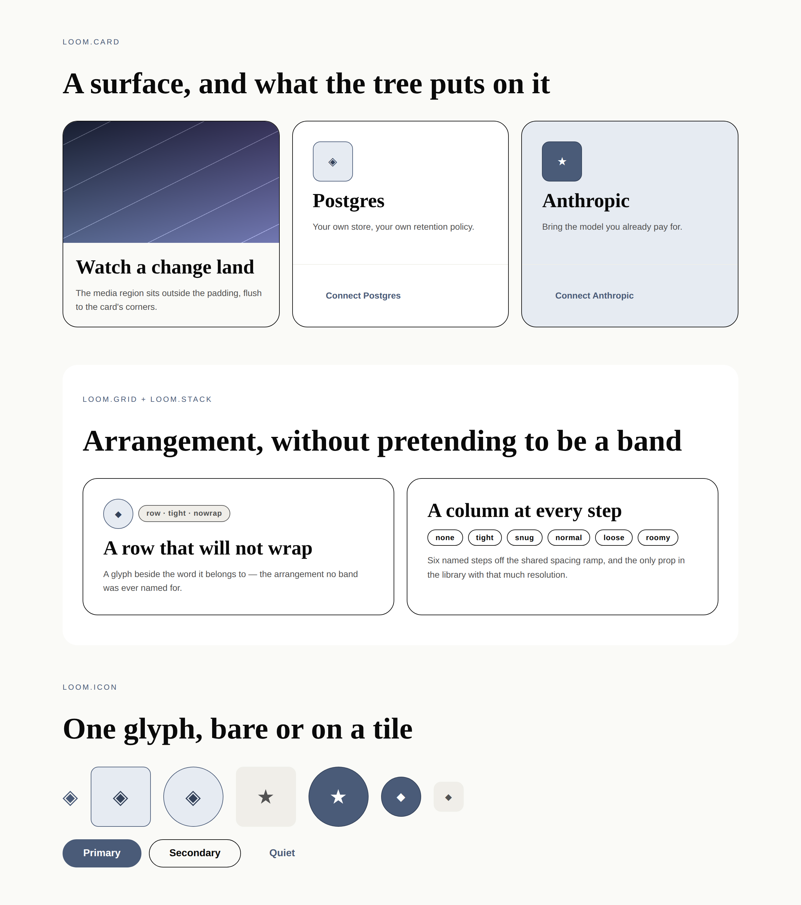
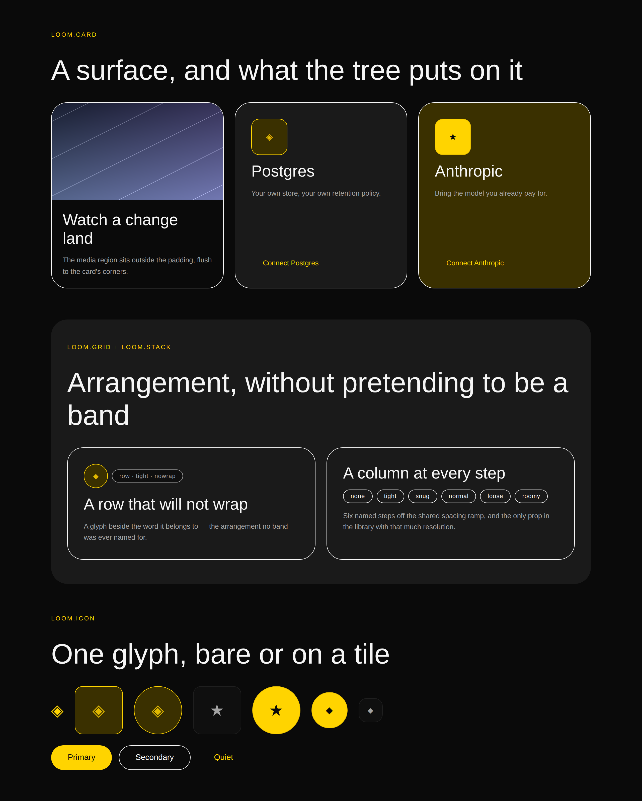

# 17 August 2026 — the compose-and-arrange layer

**Routine:** `Loom primitives` · **Section:** §4b · **Branch:** `primitives-04-compose-and-arrange`

Four primitives — `loom.stack`, `loom.grid`, `loom.card`, `loom.icon` — one shared
constants module, and [0062](../decisions/0062-a-general-arranger-is-named-for-the-arrangement-alone.md).
The library goes from **25 to 29**, and for the first time a page can say "these
two things, side by side" without borrowing a band that means something else.

## Why these four

The 16 August report named this as next and the reason still holds: **every
container in the library was a named band.** `loom.feature-grid` is excellent at
the features band and knows what a feature is; `loom.tier-table` is a price
list. None of them can hold two buttons under a headline, a glyph beside a name,
or three lines of a footer column — which is what a page actually spends most of
its nodes on. The only way to say it was to reach for a band that means
something else, and a `loom.feature-grid` holding two buttons is a tree that
lies about what it contains.

That is a **reachability** problem, which is the one the granularity doc says is
not recoverable. So it outranked the remaining Hermes bands: with the general
layer in place, a band nobody has ported can be *assembled* today and named
properly later, and naming it later is an `insert` and a `remove` rather than a
rewrite. Without it, forty-odd bands each need their own primitive before
anything they contain can be arranged.

`loom.icon` came with them rather than separately. The glyph existed already —
`loom.feature` has carried one in a prop since the first port — but it was only
reachable *inside a feature*. A card could not have one. It is also the cleanest
[0059](../decisions/0059-a-leaf-whose-whole-content-is-one-string-takes-it-as-a-child.md)
case in the library: exactly one string, and it is the whole of what the node
says.

## Which Hermes fields became nodes, and which stayed props

This unit is the one place the porting question inverts. **Nothing was ported.**
Hermes has no generic stack, grid or card — its composition model is a flat
`warp.blocks` list, so "a column with a gap" is not a block it could express and
never appears in its seventy. These four are the gap 0052 opens up rather than a
translation of something that existed: nesting is the thing Loom added, and this
is the vocabulary nesting needs.

What that leaves is the same test applied to props nobody inherited, and the
answers are worth stating because they are the near-misses the granularity doc
warns about:

| Prop | Reading | Verdict |
| --- | --- | --- |
| `stack.direction` | changes *how* however-many children sit, never how many | **prop** — and a `move` in disguise if it were two primitives |
| `stack.gap` / `align` / `justify` | arrangement of a fixed set | **prop** |
| `stack.wrap` | whether the row breaks, not what is in it | **prop** |
| `grid.columns` | a **floor** fed to `auto-fit`, exactly as in `loom.feature-grid` | **prop** |
| `card.tone` / `padding` / `elevation` | a closed set of renderings of the same content | **prop** |
| `card` media | a region the card places *differently* — outside the padding | **slot** ([0051](../decisions/0051-a-slot-is-a-region-the-primitive-places.md)) |
| `card` footer | pinned to the card's floor with `margin-top:auto` | **slot** |
| `icon` glyph | one string, the whole of the node's content | **text child** (0059) |
| `icon.label` | the accessible *name of* that content, not a second content string | **prop**, as `loom.media`'s `alt` is |

The one that took the longest was `stack.direction`. `loom.column` and
`loom.row` read better in a catalogue, and they fail the test: flipping the axis
is the single likeliest adaptation to this layer, and as two primitives it
becomes a `remove` and an `insert` that throws away the subtree's history to say
something about its axis. As one prop it is a `configure`.

The card's two regions are the other one worth naming. "The first child is the
picture" is a rule no schema states and every `move` breaks — which is 0051's
test almost verbatim, so they are slots. The **padding lives on an inner element
rather than on the card**, so the media region needs no negative margin to
escape it; bleeding content back out of a padded box is the usual trick and it
is brittle exactly where this is not, since it depends on two values staying
equal.

## The naming question, and 0062

`loom.stack` and `loom.grid` are containers with **no child type**, which 0054
does not cover — it governs *pairs*, and says in as many words that a primitive
which is not half of one names itself. [0062](../decisions/0062-a-general-arranger-is-named-for-the-arrangement-alone.md)
writes that case down, and it is `Accepted` rather than `Proposed` because it
contradicts nothing: 0054's stem rule strips an arrangement word *with its
hyphen*, and `loom.grid` has no hyphen. The registry walk that enforces the pair
rule passes unchanged, and a test now asserts that it does so deliberately
rather than by luck.

**The half of 0062 that matters is not the naming.** It is that a general
arranger is a floor and not a ceiling: a model that can reach `loom.stack` and
`loom.card` can build any page without ever naming what it built, and a tree of
anonymous boxes is worth strictly less than a tree of bands — the projection, the
Gate's stakes analysis, and a person reading a diff all key off `loom.tier-table`
*being a price list*. The mitigation is deliberately thin, because a rule the
runtime cannot enforce should not pretend otherwise:

- each general arranger's **description says "prefer a named band where one
  fits"**, and a test fails if that sentence ever disappears — a description is
  all a model has when it chooses;
- they sit with page structure in **registration order**, so a model reading
  down the catalogue meets `loom.feature-grid` first;
- **the same arrangement of the same thing twice is a band waiting to be named**,
  which is the signal for a future run to write the pair.

If a later run finds trees full of `loom.stack` where bands existed, the
mitigation was not enough and 0062 is the record to revisit. That is written
into its Consequences rather than left as folklore.

## Shared constants

`layout.ts` holds the gap scale, the alignment maps and the column minimums.
`loom.feature-grid` now imports the minimums it used to declare privately —
**values unchanged, asserted by a test** that the two grids wrap at the same
width. Two grids in one library breaking at different widths is a difference
nobody chose and everybody sees.

The gap scale has six named steps, which is more resolution than any other prop
in the library carries. That is deliberate and it is recorded as the largest
single addition this layer makes to the compiled-grammar budget
([0014](../decisions/0014-the-reply-schema-must-fit-a-grammar-budget.md)): a
stack is the one primitive used at every scale on a page, from a glyph beside a
label to the distance between two bands. It is also the first thing to trim if
that budget ever binds.

## Tests

`pnpm install && pnpm verify` is **green**.

| | Before | After |
| --- | --- | --- |
| Runtime | 1228 passed / 89 files | **1237 passed / 89 files** |
| Portal | 484 passed / 48 files | **484 passed / 48 files** |

Nine new assertions, all in `src/primitives/library.test.ts`, and the four new
primitives render under **both starter palettes** in a fourth fixture that the
existing coverage test now includes — so a primitive that stopped being
exercised would fail rather than go quiet. Worth naming three:

- **the card's regions**, asserted structurally: no `padding` between the card's
  opening tag and its media, and `margin-top:auto` on the footer. Those two
  facts are what make them regions rather than children.
- **`grid.columns` is a floor**: the same five children survive `two` and
  `four`, and only the minimum width changes. That is the near-miss the
  granularity doc warns about, pinned rather than argued.
- **the icon is decorative by default**: unlabelled renders `aria-hidden`, and
  `label` opts into `role="img"`. An icon beside the word it repeats read out
  twice is worse than one skipped.

No test was weakened, skipped, or marked `todo`.

## The visual

The specimen above is real DOM rendered through `renderLoomTree` under both
starter palettes, screenshotted at 2× — not a mock. **Nothing in it carries a
literal colour below the root**, which the re-theme test asserts by regex on the
markup and the two images demonstrate by looking nothing alike.

`21st.dev` **is still blocked** from this environment — verified again this run,
same `EGRESS_BLOCKED`. The allowlist entry the maintainer offered on #75 has not
landed, so this run again worked to the standard the brief names second:
`loom.hero` and `loom.feature-grid` as the floor. The existing finding is
annotated rather than duplicated.

There is **no deployed preview URL** for this branch. The primitives routine
deploys nothing — `apps/portal` belongs to another lane — and the previous
finding established that Vercel previews are protected by default and therefore
useless to a reader who is not signed in to both. The screenshots and the report
are the surface for this one.

## Findings

**Filed one**, for `Loom daily build`: a card with `href` can legally contain a
`loom.action`, which is nested anchors — invalid HTML that renders as something
nobody can click. Nothing in the seam can catch it, deliberately, since 0008
forbids the renderer from enforcing parentage. It pre-existed in `loom.feature`;
this unit makes it reachable in more places, and the Gate's analysis is the
plausible home for it.

**Annotated one**: the 21st.dev finding, with today's re-verification.

**Not filed**, because it is not new: the portal's own sandbox registry
(`apps/portal/lib/primitives/`) declares a `loom.card` of its own. It already
shadowed `loom.page`, `loom.heading` and `loom.prose` the same way, the two
registries are built separately, and nothing collides.

## Open questions

None blocking. One judgement worth the maintainer's eye, in
`## Needs your input` on the pull request: whether 0062's mitigation against
vocabulary dilution is strong enough, or whether the general arrangers should
have been held back until more bands existed.

## Next

**Chrome — `loom.nav` and `loom.footer`** — which the compose layer now makes
cheap: a footer is a grid of stacks, and it was not expressible last week. Then
the 21st.dev tier proper: **timeline, comparison table, bento grid**, the first
two of which are pairs by 0054 and the third of which is the one that needs
thinking about, since a bento's emphasis is per-cell and per-cell geometry is
the one thing this layer deliberately left out.
