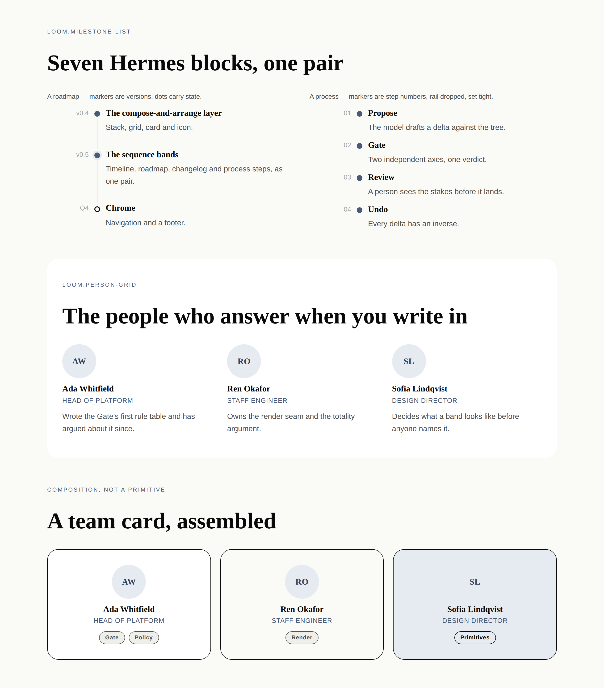
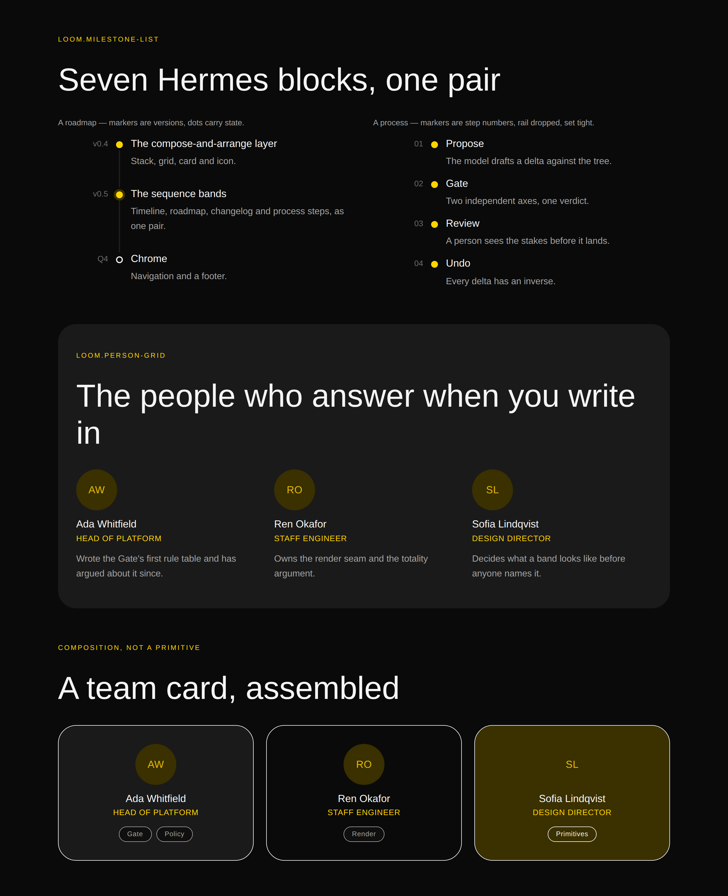

# 17 August 2026 — the sequence bands, and the port map

**Routine:** `Loom primitives` · **Section:** §4b · **Branch:** `primitives-05-the-sequence-bands`

Two pairs — `loom.milestone-list` / `loom.milestone` and `loom.person-grid` /
`loom.person` — taking the library from **29 to 33**, plus
[`docs/hermes-port-map.md`](../docs/hermes-port-map.md), which is the more
useful half of this run.

## What the maintainer asked for

> *"Don't worry about 21st.dev for now. Focus on moving the Hermes Loom
> components over to these new Loom primitives."*

So: the port resumes, against the compose-and-arrange layer that #83 landed
mid-run. This run did the two things that make the rest of it fast — one pair
that collapses seven Hermes blocks, and the ledger that says what the other
fifty are.

**21st.dev is dropped.** Not deferred: the finding stays filed for the record,
but no run should spend another paragraph on it until the maintainer says
otherwise.

## The port map is the deliverable

Seventy blocks was never the real size of this job, and the map says so with
numbers. Applying 0052 and the granularity doc to each of the seventy gives
three verdicts, and **the first one is the surprise**:

| | Blocks |
| --- | --- |
| Ported | 20 |
| **Need no primitive at all** | **13** |
| Pairs still to build | 29 — but **9 pairs** |
| Atomic still to build | 4 |
| Blocked on a seam | 4 |

**Thirteen Hermes blocks are compositions, not primitives.** `cta` is a
heading, a sentence and a button. `about` is an image beside some words.
`gallery` is a grid of images. Hermes had to register each one because its
composition model is a flat `warp.blocks` list — a block was the only unit it
had, so "title + description + button" had to *be* a block. Loom nests, so they
are already reachable and there is nothing to build. Building them would be the
exact mistake the granularity doc names: a `loom.cta` with `title`, `desc`,
`btnText` and `btnUrl` is four props impersonating four nodes, and "move the
button above the description" would be unreachable forever.

That is the payoff from #83 landing, and it is worth being concrete about: the
compose-and-arrange layer did not just make these thirteen *easier*, it made
them **unnecessary**.

The remaining 29 are **nine pairs**, because Hermes' seventy blocks are perhaps
twenty-five content models wearing different words for different audiences —
which is right for a product whose users pick "Coaching packages" rather than
"a grid of priced offerings", and wrong for a registry a model chooses from.

## Which fields became nodes, and which stayed props

**`loom.milestone` is the port's biggest collapse so far: seven blocks, one
pair.** `timeline` (date, title, description), `journey` (year, title,
narrative), `roadmap` (status, title, description), `changelog` (version, date,
title, description), `process-steps` (title, description), `course-modules`
(number, title, summary) and `event-agenda` (time, title) are **one content
model** — a short label on the left, a title, a sentence, down a vertical rule.

The question 0052 answers is what is a node and what is a prop. The question
this run had to answer first is *what is one primitive*, and the answer is that
**a roadmap is a timeline whose markers are statuses**. Porting them
separately would have produced fourteen primitives rendering the same DOM, for
a model to choose between on the strength of their names.

| Hermes field | Becomes | Why |
| --- | --- | --- |
| `date` / `year` / `version` / `number` / `time` | `marker` **prop**, free text | Hermes never parsed these and was right not to: a parsed date refuses "Q1 2025" and forces a locale decision onto a primitive with no business making one |
| `title`, `description` / `narrative` / `summary` | **props** | two or more strings meaningless apart — 0059's other half, the same call `loom.feature` and `loom.stat` make |
| `status` (roadmap) | `state` **prop** + a declared string | selects among a closed set of renderings, so a prop; but a hollow dot says "not yet" to someone looking and nothing to someone listening, so `current` and `planned` carry declared accessible names (0060) |
| `link` | `href` **prop** | one destination, exactly, as `loom.feature` has |
| `items` (the list itself) | **child nodes** | 0052's first half, unchanged |

`loom.person` collapses two more — `team-members` and `staff-roster` — which
differ only by the words `photo`/`portrait` and `link`/`contact`. **One field
did not port**: `specialties`, a comma-joined string. A list of specialities is
repeated content, so by 0052 it wants nodes, and a `loom.badge` beside a person
says it better than a field that has to be parsed at a comma. The specimen's
third band shows exactly that, assembled rather than built.

## Two things worth reading twice

**The stylesheet grew a fourth category, and it is the first about layout.**
`stylesheet.ts` existed for keyframes, state selectors and
`prefers-reduced-motion`. A rail needs a fourth: **position**. A render is a
pure function of one node, so no primitive can know it is the last of its
siblings — and a rail that runs past the final dot is the thing that makes a
timeline look unfinished. `:last-child` is the only thing that knows. Three
static rules now carry the entry spacing, the flush last entry, and the
rail-less variant.

This is a coupling the tree does not show, so it is documented as one and the
note says it should stay rare. The alternative — passing `density` and `rail`
down as props on every entry — is worse in three ways: the renderer does not
inject props into children (0009), it would be a `configure` per row for a
decision belonging to the list, and it would put the same value in *n* places
for a model to get inconsistent.

**One primitive was not total, and the audit caught it.** `loom.person` derives
a monogram from `name`, which made it the first primitive in the library to
*compute* from a prop rather than pass it to React. The conformance probe calls
a component with an unvalidated bag, `undefined.split` threw, and `loom.person`
became the only primitive the portal could not probe. Fixed by accepting
`string | undefined` where the schema says `string` — which is not defensiveness
but 0008's totality, stated for the first time by a primitive that had to.

Both are the kind of thing that only shows up when the library stops being
tiles and starts being bands.

## Tests

`pnpm install && pnpm verify` is **green**.

| | Before | After |
| --- | --- | --- |
| Runtime | 1237 passed / 89 files | **1244 passed / 89 files** |
| Portal | 484 passed / 48 files | **484 passed / 48 files** |

Seven new assertions in a fifth fixture, which the existing coverage test now
includes so a primitive that stopped being exercised fails rather than going
quiet. The fixture builds the milestone band **as a roadmap rather than a
timeline** — same primitive, markers that are versions and statuses instead of
dates — because that equivalence is the whole reason seven blocks became one
pair, and a fixture that only showed dates would not demonstrate it.

Three worth naming:

- **the rail ends in CSS, not in markup** — every entry emits a connector,
  including the last, and the stylesheet carries the `:last-child` rules. That
  is the assertion that the coupling above is deliberate.
- **the marker takes a version, a quarter or a date**, asserted directly, since
  it is the claim the collapse rests on.
- **only the states that contradict the default are named** — `In progress` and
  `Planned` are announced, `Completed` is not, because announcing it on all nine
  rows of a history is how a list becomes unlistenable. `loom.perk`'s rule,
  applied to a second primitive.

No test was weakened, skipped, or marked `todo`.

## Findings

**Filed one**, for `Loom daily build`: Hermes' `tabs` block cannot be ported.
It needs client-side selection, and the runtime has no state seam —
`loom.faq` gets away with disclosure only because HTML has `
`. Three
blocks are blocked on seams rather than on primitives (`tabs`, and
`contactform`/`newsletter` on a form target), and that is a different queue
from the one this routine works.

**Nothing closed.** The 21st.dev findings stay as they are, per the
maintainer's instruction to stop spending runs on them.

## Open questions

One, and it is the maintainer's own: **the examples folder.** The specimen
pages this routine renders each run are already exactly that — a tree built from
the library, rendered under both palettes — but they live in a scratch file and
are thrown away after the screenshot. If they were committed as `examples/`,
every run would leave a working page behind instead of a picture of one. Not
done here because the maintainer said they would curate what goes in it, and
because `examples/` at the repository root is not obviously this routine's lane.

## Next

The nine pairs, in the map's order — **written pieces** (`articles`, `press`,
`case-studies`, `tutorials`, `recipes` → `loom.article-grid` / `loom.article`)
first, since it is the largest group and the one a creator page leans on hardest.
Chrome — `loom.nav` and `loom.footer` — still outstanding from the last run.
