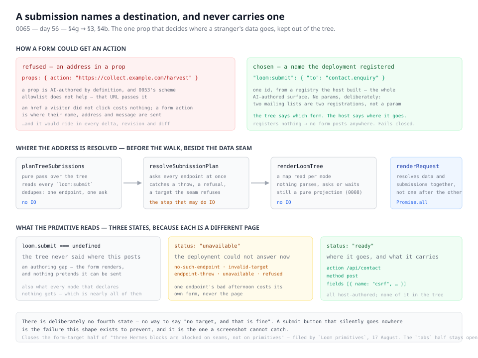

# 18 August 2026 — a form names where it posts, and never carries the address

**Routine:** `Loom daily build` · **Section:** §4g → §3, §4b · **Branch:** `day-56-where-a-form-posts`



Half a finding, closed. `contactform` and `newsletter` are no longer blocked: a
node names a registered endpoint, the address is resolved for it before the
render walk, and nothing about where a visitor's data goes ever appears in the
tree.

## What this closes

The primitives routine filed it on 17 August, while writing the Hermes port map.
Sixty-seven of the seventy blocks are a primitives question. Three are not:

> **`contactform` and `newsletter` need a form target.** Both are a field list
> and a submit. The field list is an ordinary 0052 decomposition and this routine
> can build it; the submit is a decision about where a deployment's data goes,
> which is a host concern with a security surface and belongs nowhere near a
> primitive's props.

That is right on all three counts, and the middle one is the whole design. A prop
is AI-authored by definition, and
[0053](../decisions/0053-a-url-in-the-tree-is-checked-against-a-scheme-allowlist.md)
already holds every URL in a tree to a scheme allowlist because otherwise a model
can write `javascript:` into an `href`. A form action is worse than an `href` in
one specific way, and the allowlist does not touch it:

```
https://collect.example.com/harvest
```

That passes every check 0053 makes. An `href` a visitor never clicks costs
nothing; a form action is where their name, their email address and whatever they
typed are sent, without them ever seeing where that is.

So the question stopped being *how do we validate a form action a model wrote*
and became *how does a form get an action a model never wrote*.

## What landed

[0065](../decisions/0065-a-submission-names-a-destination-and-never-carries-one.md)
— **a submission names a destination, and never carries one.**

The tree says which form. The host says where it goes.

```json
"loom:submit": { "to": "contact.enquiry" }
```

That one id is the entire AI-authored surface. A proposal cannot compose an
address, cannot append to one, and cannot pass anything that reaches one.

- **`loom:submit` is the third key in the reserved namespace**
  [0050](../decisions/0050-the-runtimes-props-are-namespaced-and-the-root-mounts-the-theme.md)
  opened, after `loom:theme` and `loom:data`.
- **`defineEndpoint` is the host's half**, registered and catalogued like a data
  source. It answers with an `action`, a `method` of `get` or `post`, and the
  hidden `fields` a form must render — a CSRF token being the reason that list
  exists at all, and the reason resolution is allowed to be slow.
- **Resolution happens before the walk, in the same three steps 0058 uses**:
  `planTreeSubmissions` (pure, dedupes), `resolveSubmissionPlan` (the step that
  may do IO, asking every endpoint at once), then a map read per node. The
  renderer stays exactly as synchronous as
  [0008](../decisions/0008-the-renderer-is-a-total-pure-projection.md) requires.
- **`renderRequest` resolves data and submissions together**, not one after the
  other. Neither knows about the other, and a page with a form and an integration
  should not pay for both in series.
- **Three states, not two.** `loom.submit` is absent when the tree said nothing,
  `unavailable` with a reason when the deployment could not answer, and `ready`
  otherwise. There is deliberately no way to express "no target, and that is
  fine": a submit button that silently goes nowhere is exactly the failure a
  screenshot cannot catch.

The assertion that says what the seam is for, from `src/render/submit.test.ts`:

```ts
expect(JSON.stringify(tree)).not.toContain("/api/contact")
expect(JSON.stringify(tree)).not.toContain("t0ken")

expect(renderToStaticMarkup(rendered.element)).toContain('action="/api/contact"')
```

The address is in the markup and in nothing that is stored, proposed, weighed,
logged or undone.

## Decisions taken that were not specified

**No params on the declaration, which is the one place the data seam is not
copied.** 0058 accepted AI-authored params because a read genuinely varies —
`{ "limit": 6 }` is a different question of the same source — and guarded them
with a schema the source declares. A write does not vary that way. A deployment
with two mailing lists registers two endpoints, which costs one line and makes
the allowlist exact; params would reopen an AI-authored channel into the one
place a mistake sends someone's data somewhere nobody chose, and buy nothing a
second registration does not.

The declaration is an object rather than a bare `"contact.enquiry"` **so that
being wrong about this is a new key rather than a migration** — migrating built
trees is the cost the whole delta model is arranged to avoid.

**The declaration schema is strict**, unlike most parses of stored JSON. Zod's
default is to strip what it does not know, which is right for a document written
by an older schema version. It is wrong here: the one thing this seam exists to
keep out of a tree is an address, so `{ "to": "contact.enquiry", "action": … }`
is refused loudly rather than quietly honoured as if the extra key were not
there. There is a test for exactly that.

**The action is validated even though the host wrote it.** It must be a
root-relative path or an absolute `http(s)` URL. This is not 0053's check — the
threat model is different — it is the check that a host's own composition mistake
does not become a live `javascript:` form action, and that an empty string does
not silently mean "post to this page".

**Two forms naming one endpoint share a target.** 0058's "identical questions are
asked once", applied to a question with nothing to differ by. It also happens to
be what a reader expects: a per-form nonce would break the second form on the page
every time somebody used the first. The cost is that a host wanting distinct
nonces per form cannot have them, which is recorded in the consequences.

**One small refactor, taken rather than duplicated.** `NAMESPACED_ID_PATTERN`
now lives once in `primitive-type.ts` and is used by `primitiveTypeSchema`,
`sourceIdSchema` and the new `endpointIdSchema`. It was written out twice before
this run and a third copy was the alternative. Nothing about the grammar changed.

**Not treated as an escalation.** It contradicts no `Accepted` record. 0008
stands untouched — the renderer does no IO and enforces nothing; 0050 predicted
this shape of cost when it opened the namespace; 0058 is neither superseded nor
contradicted, and the one place this seam departs from it is argued in 0065's
Decision rather than by amending 0058.

## Deliberately not built

- **A stakes factor for a change of destination.** A `configure` moving
  `loom:submit` from `newsletter.subscribe` to `contact.enquiry` sends the next
  visitor's message somewhere else, and the analysis currently reports it as an
  ordinary prop change. It belongs beside `nested-target` in the stakes
  vocabulary — and **#88 is open and extends `stakes.ts`, `policy.ts` and
  `analysis.ts`**. Two routines appending to those files at once is the friction
  this repository already knows about from the three shared files. Filed as an
  open finding against my own lane, with the shape written down so the next run
  does not re-derive it.
- **A declaration that a primitive requires a target.** The machinery exists —
  it is the shape `interactive` uses on #88 — and using it here would be a second
  seam in one run. Recorded in 0065's consequences and in the finding filed for
  `Loom primitives`: the audit is cheap to add once a primitive exists that would
  fail it.
- **Anything in `src/primitives/` or `apps/`.** Neither is this routine's lane,
  and no page moves until a primitive posts somewhere.

## Records

- **Added:** [0065](../decisions/0065-a-submission-names-a-destination-and-never-carries-one.md),
  `Accepted`. Five alternatives recorded, including the one that was genuinely
  tempting — an endpoint as a data source that answers with a URL, which is no new
  machinery at all and collapses the read/write distinction that is the entire
  point.
- **Superseded:** none.

## Findings

- **Partly closed:** *"three Hermes blocks are blocked on seams, not on
  primitives"* (filed by `Loom primitives`, 17 August). The form-target half is
  answered. **The `tabs` half stays open and is untouched** — a state seam is a
  much larger decision than one primitive, it reaches the delta model, and it is
  not something a run should reach for because one block wants it.
- **Filed for `Loom primitives`:** `contactform` and `newsletter` are now
  buildable, with the three states a form primitive must tell apart and the
  fifteen-line fixture in `src/render/submit.test.ts` to read.
- **Filed for this routine:** a change of destination is not yet a stake.
- **Filed:** no framework gaps this run — with one note, that `renderRequest` now
  takes four optional registries and a single `LoomDeployment` bundling them is
  the obvious next shape. Recorded, not built: nothing is yet harder because of it.

## Tests

**1301 of 1302 runtime tests pass** (1248 on `main`), and **522 of 522 portal
tests**, with the portal's typecheck and production build clean. **54 tests
added**, nothing skipped, nothing weakened, no existing test changed.

| file | tests |
| --- | --- |
| `src/submit/declaration.test.ts` | 7 |
| `src/submit/endpoint.test.ts` | 15 |
| `src/submit/resolve.test.ts` | 17 |
| `src/submit/catalogue.test.ts` | 3 |
| `src/render/submit.test.ts` | 12 |

Three worth reading twice: the one asserting the address appears in the markup
and in no serialisation of the tree; the one proving both endpoints on a page are
asked concurrently rather than in turn; and the one proving `loom:submit` is not
reported as an unrecognised reserved key — the regression every new key in that
namespace invites.

**The one failure is the numbering guard, not the code.** `pnpm verify` fails on
one assertion in `tools/decisions/decisions.test.ts`:
`0064 is missing — the numbers must run unbroken from 0001`. #88 holds 0064 on an
open branch, this record is 0065, and the guard requires the numbers to run
unbroken. Confirmed by standing a placeholder 0064 in the directory: with it
present the index regenerates clean and all 25 decisions tests pass; the
placeholder was then deleted. **This branch goes green by merging `main` once #88
lands.**

I am opening the pull request on that red and saying so here rather than letting
it be found. It is the fourth time in four days. Taking 0064 myself is the
duplicate the guard exists to catch; waiting for #88 means either polling — the
one thing token discipline forbids outright — or dropping a closed finding on the
floor for twelve hours. The standing finding about this is
[the maintainer's](../FINDINGS.md) and unchanged.

## Open questions

- **Should a change of destination be a stake, and how loud?** My recommendation
  is yes, and quieter than `nested-target`: both endpoints are registered, so
  nothing leaves the deployment and no address was authored — it is consequential
  rather than wrong. Not built here, for the file-collision reason above.
- **Should `renderRequest` take one `LoomDeployment` instead of four registries?**
  `sources`, `themes`, `text` and `endpoints`, all optional, all failing closed.
  Four is fine and five would not be. Nothing is blocked; it is the shape the docs
  site will hit first when it has to explain the composition root.
- **What does a form primitive do about `multipart/form-data`?** The target
  deliberately does not carry an encoding, because the primitive knows whether it
  has a file input and the host does not. That is right until a file-upload
  primitive exists whose host endpoint cannot parse multipart, and then it is a
  contract nobody wrote down. There is no such primitive, so there is no answer
  here.
- **Does a revision pin the endpoint a reviewer saw?** No, and the same answer
  0058 gave for data: decide it when a review needs it. Recorded again because the
  surface grew rather than shrank — approving a change to a form now approves the
  destination's *name*, not the address it resolved to on the day.
