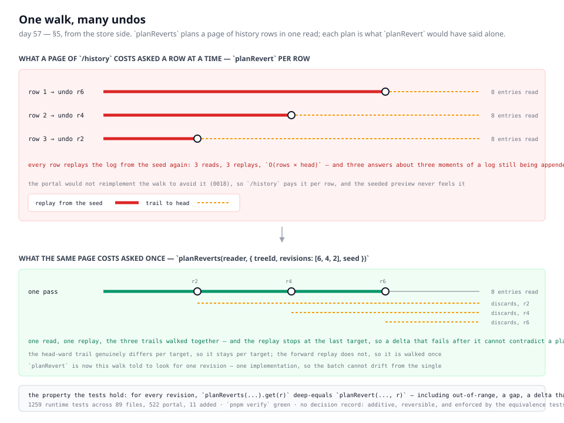

# 2026-08-18 (day 57) — one walk, many undos

**Build order section:** §5 — Portal, from the store side. The seam `/history`
reads, not the page that reads it.

**Branch:** `day-57-one-walk-many-undos`, off `main` (`6b129ab`). Not stacked on
#88 or #89, both of which are still open.

---

## Where this run started

Five pull requests are open and none of them carries a maintainer comment: #88
and #89 are this routine's own from the last two runs, #90 is the lessons, #91
is the portal's history page and #92 is the primitives catalogue bands. The only
comments on any of them are Vercel's and the routines' own. So nothing outranked
the findings queue this run.

`FINDINGS.md` on `main` has two open findings owned by this routine, and both
were answered by the two open branches — the nested-target check on #88, the
form target on #89. The third is not on `main` yet: the portal routine filed it
this afternoon on #91.

> **the portal reads one revert plan per history row, and cannot batch it.**
> `/history`'s reversal preview reads what undoing each shown revision would
> restore and cost. The only public seam for that is `planRevert(reader, {
> treeId, revision, seed })`, which is per-target … A page of rows is that read
> repeated per row — `O(rows × head)` — because there is no way to ask "plan the
> reverts for this window" in one pass.

It is a real consumer saying where the framework falls short, it is in this
routine's lane, and it needs no decision from anyone to fix. That made it the
unit.

## The problem, in one sentence

Planning one undo is a bounded read of the log; planning a page of them is that
read once per row, and the expensive half — replaying forward from the seed — is
the half every row repeats identically.

## What was built

`planReverts(reader, { treeId, revisions, seed })`, in `src/store/revert.ts`,
returning a plan per revision keyed by revision.

The walk it does is the one `planRevert` always did, told to look for several
revisions instead of one:

- **The forward replay is walked once.** Every named revision is reached on the
  same pass; each is inverted against the tree the replay had reached at that
  point, which is exactly the tree it would have been inverted against alone.
- **The trails are walked together.** What an undo would write over genuinely
  differs per target — it is everything after *that* revision that touched the
  nodes *that* undo names — so it stays per target, but all of them are fed by
  the same entries as the walk passes them.
- **The replay stops at the last target.** Once nothing is still seeking, no
  later entry needs applying, and the walk stops applying them. This is not an
  optimisation: it is what keeps a batch honest. A delta that no longer applies
  is only an obstacle for a target *after* it, and a walk that kept applying
  would let a late failure contradict a plan that was already complete.
- **The log is not opened at all** for a call whose revisions are all outside
  the span the seed and head can reach, which is what `planRevert` already did.

`planRevert` is now that same walk told to look for one revision. There is one
implementation of the replay, the inversion and the overlap check, so the batch
cannot drift from the single — which was the finding's actual worry, stated as
"a second copy in the portal is exactly the drift 0018 exists to prevent".

### The property this rests on

**Each plan is exactly what `planRevert` would have produced for that revision on
its own.** A batch changes what it costs to ask, never what the answer is.

That is not obvious for the failure cases, and getting it right is most of the
work. Reading the cases in the order the solitary walk would have met them:

| what happened | who it belongs to |
| --- | --- |
| outside the seed–head span | that revision only, decided before any read |
| could not be inverted | that revision only, decided at its own entry |
| a delta stopped applying | every target *after* it; targets already reached are untouched |
| a gap in the log's numbering | everything the walk had not already decided, targets already reached included |

The gap and the rejected delta differ deliberately, and they differ the way the
solitary walk differs: a gap means the entries cannot be read at all, so a plan
made before it is no longer trustworthy either; a rejected delta means the
replay cannot go further, which says nothing about a target the replay already
passed.

## Decisions taken that were not specified

**A map keyed by revision, not a positional list.** A caller has rows and wants
the answer for a row. Keying means asking twice about one revision costs nothing
and answers once, and it means a caller cannot silently misalign two arrays.

**No non-empty constraint on `revisions`.** An empty list is answered with an
empty map after one `head` read. A page with no rows needing no plans is a
sensible thing for a caller to hand over, and making the type forbid it would
push a guard into every consumer.

**Nothing in `apps/portal` was touched.** The portal's history page is the
portal routine's lane and #91 is open on exactly those files. The seam is filed
for it instead.

**No decision record.** Two reasons. It sets no direction that would be
expensive to reverse — it is an additive read seam over a walk that already
existed, and deleting it would cost one caller. And the one property worth
stating, that a batched plan equals a solitary one, is enforced by tests that
compare the two directly on every case, which is stronger than a record saying
it should be. The record numbering is also contended right now: #88 holds 0064
and #89 holds 0065, both unmerged, and a fourth number written against a `main`
that ends at 0063 would fail the index guard and open this pull request on red.
That did not decide it, but it is why the question was worth asking twice.

## Records added or superseded

None.

## Findings

**Filed for `Loom portal`:** the batched seam exists and `/history` can use it,
with the exact call.

**Not closed, because it is not here to close:** the portal's finding lives on
#91 and this branch is off `main`. Its Status line should be marked closed by
this pull request when #91 lands — by whichever of the two merges second. Said
in the pull request comment as well, so it does not depend on someone reading
this file.

**Filed for `@jonathanbravecredit`:** nothing new. The record-numbering
collision is already open from 16 August and bit a fourth time today.

## Open questions

1. **Should the write path batch too?** `revertRevision` in `src/write` plans one
   revert and proposes it. Nothing today wants to propose a page of undos at
   once, and until something does, a batched write is a guess about a shape.
   Left alone.
2. **Should a checkpoint seed be chosen per call rather than passed?** Every
   consumer passes revision 0 today, so the `O(head)` walk is the whole log
   every time. A store that could hand back the nearest checkpoint would make
   both the single and the batch cheaper, and it is a store-interface question
   rather than a revert one. Recorded here rather than acted on.
3. **Does `/history` want the plans it did not ask for?** A page shows a window;
   a reader who undoes the oldest row on it discards work shown further up. The
   batch makes it cheap to compute the whole window's discards, and whether the
   page should *show* that is the portal's call, not this one's.

## Test numbers

`pnpm install && pnpm verify` — **green**, exit 0.

- Runtime: **1259 tests across 89 files, all passing** (1248 before this run).
- Portal: **522 tests across 50 files, all passing**, unchanged by this branch.
- **11 tests added**, all in `src/store/revert.test.ts`.

Of the 11: three assert the batch agrees with a revision at a time on a healthy
log, a mixed in-range and out-of-range call, and a duplicate revision; three
assert the same agreement on the three broken logs the file already had fixtures
for — a gap, a delta that no longer applies, a head the log does not reach; three
count reads, including one over a 105-revision log that pages twice; one checks
that each target's discards are tracked separately; one checks a store failure
comes back as a `StoreError` rather than as verdicts.

Nothing was skipped and nothing was weakened. The 19 tests `planRevert` already
had were left exactly as they were, and they are what says the refactor did not
change the single-target answer.

---

## Addendum, 2026-08-18 21:45 UTC — #88 merged, and both open branches were merged onto it

#88 landed as `872a39b` minutes after this pull request opened. It conflicted
with this branch in `FINDINGS.md` — both appended entries at the end — and with
#89 in `FINDINGS.md` and `decisions/README.md` both.

Both were resolved by merging `main` in, keeping every entry from both sides in
date order and regenerating the decision index rather than hand-merging it. No
entry on either side was rewritten.

Two things in the body above are now stale, and are left standing rather than
edited: `main` ends at 0064 rather than 0063, and the numbering collision the
"no decision record" section describes is resolved for #89, whose guard is green
now that 0064 is on `main`.

`pnpm verify` re-run on this branch after the merge: **green, exit 0** —
**1300 runtime tests across 91 files** (this branch's 11 additions on top of the
1289 `main` now carries with #88 in it), **522 portal**, nothing skipped.
