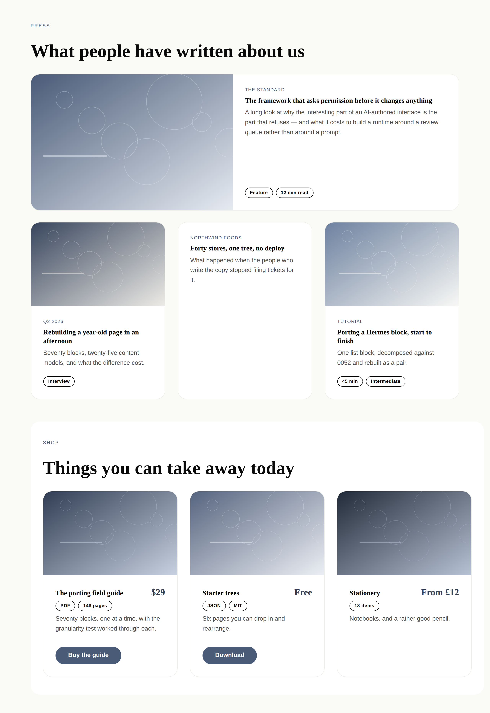
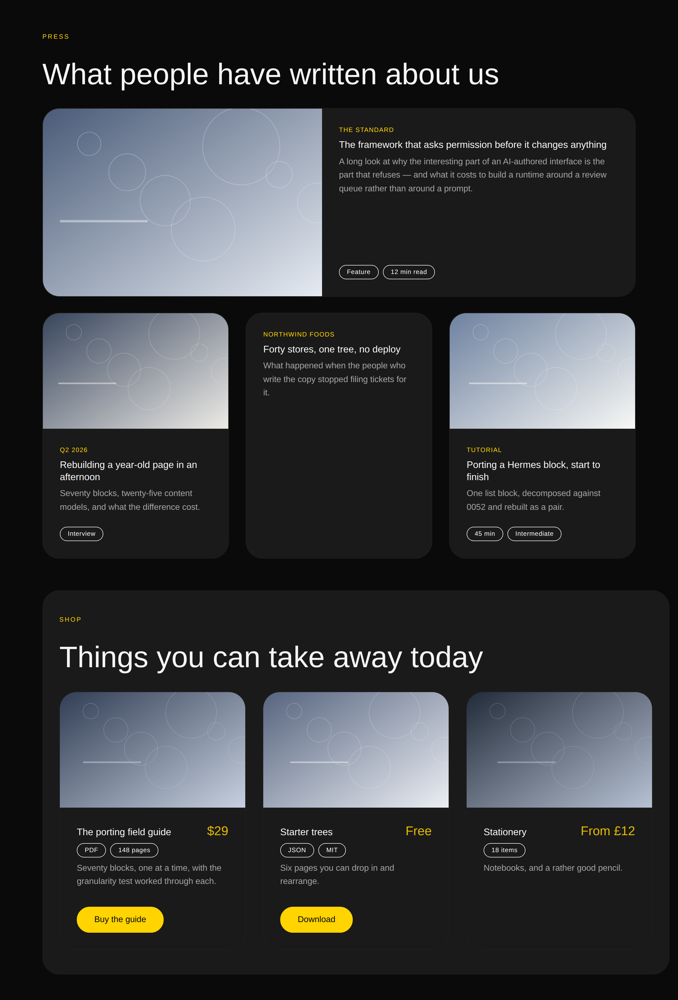

# 18 August 2026 — the catalogue bands, and where a card's target goes

**Routine:** `Loom primitives` · **Section:** §4b · **Branch:** `primitives-06-the-catalogue-bands`

Two pairs — `loom.article-grid` / `loom.article` and `loom.product-grid` /
`loom.product` — taking the library from **33 to 37**, and the Hermes ledger
from **20 blocks ported to 29**. Plus
[0065](../decisions/0065-a-card-is-the-target-when-it-is-read-and-the-control-is-the-target-when-it-is-bought.md),
which is the half of this run that decides the seven pairs after it.

## Which primitives, and why those

The port map's own order said written pieces next, and it was right for the
reason the map gives: five Hermes blocks, the largest remaining group, and the
band a creator page leans on hardest. **Things for sale came with it rather
than after it**, and that pairing is the run's one scoping decision.

They belong together because they are the *same five fields* — a picture, a
name, a short label, a sentence, a destination — and building either one alone
would have hidden the only question that actually separates them. Built
together, the question is unavoidable and gets answered once, in a record, for
the seven card-shaped pairs still queued.

That question is not granularity. 0052 and the granularity doc answer the field
decomposition for both of these in about a minute. It is: **what does the reader
aim at?**

## The question the granularity rules do not answer

A card in a grid can be a target two ways, and both are correct somewhere.

- **The card is the target.** A blog index, a news front page, a search result.
  One destination, and the card is a bigger target than a five-word link.
- **A control on the card is the target.** A shop. The card holds *Buy* or
  *Download*, and the surface around it is not clickable.

Hermes ships the first one the common way — the entire card wrapped in an `<a>`
— and that produces two defects that make the whole approach look worse than it
is:

1. **The link's accessible name becomes the whole card.** A screen reader
   announces *"Link: The Standard, The framework that asks permission before it
   changes anything, A long look at why the interesting part of an AI-authored
   interface is the part that refuses…"*, because an anchor's accessible name is
   its text content. A sighted reader scans twelve headlines; a listening reader
   hears twelve paragraphs.
2. **Nothing else on the card can ever be a link**, because nested anchors are
   invalid HTML that browsers resolve by dropping one of the two. That is this
   routine's own open finding from 17 August, in a second costume.

So `loom.article` does it a third way: the root is an `<article>`, the **title**
is the anchor, and a `::after` overlay stretches that anchor across the card.
The accessible name is the title alone; the click target is the whole surface;
and the root is not a target, so a link inside the card is *valid* markup that
merely overlaps — a failure a person can see rather than one the browser hides.

`loom.product` does the opposite and links its **name only**, with a real
`loom.action` pinned to the card's floor. A card-wide overlay under a buy button
is the pattern that ships broken: two click regions overlap and which one wins
depends on paint order.

0065 writes that down as a rule with the assignments already made —
`loom.credential`, `loom.book` and `loom.episode` are read; `loom.offering`,
`loom.listing` and `loom.event` are acted on. It is deliberately **not a prop**:
a shop card configured "the card is the target" under its own button is
invisible in every projection and every screenshot, and shows up only when
somebody clicks the wrong half.

## Which Hermes fields became nodes, and which stayed props

**`loom.article` — five blocks, one pair.** `articles` (title, excerpt, date,
image, link), `press` (name, quote, logo, link), `case-studies` (client, title,
challenge, result, image, link), `tutorials` (title, description, duration,
level, image, link) and `recipes` (title, image, summary, prepTime, difficulty,
link) are one content model.

| Hermes field | Becomes | Why |
| --- | --- | --- |
| `date` / publication `name` / `client` | `kicker` **prop**, free text | one short label above the title, and the three never co-occur — each block had exactly one. Not parsed, for `loom.milestone`'s reason: Hermes' own field says *"free-text date string; not parsed"*, and a parsed date refuses "Q2 2026" and forces a locale decision on a primitive with no business making one |
| `title`, `excerpt` / `quote` / `result` / `description` / `summary` | **props** | two strings meaningless apart — 0059's other half, the call `loom.feature` and `loom.stat` already make |
| `image` / `logo`, `link` | `image`, `href` **props** | exactly one cover, exactly one destination |
| `duration` + `level`, `prepTime` + `difficulty` | **child nodes** in a `meta` region | this is the interesting one — see below |
| `challenge` (case studies) | **not ported** | a second paragraph under a card title is a card that has become an article page. It is a `loom.prose` in whatever the tree puts the card in, not a sixth prop |
| `items` (the list itself) | **child nodes** | 0052's first half, unchanged |

**`loom.product` — four blocks, one pair.** `products`, `digital-downloads`,
`shop-categories` and `leadmagnet`.

| Hermes field | Becomes | Why |
| --- | --- | --- |
| `name` / `title`, `price`, `description` / `desc`, `image` | **props** | fixed fields of one record. `price` is free text and deliberately not a number, which is `loom.tier`'s argument and Hermes' hard-won one: "Free", "From £12" and "Pay what you want" are all things people write |
| `format` (`"PDF · 24 pages"`), `itemCount` (`"18 items"`) | **child nodes** in a `meta` region | the same field wearing two names, and **there is never exactly one of them** — a download is a PDF *and* 148 pages *and* MIT-licensed. Repeated content wants nodes |
| `btnText` + `fileUrl` | **a region** holding a `loom.action` | the library already has a call to action; a product reimplementing one would be a second scheme allowlist to keep in step with 0053 |
| `link` | `href` **prop** | links the name, not the card (0065) |

**The `meta` regions are the 0052 call worth reading twice.** `format` and
`itemCount` and `duration` and `level` are four separate Hermes fields that are
all the same thing: a short qualifier attached to the item. Kept as props they
are four `configure`s and a hard ceiling — a recipe that also wants "serves 4"
is unreachable forever. As `loom.badge` nodes in a region they are `insert` and
`remove`, one at a time, and the specimen shows seven of them across seven
cards with no primitive having predicted any particular one.

It is the call `loom.person` made about `specialties`, with one difference: a
person's specialities read fine *beside* the person, and a product's qualifiers
belong **inside** its card. So they are a region here rather than a sibling, and
that region earns a slot under 0051 on the ordinary test — the primitive places
it somewhere the flow of children does not go.

## Why these are primitives at all, given `featured` is not

The port map sends `featured` — a card with an image, a heading, a sentence and
a link — to the compose layer with nothing to build. `loom.article` is the same
description. The difference is **repetition**, and it is worth stating because
the next seven pairs will each raise it:

`featured` is one item, and one item assembled from `card` + `media` +
`heading` + `prose` is four reviewable nodes, which is fine. A blog index is
twelve of them — forty-eight nodes a model has to keep typographically identical
by hand, against the grammar budget ([0014](../decisions/0014-the-reply-schema-must-fit-a-grammar-budget.md)),
with nothing in the tree saying they are meant to match. **A band that repeats
carves at a joint; a single card does not.**

## `lead`, and the prop that looks like structure

`loom.article-grid` takes `lead`, which runs the first piece across the full
width as a row. A publication does not set every piece at the same size, and an
index that cannot say so looks like a card catalogue rather than a front page.

It is the near-miss the granularity doc warns about, so it was checked against
the sharper question rather than the name: *does changing this prop change the
set of nodes?* It does not — nothing is promoted, truncated, inserted or
removed, and the first cell was already first. It changes how however-many cells
are laid out, which is exactly what `columns` does. **A test asserts it**:
rendering the same band with and without `lead` produces the identical list of
`data-loom-id`s and differs only by a class.

The layout itself is `:first-of-type` in the stylesheet, because a render is a
pure function of one node and no cell can know it is first. The lead's row form
wraps back to a column by `flex-wrap` against a basis rather than by a media
query, so the band keeps the property `auto-fit` was chosen for.

## The mechanic that cost the first screenshot

`stylesheet.ts` says an inline style beats a rule in that file, so a value the
stylesheet has to vary must not also be set on the element. That warning was
written after `loom.milestone`'s `density` hit it. **It hit again here, in the
first render**: `loom.article` set `flex-direction: column` and its body set
`flex: 1 1 auto` inline, so the lead rule flipped nothing and the lead card
stacked exactly like every other card. The screenshot looked plausible, which is
the failure mode.

Both values are in the stylesheet now, on `.loom-cover`, with a comment on the
primitive saying why they are not where a reader would expect them. Worth
recording because it is the second time and it will not be the last: **any
property a position rule needs to override has to leave the element.**

The stylesheet also gained a fifth category — `::after`, for the stretched
anchor. The alternative is a second element in the markup that exists only to be
clicked, which is a node in the DOM that is not a node in the tree.

## Tests

`pnpm install && pnpm verify` is **green**.

| | Before | After |
| --- | --- | --- |
| Runtime | 1248 passed / 89 files | **1255 passed / 89 files** |
| Portal | 522 passed / 50 files | **522 passed / 50 files** |
| `library.test.ts` | 65 | **72** |

Seven new assertions in a sixth fixture, which the existing coverage test now
includes so a primitive that stopped being exercised fails rather than going
quiet. The fixture builds the article band as a **press page** rather than a
blog index — kickers that are publications and clients rather than dates —
because the five-block collapse is the claim, and a fixture that only ever
showed dated posts would not demonstrate it.

Four worth naming:

- **the anchor's text content is the title alone**, asserted by extracting every
  stretched anchor and comparing its label to the three titles. This is what
  0065 exists for, and it is the assertion that fails if someone later "tidies"
  the anchor up to wrap the card.
- **the root of a written piece is not itself a target** — `<a><article>` is
  asserted absent, which is what makes a link inside one valid markup.
- **the products carry no overlay at all**, so the buy buttons are the only
  targets on their cards. Three overlays on the page, and all three are articles.
- **`lead` changes the class and not the set of nodes**, described above.

No test was weakened, skipped, or marked `todo`.

## Records

**One, and it needs a word about its number.**
[0065](../decisions/0065-a-card-is-the-target-when-it-is-read-and-the-control-is-the-target-when-it-is-bought.md)
is `Accepted` — it contradicts nothing, and 0051, 0052 and 0054 are untouched.

**It was written as 0064, which #88 also claims, and it is 0065 because #88
merges first.** That ordering is not a guess: the maintainer asked this run to
fix #88's merge conflict, which it did, so #88 is unblocked and this branch is
the one arriving second. Renumbering was the whole cost — one `git mv`, one
`sed`, one `pnpm decisions:index`.

**The consequence is that `pnpm verify` is red on this branch on exactly one
assertion**, `0064 is missing`, until #88 lands. Everything else is green and
nothing was weakened to get there: 1254 of 1255 runtime tests pass, portal 522,
typecheck and build clean. The alternative was to also call this record 0064,
which is precisely the duplicate the numbering guard exists to catch and would
have made every reference to "0064" permanently ambiguous. It is the same trade
#76 made against #75 on 16 August, recorded in `FINDINGS.md` as one red branch
being the right price. **Merging `main` after #88 lands turns it green with no
conflict in the record itself.**

## Findings

**One filed**, for this routine's own next run: the four new primitives will
need the `interactive` declaration #88 is landing, and it is not on `main` yet.

**Nothing closed.** The 17 August nested-anchor finding is narrowed rather than
closed — `loom.article` and `loom.product` are off it by construction, and
`loom.card`, `loom.feature` and `loom.logo` still carry it.

## Next

The port map's order, with 0065 now deciding the target for each: **things
booked** (`loom.offering-list` / `loom.offering`, seven blocks) is the largest
remaining group and the one that needs the most from the pricing band's
vocabulary. **Credentials** is four more blocks and is the cheapest pair left.

Chrome — `loom.nav` and `loom.footer` — is still outstanding and is now the
oldest thing on this list. It is not a Hermes port (Hermes is a profile-page
product and has neither), so it sits under the brief's *"fill the gaps a
marketing page needs that Hermes never had"* rather than under the map, and it
is the one thing a demo page still cannot have.
