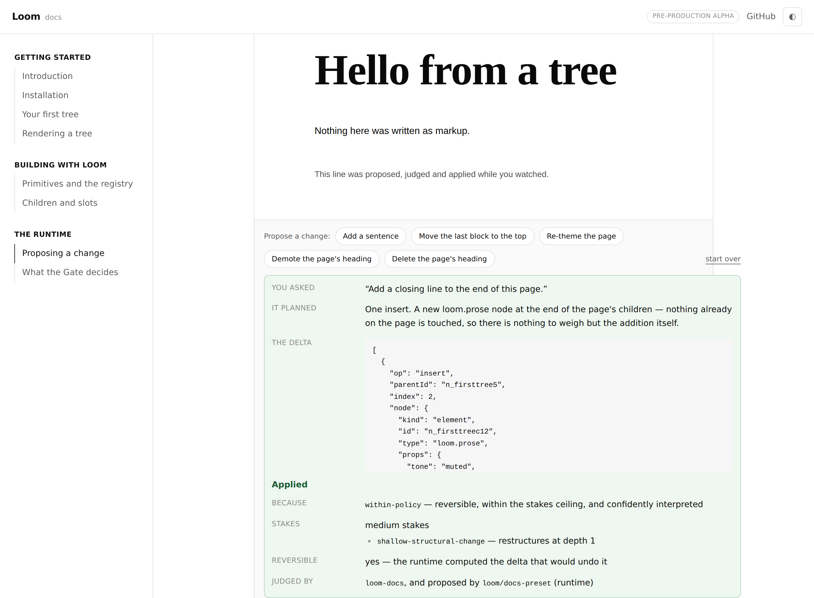
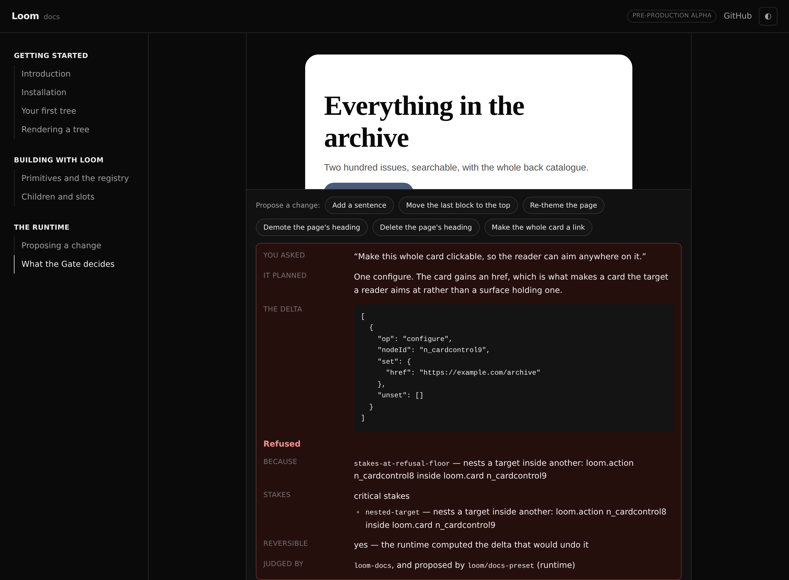
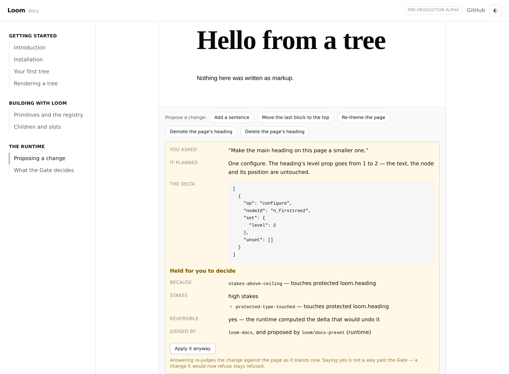

# 19 August 2026 — §4c: the propose-a-change box, and a live Gate on every example

**Routine:** `Loom docs` · **Branch:** `docs-02-propose-a-change` · **Section:** §4c

The second run of this routine, and the unit the first one deferred. §4c settles
that every rendered example carries a working propose-a-change box; it now does.
A reader can ask for a change on any example on the site and watch the runtime
interpret it, weigh it, judge it and apply it — or hold it, or refuse it — with
every stage printed out of the same functions a production deployment calls.

The migration in #98 landed before this run, so the lane is
`apps/loom/app/(docs)/` as the brief anticipated. Nothing was migrated by this
run and no other route group was opened.

## What shipped

**A propose-a-change box under every example.** Chips along the top, each one an
utterance a person could have typed. Clicking one produces a real `EditIntent`,
hands it to `composeChange`, and prints what came back in three parts: **what you
asked**, **what it planned** (the delta, verbatim), and **what the Gate said** —
the rule code, the stake factors and the reversibility, in the runtime's own
words rather than in a paraphrase that could drift from them.

**It all runs in the browser.** No server, no API key, no session, no store. The
pipeline is a pure function of the tree and the intent and the interpreter is
deterministic (0057), so the whole sequence executes in front of the reader.
That is what makes it work on a preview deployment, in a clone with no key, and
with the network off.

**Six changes a reader can ask for**, covering all four operations:

| Chip | Operation | What it is there to show |
| --- | --- | --- |
| Add a sentence | `insert` | the smallest change, landing without argument |
| Move the last block to the top | `move` | nothing created or destroyed, ids unchanged |
| Re-theme the page | `configure` | one node, one prop, and the whole page moves |
| Demote the page's heading | `configure` | the same operation, held for a person |
| Delete the page's heading | `remove` | refused outright |
| Make the whole card a link | `configure` | a change that names one node and breaks another |

A chip is offered only when the tree in front of it gives it something to do,
re-planned on every render — so "delete the heading" disappears once there is no
heading, and no button on the site can produce "nothing changed".

**Two new pages, and a third section in the sidebar.** *The runtime* now holds
**Proposing a change** (the four operations, what a proposal carries, and why the
model is a component rather than the system) and **What the Gate decides** (the
three answers, the two questions behind them, and the policy a deployment
writes). Both open with the plain-language version and reach the precise one a
paragraph later; neither opens with a type name.

**A fifth example: a card holding a button.** An entirely ordinary composition,
and the one tree on the site where a single `configure` breaks something several
nodes away.

## Decisions taken that were not specified

**The site declares a Gate policy, and it protects `loom.heading`.** A Gate with
no host vocabulary judges on shape alone, and on trees this small every change
would have come back accepted — a page about three verdicts that only ever
showed one. So the docs deployment names one primitive consequential, exactly as
a real deployment would name its checkout, and both pages say plainly that this
is a choice the site made rather than something intrinsic. The pay-off is that
"demote the heading" and "delete the heading" differ by one word and land in two
different places, which is the runtime's own ordering — reconfiguring something
protected is high, destroying it is critical — rather than anything this policy
tuned.

**`interactiveTypes` is derived from the registry, and that gives 0064 its first
live user.** The framework routine filed on 17 August that
`interactiveTypesFor(registry)` was "real, tested and unused" until some
deployment called it, and expected the demo routine to be the caller. This
policy calls it in one line, so the nested-target refusal is now firing on a
deployed surface, in front of readers, with a documented example built to
provoke it. That is filed below rather than claimed as closing the finding: the
finding is a lane question and only the maintainer settles it.

**`Example` became a client component.** A change produces a *new* tree, and the
new tree has to be rendered, so the tree lives in React state and the walk
happens wherever the state does. The cost is real and worth naming: the starter
library ships to the browser on any page with an example on it. The first render
is still server-rendered and hydrates cleanly, because building a tree is
deterministic and nothing reads a clock until a reader clicks. `interactive={false}`
turns the box off for a page that wants a still example, and a test covers it.

**No undo.** An undo in Loom is a proposal against a stored log (0032), and this
site has no log — `revertInterpreter` takes a `RevertablePlan` produced by
reading one. Applying the inverse delta directly would have been four lines and
would have taught the reader the precise thing 0032 exists to refuse, so the box
offers **start over** (which rebuilds the example and says so) and the verdict
panel reports the inverse the runtime *computed*, without pretending there is
somewhere to put it. Both pages say the log chapter is not written yet.

**The delta panel scrolls at 14rem.** An `insert` carries the whole node it is
inserting, and the first screenshot of this unit had a delta tall enough to push
the verdict below the fold. Printing a summary instead would have been the site
paraphrasing the one artefact it is trying to teach a reader to read.

**No decision record was written**, deliberately. Everything above is a choice
about one surface — which policy this site declares, which component holds state,
how tall a code block is — and none of it would be expensive to reverse or
changes what Loom is. The two records this unit leans on, 0057 and 0064, already
say what it needed; a third restating them for the docs site would be a second
copy of an argument, which is the thing §4c's Architecture rule exists to refuse.

**Three verdict tones were added to the site's own tokens**, in light and dark.
Three and no more — there are exactly three dispositions, and a fourth colour
would be inventing a verdict the runtime does not have.

## What had to be written differently from what I wanted

**A tree still cannot name a page on its own site.** The card example needed a
button, and `href: "/docs"` is refused by `linkUrlSchema` — 0069 proposes
allowing a root-relative path and is `Proposed`, pending the maintainer's review,
with nothing implementing it. So the example and the preset both point at
`https://example.com/archive`, which is what the library actually allows today.
The marketing routine filed this on 19 August; this is the second lane to hit it,
and it is noted below rather than filed again.

## Tests

`pnpm install && pnpm verify` at the repository root, **green**:

| Suite | Files | Tests |
| --- | --- | --- |
| `@loom/runtime` | 96 | 1373 |
| `@loom/app` | 64 | 673 |

Nothing failed, nothing was skipped and no test was weakened. The app suite grew
by 29 — 19 in `_lib/propose/run.test.ts` and 10 in `_components/proposal-box.test.tsx`
— and they are split deliberately:

- **`run.test.ts` asserts the verdicts are the Gate's.** Every disposition the
  site can show is checked against the policy that produces it: `add-a-sentence`
  applies, `demote-the-heading` comes back `stakes-above-ceiling` with
  `protected-type-touched` on it, `remove-the-heading` comes back
  `stakes-at-refusal-floor` with `protected-type-removed`, and `link-the-card`
  comes back with exactly one `nested-target` from a delta that configures one
  node. A refusal is also checked to leave the tree identical.
- **`proposal-box.test.tsx` asserts the page shows them.** A component that
  computed a refusal and rendered "Applied" would pass every test in the first
  file, so these click the chips and read what a reader reads — including the
  hold, the answer to it, and the rendered example carrying the new sentence
  rather than a picture of the old tree.

Two properties are checked that are easy to lose later: a preset **re-plans
against the tree it is handed** (the second click's `baseRevision` is the
revision after the first), and the ids a change mints **cannot collide with the
example's own** — asserted for every registered example against the id grammar,
which is stricter than it looks.

The existing suites caught two real mistakes while this was being built. The
example catalogue's zero-diagnostics rule caught the relative URL immediately
rather than at a reader's first click, and `content.test.ts` refused to let the
new example exist without a page naming it.

## Findings

**Filed:** 0064's interactive check now has a live user, in this deployment
rather than the demo's. **Filed:** the relative-URL refusal has been hit by a
second lane, noted against the marketing routine's open entry.

**Closed:** none this run. `nextjs.org` is still refused by the egress proxy —
re-verified, identical message — so the structural description in the brief is
again what this run built to, and whether the site *reads* like the one it is
modelled on is still a judgement only the maintainer can make.

## Open questions

In the pull request comment. The short version: search and the generated API
reference are each still one decision away and unchanged from the last run;
Architecture wants `lessons/` to be readable from this site without being copied
into it, which is a mechanism question worth settling before the pages are
written; and the box now puts a real gated pipeline on the docs deployment, which
is the thing the §4d composed-page idea would reuse.
