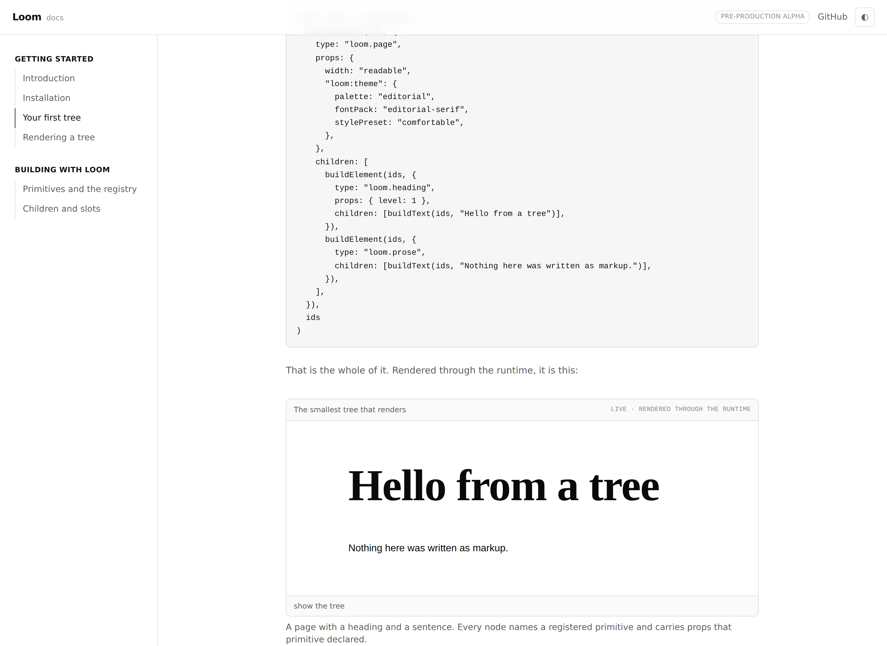
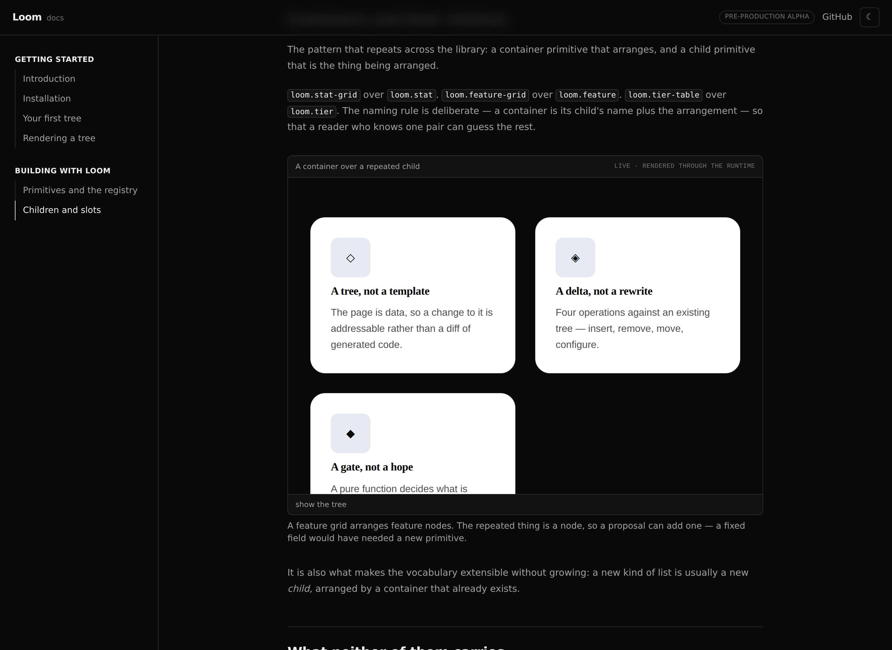

# 19 August 2026 — §4c: the documentation site, and its first real examples

**Routine:** `Documentation site` · **Branch:** `docs-01-the-shell-and-a-real-example`
· **Section:** §4c

The first run of this routine. `apps/docs` did not exist; it does now, with six
written pages, four live examples, and the two decisions §4c settles enforced by
tests rather than by convention.

## What shipped

**A Next.js app at `apps/docs`,** modelled on the structure the brief describes:
a persistent left sidebar grouped into sections, an article column, prev/next at
the foot of every page, copy-paste code blocks, two kinds of callout, and light
and dark themes with a three-state toggle that remembers what the reader chose.
It deploys the way the portal does — `vercel.json` pins `"framework": "nextjs"`,
Root Directory is `apps/docs`, and `docs/deployment.md` covers the rest.

**Prose is MDX.** A page is a `page.mdx` file, and the file *is* the route.
Three components are available to a page without importing them — `Callout`,
`Example`, and `EntryPoints` — and that list is deliberately short.

**Six pages, written for someone who does not have the model in their head:**

| | |
| --- | --- |
| Getting started | Introduction · Installation · Your first tree · Rendering a tree |
| Building with Loom | Primitives and the registry · Children and slots |

The bargain is stated plainly on the first page — a bounded vocabulary buys
addressable, reviewable, attributable, reversible change — along with its cost,
that AI can only say things the registry has words for. Behaviour living in the
registered component and never in the tree is the second page-one idea, because
everything else about why a proposal is safe to gate follows from it.

**Four examples, each a real `LoomTree`.** `first-tree` is the smallest thing
that renders; `themed-tree` is the same nodes wearing three different registered
ids; `a-slot-and-its-children` is a `loom.section` placing its own heading
region; `a-container-and-its-children` is a `loom.feature-grid` over three
`loom.feature` nodes. Each is mounted through `renderLoomTree` with the starter
registry, and each frame carries a **show the tree** disclosure printing the
exact value the render walked — so the code above an example and the page below
it cannot drift apart.

## Decisions taken that were not specified

**Only sections with pages appear in the sidebar.** Three of §4c's five — the
runtime, the API reference, Architecture — have no pages yet, and an empty group
in a rail is a promise the site cannot keep. They arrive with their content.

**The examples are not run through a propose-a-change box yet.** §4c settles
that they will be, and this run does not do it: the portal's equivalent is
around 1,200 lines of session, budget, preset and record machinery, and building
a rushed copy of it beside a first draft of the site would have produced two
weak halves. What landed is the half the other one needs — every example is
already a registry entry with a stable, sequential node id, which is what a
scripted change addresses. It is the next unit and nothing in this one has to
change to accept it.

**Every example is rooted at `loom.page` and names a theme.** Theme mounting is
the root primitive's job (0050), and `loom.page` is the primitive in the starter
library that does it. A tree rooted elsewhere renders with none of the
`--loom-*` properties set: legal, diagnostic-free, and indistinguishable from a
stylesheet that failed to load. The first draft of the slot example was rooted
at `loom.section` and looked exactly like that. Both the fix and the trap are now
documented on *Rendering a tree*, and a test asserts every example resolves a
theme.

**The rendered frame is capped at 32rem and scrolls.** A page brings its own
vertical rhythm, and a tall example would push the prose explaining it off the
screen. The alternative — scaling the render down — would show the reader
something they cannot reproduce.

**The entry-point list is written, and its *set* is not allowed to drift.** §4c
settles that the API reference is generated rather than written, and that is not
this unit. In the meantime `lib/entry-points.ts` carries one sentence per
published entry point and `entry-points.test.ts` reads the runtime's own
`exports` map off disk and fails on any difference in either direction. The
summaries are hand-written; the eleven doors are not.

**One edit outside `apps/docs`:** the root `verify` script now chains
`pnpm --filter @loom/docs verify`, exactly as it already chained the portal's.
Without it none of the tests below run in the command the routines are bound to.

## Tests

`pnpm install && pnpm verify` at the repository root, green:

| Suite | Files | Tests |
| --- | --- | --- |
| `@loom/runtime` | 96 | 1343 |
| `@loom/portal` | 50 | 522 |
| `@loom/docs` | 7 | 44 |

Nothing failed and nothing was skipped. The docs suite is split the way the
portal's is — `.test.ts` in Node, `.test.tsx` in jsdom — and the 44 cover four
things worth naming:

- **Every example mounts, with zero render diagnostics and a resolved theme.**
  Rendering is total, so "it rendered" proves nothing on its own; a diagnostic
  is a page serving something other than what its tree asked for, and here it is
  a failure.
- **Every example builds byte-identically twice**, which is what makes a
  scripted change against a node id survive a deploy.
- **The navigation and the pages on disk are held against each other** in both
  directions: no link without a page, no page without a link, one `#` heading
  per page matching its listed title, and `pageMetadata(section, page)` present
  in each — which throws at build time for a page the navigation does not list.
- **Every `<Example id="…">` in every page names a registered example**, and no
  registered example goes unused.

Two bugs were found by writing those tests and one by looking at the result:

1. `THEME_STORAGE_KEY` was exported from the theme toggle, which is a client
   component. Importing a plain constant from one into a server component yields
   `undefined`, so the site shipped `localStorage.getItem(undefined)` — no error,
   no warning, and a stored dark preference silently ignored on every load. The
   key now lives in `lib/theme.ts`, and `theme-script.test.tsx` asserts on the
   emitted text.
2. A node id namespace must be `[0-9a-z]{1,32}`; `sequentialIdFactory("first-tree")`
   throws on the first node it builds. Now documented on *Your first tree*, where
   a reader would otherwise hit it in their first ten minutes.
3. Example captions render as a `figcaption`, not as MDX, so two of them showed
   the reader literal backticks. A test now refuses markdown in a caption.

## Findings

**Filed:** `nextjs.org` is unreachable from this routine's environment — the
egress proxy refuses it, and the brief names it as a fetch. Same shape as the
`21st.dev` finding of 16 August, same two ways out, both the maintainer's. The
run proceeded from the structural description the brief itself gives, which
covers the elements but cannot confirm the result *reads* like the site it is
modelled on. That judgement is on the preview URL now.

**Closed:** none. No open finding was owned by this routine.

## Open questions

They are in the pull request comment rather than here. The short version: the
propose-a-change box is the next unit and needs no decision; search and the
generated API reference each need one; and the §4d idea of composing a page for
what a reader asks — rather than dropping them into a topic page — is worth
raising now, because it needs the interpreter live in this deployment and that
is a deployment decision, not an engineering one.
