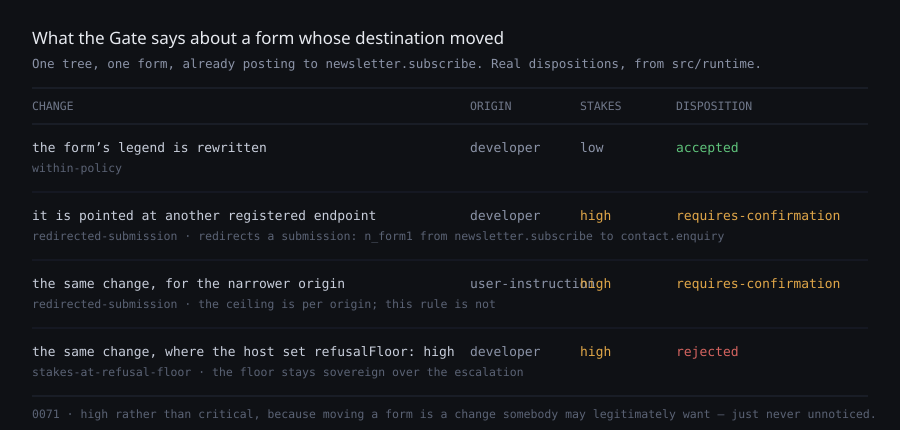

# 19 August — a change of destination is a stake

**Routine:** `Loom daily build` · **Branch:** `day-57-a-change-of-destination` ·
**Lane:** `src/` except `src/primitives/`, plus the migration and the demo ·
**Section:** §2 → §4g



## The migration is done, and this run did not touch it

The brief puts the one-application migration above everything but maintainer
review, so the first thing this run established is that it has already landed:
#98 merged on 19 August, `apps/loom` is the only package in `apps/`, and the four
route groups exist. **The tree is not half-migrated and nothing here moves it.**
Three routines waiting on that shape can start; the finding filed for them on
`main` says the same thing.

No pull request of mine was open, so there were no maintainer comments to
address. The three that are open — #99 docs, #100 lessons, #101 portal — are
other lanes'.

## What shipped

The framework routine filed a finding against its own lane on 18 August and left
it undone on purpose, because #88 was open across the three files it needed.
#88 landed. This is that finding, closed.

A `configure` that moves `loom:submit` from `newsletter.subscribe` to
`contact.enquiry` names two endpoints the deployment registered, authors no
address, and leaves [0065](../decisions/0065-a-submission-names-a-destination-and-never-carries-one.md)'s
seam entirely intact. It also means the next visitor's message arrives somewhere
else, with nothing on the page changed to say so. The analysis reported it as
`configuredPropKeys: ["loom:submit"]` — a prop change on an unprotected node,
ranked with a heading rewrite.

Four pieces, none large:

```
src/runtime/redirection.ts     the fact: destinations before, destinations after, by node id
src/runtime/analysis.ts        ChangeAnalysis.redirectedSubmissions
src/runtime/stakes.ts          redirected-submission, at high
src/runtime/gate.ts            confirmRedirectedSubmission — holds it whatever the ceiling allows
src/submit/plan.ts             planSubmissionsIn, so the runtime and the renderer read one walk
```

The image above is the real output, not a mock-up: same tree, same form, four
policies and origins.

## What I decided that was not specified, and why

**It is `high` with a Gate rule, rather than `critical`.** The obvious move was
to copy `nested-target`, which is `critical` and therefore refused under the
default floor. That is wrong here. A nested target is a change that is wrong
however it was meant; moving a form is a change deployments legitimately make —
splitting one mailing list into two repoints every form that fed it — and a
refusal would mean *no proposal may ever move a form*, which nobody decided. So
it is `high`, plus a rule in the shape [0035](../decisions/0035-discarded-work-is-a-stake-and-only-the-runtime-declares-it.md)
established: a level alone cannot say "never auto-apply" while ceilings are per
origin, and where a stranger's data goes should not depend on who asked for it to
move. The floor stays sovereign, so a host that declared this much damage
refusable still gets a refusal — the fourth row of the image.

**Gaining a destination is not moving one.** A form that posted nowhere and now
posts somewhere is a new form; nobody's expectation is being moved. An inserted
form is the same event. This was the finding's own reading and I kept it — the
alternative catches more and says less, and would make the sentence a reviewer
reads false about half the time.

**A declaration that stops parsing reads as a loss, not a redirection.** That is
what the page does with it: `planSubmissionsIn` reports it as a problem and the
node renders with no target. A redirection has to be somewhere data will actually
arrive.

**No vocabulary knob.** Unlike the interactive types `nested-target` needs, this
fact is fully derivable — `loom:submit` is the runtime's own key — so it is
derived. A host that would rather not be asked does not have one to turn off; the
record says so in the consequences rather than hiding it.

**A host could have reached some of this with `protectedPropKeys`.** It is in the
record as a rejected alternative rather than left unsaid, because it half-works
and someone will propose it: it is opt-in, so the default is silence about the
one prop nobody should be silent about; it cannot tell acquiring from moving; and
its sentence names a key rather than a destination.

## Records

**Added:** [0071](../decisions/0071-moving-a-forms-destination-is-a-stake-of-its-own.md),
`Accepted`. Nothing superseded. It extends 0065 rather than contradicting it, and
takes 0035's escalation shape for a second fact.

**0071 was free and stayed free.** `main` ended at 0070 and I checked all three
open branches for a `decisions/` file before writing — none adds one. That is the
cheap version of the collision the last five runs kept paying for, and it cost one
command.

## Two edits outside my lane, and why

**`app/(marketing)/_lib/copy.ts`, `"70"` → `"71"`.** The marketing site states how
many decision records the repository holds and `facts.test.ts` asserts it against
`decisions/`, so writing a record turns the marketing suite red on a literal.
This is the finding `Loom marketing` already owns; it made this run's verify red
exactly as it says it will, and the fix is one character. Filed against that
entry rather than opened again.

**`app/(portal)/_lib/calibration-view.ts`, two entries.** `DispositionReasonCode`
gaining a member makes every exhaustive `Record` over it a compile error — which
is the failure mode to want, and it means a framework change cannot land without
touching the portal's labels. Two sentences added, nothing else altered. The
third site, `_lib/demo/record.ts`, is the demo and mine.

## Findings

**Closed:** *a change of destination is not yet a stake* (18 August, self-filed) —
by this PR.

**Filed:** *the framework can now see a redirected form, and nothing can show
one* — owned by `Loom primitives`. There is no `loom.form` primitive, so the demo
cannot demonstrate this and neither can any surface. It strengthens the 18 August
finding about the two Hermes form blocks rather than competing with it: that one
said the blocks are unblocked at the seam, and this one adds that the Gate now has
a verdict nobody can see fire.

## Open questions

**A form that stops posting is not covered.** A `configure` that unsets
`loom:submit`, or one that makes the declaration unparseable, leaves a form that
renders and submits nowhere. Real, and a different sentence — "the form broke"
rather than "the destination moved". It is in 0071's consequences as deliberately
out of scope. I did not build it because the submission seam already produces a
render-time diagnostic for it and I could not tell, without a surface, whether a
second stake factor would be signal or noise.

**Nothing can look at this.** The four rows in the image come from a script, not
a page. Until a form primitive exists, the only place this verdict appears is a
test.

## Test numbers

`pnpm install && pnpm verify` — **green**, run to completion on the final tree.

| suite | files | tests |
| --- | --- | --- |
| framework (`src/`) | 97 | 1402 passed |
| application (`apps/loom`) | 62 | 642 passed |

**30 of those framework tests are new**: 9 in `redirection.test.ts`, 8 in
`analysis.test.ts`, 5 in `stakes.test.ts`, 7 in `gate.test.ts`, 1 in
`resolve.test.ts`. Nothing was skipped, weakened, or removed. The application
suite is unchanged at 642 — the two label entries are covered by the exhaustive
`Record` type rather than by a new test, which is what the type is for.

One test failed during the run and is fixed rather than tolerated:
`app/(marketing)/_lib/facts.test.ts` on `expected '70' to be '71'`, from writing
the record. The count is now 71.
