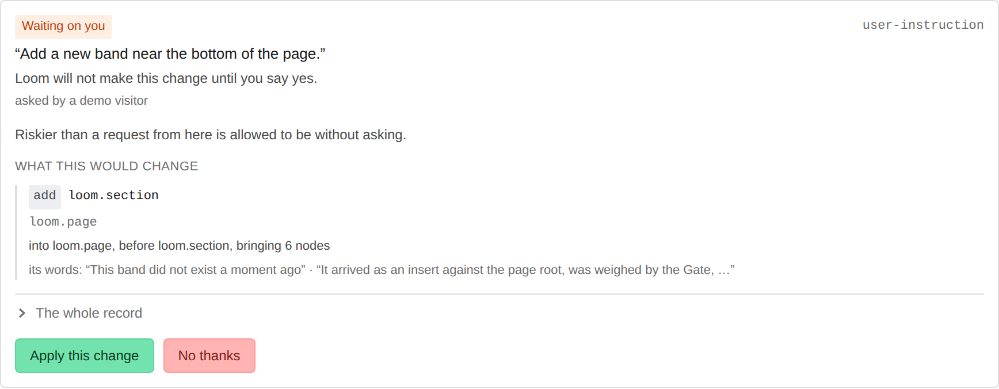
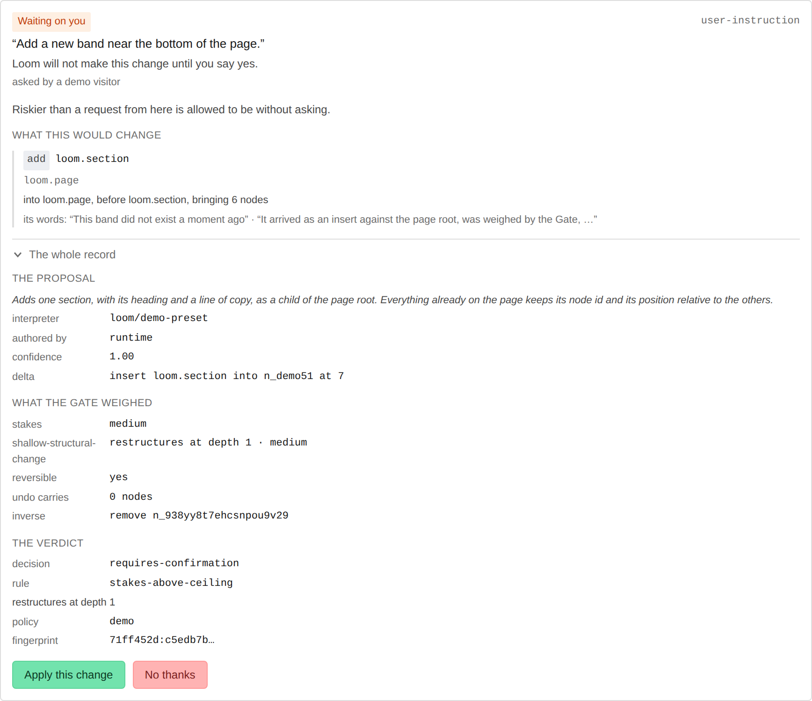
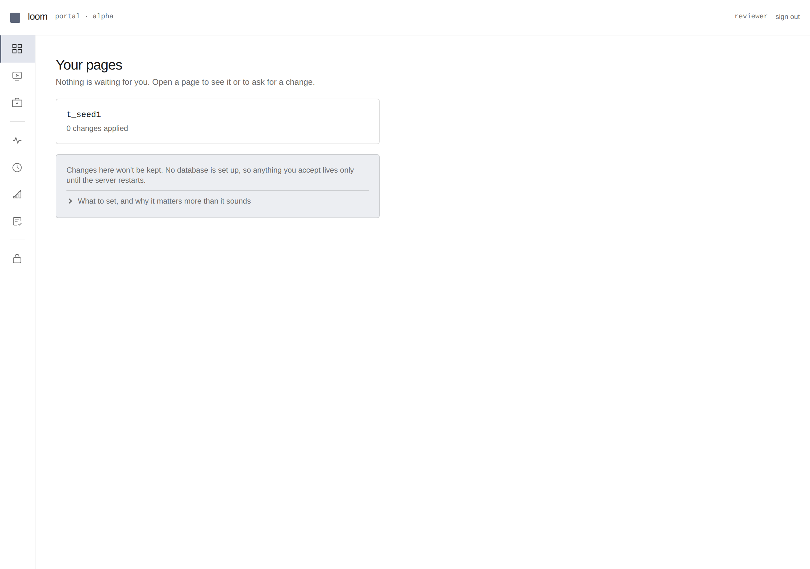

# Portal — plain language is the default, the technical record is one click away

**Routine:** `Loom portal` · **Date:** 2026-08-19 · **Branch:** `portal-05-in-plain-language`

This is the first cut of the 18 August redirection. The maintainer's words:

> *"I love that it is very technical, and all that information is very useful, but
> we have to make it user friendly … such that a high schooler can easily follow
> what is going on. Think of the vercel or supabase interfaces/portals."*

The governing principle I built to:

> **Plain language is the default. The technical record is one click away.
> Nothing is ever removed.**

This is progressive disclosure, not simplification. Every field the portal
showed before — the rule code, the policy fingerprint, the delta, the inverse —
is still on screen. It has moved behind a disclosure, and a plain sentence has
moved in front of it. I did **not** touch every surface in one sweep; I did the
ones a new person meets first, and left the vocabulary I have not earned yet
where it was, on purpose (see *What I left out*).

## The before/after, in one card

The clearest instance is the held-proposal card — the one screen where somebody
is actually asked to make a decision. It used to open with five monospace pairs
(`stakes / reversible / confidence / changes / policy`) and reach the reason you
were being asked *sixth*, as the policy's own words about its own thresholds.

**Closed** — what a person meets now:

**Open** — one click on *The whole record*, and nothing has been lost:

The proposal, both axes the Gate weighed, the rule code, the policy id, the
fingerprint and the inverse are all still there — `stakes-above-ceiling`,
`71ff452d:c5edb7b…`, `remove n_938…`, every bit of it. A person just does not
meet it before they have asked.

(The card shown is the demo's `record-card`, which is the same vocabulary and the
same disclosure the portal's own review-queue card now uses — the demo is the one
surface that renders a held change without an interpreter key, so it is the
faithful live render. The review-queue card is covered by its own rendering test.)

The pages list, which is where a new person starts:

## The high-schooler test, applied to each screen I shipped

> *Could a bright high schooler, who has never read a decision record, say what
> happened and what they should do next?*

- **`/portal/pages`** (was `/portal/trees`) — "Your pages", and the sub-heading
  answers *what do I do now*: `N changes are waiting for your answer`, or "Open a
  page to see it or to ask for a change". Each row leads with **how many changes
  are waiting on you**, not the revision number. Empty state has one primary
  action: **Try the demo**.
- **The held-proposal card** — "Why you're being asked" in a plain sentence,
  before any number. Buttons are **Apply this change** / **No thanks**, not
  `apply` / `discard`.
- **The review queue** — empty state was `Nothing is held.`; it is now "Nothing
  is waiting for you." with the runtime's explanation one click down. The `0`
  count beside the heading is gone when there is nothing to count.
- **The demo record card** — the state badge and the verdict lead in plain words;
  the four dense sections are behind *The whole record*.
- **`not-found`** — "There's nothing here", with the tree-id-refusal explanation
  moved behind a disclosure.
- **The nav** — labels capitalised and de-jargoned: **Pages** (was `trees`),
  Demo, Primitives, Activity, History. Calibration and Audit keep the runtime's
  words *for now* — a nav label renamed ahead of the screen it points at is a
  promise the screen does not keep, and those screens are a later cut.

## What I renamed, and what moved behind a disclosure

**Renamed (route + labels):**

| was | is |
| --- | --- |
| `/portal/trees` | `/portal/pages` (old path 308-redirects, rest of URL carried through) |
| `trees` (nav) | `Pages` |
| `Nothing is held.` | `Nothing is waiting for you.` |
| `did-not-apply` / `not-applicable` | `Nothing changed` |
| `not-interpreted` | `Not understood` |
| `not-answerable` | `Already answered` |
| `not-written` | `Not saved` |
| `held` | `Waiting on you` |
| `discarded` | `You said no` |
| `apply` / `discard` (buttons) | `Apply this change` / `No thanks` |
| `undo revision N` | `Undo this change` |
| stakes `low…critical` | `Low risk … Very high risk` (as a consequence, not a level) |
| confidence `0.62` | `The AI says it is not certain` (attributed — 0007/0031) |

**Moved behind `
` (nothing deleted):** the rule code, `reason.detail`,
the policy id, the confidence float, the stakes level, the operation verbs; on
the demo card, the full proposal / gate / verdict / revision sections; the store
error on the pages list; the `DATABASE_URL` explanation; the not-found
tree-id-refusal note.

**One place, not per component.** All of the state words live in a new
`_lib/vocabulary.ts` — `plainState`, `STAKES`, `ruleSentence`, `confidenceWord`.
The pattern already existed privately in `record-card` (`awaiting-you` → "waiting
on you"); it is now the single source the demo *and* the review queue read from,
so a state cannot be called two things on two screens. `RULE_SENTENCES` moved out
of the demo module (where only the demo could reach it) into vocabulary, which is
why the review queue can now name the rule it is asking you to overrule.

## The value answer

> *What does this tell a developer that they could not get from the repo, the
> logs, or `git log`?*

Unchanged, and now **readable**: which change is waiting for their answer and on
which page, why the Gate stopped rather than deciding, what a change would replace,
what its inverse would undo. None of that is in the repo, the logs, or `git log` —
those never saw the tree. The 18 August brief's sharpest line is that *"a refusal
nobody can read is not an advantage"*: the advantage was already built, and this
run is the part that makes it legible. The pages list now leads with the count of
waiting changes precisely because that number is the reason to open the portal
tomorrow, and it is a number nothing else in the ecosystem holds.

## New building blocks

- `_components/technical-detail.tsx` — the disclosure. `
`, so it works
  with JS off, costs no bundle (Server Component), gets keyboard/AT semantics
  free, and — the deciding reason — browser find-in-page reaches inside a closed
  one, so a reviewer searching for a node id still finds one behind a disclosure.
- `_lib/vocabulary.ts` — the one place the portal decides what to call things.

## Tests

`pnpm verify` green: runtime **1373 passed**, app **674 passed**, build succeeds.
New/changed coverage:

- `vocabulary.test.ts` — every state has a label/meaning/technical trio; **no
  label contains a runtime identifier or a hyphen** (the exact failure this run is
  about, asserted directly); refusal and misunderstanding never collapse; every
  rule and stake level is covered off the schema's own options.
- `technical-detail.test.tsx` — content stays in the document while closed (a
  disclosure that unmounted its children would be a deletion wearing an arrow),
  starts closed, is labelled.
- `held-proposal.test.tsx` (new) — the decision is in front of the disclosure and
  the rule code is behind it; confidence is attributed to the AI; risk reads as a
  consequence.
- Updated `outcome`, `record-card`, `review-queue`, `not-found`, `guarded-pages`,
  `nav-items`, `nav`, `paths` tests to the new vocabulary and route.

## What I left out (deliberately)

- **Calibration, Audit, Activity, History, Sign-ins** — not renamed beyond nav
  capitalisation and the `trees → pages` link updates. The brief says do it *as
  you touch each surface*, not as one sweep; a giant rename PR is unreviewable,
  and these screens each deserve their own cut. Their nav labels keep the
  runtime's words until their screens are done.
- **`/portal/trees` → `/portal/pages`** is a 308 redirect, not an alias — two
  live names for one screen is how a vocabulary comes back. `docs/deployment.md`
  and decision `0070` still reference `/portal/trees`; the first is another lane's
  doc and the second is an Accepted record, so I left both — the redirect keeps
  their links working.
- **No decision record.** Nothing here touches the tree schema, the delta model
  or an Accepted record. 0018 holds — everything came through published entry
  points, `src/` is untouched. 0019 holds — this makes changes more reviewable and
  adds no way to author one.

## Recommendation

The held-proposal card on `/portal/pages/[treeId]` can only be seen populated with
a real interpreter key, which is the same wall `/history` and the telemetry pages
hit — three of the portal's best screens share one reason nobody outside this repo
has watched them work. The demo-fed-journal finding I filed on 17 August is still
the way to close it, and it is the unit I would take next unless redirected.
