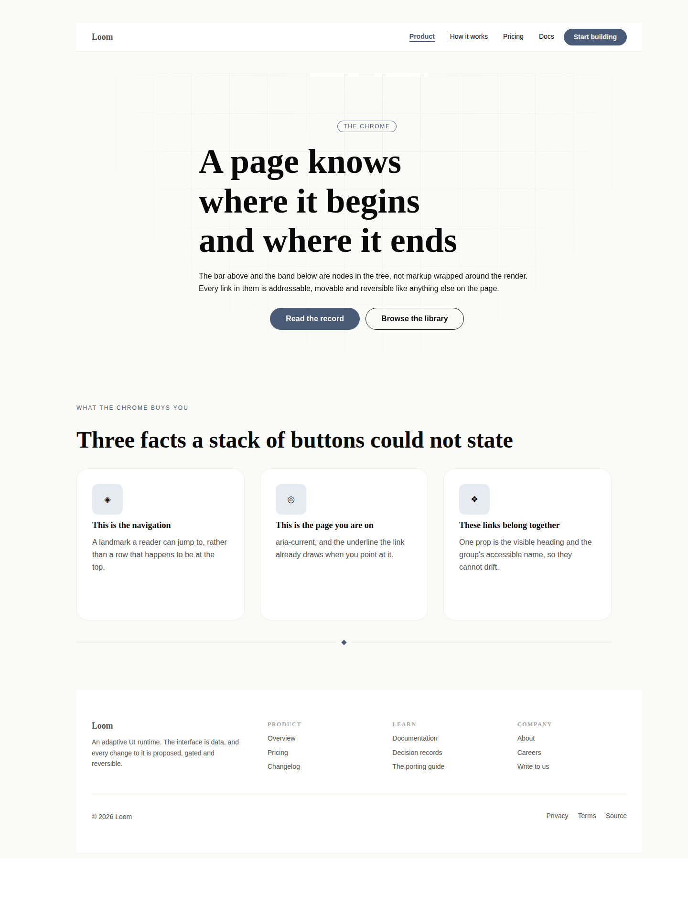
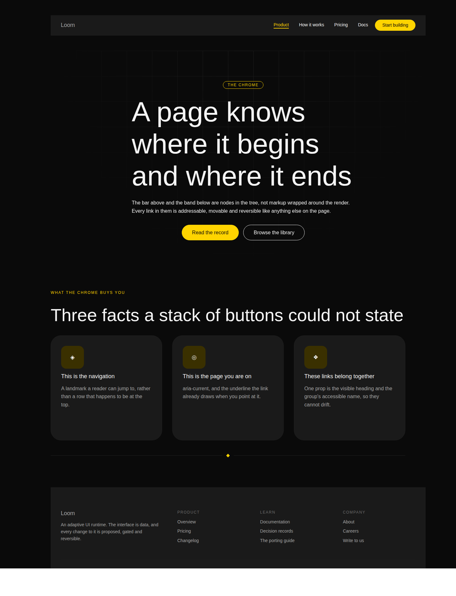

# 19 August 2026 — the page chrome, and what a target actually means

**Routine:** `Loom primitives` · **Section:** §4b · **Branch:** `primitives-07-the-page-chrome`

Four primitives — `loom.link`, `loom.link-list`, `loom.nav`, `loom.footer` —
taking the library from **37 to 41**, plus the `interactive` adoption that has
been sitting in the findings queue for two days and
[0068](../decisions/0068-a-primitive-is-a-target-when-the-reader-aims-at-the-whole-of-it.md),
which is what it turned into once two of the six answers turned out to be wrong.





## Which primitives, and why those

The port map's remaining Hermes work is seven card-shaped pairs and four atomic
blocks, and the obvious next unit was *things booked* — the seven-block
`loom.offering-list` pair. This run did not build it.

**The chrome was older and it was blocking a live surface.** `loom.nav` and
`loom.footer` have been the oldest outstanding items since 16 August, and on
19 August the marketing site landed and composed its header out of a
`loom.stack` holding a `loom.logo` and five `loom.action`s with
`variant: "quiet"`. That file says what it cost, in its own comment:

> *"It costs something. There is no nav primitive, so nothing can say **which**
> item is the current page; both are filed as findings rather than worked around
> with markup."*

Two things follow, and the second is the one that decided the run:

- **A quiet button is not a nav item.** It carries a button's padding, a
  button's pill radius and a button's `align-self`, and five in a row read as
  five dismissed choices rather than as a menu. The library had **no plain text
  link** — thirty-seven primitives and no `<a>` that is just an `<a>`.
- **The site had to drop the current route from its own menu**, because nothing
  in the tree could mark it. A header that changes length as you walk through
  the site is what "no `aria-current`" looks like from the reader's side.

This is also the first group in the library with **no Hermes ancestor at all**.
Hermes was a creator-profile toolkit whose header and footer came from the app
shell, so none of the seventy blocks is a nav and none is a footer. A site whose
claim is that the whole page is data cannot borrow a shell, which is why the gap
had to close before the fifty-second card band.

## Which fields became nodes, and which stayed props

There is no Hermes block to decompose here, so the 0052 question arrives in its
purer form: **what would a fat version of this primitive have carried, and which
of those are deltas in disguise?**

The fat `loom.nav` is the one every component library ships:

```ts
{ links: NavItem[], brandName: string, brandHref: string,
  ctaLabel: string, ctaHref: string, sticky: boolean, … }
```

| The fat prop | Becomes | Why |
| --- | --- | --- |
| `links: NavItem[]` | **child nodes** | 0052's first half, and the whole reason the chrome is worth building as primitives. A menu grows and shrinks by `insert` and `remove`; as a prop, adding one item is a `configure` carrying the entire array, and no individual link has an author |
| `brandName` + `brandHref` | a **`brand` region** | the bar places it at one end regardless of how many links there are, which is 0051's test exactly. As "the first child" it is a rule no schema states and every `move` breaks. As a region it holds a `loom.logo` — or, since it is a region, a badge beside one |
| `ctaLabel` + `ctaHref` | an **`actions` region** | same test at the other end, and it means the CTA is a real `loom.action` with the library's variants and scales rather than a second button reimplemented inside a nav |
| `position`, `tone`, `align` | **props** | none changes the set of nodes. `tone` is `loom.hero`'s `backdrop` argument — three genuinely different renderings of the same content, a closed set the schema names |
| a `mobile` / `collapse` prop | **neither** — see below | |
| `footer.columns` | **prop** | a floor fed to `auto-fit`, never a count. `loom.feature-grid`'s distinction, and it passes for the same reason: changing it moves no group in or out |
| `footer.groups: {title, links}[]` | **child nodes**, each a `loom.link-list` | repeated content, twice over — the groups repeat and the links inside them repeat |
| `link-list.label` | **prop** | exactly one of it, and it buys something no composition can: the visible heading and the landmark's accessible name are the *same string*, so they cannot drift. `loom.stack` + `loom.heading` renders the same pixels and announces an anonymous group |
| `link.label` | **text child** | 0059 read literally — one string is the whole of what the node says, so re-wording it is a `configure` the analysis reports as a change to that string alone |
| `link.current` | **prop** | the near-miss worth stating: no delta operation reorders or removes anything when it flips. It emits `aria-current="page"`, which is the accessible fact and the styling hook at once |

**`loom.link-list` renders a `<nav>` or a `<div>`, not a `<ul>`.** That is the
one naming call worth reading twice. 0054 names it — the child is `loom.link`,
the arrangement is a list — and the arrangement word does not claim the markup:
`loom.faq-list` and `loom.stat-grid` are both `<div>`s. Had it been a `<ul>`,
[0061](../decisions/0061-a-suffix-that-names-the-markup-earns-its-place.md)
would have forced a `loom.link-list-item`, splitting the one link primitive a
page needs into two that differ by their element and nothing else. The element
follows the *label* instead, for `loom.logo`'s reason: a labelled group is a
landmark a reader can jump to, and an unlabelled one is a `<div>`, because a
page of nameless `<nav>` landmarks is worse for a reader than none at all.

## What the chrome cannot do, and why it is not a bug

**`loom.nav` wraps to a second line on a phone. It does not collapse behind a
menu button.** That is a limit and it is filed as one.

The `<details>` trick `loom.faq` uses needs the collapsible content *inside* the
element. A nav needs its links inside the `<details>` on a phone and outside it
on a laptop, which is one subtree in two places. All three ways out are worse:

- **Render the menu twice** and hide one by media query — a screen reader reads
  both, so the site announces every item twice.
- **Override the disclosure from CSS** so the panel shows while closed. Modern
  engines hide `::details-content` with `content-visibility`, which an author
  `display` on the child does not override. It works in *some* browsers today,
  which is the worst of the three outcomes: a nav whose links vanish depending
  on the reader's browser.
- **Client state.** The runtime has none, and 0008 makes a render a pure
  function with no effects. Same wall `tabs` is behind in the port map.

So it wraps by flex-basis, which is the call `loom.split` already makes and the
only responsive behaviour a pure render can honestly offer. A test asserts it —
`flex-wrap`, no `<details>`, no `@media` — so the limit stays a decision rather
than decaying into an oversight.

## The findings queue, and the two answers in it that were wrong

#88 filed the `interactive` adoption for this lane on 17 August and named four
primitives; a later note added `loom.product` and left one open question about
`loom.article`. Both halves were answered by reading each primitive's **props**
rather than its **rendering**, and applied that way, "has an `href`" gets two of
the seven wrong — in opposite directions.

- **`loom.product` must not be declared.** Its `href` links the *name*, and
  [0066](../decisions/0066-a-card-is-the-target-when-it-is-read-and-the-control-is-the-target-when-it-is-bought.md)
  puts a real `loom.action` in the region beneath it on purpose. Declaring it
  would make the Gate refuse this library's own shipped composition — which is
  how a check ends up switched off, the exact failure 0064 called out for the
  unconditional form and then walked into from the other side.
- **`loom.article` must be.** Its root is an `<article>`, so there is no nested
  anchor anywhere — but its title anchor stretches a `::after` across the whole
  card, and a control placed underneath never receives a click. Valid markup,
  correct screenshot, dead button. That is precisely what 0064 exists to catch,
  arriving by a mechanism 0064 did not name.

The open question was *"what word does `loom.article` deserve?"*, and the answer
is that it deserves the word that already exists — nobody had defined it. 0068
does:

> **A primitive declares itself interactive when the thing a reader aims at
> covers the whole node. How it covers it does not matter.**
>
> The test for the next primitive is a question about the rendering: *is there
> anywhere inside this node a reader could put a second control and have it
> work?*

Final declarations: `loom.action` and `loom.link` `"always"`; `loom.card`,
`loom.feature`, `loom.logo` and `loom.article` `{ whenProps: ["href"] }`;
`loom.product` and every container nothing. Asserted as a list in the tests, so
a primitive that grows an `href` and forgets to say so fails here rather than in
a deployment whose Gate quietly stops refusing.

## Also fixed: the divider, exactly as filed

The marketing routine filed `loom.divider`'s `dots` and `diamond` ornaments
collapsing to the left, with the cause diagnosed precisely — the spans set
neither a width nor a flex, so they took `flex: 0 1 auto` and shrank to their
content. The fix is the two lines it named. **The assertion it asked for is
there too**, and its absence is the more interesting half: the palette test
renders all three ornaments and asserts about *colour*, so a mark drawn at the
left end of an empty line passed for six days. "The ornament is as wide as the
divider" now fails if either regresses.

## The escalation, built as nothing

`src/primitives/url.ts` is **unchanged**, and
[0069](../decisions/0069-a-root-relative-path-is-a-destination-a-tree-may-name.md)
is `Proposed` rather than Accepted.

The marketing routine filed that a Loom site cannot link to its own next page:
`linkUrlSchema` parses with `new URL(value)` and refuses anything that does not
parse, which is every relative URL. That is not an accident — 0053 states it as
a decision, with a reason, and 0053 is `Accepted`. Changing it is an escalation
by the routine's own rules, so the record is written and nothing is built.

Worth saying plainly, because it is the recommendation: **the workaround costs
the property the whole theme and tree model is built on.** The site resolves an
origin per request and builds absolute URLs from it, so the tree is now a
function of route, theme *and deployment* — two deployments of one site hold
different trees, which is what 0050 exists to prevent. 0053's own reasoning
indicts the workaround its clause forced. The record argues that 0053 read
"relative" as one category when two of its three kinds are deployment-dependent
and one is not: a **root**-relative path means the same thing at every route of
one deployment, cannot execute anything, and `//host` stays refused.

This run built four primitives whose entire job is linking a site to itself, and
every one of them inherits the refusal. Nothing here depends on the answer — the
specimen links out, like the demo does — but the chrome is the surface where it
bites hardest.

## Real test numbers

`pnpm install && pnpm verify` — **green**, nothing weakened, nothing skipped.

| Package | Files | Tests |
| --- | --- | --- |
| `@loom/runtime` | 96 | 1373 |
| `@loom/portal` | 52 | 546 |
| `@loom/docs` | 7 | 44 |
| `@loom/marketing` | 3 | 52 |

`src/primitives/library.test.ts` went from 72 tests to **84**: a seventh fixture
(the chrome page, built as a *site* rather than a specimen strip, because the
two claims it makes are about a site), six assertions on the chrome itself, four
on the `interactive` declarations, one on the divider, and the census updated to
41.

Both palettes are asserted the way every band before them is: identical markup
once the root's variables are stripped, and no hex, `rgb()` or `hsl()` anywhere
below the root.

## One thing edited outside this lane

`apps/marketing/lib/copy.ts` — **two numbers**, `primitives: "37" → "41"` and
`decisions: "67" → "69"`. `apps/marketing/lib/facts.test.ts` holds them against
the registry and the `decisions/` directory, and it fails when either grows; its
own comment says that is the design — *"When either grows, this fails and the
page is updated, which is the only way a number on a marketing page stays
true."* `pnpm verify` is the merge gate for all four surfaces, so leaving it red
would have blocked everyone over two digits.

Flagged rather than done quietly, because every primitives run from here will
trip it. If the marketing routine would rather the counts were derived at build
time than asserted against a literal, that is its call and worth making soon.

## What the library still cannot express

- **A menu that collapses on a phone.** Filed. The honest options are a
  `:has()`-driven checkbox toggle inside one primitive, or accepting the wrap.
  This run recommends accepting it.
- **A link to the page beside it.** 0069, above, pending review.
- **A breadcrumb.** `loom.link-list` in a row is close, but a breadcrumb has a
  separator between items and a last item that is not a link. It is a real
  primitive, and small.
- **A nav with a dropdown.** Same wall as the mobile menu, one level worse.
- **Anything that measures itself.** Marquee, before-after, embed — the four
  atomic Hermes blocks, still unbuilt and still genuinely atomic.
- **21st.dev, for the third run running.** `EGRESS_BLOCKED`, identical message,
  allowlist entry still not landed. This unit is the one where it would have
  mattered most: a nav and a footer are almost pure visual judgment, with no
  Hermes content model to port, so it was built against `loom.hero` and
  `loom.feature-grid` as the floor and nothing else.

## What is next

The port map's *things booked* pair — `loom.offering-list` / `loom.offering`,
seven Hermes blocks — is now the largest single group outstanding, and 0066 has
already decided what it aims at. `loom.form` / `loom.field` is unblocked by the
submission seam and is the other candidate; it is the one with a live seam
behind it and no primitive using it yet.

No follow-up scheduled and no self-check-in armed.
