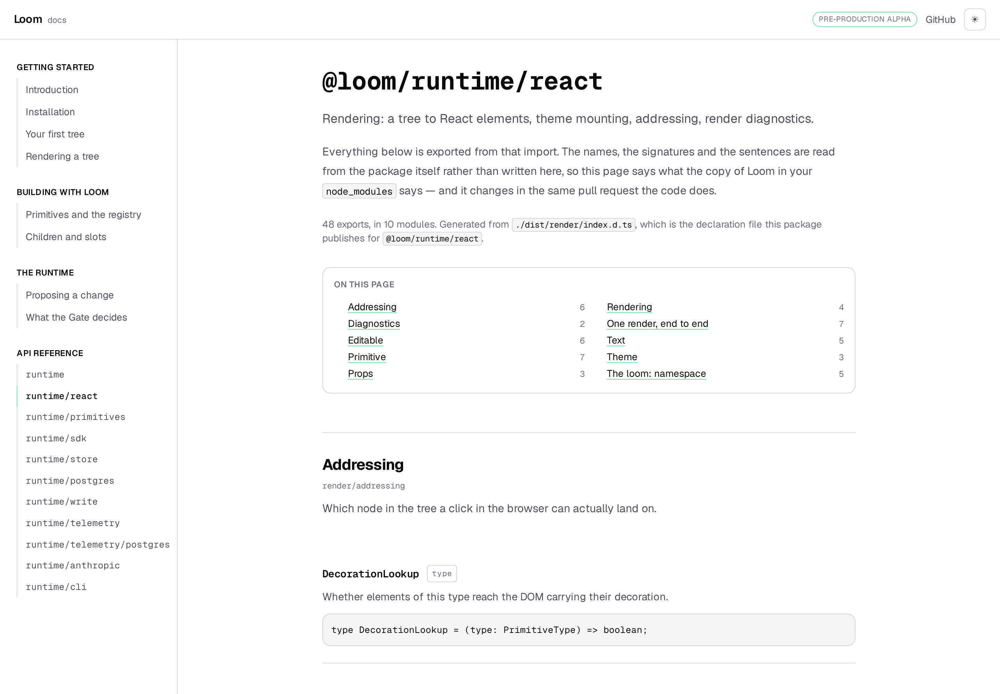
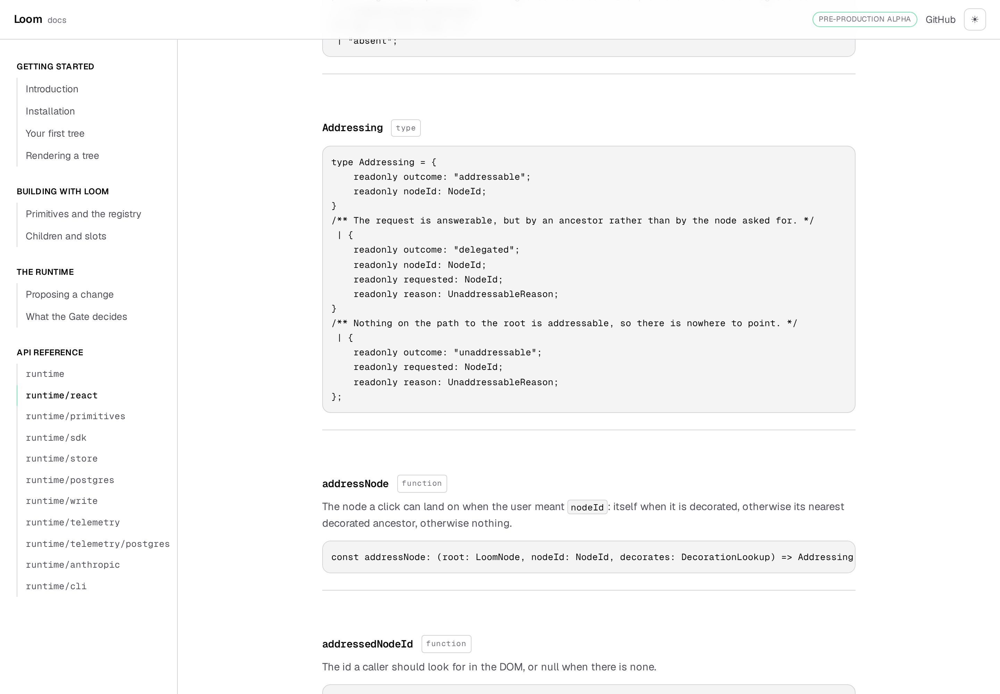
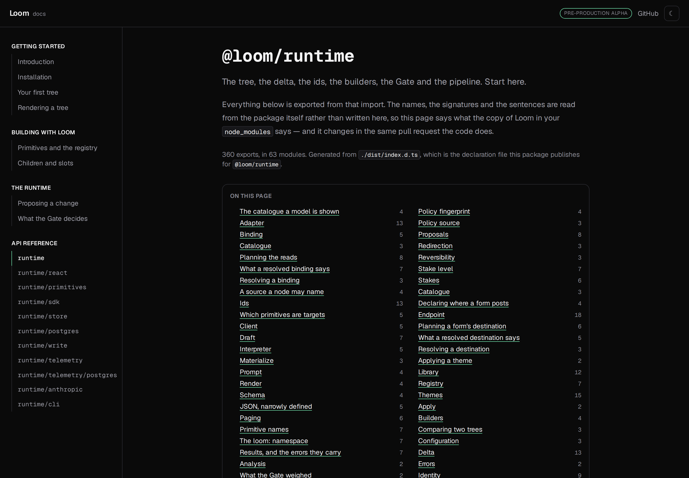

# 20 August 2026 — §4c: the API reference, read off the package

**Routine:** `Loom docs` · **Branch:** `docs-04-the-api-reference` · **Section:** §4c



> *"The API reference is generated from the published entry points, not written.
> A hand-maintained reference drifts within a week."*

The fifth section arrived. It has eleven pages, one per door the package
opens, and not one of them was written — each is rendered from
`reference.generated.json`, which the runtime's own declarations produce and a
test refuses to accept behind.

## What is on the page, and where each word came from

Every page shows the same shape. A title that is the import path in mono; the
one-line summary already carried in `entryPoints`; a receipt saying how many
exports come out of that door, in how many modules, and which declaration file
they were read from; a two-column index of "on this page"; then the modules,
each with its own paragraph and a divided list of the exports inside it.

Where did the sentences come from:

- **The module heading**: the file's own leaf name, or a short override in
  `groups.ts` for the ones a directory name says nothing about (`tree/tree`,
  `store/store`, `data/resolve` vs `data/resolution`). The override list is 30
  entries and a test refuses one that names a module the package does not
  publish.
- **The paragraph under it**: the file's own opening comment, read from `src/`.
  145 of 160 modules carry one; the 15 that do not are filed for their lanes.
- **The one-line explanation on each export**: the first paragraph of the
  export's own doc comment. 238 have one; the other 432 rely on the module's
  sentence above them, which the reference deliberately does not reprint under
  each name.
- **The signature**: the export's own declaration, with `export declare` taken
  off — because a page saying `export declare const applyDelta` when you would
  write `applyDelta(tree, delta)` is showing seams. Zod schemas render as one
  line — `const treeDeltaSchema: z.ZodObject<…>` — because their type is
  page-length and their *shape* is documented by the `TreeDelta` type beside
  them.

## The one convention this run made load-bearing

Almost every file in `src/` opens with a paragraph about itself, separated from
its first export by an empty line. That empty line is doing more work than it
looks like: **TypeScript's declaration emit drops it**, so by the time a
comment reaches `dist/` you cannot tell a "file talking about itself" from
"documentation for the first export". Reading blindly from `dist/` credits
`TREE_SCHEMA_VERSION` with "the persisted document. A tree is a root element…",
which is a lie about a `= 1`.

So the generator reads the blurb from `src/`, where the convention still
exists, and a symbol whose doc comment turns out to *be* that blurb is left
without a duplicate rather than credited with the module's sentence. 158 of
188 files follow the convention today; the 17 that do not have been left alone
because a lint rule about comment spacing in `src/` is `Loom daily build`'s to
add. The finding says so.



## Two decisions taken that were not specified

**The section is a route, not eleven directories.** `docs/api-reference/[entry]/page.tsx`
is one page with `generateStaticParams` returning the eleven slugs, and
`dynamicParams = false` so an unknown URL is `notFound()` rather than an empty
page. Writing eleven MDX shells would work and would be one more thing to
remember at every new entry point — an authoring surface that has no author.

**The reference imports data, not the extractor.** `extract.ts` opens files
and loads the TypeScript compiler; the pages read `reference.generated.json`
through `reference.ts`, which validates it at module scope and throws if a
handwritten JSON reaches the site. The compiler stays out of the browser
bundle, the reference is data by the time Next sees it, and a page renders
from a file rather than from a directory scan.

**No decision record.** Generating a reference from published declarations
does not fix a shape or foreclose a choice — it is the ordinary thing a docs
site does with the surface it documents. 0067 already says the four surfaces
are one application; nothing about how this section is built needs recording.

## What kept the drift a test rather than a discipline

The moment worth defending is the failure mode. A hand-maintained reference is
wrong the first time someone adds an export and does not remember this file,
and nothing goes red when it happens. The check that closes that loop is the
committed `reference.generated.json` and one line in `extract.test.ts`:

```
serializeReference(extractReference())
  === readFileSync(GENERATED_FILE, "utf8")
```

Regenerate before `pnpm verify` (`pnpm --filter @loom/app docs:api`), commit
the JSON along with the code change, and the reference goes green. Skip that
step and CI says exactly what to do about it. A committed generated file is
noise in a diff by default; here it earns its place, because the same pull
request that changes the public surface shows what it changed.



## Tests

`pnpm install && pnpm verify` at the repository root, **green**:

| Suite | Files | Tests |
| --- | --- | --- |
| `@loom/runtime` | 97 | 1426 |
| `@loom/app` | 79 | 876 |

Nothing failed, nothing was skipped, no test was weakened. Eleven new tests
along the seams a generated reference has to make honest, listed by what would
have gone wrong without them:

- **The published entry points and the pages agree on which doors exist**, in
  both directions. The rail names none the package does not publish, and the
  package publishes none the rail forgot.
- **The generated file is what the generator produces right now.** Adding an
  export and forgetting `docs:api` is a red test naming the fix.
- **Every entry has at least one module and every module has at least one
  export**, so an empty page cannot ship. **Every export has a name, a kind
  and a signature**, and the signature contains the name.
- **Every signature drops `export` and `declare`.** A reader is not writing a
  declaration file.
- **Every schema signature stays under 120 characters.** The Zod tree the
  schema parses to is not what a reader wants; the type beside it says the
  useful half.
- **Every export on a page has an anchor of its own**, and the URL fragments
  are unique per page.
- **A module's opening paragraph is carried, in the majority.** The threshold
  is 75%; today it is 91%. A run that broke the convention would trip this
  before it broke a reader.
- **No export is credited with its module's opening paragraph.** The trap
  above.
- The rendering tests: **the sentence is placed before the signature** on
  every export, **the on-this-page nav links to every module** and shows the
  count beside each, **the truncated marker appears only where a signature was
  cut short**, and **a module with no paragraph does not print an empty one**.

## Findings

**Closed:** *"the Gate's refusal and the page explaining it now describe
different things"* — `what-the-gate-decides` now points at the difference
explicitly, so the mechanism the page demonstrates (`loom.card`) and the
sentence the runtime prints (*"puts a target where the reader cannot reach
it"*) no longer read as two different claims. The larger fix the finding
suggested — a second worked example on `loom.article` — is still open and
still wants a unit of its own; the smaller fix landed here.

**Filed:** two thirds of the published surface has no doc comment of its own,
and it is on a page now — but 91% of modules carry a paragraph that fills the
gap under each heading, so the actual gap is fifteen modules with no opening
line. **Filed:** the primitives half of that number, for its lane. **Filed:**
no framework gaps this run, and the argument for that is that a reference of
the published surface needed *no* import from `@loom/runtime` at all.

## Open questions

In the pull request comment. Short version: the blank-line convention in
`src/` should probably be a lint rule; a couple of the module names in
`MODULE_TITLES` are still borderline and might be better in `src/` as file
renames; and no page has search yet — this run stopped short of building a
client-side index because §4c's search line is a single word and would benefit
from being scoped once all five sections exist.
