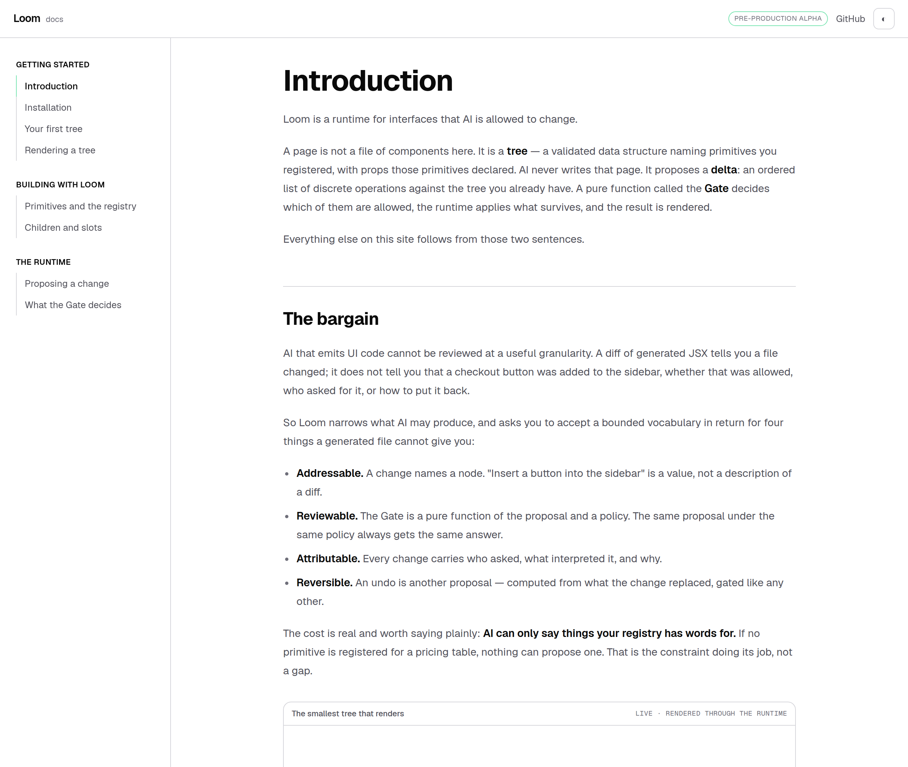
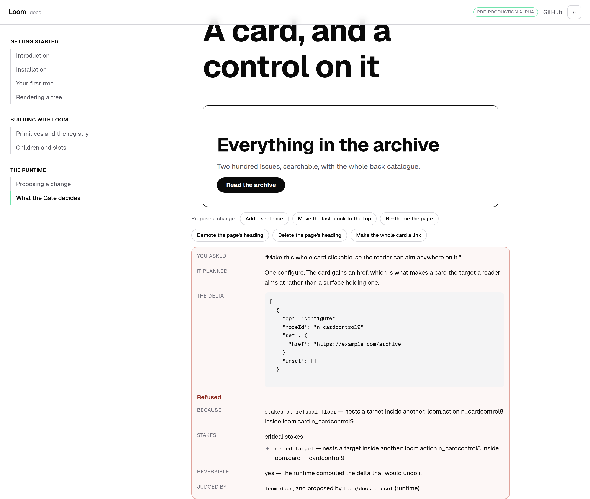
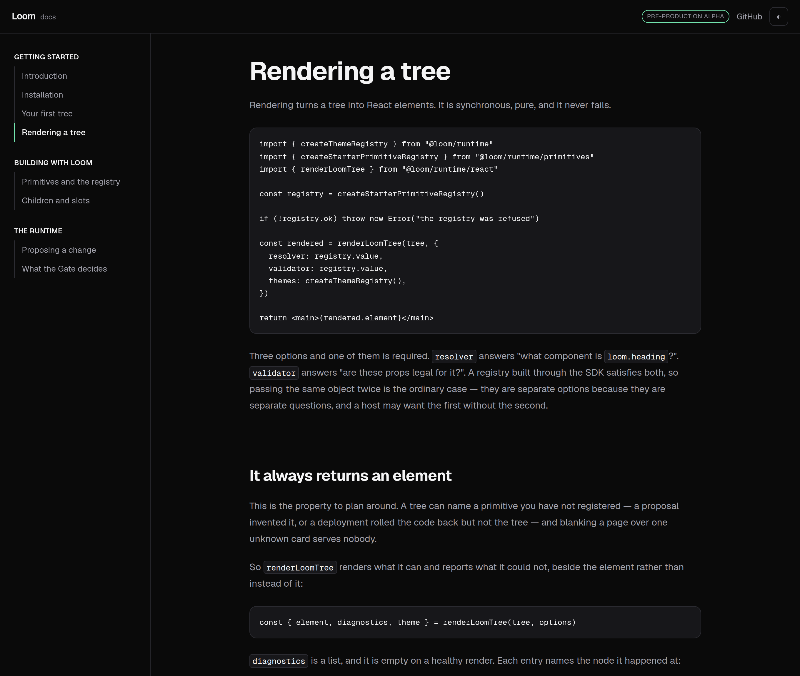
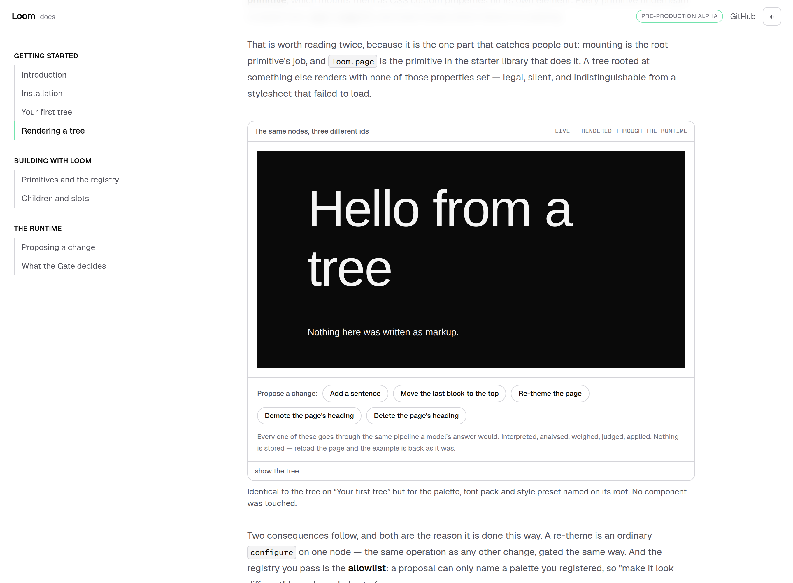

# 20 August 2026 — §4c: the documentation site wears the house theme

**Routine:** `Loom docs` (live request) · **Branch:** `docs-03-the-minimal-theme`
· **Section:** §4c

> *"The minimal theme is ready. Can we convert the doc page to the minimal
> theme."*

Done, in both halves — the trees the site builds and the chrome around them —
and the two are now held together by tests, because nothing in the framework can
hold them together for us.

This is the docs half of the finding `Loom primitives` filed with #103: *the
house theme is registered and nothing selects it, and Geist is not loaded.* Both
pieces are closed for this surface. The other three lanes still have theirs.

## What "convert" turned out to mean

Two things, and only one of them is a theme selection.

**The examples name the theme.** Every documented tree is rooted at `loom.page`
with three registered ids on it, and those ids are now
`minimal` / `minimal-sans` / `precise`. That is the whole of it — no primitive
was touched, no example was rewritten, and the diff for this half is four lines.

**The chrome is transcribed from it.** Site chrome is application furniture
(0067) — a sidebar is not a Loom tree, so it has no theme mounted on it and
nothing to resolve. The values in `globals.css` are therefore *copied* from
`src/theme/library.ts` rather than read from it, and the file now says so at the
top and names the source in each block, so a later reader can diff the two.

The result is that a reader looking at an example is looking at the same three
ids the page around it was built from. "The site is made of the thing it
documents" stops being a claim.

## The single line that did most of the work

`--surface-sunken: #fafafa` → `#ffffff`.

It is the same move `minimal` makes with `bg-surface`, and it has the same
effect: the example frame's header, the propose-a-change box and the "show the
tree" disclosure were each defined by a grey fill and are now defined by their
border. Nothing else changed for the site to read as outlined rather than
filled, which is what the maintainer's second instruction on #103 asked for.

Two consequences followed, both of them the palette's own:

- **`--edge` took `border-default` rather than `border-subtle`.** A hairline
  that was decorative at 11% black is now the only thing holding a card
  together.
- **`--surface-muted: #f4f4f5` is the one fill left**, and only where a fill is
  *functional*: a table header, a hover state, a code block. "Sparingly" is not
  "never".

## Geist, and why the fonts are vendored rather than loaded

The obvious way to load Geist in a Next application is `next/font`. **It would
have styled the chrome and left every example on the fallback**, and nothing
would have said so.

A font pack names a family as a plain CSS string — `Geist, "Geist Sans",
ui-sans-serif, …` — and a theme is data. It cannot know what a surface loaded,
and it certainly cannot know the hashed family name `next/font` mints at build
time. So the only thing that makes the *trees* render in Geist is a `@font-face`
declared under the exact family the pack asks for.

So the two variable faces are vendored into `app/(docs)/_fonts/` (SIL OFL,
licence beside them) and declared by hand as `Geist` and `Geist Mono`. Two
consequences worth having: the chrome and the trees inside it resolve the same
word to the same font, and the build reaches no network, so it cannot fail for a
reason nobody changed. A test reads the first family out of
`minimalSansFontPack.headingFamily` and asserts the stylesheet declares a face
under that name, which is the drift this arrangement exists to prevent.

The type ramp came with it: body 16, h3 20, h2 26 and the display step 44 for a
page title, which are the pack's own steps rather than numbers picked here. The
h1 grew because the ramp is gentle through the reading sizes and jumps at the
top — that is what makes a page read as one object with a title on it instead of
a document with a masthead.

## Three places this site does not copy the theme, and why

**`--ink-faint` is two steps darker than `fg-subtle`.** The palette's value is
`#8a8a94`, which is 3.42:1 on white and misses AA — filed on 20 August against
every registered palette, this one included. Chrome is not a Loom tree, so
nothing forces the site to inherit a value the finding already calls wrong.
`#6f6f7a` is the same hue at 5.0:1, and it draws every uppercase row label in a
verdict panel and every section header in the rail. Those are labels, not
ornament.

**The warning and the refusal keep a hue the theme does not name.** Minimal is
whites, black and green; a refusal rendered in green-or-grey would be restrained
and unreadable, and the difference between "applied" and "refused" is
information. So the grounds were pulled back to near-whites — *shades of white*,
which is what the request asks for — and the colour is spent on the ring and the
label alone. The accepted verdict and the note callout both moved onto Hyperion's
green, which is a colour the site gained rather than lost: the note used to be
blue, a fourth colour this theme does not have.

**Dark is the site's own inversion, not a registered palette.** `minimal` is
white paper and there is no `minimal-dark`; a docs site with a theme toggle still
needs an answer at midnight. The dark block keeps the *rules* — one ink, one
paper, structure carried by borders, the same mint as the only hue — and inverts
the two neutrals. If a dark minimal palette is ever registered, these numbers
should move to match it, and the stylesheet says so.

## The bug the conversion uncovered

**The `bold` example had been rendering pale grey text on white**, and had been
since it was written.

`loom.page` paints the theme's canvas only when asked — `fills` is off by
default, because a page embedded in a host's chrome should not repaint the
host's background out from under it. That is a good default and the wrong one
for an example frame, which is a *viewport onto a document* rather than an
embed. No example set it.

It cost nothing visible for as long as every example's canvas was the same white
as the frame around it. The moment the default theme stopped agreeing with the
docs background — which is to say, the moment the themed example became the only
one not on the house theme — it was unreadable. **Matching backgrounds were
hiding it**, and no test could see it: "it rendered" is true of a page nobody can
read, the diagnostics were empty, and the palette suite asserts colour rather
than legibility.

Fixed in this lane, where it belongs: `fills: true` on every example root, with
a test that asserts it for all of them.

## Decisions taken that were not specified

**The themed example moved from `bold`-against-`editorial` to
`bold`-against-`minimal`.** That page's lesson is that three strings on the root
change everything below them, and the further apart the two look the harder that
is to mistake for a coincidence. It is also now the only example on the site that
is not the house theme, which is exactly what it is for.

**The green appears in four places and no more**: the current page's rule in the
sidebar, the ring on the header's alpha pill, a link's resting underline, and the
note callout. Each is a hairline or a mark rather than a fill, which is the
palette's own argument for where a highlight belongs.

**Tailwind's radius scale was remapped to `precise`'s** — 4 / 8 / 12 — and
`rounded-full` left alone, for the reason the preset leaves `full` at 9999: a
circle is a shape, not a style.

**Spacing was not remapped.** `precise` widens the spacing scale, and the chrome
uses Tailwind's rather than the theme's. Rewriting every gap on the site to match
would have been a large, unverifiable diff on top of a conversion, and the
article's own rhythm was widened where the type ramp made it necessary and
nowhere else. Worth revisiting deliberately rather than as a side effect.

**No decision record.** Selecting a registered theme is what a surface is
supposed to do, and 0049, 0050 and 0067 already say everything this leans on.

## Tests

`pnpm install && pnpm verify` at the repository root, **green**:

| Suite | Files | Tests |
| --- | --- | --- |
| `@loom/runtime` | 97 | 1407 |
| `@loom/app` | 75 | 766 |

Nothing failed, nothing was skipped, no test was weakened. Six new, all in
`_lib/house-theme.test.ts`, and they exist because a conversion is the kind of
change that rots quietly:

- **Every example but the themed one is on the house theme**, and the themed one
  deliberately is not.
- **Every example names ids the registry resolves.**
- **Every example paints its own canvas** — the assertion the bug above earned.
- **The stylesheet declares a face under the family the font pack asks for**,
  read out of `minimalSansFontPack` rather than typed twice.
- **The body carries the pack's own fallback stack**, so chrome and trees fail
  over identically.
- **The structural surfaces stay on the page colour**, so a later grey fill
  cannot quietly undo the outline-first half.

## Findings

**Closed:** the docs half of *"the house theme is registered and nothing selects
it, and Geist is not loaded"*. Both pieces, for this surface only.

**Filed:** a font pack can name a family that no surface can honour without
publishing the file under that exact name — the `next/font` trap above, which
every one of the other three lanes is about to walk into. **Filed:** `loom.page`
defaults `fills` off, which is right for an embed and wrong for every rendered
specimen, and this is the second surface to want it on.

## Open questions

In the pull request comment. The short version: whether the other three surfaces
should share these vendored faces rather than each solving Geist again, and
whether `fg-subtle` moving in the palette itself would be better than four
surfaces each choosing a darker step.
