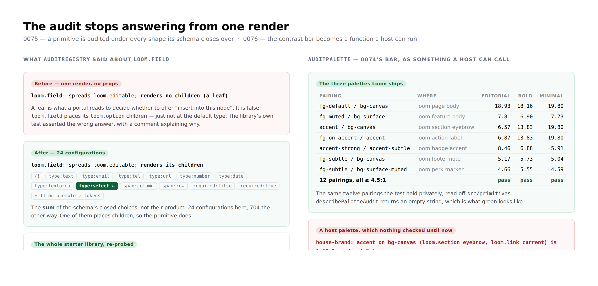

# 2026-08-20 — The audit stops answering from one render

**Routine:** `Loom daily build` · **Section:** §4, §4b
**Branch:** `framework-02-the-audit-answers-from-every-shape` · **PR:** #115
**Preview:** https://loom-git-framework-02-the-au-0dba2a-jpizzolato36-6341s-projects.vercel.app

---



## What this run did

Two findings closed, both owned by this lane, both the same shape of defect:
**a check that was quietly narrower than the claim it made.**

`auditRegistry` said `loom.field` had nowhere to put a child node. It has —
`loom.option` children, under `type: "select"` — but the probe called it once
with no props and reported whatever that one shape did. And the contrast bar
0074 set for palettes existed only inside a test file, so it held for the three
palettes Loom ships and for nothing a host writes.

Neither was a bug anybody could see from a page. Both were a check saying more
than it had checked.

**The migration this brief still leads with is done and has been since #98.**
`apps/loom` exists with all four route groups, `apps/portal` and `apps/docs` are
retired, sign-in is in `proxy.ts` at the `(portal)` boundary, one Vercel project
is rooted at `apps/loom`. Nothing is half-migrated. Recorded again in
`FINDINGS.md` so the next cold session does not go looking.

---

### 1. A primitive is audited under every shape its schema closes over

*Finding filed by `Loom primitives`, 20 August. Record:*
[0075](../decisions/0075-a-primitive-is-audited-under-every-shape-its-schema-closes-over.md).

The probe now asks each primitive under **the default configuration plus each of
its closed choices, one value at a time** — a `z.enum`'s members and both values
of a `z.boolean`, looked up through `.optional()`, `.default()` and
`.nullable()`. `closedChoices` in `src/catalogue.ts` reads them off the declared
schema; `probeConfigurations` turns them into the list.

The **sum** of the choices, not their product. `loom.field` is 24 configurations
this way and 704 the other, and a schema with six enums of eight members is a
quarter of a million. The record says plainly what the cheap answer misses: a
primitive that places children only when two particular values are set *together*
is still called a leaf.

Each claim then resolves the way its failure mode requires:

| claim | resolved as | why |
| --- | --- | --- |
| `rendersChildren` | true if **any** shape placed them | "has nowhere to put a child" is refuted by one shape that takes them |
| `unplacedSlots` | unplaced only if **no** shape placed it | same |
| decoration | must hold under **every** shape | it is a promise, not a capability — invisible in the eighth mode is broken in the eighth |

A configuration that **throws** answers neither way. It is excluded from the
verdict and reported separately as `throwsOnDeclaredProps`, because a component
that throws on a value its own schema accepts is one a valid tree can take a page
down with — and because the shapes that did render still rendered. Only when
nothing answers is the verdict `not-probeable`, as before.

**What re-probing the whole library found:** exactly one type moved.

```
45 primitives → 320 configurations → 640 calls, 20ms
leaves                  13 → 12   (loom.field out)
notDecorated                  0   ← now a stronger claim than yesterday
unplacedSlots                 0   ← now a weaker one
throwsOnDeclaredProps         0   ← new
```

No primitive decorates conditionally. None throws on a value its schema accepts.
No declared slot turned out to be placed only under some prop. That is the
reassuring outcome, and it is worth more than the finding asked for: the
decoration claim four surfaces assert empty is now checked against every shape,
and it still holds.

### 2. `auditPalette` — 0074's bar, as a function a host can call

*Finding filed by this lane, 20 August, out of 0074's own consequences. Record:*
[0076](../decisions/0076-loom-offers-a-host-the-contrast-bar-and-does-not-impose-it.md).

`createThemeRegistry({ palettes })` **replaces** `STARTER_PALETTES` (0049), so a
host supplying its own got `paletteSchema` — every slot holds a colour — and
nothing else. A host palette with a 2:1 subtle registered, resolved, re-themed
and rendered.

`src/theme/contrast.ts` now holds what the test held privately:
`PALETTE_TEXT_PAIRINGS` (twelve pairings, each naming the primitives that render
it), `contrastRatio`, `TEXT_CONTRAST_MINIMUM`, `auditPalette` and
`describePaletteAudit`. All exported from `@loom/runtime`. The library's own
suite is now one call per shipped palette, so 0074's guarantee and a host's are
the same check rather than two that can drift.

Two things it deliberately does:

- **It refuses nothing.** Enforcing in `paletteSchema` would reject palettes that
  are legal today — a host upgrading a patch version would find its site does not
  boot — and would decide, inside a Zod refinement, whether Loom enforces
  accessibility on hosts or merely meets it itself. That is the maintainer's
  question, and it is in *Needs your input* below.
- **`unmeasured` is a third outcome, not a pass.** `contrastRatio` measures three-
  and six-digit hex and answers `undefined` for `rgb()`, `hsl()`, named colours
  and eight-digit hex — a named colour needs 148 entries of CSS vocabulary, a
  colour-function parser that is subtly wrong reports a *passing* ratio for a
  failing pair, and an alpha composites against whatever is behind it so its
  contrast is not a property of the two slots at all. A check that cannot answer
  says so, the way `not-probeable` already does.

---

## Decisions taken that nothing specified

**Booleans count as closed choices, not only enums.** The finding named enums.
A boolean is closed by construction and costs two renders, and including it makes
the audit's claim "under every shape the schema closes over" true rather than
"under every enum". Numbers were left out: their bounds are reachable only
through Zod internals, most numeric props are unbounded, and a prop that selects
among a closed set of renderings is an enum already.

**`closedChoices` lives in `src/catalogue.ts` and is not part of the catalogue.**
It reads the same object schema through the same public Zod surface and reuses
`objectSchemaWithin`; the alternative was a second copy of that unwrapper in
another file. The module doc says why it is beside the catalogue and not in it —
widening the model-facing catalogue to carry enum options is a separate decision
and was not taken here, though `loom.field`'s own comment argues for it.

**Decoration was tightened without being asked to.** The finding was about
leaves. The same machinery makes the decoration probe answer from every shape,
and leaving it answering from one would have meant shipping a probe that is
rigorous about children and lax about the promise a portal actually depends on.
It could have turned `main` red; it did not — checked before writing the record.

**The throw list was added rather than folded into `not-probeable`.** Once
configurations are built from a schema, a component that throws on one is a fact
the probe now knows and nothing else does. Reporting it separately keeps
`not-probeable` meaning "I could not call this at all".

## Records

- **0075** — a primitive is audited under every shape its schema closes over. New, Accepted.
- **0076** — Loom offers a host the contrast bar and does not impose it. New, Accepted.
- Nothing superseded. `pnpm decisions:index` regenerated; `decisions/README.md` carries both.

## Findings

**Closed:**

- *`auditRegistry` calls `loom.field` a leaf, and it is one only sometimes* (filed by `Loom primitives`) — by 0075.
- *A host's own palette is not held to the bar the starter palettes now clear* (filed by this lane) — by 0076.

**Annotated, still open and still mine:**

- *The submission audit 0065 deferred now has something to audit.* Not taken, on
  purpose, with the reason written into the entry: the only thing that would
  declare `submits: true` is `loom.form`, which is `Loom primitives`' lane, and a
  seam with no user is worse than a seam not yet built. It is the next framework
  unit unless a finding outranks it.

**Filed:**

- *The audit calls a component more than once now, and one comment in the portal
  says otherwise* — for `Loom portal`. A doc comment in
  `app/(portal)/_lib/addressing.ts` that says "once"; the reasoning it draws is
  unaffected and in fact stronger.
- *Two files in other lanes had to change so `pnpm verify` would pass* — for
  `Loom primitives` (one string and one comment in `library.test.ts`, in an
  assertion whose subject is framework behaviour) and `Loom marketing`
  (`copy.ts`'s checked decision count, 74 → 76 — the fourth time, already open as
  a finding of its own).
- *No framework gaps this run, and the migration is still done.*

## Open questions

- **Should `auditPalette` become a refusal, or a render diagnostic, or stay an
  audit?** 0076 chose the audit and defends it; the other two are in *Needs your
  input*.
- **Should the catalogue carry a closed prop's options?** `loom.field`'s own
  source says an enum "buys the catalogue a list a model can choose from", and
  the catalogue does not in fact carry one — it stops at prop names, by a
  decision that predates the enums. Not changed here: it is model-facing surface
  and wants its own record.
- **`probeConfigurations` is exported.** It is the seam a host would use to probe
  its own primitives under shapes Loom cannot derive — a discriminated union, a
  prop whose values come from a database. Nothing uses it that way yet.

## Test numbers

`pnpm install && pnpm verify` — **green**, on the merge of `main` (final numbers):

```
@loom/runtime   99 test files   1458 tests   passed
@loom/app       81 test files    889 tests   passed
                                 ─────
                                 2347 passed, 0 failed, 0 skipped
```

Typecheck and build clean. Nothing was skipped, weakened or marked `todo`.

**Three tests failed on the way and all three were fixed rather than weakened.**

`app/(marketing)/_lib/facts.test.ts` asserts the marketing site's decision count
against the contents of `decisions/`, and two new records made it read 74 against
76. The literal in `copy.ts` was corrected; the assertion was not touched.

`app/(docs)/_lib/api/extract.test.ts` — **after merging `main`.** #112 landed the
generated API reference while this branch was open, and it holds a committed
snapshot against what the generator produces now. This branch adds nineteen
exports, so it moved. The test says exactly what to do and it was done:
`pnpm --filter @loom/app docs:api`, committed. The published surface is 689
exports where the docs routine measured 670 this morning.

`FINDINGS.md` conflicted on the same merge — both branches append entries at the
end of the file. Resolved by keeping both, in the order they were written. No
entry of anyone else's was rewritten.

Three existing assertions in `conformance.test.ts` were updated because
`PlacementVerdict` gained two members (`probed`, `threw`) and they compare the
whole object with `toEqual`. Their subjects are unchanged.

`src/sdk/audit.test.ts` prints React's "Invalid hook call" to stderr during the
run. That is pre-existing and deliberate — the `loom.hooked` fixture exists to be
unprobeable — not a new warning from this branch.

**The first push failed to deploy, and the cause is worth every routine knowing.**
It authored the commit as `jpizzolato36@gmail.com`, which GitHub resolves to
`@jpizzo` rather than to the maintainer, and Vercel refuses to build for an author
without access to the project: *"Git author jpizzo must have access to the project
on Vercel to create deployments."* Not a test failure and nothing to do with the
diff. Amended to the author every other routine's branch uses — `Claude
<noreply@anthropic.com>`, the repo's configured default — and force-pushed, which
is safe on a branch nobody else had. **A routine should not set a commit author.**

## Merged `main` mid-run

#112, #113 and #114 landed after this branch was cut. `main` was merged in rather
than rebased, the three failures above were fixed, and `pnpm verify` was run
again on the merge — the numbers above are from that run. The branch is a merge
commit on top of `1aabebb`, never a stack.

One thing arrived with #112 that is **now an open finding owned by this lane**:
*two thirds of the published surface has no sentence*, filed by `Loom docs`. It
counts 432 exports with no doc comment of their own, of which only 19 have
neither their own sentence nor a paragraph from their module — and it names
fifteen modules whose opening paragraph is missing, `sdk/catalogue` among them.
Not touched here, because widening a migration-shaped PR with unrelated prose is
how a diff becomes unreviewable. It is a strong candidate for the next run: the
finding says it is the cheapest documentation work in the repository, and it is
one paragraph per module.

What this branch did do about it is not add to the count: **all nineteen new
exports carry a doc comment of their own.**

## What is not in this branch

Nothing was started and left unfinished. No primitive was added or restyled, no
surface content was written, and the two files touched outside `src/` are the two
filed above. The tree is not half-anything across this run boundary.
