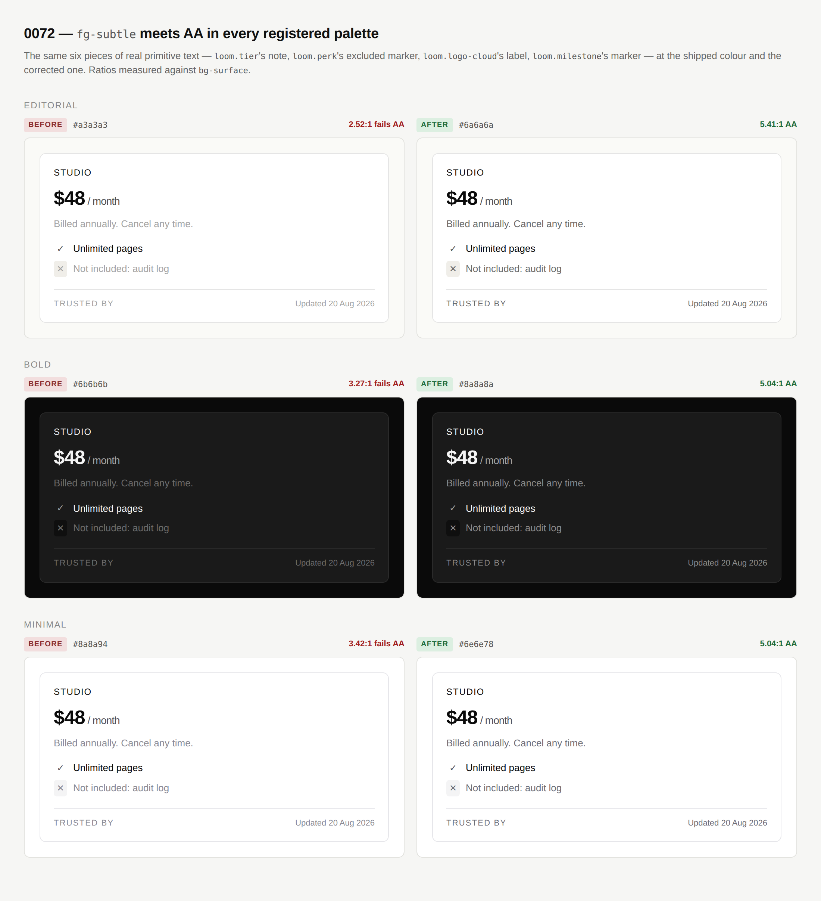

# 2026-08-20 — What the framework says back

**Routine:** `Loom daily build` · **Section:** §2, §4b
**Branch:** `framework-01-what-the-framework-says-back` · **PR:** #109
**Preview:** https://loom-git-framework-01-what-t-a6202e-jpizzolato36-6341s-projects.vercel.app

---

## What this run did

Three findings, filed by three different lanes against `src/`, all closed. They
are one unit because they are the same kind of defect: **the framework was
quietly wrong in a way only somebody using it could find.** An id factory that
accepted an argument it could not use. A refusal that named the wrong mechanism.
A colour that nobody could read. None of the three was visible from inside the
framework's own tests, and each was found by a surface trying to build something.

The migration this brief has led with since 19 August is **done** — `apps/loom`
exists, all four route groups are in it, `apps/portal` and `apps/docs` are
retired, one Vercel project deploys the lot. Nothing about it was left half
finished across a run boundary. This run is the first of the "after the
migration" queue, which the brief orders as *open findings owned by you* first.

### 1. `sequentialIdFactory` refuses a namespace it cannot use

*Filed by `Loom lessons`, 19 August.*

The namespace was interpolated into every id and only the **result** was
validated — `nodeIdSchema.parse(\`n_${namespace}${n}\`)`. So a lessons page
naming its fragments `set-n-q1`, which reads like exactly the debugging
affordance the namespace is documented to be, was accepted by the factory and
then failed on first use:

```
ZodError: [ { "validation": "regex", "code": "invalid_string", "path": [] } ]
 ❯ Object.nodeId src/ids.ts:95
 ❯ buildText src/tree/builders.ts:31
```

Several frames and one file from the mistake, naming neither the namespace, nor
the factory, nor the rule. It now refuses at the call:

```
loom: sequentialIdFactory was given the namespace "set-n-q1", which cannot
appear in an id. A namespace is lowercase letters and digits only, at most 24
of them — no hyphens, underscores or capitals. Try "setnq1".
```

**Twenty-four, not thirty-two**, and that is the one thing here that was not in
the finding. An id body is at most 32 characters and the counter is appended, so
a namespace allowed to use all 32 would be legal at the first node and illegal
at the tenth. Eight characters of headroom is a hundred million ids per kind —
the bound holds for the last id as well as the first, which is the property a
bound is for. A test mints a thousand ids from a maximum-length namespace and
checks the last one still parses.

The lessons surface's own `namespaceOf` workaround already sliced to 24 and
stripped the same characters, so nothing there breaks and its keys are unchanged.

**One caller could notice this who did not before**, and it is worth naming
rather than burying: a namespace of 25 to 32 lowercase alphanumerics used to
*work*, for a while. Twenty-five characters plus `1` fits an id body; plus `1000`
does not. So that caller got a working factory that failed somewhere between its
hundredth and its ten-thousandth node, depending on how many it minted. It now
throws at the call. That is the fix rather than a regression — the alternative is
a bound that expires mid-run — but it is a behaviour change to a shipped export,
and no caller in this repository is in that range.

### 2. The Gate's refusal describes reach, not markup

*Filed by `Loom primitives`, 19 August.*

```diff
- nests a target inside another: loom.action n_buy0 inside loom.article n_story0
+ puts a target where the reader cannot reach it: loom.action n_buy0 inside loom.article n_story0
```

0068 declared `loom.article` a target when it carries an `href`, which is the
right verdict — its title anchor stretches a `::after` over the whole card, so a
control underneath never receives a click. But the mechanism is not nested
anchors. For `loom.card` the old sentence was literally true; for `loom.article`
it was true of the reader's aim and false of the markup, and a person checking
that diff would go looking for an `<a>` inside an `<a>` that is not there.

The list still names the pair — a reviewer fixes nodes, not a sentence. Three
doc comments that asserted invalid markup as the damage (`analysis.ts`,
`policy.ts`, `nesting.ts`) were corrected alongside it, and the explanation of
*why* the sentence avoids the word "nesting" now sits above the stake factor
where the next person to edit it will read it.

A new test renders the `loom.article` case specifically and asserts the refusal
says nothing about nesting, markup, or a link inside a link.

### 3. `fg-subtle` meets AA in every registered palette — [0072](../decisions/0072-a-palette-slot-that-carries-text-meets-aa.md)

*Filed by `Loom primitives`, 20 August.*

The contrast suite written on 20 August found every pairing the primitives put
together clears AA except one, and excluded that one with a comment rather than
lowering the bar — correctly, because it wanted a decision.

| palette | was | is | canvas / surface / muted |
| --- | --- | --- | --- |
| `editorial` | `#a3a3a3` — **2.41:1** | `#6a6a6a` | 5.17 / 5.41 / 4.66 |
| `bold` | `#6b6b6b` — 3.72:1 | `#8a8a8a` | 5.73 / 5.04 / 5.55 |
| `minimal` | `#8a8a94` — 3.42:1 | `#6e6e78` | 5.04 / 5.04 / 4.59 |



*The same six pieces of real primitive text at the shipped colour and the
corrected one. Left column is what has been shipping.*

The finding named the fork exactly: either the slot's contract is "large or
secondary text only" and the primitives using it for small text are wrong, or the
palettes want a darker subtle. **The palettes moved.** Six primitives read the
slot at eight call sites — `loom.footer`'s note row, `loom.tier`'s note,
`loom.milestone`'s marker, `loom.link-list`'s group label, `loom.logo-cloud`'s
label, `loom.perk`'s excluded and coming-soon markers — and not one of them is
reliably large text. Two of them are the only place a particular fact appears on
the page.

The "large text only" contract was rejected because **nothing can enforce it.**
A primitive picks a colour and a font size independently; a host's style preset
can change the size afterwards; no test in this repository could check it. A rule
every author must remember, that no machine can verify, and that is violated the
moment somebody reaches for the obvious slot for a caption, is a rule that will
be broken silently — which is precisely how this sat in three shipped palettes
for weeks.

`fg-subtle` is now in the pairing table with all three of its backgrounds. There
is no excluded pairing left in the suite, which is what makes it worth running: a
suite with a documented exception teaches its readers to expect exceptions.

## Decisions this run made that nobody specified

**Twenty-four characters for a namespace.** The finding said "validate the
namespace where it is given" and did not say how long it may be. Any bound that
does not reserve room for the counter is a bound that expires mid-run, so the
question is only how much headroom. Eight digits is more ids than a deterministic
replay will ever mint and leaves three quarters of the body for the caller.

**`bg-surface-muted` joins the checked backgrounds.** The finding's table
measured `fg-subtle` against canvas and surface. `loom.perk` deliberately puts it
on `bg-surface-muted`, so leaving that pair unchecked would have left the same
hole one slot over. It is the tightest of the three ratios in every palette
(4.59–5.55) and it passes.

**The ink ramp is now asserted to stay a ramp.** Not asked for. It is the
guardrail against the obvious way to overshoot this repair — darken `fg-subtle`
until it *is* `fg-muted`, at which point the palette has spent a slot on nothing.
Three distinct colours, strictly increasing contrast against the canvas.

**Two files outside this lane were edited.** Both are one value, both were forced
by a test in that lane that exists to force exactly this, and both are recorded
as a finding for their owners:

- `app/(portal)/globals.css` — three chrome tokens copy the palette's `fg-subtle`
  as a literal, and `(portal)/globals.test.ts` asserts they equal the registered
  value. It failed. That test is the reason the portal's sign-in page is not
  still rendering the old grey.
- `app/(marketing)/_lib/copy.ts` — `decisions: "71"` → `"72"`, because
  `facts.test.ts` counts the records on disk. The marketing lane filed this on 19
  August as the thing that makes every other lane's run go red. It is, and the
  alternative is a page that says 71 when the answer is 72.

Neither is a redesign and neither changes behaviour in those surfaces beyond the
value the framework changed underneath them.

## Records

- **[0072](../decisions/0072-a-palette-slot-that-carries-text-meets-aa.md)** —
  *A palette slot that carries text meets AA, and the palette moves rather than
  the bar.* Accepted. §4b. Nothing superseded.

**The number may have to change before this merges.** `decisions/README.md` is
generated and `pnpm verify` fails on a gap, so a record has to take the next free
number **on `main`**, which is 0072. PR #108 — open since this morning, in the
primitives lane — claims 0072 and 0073 on its own branch. Whichever merges second
renumbers. If #108 lands first this record becomes 0074, along with four
references to it in `src/theme/`. This is the collision filed on 16 August as
*"two routines cannot both write a decision record without colliding"*, still open
and still owned by the maintainer; it cost a rename on 19 August and will cost one
here.

## Findings

**Closed — three, all owned by this routine:**

- *`sequentialIdFactory` takes a namespace it cannot mint an id from* (`Loom lessons`, 19 Aug)
- *The Gate's nested-target reason will be a shade wrong for a covered card* (`Loom primitives`, 19 Aug)
- *`fg-subtle` does not meet AA in any registered palette* (`Loom primitives`, 20 Aug)

**Closed — two that no longer need this routine:**

- *Vercel deploys fail on every PR* (`Loom portal`, 19 Aug) — **fixed by the
  maintainer.** One project, `loom`, rooted at `apps/loom`; `loom-portal` and
  `loom-marketing` are gone. Verified against #108's deploy, which reached
  `Ready`. A routine can put a real preview URL in a pull request again, and this
  one does.
- *A house theme was added, and it was added in someone else's lane*
  (`Loom primitives`, 20 Aug) — **acknowledged**, which is all it asked for.
  Nothing was discovered by merge conflict. The census assertions that routine
  rewrote to *derive* their expectations rather than list palette ids held
  without edits when this run changed three slot values in the same file, which
  is why the palette change was three hex values rather than a test rewrite.

**Filed — three:**

- *Two files in other lanes had to change so `pnpm verify` would pass*, for
  `Loom portal` and `Loom marketing`, with the deduplication each might consider.
- *The Gate's refusal and the page explaining it now describe different things*,
  for `Loom docs`. `what-the-gate-decides` still explains the refusal as "a link
  inside a link". Nothing fails; its worked example is `loom.card`, where that is
  literally true. But the live refusal a few lines below now says something else.
- *A host's own palette is not held to the bar the starter palettes now clear*,
  for this routine. See open questions.

## Open questions

**Does Loom enforce accessibility on hosts, or only meet it itself?** 0072's bar
is a test iterating `STARTER_PALETTES`. `createThemeRegistry({ palettes: [...] })`
replaces that list wholesale (0049), so a host's own palette gets `paletteSchema` —
which checks a slot holds a colour and has no idea which slots are read as text on
which others — and nothing more. A host palette with a 2:1 subtle registers,
resolves and renders. Deliberately not fixed in this run: moving the check into
the schema is a refusal at registration, a behaviour change to a shipped seam, and
it answers a question 0072 did not ask. The two shapes worth weighing are a
`RenderOutput` diagnostic in the shape `data-unavailable` already established
(0058), or an exported `auditPalette` a host can run in its own tests the way
`auditRegistry` already works. Recommendation in the PR comment.

**Nothing else in `src/` was found wanting this run.** No deep import was needed,
no entry point changed shape, and the three fixes touched six files between them.

## Test numbers

`pnpm install && pnpm verify` — **green**, run twice: once on the failures below
and once clean.

| suite | files | tests |
| --- | --- | --- |
| `@loom/runtime` | 97 | **1414 passed** |
| `@loom/app` | 76 | **827 passed** |

`pnpm build`, `pnpm typecheck` and the `apps/loom` production `next build` all
pass. Nothing skipped, nothing weakened, no test deleted or loosened to make a
change fit.

**Two suites failed on the first run and both were correct to.** The portal's
chrome-token test and the marketing site's decision count, described above. Both
were red because this branch changed a value they are wired to notice; both went
green when the value they check was updated, rather than when the assertion was
relaxed. Recorded because "verify green" means less if the first run is not
reported.

Seven tests added: five on the namespace refusal, one on the overlay case's
refusal wording, one on the ink ramp staying a ramp.

## Token discipline

One branch, one unit, one pull request. No follow-up scheduled and no
self-check-in armed.
