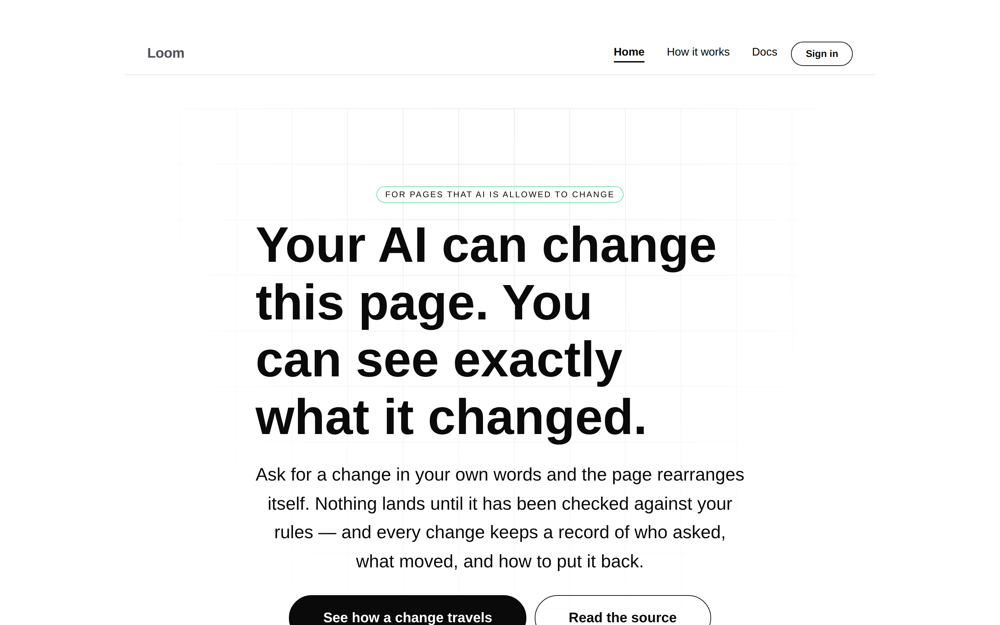
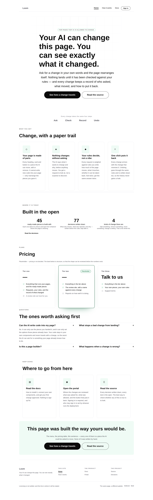
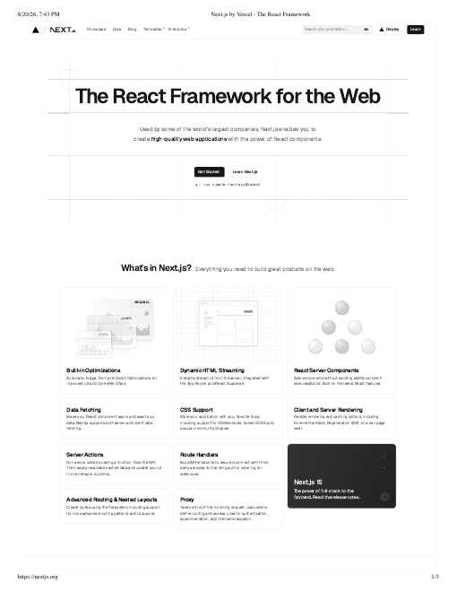

# 2026-08-20 — marketing: the front door stops using our words

The maintainer read the site against `nextjs.org`, sent the reference, and said
the copy was heavy on technical jargon.

He was right. The third band of the landing page read
`Proposals · The Gate · Revisions · Inverses` under the heading "The four things
underneath" — four of our nouns, taught to a stranger inside the first screen and
a half, before the page had said what any of them were for. The brief says in as
many words *never open with `TreeDelta`, `disposition` or the Gate*. The site
opened with the Gate for three weeks.

This run rewrites the copy in the reference's register and — more importantly —
makes the register a **tested property of the surface**, because the reason it
drifted is that it was the only thing here nothing checked.

---

## Why it drifted, which is the part worth fixing

Every other claim this site makes has an assertion behind it. A re-theme touches
only the root; no colour is named below it; every surface is reachable from every
page; the numbers are held against the repository. Break one of those and the run
that broke it finds out in under a second.

The register had nothing. So it rotted one defensible sentence at a time, written
by a routine that reads this repository all day and to which *delta* and *the
Gate* are ordinary words. No single commit did it and every commit was fine.

That is what [0078](../decisions/0078-the-front-door-speaks-the-visitors-language.md)
records: **the register is a property, and it is tested like the others.**

## The rule, in two halves

`RESERVED_VOCABULARY` in `_lib/copy.ts` names the words this project uses about
itself that a visitor has never heard — `delta`, `the Gate`, `primitive`,
`inverse`, `provenance`, `schema`, `registry`, `runtime`, `node`, `tree`,
`TreeDelta`, `disposition`.

- **The front door may not use one at all.** Someone arriving at `/` has no
  context, and a word they have to look up is a word that sends them somewhere
  else to look it up.
- **A mechanism page may, once it has said the same thing plainly first.** The
  test holds the *order*: `delta` is allowed on `/how-it-works` because "an exact
  list of changes" appears above it, and `the Gate` because "Your rules decide"
  does.

The second half is what keeps this from being censorship. Those are the right
names for what they name and the documentation should use them freely. What a
visitor cannot be asked to do is meet them cold.

## What the test found that I had not

The first version of `voice.test.ts` walked text nodes and **reported a clean
front door while reading about a third of the page.**

Most of the words on this site are *props*, not text — a `loom.feature` carries
its title and body as configuration, which is 0052 working exactly as intended.
So the feature grid, every FAQ answer, every stat caption and the entire pricing
band were invisible to it.

Fixing the collector immediately failed three assertions, and every one was a
real jargon leak I had missed by hand: the pricing band still promised "The
runtime and the starter primitives", "Proposals, the Gate and the revision log"
and "Your own primitives, your own policy". A test that reads the page properly
found in one second what I had read past twice.

`PROSE_PROPS` is therefore an allowlist, and the reasoning is in the file: a new
prose prop nobody adds to it is copy the test cannot see, which is the failure it
just had.

## What changed on the page

| Before | After |
| --- | --- |
| *An AI-native UI runtime* | *For pages that AI is allowed to change* |
| "Loom makes the interface data. A page is a tree of registered primitives, every change to it arrives as a proposal with a rationale, is weighed against a policy before it lands, and carries the change that undoes it." (45 words, one sentence) | "Ask for a change in your own words and the page rearranges itself. Nothing lands until it has been checked against your rules — and every change keeps a record of who asked, what moved, and how to put it back." (two sentences) |
| *Proposals · The Gate · Revisions · Inverses* | *Ask · Check · Record · Undo* |
| "A page is a tree, not a file" | "Your page is made of parts" |
| "The Gate is a pure function of the change, its stakes and whether it can be taken back." | "Every request is weighed against rules you write: how much of the page moves, what it touches, whether it can be taken back. Ask twice, get the same answer twice." |
| "Every delta has an inverse." | "Every change arrives with the change that reverses it." |
| "45 primitives in the starter library" | "45 ready-made pieces to build with" |
| "This page is a tree. So is yours." | "This page was built the way yours would be." |
| `<title>` — "Loom — the interface is data" | "Loom — every change your AI makes, written down" |

The `<title>` and the meta description mattered more than they look: they are the
front door *before* the front door, and they described the product as "a runtime
where a page is a tree of registered primitives" in every search result.

On `/how-it-works` the five steps now name themselves in plain words — *Someone
asks for something*, *The AI writes down what it wants to change*, *The change is
measured*, *Your rules decide*, *What happened is written down* — and the two
terms it genuinely needs arrive after the plain sentence that earns them.

## What I took from the reference, and what I could not

The register is four habits rather than a style guide, and they are lifted
straight off `nextjs.org`: the reader is in the sentence ("your page", not "a
page"); one idea per sentence, and a short second sentence is a gift ("Skip the
API."); what it does for you before what it is made of; something concrete in
place of the abstraction it implements. Two of the four are testable and are
tested — the reserved list, and a thirty-word ceiling on any sentence in an
opening band, which is where "one idea" stops being true.

**The one thing on their page I could not copy is the most important element on
it**, and it is filed: under the hero they put `npx create-next-app@latest`, one
line a visitor can copy. That is the conversion path; everything else is
persuasion. `@loom/runtime` is `private: true` and unpublished, so there is no
honest equivalent, and inventing one would be the first false claim on the site.

## Tests

`pnpm verify` green — **1473 runtime, 909 application**. Nothing skipped, nothing
weakened.

Marketing suite **94 → 114**, twenty of them new in `voice.test.ts`. The palette
switcher's label moved into an exported constant on the way past, because two
test files were asserting the same sentence and a string spelled out in three
places is a string that gets re-worded in one of them.

## Findings

- **There is nothing to install** — the maintainer's. The reference's hero
  carries a copyable install command; ours cannot, because the package is
  private and unpublished. It shapes the front door rather than decorating it,
  and it collapses into the same question as the demo finding from earlier today.
- **`loom.feature-grid` cannot vary a cell** — `Loom primitives`, low priority.
  The reference's feature band mixes card sizes and slots a dark promo card into
  the run, which is what makes it read as a composed page rather than a table.
  Filed with a note that the obvious fix — a `span` prop on the child — is
  probably the wrong one.

## Still outstanding

- **Positioning, audience, pricing and the licence line** (#96) — unchanged and
  still only the maintainer's. The pricing band is still marked placeholder, in
  plainer words than it was.
- **Should the front door say what *kind of thing* Loom is?** `runtime` is on the
  reserved list, so the site no longer has a category line. The reference leads
  with one — "The React Framework for the Web" — and can, because its audience
  already owns both words. Ours would need a plain-English category, and choosing
  it is positioning. Asked in the pull request.
- **The demo is still behind the sign-in**, so the front door still describes
  rather than demonstrates.
