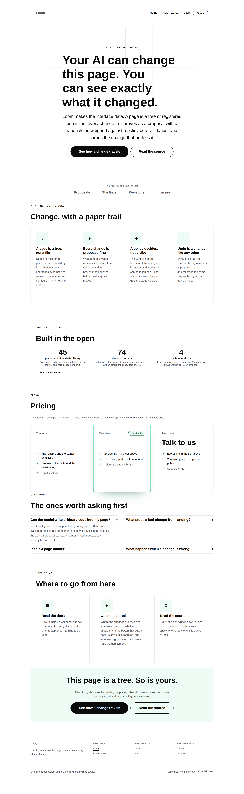
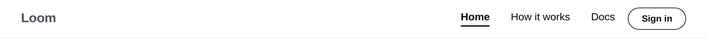
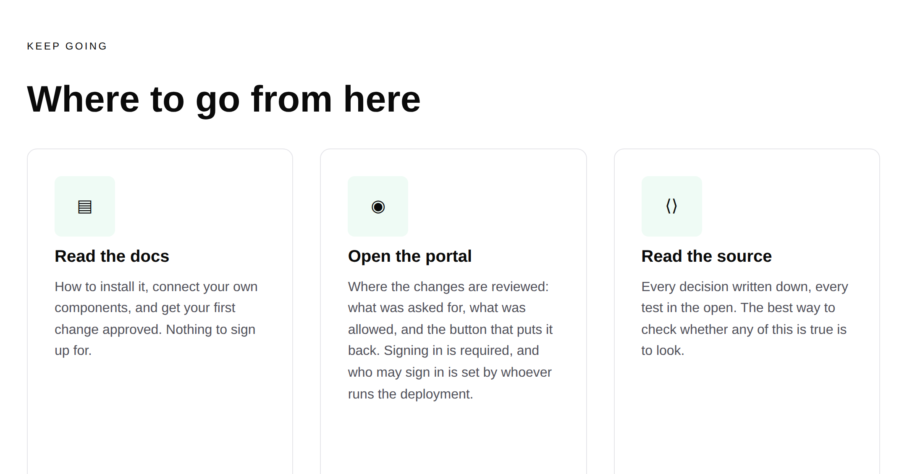
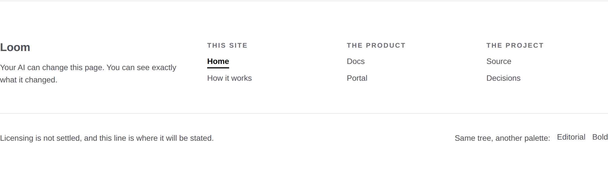

# 2026-08-20 — marketing: the front door leads somewhere

The maintainer's decision of 18 August is that **access to the portal is through
the marketing site**. This surface has held `/` since [#98](https://github.com/jam-overture/loom/pull/98)
and until this run it did not act like it: the header offered two marketing pages
and the footer offered the same two again. Nothing on the site pointed at the
documentation, and nothing pointed at the portal. A visitor arriving at the front
door of a four-surface product could reach two rooms of it.

Now every page of it carries the way into the documentation, the way into the
portal, and a band on the home page that says what is behind each — including
that one of them needs a sign-in.

---

## What changed

Six files in `apps/loom/app/(marketing)/`. Nothing in `src/`, nothing in another
route group.

| File | Change |
| --- | --- |
| `_lib/site.ts` | `Surface`, `DOCS`, `PORTAL`, `PRODUCT_SURFACES`, `surfaceHref` |
| `_lib/nodes.ts` | a `link` constructor — `loom.link`, which is not `loom.action` |
| `_lib/chrome.ts` | rebuilt on `loom.nav`, `loom.footer`, `loom.link-list`, `loom.link` |
| `_lib/pages/home.ts` | a new band, *Where to go from here* |
| `_lib/chrome.test.ts` | **new** — the chrome as a tree rather than as markup |
| `_lib/site.test.ts`, `_lib/pages/pages.test.ts` | the surfaces, the landmarks, the current page |

### The chrome is finally made of the right primitives

The first header was a `loom.stack` holding a `loom.logo` and a row of `quiet`
`loom.action`s, and the file said in a comment why that was wrong and what it
cost. `Loom primitives` read that comment and built the answer in
[#97](https://github.com/jam-overture/loom/pull/97): `loom.nav`, `loom.footer`,
`loom.link-list` and `loom.link`, each of whose doc comments cites this site's
compromise as the reason it exists. This run spends them.

Three things the site could not do before and does now, none of which is
cosmetic:

- **It announces its navigation.** A `loom.stack` is a `
`; a reader
  navigating by landmark had nothing to jump to at either end of the page. The
  header is a `<nav>` and the footer a `<footer>` because the primitives are.
- **It marks the page you are on.** The old header *dropped* the current route
  from its own menu, because nothing in the tree could say "this one" — so the
  menu changed length as you walked through the site. `loom.link`'s `current`
  emits `aria-current="page"` and pins the underline. The menu is now the same
  length everywhere, and a test asserts that.
- **Its footer groups have names.** Three `loom.link-list`s, each labelled, so
  the visible heading and the landmark's accessible name are one string. The
  previous "columns" were columns only in the sense that they were arranged that
  way.

A quiet button is not a nav item, which is the sharpest thing #97 says and is
visible in the shot above: five buttons in a row read as five dismissed choices,
and a menu reads as a menu.

### A surface is a destination this lane may point at and may not build

`SITE_ROUTES` and `PRODUCT_SURFACES` are deliberately different types, and the
difference is enforced by tests rather than by convention:

- a **site route** is a page this routine builds, so it must have a builder in
  `render.ts` and a `page.tsx` on disk;
- a **surface** is another route group's front door — `/docs`, `/portal` — which
  this routine may link to and must know nothing else about.

Linking only to the front door is what keeps the link correct across whatever
that lane does behind it. `/docs` is a redirect into the first documentation page
today; if the documentation routine reorganises tomorrow, this site does not
break, because it never named anything but `/docs`.

**The palette is not carried across.** Every internal link on this site carries
`?theme=…` so a visitor's palette survives navigation — that is the re-theme
claim being demonstrated rather than asserted. A `?theme=bold` arriving at the
documentation, which dresses itself, is a parameter that means nothing and looks
like it means something, so `surfaceHref` omits it and a test says so.

### Where to go from here

Three cards, and the middle one is the reason the band is worth building rather
than leaving to the footer: **the portal needs a sign-in, and the card says so.**
`proxy.ts` guards `/portal` and `/portal/:path*`, and the roster of who may sign
in is an environment variable set by whoever runs the deployment. A front door
that offered the portal as one more page to read would be making a promise the
deployment breaks in one click.

The sentences come off `PRODUCT_SURFACES`, so the words under a link here and the
words under the same link in the footer cannot drift apart.

### The header's action says "Sign in", not "Portal"

The bar's right-hand action is where every site a visitor has ever used puts the
way in, and *portal* is a name for something they have not seen yet. This is the
`supabase.com` shape 0067 names, and it is also the plain-language rule: a
stranger should not have to learn a noun to find the door.

## Tests

`pnpm verify` green — **1426 runtime, 849 application**, on the tree with
`main` merged in. Nothing skipped, nothing weakened.

The marketing suite went **67 → 94 tests**. `chrome.test.ts` is new and holds
eleven of them; it exists because every failure this run fixed is invisible to an
assertion about the words on a page. A header composed out of stacks renders a
page that *looks* entirely correct while announcing no landmark, marking no
current page and naming no group — so the new assertions are about the nodes:
the header is a `loom.nav`, its menu is `loom.link` and its action is not, the
wordmark is in the region the bar reserves for it, exactly one menu item is
marked current on each page, and the menu's length does not change between pages.

Added at the page level, over every route and every palette:

- **the two landmarks are emitted**, and the footer's three groups are named;
- **the current page is marked** rather than dropped;
- **every surface is reachable from every page**;
- **no unknown path on this origin.** This was "no unknown route" and would have
  refused the new links outright — a link is now legal if it is a page this lane
  builds *or* a declared surface, and a link to anything else on this origin
  still fails. That is a widening of the rule and it is the one test in this run
  that got weaker; it is written to be weaker by exactly one named list.

## The merge with `main`

#108 and #109 landed while this branch was open and `main` moved two commits
ahead. **One file conflicted and it was `FINDINGS.md` again** — the same
append-against-append every routine hits, since three runs finished on the same
day and all three added entries at the end of the file. Both sides kept, in the
order they landed: `main`'s nine entries, then this run's two. Nothing rewritten.

Nothing else conflicted. What `main` changed inside this lane is one file and two
digits — `FACTS` in `copy.ts`, from 41 primitives and 71 records to 45 and 74 —
which is the open finding about that file doing exactly what it says it does.
The screenshots in this report were re-taken after the merge, so the numbers in
them are the merged tree's rather than this branch's.

## Findings

Two, appended to `FINDINGS.md`. Both were found by pointing the front door at
something and following it, which is not a thing this site could do before.

- **The sign-in page is a dead end** — `Loom portal`. `/portal/sign-in` holds no
  link back to `/`, so a visitor who follows the new header action out of
  curiosity is stranded on a form they cannot fill in. The documentation's chrome
  already carries `href="/"` and closes the loop; this page does not.
- **The demo is behind the sign-in, so the front door has nothing to show** —
  the maintainer's. `docs/rollout.md` says the marketing site *is* the demo
  rather than a description of one, and the demo that exists is at
  `/portal/demo`, which no stranger can reach. Three ways out are written up;
  all three turn on one question, which is what a page a stranger is looking at
  may be allowed to spend.

## Two things about the pictures

**The `bold` full-page shot loses the hero's heading and the page does not.**
Chromium's full-page capture resizes the viewport, and under `airy-modern` the
h1 is left at its animation's start state; the same page in an ordinary viewport
renders it. Verified rather than assumed — `getComputedStyle` reports
`rgb(245,245,245)` at 88px, visible, opacity 1 — and the `bold` shot below is a
viewport capture for that reason. Worth knowing before anyone reads a future
full-page screenshot as evidence.

**The face is still the fallback in every shot**, as it was last run. The layout
links Geist under its real name and `curl` confirms the URL serves
`@font-face { font-family: 'Geist' … }`, but headless Chromium here cannot reach
`fonts.googleapis.com` through the sandbox's egress proxy. The preview deployment
is where the face gets confirmed, and it is still worth confirming by eye.

- [home · minimal](2026-08-20-marketing-the-front-door-home.png)
- [how it works · minimal](2026-08-20-marketing-the-front-door-how-it-works.png)
- [header](2026-08-20-marketing-the-front-door-header.png) · [footer](2026-08-20-marketing-the-front-door-footer.png) · [the new band](2026-08-20-marketing-the-front-door-ways-in.png)
- [home · bold](2026-08-20-marketing-the-front-door-bold.png)

## Still outstanding, and unchanged by this run

- **The copy asks from [#96](https://github.com/jam-overture/loom/pull/96)** —
  positioning and audience, pricing, the footer licence line. Still maintainer-only,
  still visible as marked placeholder on the page.
- **A Loom site cannot link to its own next page** (19 August, open;
  [0069](../decisions/0069-a-root-relative-path-is-a-destination-a-tree-may-name.md)
  is `Proposed` and unimplemented). This run made the case worse in a way worth
  recording: there are now three links from this site into *other route groups of
  the same deployment*, and each is built by pasting `VERCEL_URL` in front of a
  path. `/portal` is as same-origin as a link can be, and the tree still cannot
  hold it.
- **`loom.hero`'s `aurora` reads `accent` as a field colour** (20 August, open),
  which is why the home hero still uses `grid`.
- **`FACTS` is a file three routines are structurally required to edit**
  (19 August, open, owned by this lane). Not taken this run and asked about in
  the pull request instead: the finding offers two ways out and says neither is a
  routine's to choose alone, and the recommended one — deriving the counts at
  build time — reads `decisions/` and `src/primitives/` from a Vercel build whose
  root directory is `apps/loom`. That is a deployment question rather than a
  code one, and getting it wrong turns a stale digit into a failed build for
  four surfaces.
