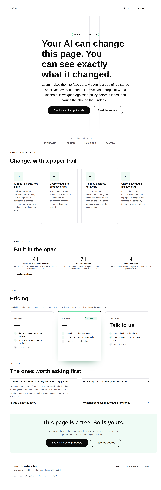

# 2026-08-20 — marketing: the site wears the house theme

The maintainer asked for the marketing site to be converted to the `minimal` theme registered in [#103](https://github.com/jam-overture/loom/pull/103). It is: `/` and `/how-it-works` now render **white paper, black ink and Hyperion's green** with no query string, and the two starter palettes stay reachable as what they always were — the demonstration, not the front door.



---

## What changed

Five files in `apps/loom/app/(marketing)/`. Nothing in `src/`, nothing in another route group.

| File | Change |
| --- | --- |
| `_lib/site.ts` | `minimal` registered as a site theme; `DEFAULT_THEME` is now `minimal`; the binary toggle became a list |
| `_lib/chrome.ts` | the footer switcher offers *every other* palette rather than "the other one" |
| `_lib/pages/home.ts` | reads `.selection`; hero backdrop `aurora` → `grid` |
| `_lib/pages/how-it-works.ts` | reads `.selection` |
| `_lib/site.test.ts`, `_lib/pages/pages.test.ts` | generalised from two palettes to every registered one |

### The theme, as the site holds it

`SITE_THEMES` was a map of name → three ids. It is now a map of name → `{ label, selection }`, because the footer needs a word for each palette and the previous version spelled those words in a ternary:

```ts
otherTheme(context.theme) === "bold" ? "Bold" : "Editorial"
```

That line is why a third palette could not simply be appended — it is exhaustive over exactly two, and adding a third would have made it silently mislabel one. The label now lives beside the selection it names.

### The toggle became a list

`otherTheme(theme)` returned *the* other one, which stops being a function at three. It is now `otherThemes(theme)`, returning every palette but the one being worn, and the footer maps over it. A cycling toggle was the alternative and was rejected: it would have put one palette behind two clicks for no reason.

The site's own test now holds that list to the palette list — `[...others, name]` must equal every registered name. That is the assertion the binary version could not have: a fourth palette registered and never offered would have been invisible.

## The one thing that did not survive the conversion

The home hero used `backdrop: "aurora"`, which paints two soft fields — one from `accent`, one from `brand-secondary`, each at 32% opacity. Under `minimal`, **`accent` is `#0a0a0a`**, so the first field rendered as a black cloud on white paper: a grey smudge across the top-left of the front door.

Both sides of that are defensible, which is why it is filed rather than patched. #103 set `accent` to black on purpose — the library reads that slot as *text* far more than as a fill, and the mint is 1.58:1 on white. `aurora` is the one place in the library that reads it as a large area of colour.

**The prop changed to `grid`.** It is a clear win under `minimal` and a clear loss under `bold`, whose glow was its best feature:

| | `aurora` | `grid` |
| --- | --- | --- |
| `minimal` | black smudge on white | faint rules on white — what the theme asks for |
| `bold` | the page's best moment | flat, still legible |

That trade was taken because `minimal` is the palette a visitor arrives on and the other two sit behind a query string. It is reversible in one word, and it should be reversed once `aurora` stops reading `accent` — the suggested fix (paint it from `brand-secondary` and `accent-subtle`, both area colours in all three palettes) is in `FINDINGS.md`.

**It could not be split per palette.** The site asserts that changing the palette changes the root's variables and *nothing below them* (0049). A backdrop chosen per theme would put the palette's identity into the markup and break the claim the page exists to make.

## Tests

`pnpm verify` green — **1407 runtime, 773 application**. Nothing skipped, nothing weakened.

The marketing suite went **52 → 67 tests** on three files. The growth is not padding — most of it is the existing per-palette `describe` block now running against three palettes instead of two, which is the point:

- **Palette invariance is now every pair, not one pair.** It compared `editorial` against `bold`. With three palettes that is a check which could pass while one palette differed below the root from the other two. It now runs over all three pairs.
- **The normalisation derives from the site's list.** `withoutPaletteNames` matched `/theme=(editorial|bold)/` by hand. A palette missing from that alternation would not have failed the test — its name would have survived normalisation and been reported as a difference below the root. It now folds over `SITE_THEME_NAMES`.
- **New: every other palette is reachable from every page.** The footer's offers are asserted by href and by label, from each palette in turn.
- **New: the default is the house theme**, and its triple is `minimal` / `minimal-sans` / `precise`.

One test still names `bold` explicitly — *"keeps the visitor's palette when they navigate"*. That is deliberate: asserted against the default it would pass whether or not the palette travelled.

## Visual

All four taken against one `next start`, full page.

- [home · minimal](2026-08-20-marketing-the-minimal-theme-home.png) — the front door
- [how it works · minimal](2026-08-20-marketing-the-minimal-theme-how-it-works.png)
- [home · editorial](2026-08-20-marketing-the-minimal-theme-home-editorial.png) — unchanged but for the hero backdrop
- [home · bold](2026-08-20-marketing-the-minimal-theme-home-bold.png) — footer now offers Minimal and Editorial

What the theme does to the page, which is more than a recolour: `bg-surface` equals the canvas white, so every card, the nav, the footer and the pricing tiers are defined by their border instead of by a change of background. The green appears only as the pill's ring, the icon tiles, the check marks, the featured tier's ring and the closing band's tint. The type is Geist, one family separated by weight.

## Findings

One, appended to `FINDINGS.md`: **`loom.hero`'s `aurora` reads `accent` as a field colour**, with the suggested resolution and the reason the marketing lane could not fix it properly.

## Still outstanding, and unchanged by this run

The copy asks from [#96](https://github.com/jam-overture/loom/pull/96) are still open and still maintainer-only — positioning and audience, pricing, the footer licence line. They are visible as placeholder on the page, and the pricing band is where it shows most: `Tier one` and `Tier two` render their price as `—` while `Tier three` renders `Talk to us` at display size, so the row reads unevenly. That is the placeholder doing its job, not a layout defect, and it resolves the moment the numbers exist.
