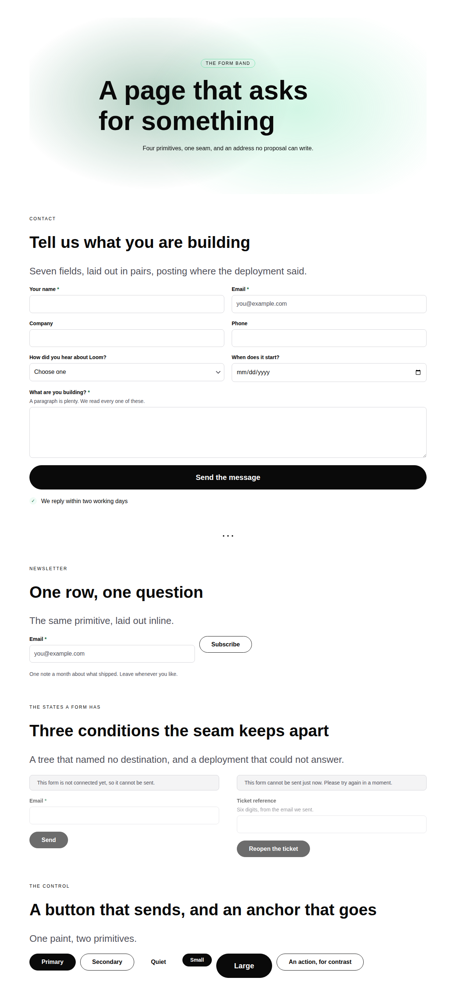
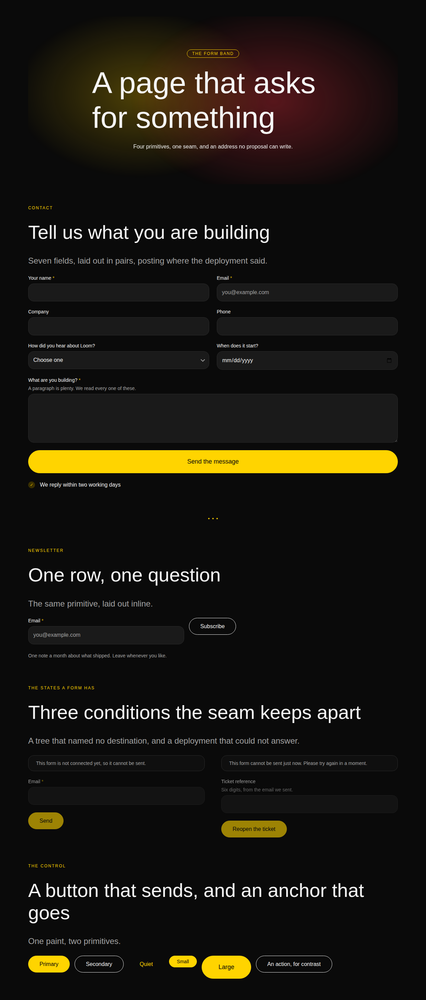
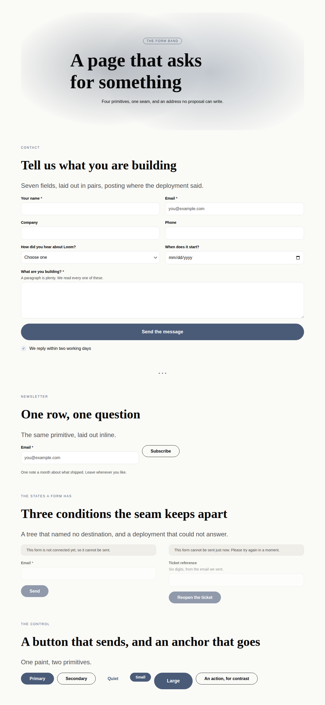
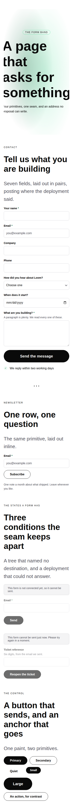

# 20 August 2026 — the form band, and the scrollbar nobody could see

**Routine:** `Loom primitives` · **Section:** §4b · **Branch:** `primitives-08-the-form`

Four primitives — `loom.form`, `loom.field`, `loom.option`, `loom.button` —
taking the library from **41 to 45**, plus both findings this lane owned, plus a
defect found by looking at a screenshot that every test in the repository was
blind to.

## Which primitives, and why those

The port map's largest outstanding group is *things booked* — seven Hermes
blocks behind a `loom.offering-list` pair — and this run did not build it.

**The form is the one with a live seam and no caller.**
[0065](../decisions/0065-a-submission-names-a-destination-and-never-carries-one.md)
landed on 18 August, built the whole submission path — plan, resolve, three
distinguishable states, a registry that is the entire allowlist — and closed
with a sentence naming what was missing:

> **No primitive in the starter library posts anywhere yet.** The seam exists
> and `src/primitives/` is another routine's lane. Filed for it.

A seam with no user is a seam nobody has proved. Two days of it is fine; longer
is how a framework acquires a feature that has never been rendered. And the
thing it unblocks is not marginal: **every marketing page ends in a form.** The
site this library is meant to stand up has a contact page and a newsletter
signup, and until today it had no way to say either — not because the address
was hard, but because there was no `<input>` in forty-one primitives.

Three of the four also close real vocabulary gaps that have nothing to do with
the seam. There was no text input, no select, and **no button** — only
`loom.action`, which is an anchor. A library that can build a pricing table and
cannot build "type your email here" is not a library a demo can lean on.

## Which Hermes fields became nodes, and which stayed props

Hermes' `contactform` carried five fields, and four of them are the port map's
*first* verdict rather than a decomposition:

| Hermes field | Becomes | Why |
| --- | --- | --- |
| `fields: ContactFormField[]` | **child nodes**, one `loom.field` each | 0052's first half, and the cleanest instance of it in the seventy. Twelve field shapes in one array: adding a phone number was a `configure` carrying all twelve, no individual field had an author, and reordering two was indistinguishable from rewriting both |
| `title`, `desc` | **nothing — composition** | a `loom.heading` and a `loom.prose` in the `loom.section` above the form. A form that owned them would make "move the explanation below the fields" a prop nobody predicted |
| `btnText` | **child text of a `loom.button`** | 0059 read literally. It was a *string on a block* in Hermes, which is why there was nothing to port and a control had to be invented |
| `newsletter.placeholder` | **prop** on the field | one string, fixed, content |
| `newsletter.privacyNote` | **the `note` region** | the form places the fine print beneath the control however many fields there are, which is 0051's test exactly |
| `ContactFormField.type` | **prop** | the near-miss, below |
| `ContactFormField.label`, `required`, `id` | **props** | one of each, fixed, and `id` becomes `name` because an endpoint reads it |
| a dropdown's choices | **child nodes** — `loom.option` | Hermes had nowhere to put them at all. See below |

**`type` is the near-miss worth stating.** It looks like the sort of prop the
granularity doc tells you to decompose — eight values, each rendering something
different — and it passes, because the question is *does changing this prop
change the set of nodes?* A field's label, name and requirement are identical
whichever type it is; nothing is inserted or removed when `text` becomes
`email`. That is "changes how, not how many". A `fields` array is structure in a
prop bag; an input type is not.

**Hermes' `dropdown` had no options, and had not for a year.** The
`ContactFormField` shape declares `label`, `type` and `required` and stops, so
`type: "dropdown"` rendered an empty select. That is the clearest case yet of the
brief's instruction to *take the content model and write better markup where
Hermes' is not good enough*: choices are the plainest repeated content in the
library, and they are `loom.option` children — insert one, move two, and the
delta says exactly which choice changed.

`loom.option`'s `value` is **optional**, which is HTML rather than a shortcut:
an `<option>` with no value submits its own text, so a choice whose label is the
value does not carry two copies of one string to drift apart.

## The three states, and the one mechanism that could express them

0065 gives a form three conditions and refuses to let any two collapse: **absent**
(the tree never said where to post), **unavailable** (the deployment could not
answer), **ready**. What it left open was what those look like on a page, and the
answer turned into [0073](../decisions/0073-a-form-with-nowhere-to-post-renders-disabled-and-says-so.md)
once one structural fact fell out of the seam's own shape:

> `loom.submit` reaches the node that **declared** the submission and not its
> children — so a `loom.button` cannot possibly know that the form around it has
> no address.

Which rules out the obvious design. A `disabled` prop on the button is a rule no
schema states, that some other node has to set correctly, and that every edit to
the tree can silently break.

**`<fieldset disabled>` is what the library uses instead.** It disables every
control inside it without any of them knowing why, which is exactly the property
needed. Three consequences, each a line of the implementation:

- The **hidden fields stay outside** it. A disabled control is not a successful
  one, so a CSRF token inside a fieldset that is ever disabled is a form that
  posts without its token on the day the endpoint has a bad afternoon. There is
  a test that pins the ordering.
- The **notice stays outside** it too, and undimmed — the one thing worth
  reading is the one thing not greyed out.
- The strings are **declared** (0063), three of them, because the seam
  distinguishes three conditions and a visitor acts on them differently: a page
  that is not finished, something worth retrying, and something not. None of
  them says "endpoint" or names a reason — `unavailable.detail` says the token
  store timed out, and that goes to the render diagnostics where the person who
  can fix it is looking, not onto a page in front of someone who wanted to send
  a message.

`loom.button` carries **no destination of its own**, and that is the whole of its
safety: `formAction` is the one attribute that would let a control override where
its form posts, and a primitive accepting it would have reopened precisely the
channel 0065 closed. Asserted as a test rather than left as an intention.

## The defect a screenshot found and 1,373 tests could not

Rendering the specimen at a phone width to check the form, the page came out
**486px wide on a 390px screen**.

**An inline style carries no reset.** This library styles everything inline on
purpose — nothing to attach, nothing to load, a render that is a pure function
of the tree — and so `box-sizing` is `content-box` in every one of them. A band
that says `width: 100%` and then pads itself is wider than its parent by exactly
its padding. Five primitives did: `loom.page`'s inner column, `loom.hero` with
any backdrop, `loom.nav` and `loom.footer` with any tone but plain, and
`loom.section` with a tone. **The marketing site, the demo and every documented
example have been scrolling sideways on a phone since the day each of them
landed.**

Nothing in the suite could have caught it, and that is the part worth keeping.
The palette tests assert colour comes from slots. The markup tests assert
elements are present and ordered. A pure render has no viewport and no layout
engine, so every assertion in this library was true of a page that scrolled
sideways.

What closes it is one line per primitive and, more usefully, **an invariant
instead of six cases**: a test that walks every inline style in all eight
fixtures and fails on any combining `padding-inline` with `width: 100%` and no
`box-sizing: border-box`. It caught a sixth instance the moment it was written —
`loom.button` with `width: "full"`, added an hour earlier in this same run.

## Both findings this lane owned, closed

**`loom.hero`'s aurora read `accent` as a field colour** (filed by the marketing
routine). The diagnosis was exactly right — a slot cannot be both near-black ink
and a tinted field, `minimal` sets `accent` to `#0a0a0a` deliberately, and the
one place in the library that reads a slot as a *large area* is the thing that
has to move.

**The suggested slot would have replaced a visible smudge with an invisible
field.** `accent-subtle` is a tile background in every palette — `#e6ebf2`,
`#effbf5` — and at 32% opacity on a light canvas it is nothing at all. The
aurora now paints `accent-strong`, which is the slot that has to hold up as a
glyph *against* `accent-subtle`, so every palette gives it real chroma by
construction. Bold keeps the gold-and-red glow the finding was right to mourn
(look at the second screenshot), editorial gains a second shade where it
previously painted one colour twice, and minimal gets Hyperion's green over its
mint. **The marketing site can put `backdrop: "aurora"` back** whenever that lane
next runs.

**`loom.page` did not paint its canvas** (filed by the documentation routine).
[0072](../decisions/0072-a-page-paints-its-ink-and-its-canvas-together.md) says
the default was the smaller half of that finding: the component set the palette's
ink *unconditionally* and its canvas only when asked, so `fills: false` meant
"paint the ink of one theme onto the background of another" — broken in every
configuration, not only the white-on-white one the docs site hit. `fills` now
governs both and is on by default; `fills: false` paints neither and inherits the
host's. The default moved on the finding's evidence plus one more: **every tree
in this repository already passes `fills: true`**, so the old default was serving
nobody.

## Real test numbers

`pnpm install && pnpm verify` — **green**, nothing weakened, nothing skipped.

| Package | Files | Tests |
| --- | --- | --- |
| `@loom/runtime` | 97 | 1419 |
| `@loom/app` | 76 | 827 |

`src/primitives/library.test.ts` went from 84 tests to **98**: an eighth fixture
(a contact page, rendered both synchronously for the untargeted state and
through `resolveTreeSubmissions` for the rest, because the two-step wiring is as
much the assertion as the markup), eleven assertions on the band itself, the
box-sizing invariant across all eight fixtures, the `interactive` declaration for
`loom.button`, and the census at 45.

Both palettes are asserted the way every band before them is — identical markup
once the root's variables are stripped, no hex or `rgb()` below the root — and
this run adds the same assertion for the *untargeted* state, which is a
different page rather than a different theme.

## What is edited outside this lane, and why

`apps/loom/app/(marketing)/_lib/copy.ts` — **two numbers**, `primitives: "41" →
"45"` and `decisions: "71" → "73"`. `facts.test.ts` holds them against the
registry and the `decisions/` directory and fails when either grows; `pnpm
verify` is the merge gate for all four surfaces, so leaving it red would block
everyone over four digits. Every primitives run trips this; the standing
suggestion to derive the counts at build time is still worth taking.

## What the library still cannot express

- **A form that tells you what you got wrong.** Validation is `required`,
  `type="email"` and whatever the browser does with them. Anything server-side —
  "that address is already subscribed" — arrives after a navigation, and nothing
  in the tree describes the page a visitor lands on. That is a host route, not a
  primitive, and it is worth being explicit that the seam stops at the post.
- **A checkbox or a radio group.** Deliberately not built: a checkbox is a
  different content model (the label is the question *and* the answer), and a
  radio group is `loom.option`'s content in a shape that needs a fieldset and a
  legend per group. Both are a real pair and neither is one this run should have
  slipped in beside four other primitives.
- **A file upload.** Same seam question one step harder — where the bytes go is
  not where the fields go.
- **A level-1 heading that fits on a phone.** Found in the same screenshot as
  the overflow; filed. The type ramp is eight fixed pixel sizes, so a 72px
  headline is 72px on a 390px screen. The fix is a clamp, and where it belongs
  is a bigger call than this run.
- **`tabs`, `feed`** — still behind a state seam and a binding design
  respectively, per the port map.
- **21st.dev, for the fourth run running.** `EGRESS_BLOCKED`, identical message,
  allowlist entry still not landed. Built against `loom.hero` and
  `loom.feature-grid` as the floor, plus the Hermes content models on disk.

## What is next

The port map's remaining seven pairs are six cards-in-a-grid and one comparison
table, and 0066 has already decided what each of them aims at. *Things booked* —
`loom.offering-list` / `loom.offering`, seven Hermes blocks — is the largest and
is the obvious next unit. The comparison table is the one a demo would notice.

No follow-up scheduled and no self-check-in armed.
