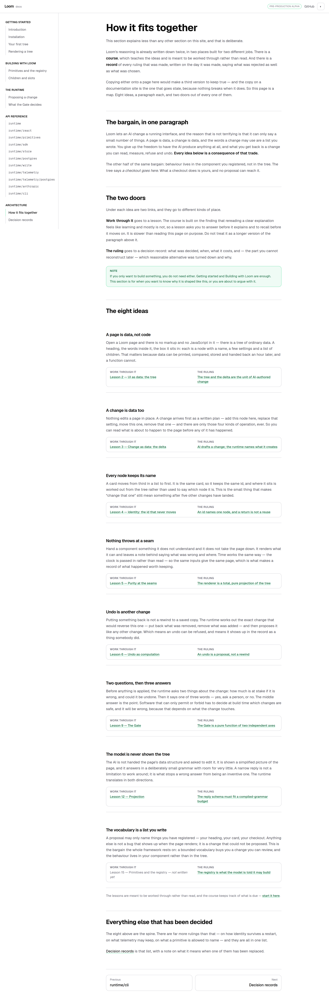
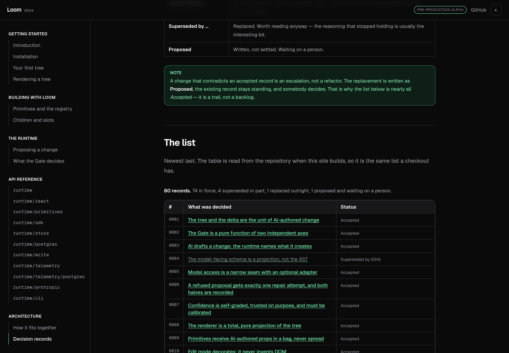
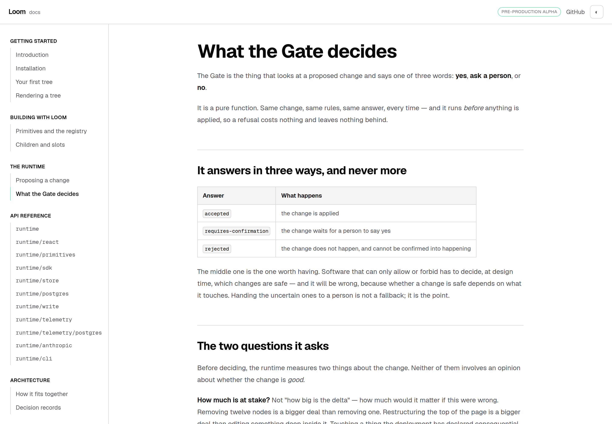
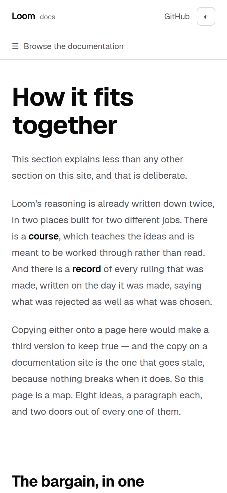

# 21 August 2026 — Architecture, and the tables that were never tables

**Routine:** `Loom docs` · **Branch:** `docs-06-architecture-points-outward` · **Section:** §4c

The fifth and last section of the documentation site exists. It is two pages
long, it explains almost nothing, and that is what the maintainer asked for.

Along the way I found that **every markdown table on the site had been shipping
as a paragraph of pipe characters**, on seven pages, since each was written. That
is fixed too, and the fix is held by a test.

## The maintainer's finding, and what I built for it

> *"Architecture should be a thin index that points outward — a short
> orientation and then links into the lessons for the reasoning and into the
> decision records for the ruling. Two copies of an argument is two copies to
> keep true, and the copy inside a docs site is the one that goes stale, because
> nothing fails when it does."*

**`/docs/architecture/how-it-fits-together`** is the orientation. Eight ideas —
the tree, the delta, identity, purity, undo, the Gate, projection, the registry
— one plain paragraph each, in the order they depend on each other. Under every
paragraph are two doors: **Work through it**, which goes to the lesson, and
**The ruling**, which goes to the decision record.

The page says the bargain in its own section before any of them: *a bounded
vocabulary buys you a change you can review, and the behaviour lives in your
component rather than in the tree.* Everything below it is a consequence.

**`/docs/architecture/decision-records`** is the index of all eighty rulings,
with the two paragraphs a stranger needs first — what a record is, and what it
means that the trail is never edited.

### None of it is typed

The link targets are **read out of the repository as the site builds**. The
eight ideas name a lesson and a record by number; both are resolved against
`lessons/README.md` and `decisions/README.md`, and an unknown number throws at
module load rather than rendering a plausible dead link. The records table is
the repository's own generated index, parsed. The counts above it — *74 in
force, 4 superseded in part, 1 replaced outright, 1 proposed* — are counted,
because a written total is wrong the first time somebody supersedes something.

The only prose in the section is orientation: the eight paragraphs and the two
page introductions. That is the whole of what a future edit to `lessons/` could
make stale, and it is deliberately the layer that ages slowest.

### The number is never in front of the reader

The maintainer's earlier ruling — *"the casual reader would not know what those
are"* — is why a door labelled **The ruling** says *"The Gate is a pure function
of two independent axes"* and not *"0002"*. A test asserts no four-digit number
appears in any idea's title, paragraph or link text.

The one page that shows numbers is the records index, where they are the
subject and the page has said what they are two paragraphs earlier. I think
that is the right line; it is the one thing in this pull request I would like
checked.

## The tables were never tables

I screenshotted the records page, and the markdown table I had just written had
rendered as `| State | What it means | | --- | --- | | **Accepted** | …`. Then I
checked the rest of the site.

**MDX is CommonMark, and CommonMark has no tables.** GFM was never enabled. A
pipe table does not fail to compile — it compiles into a paragraph of pipes, so
the page builds, deploys, and ships looking like somebody pasted a spreadsheet
into it. Seven pages had one each, including *What the Gate decides*, whose
three-answer table is the clearest thing on it.

Nothing on the site could have caught this. `content.test.ts` checks that pages
exist and are linked; the api-reference tests check generated data. Nobody
checks what markdown turns into.

### The fix, and why it is a string

`remark-gfm`, declared in `app/(docs)/_lib/mdx.ts` and handed to the loader by
`next.config.ts`. It is named as a **string** rather than imported, which looks
like the weaker choice and is the required one: the loader's options cross into
the bundler and are checked for serializability, so a plugin function there
fails the build outright. I found that by doing it the obvious way first.

`mdx.test.ts` closes the loop that a string opens. It resolves each name to the
module it points at — so a misspelling or a dependency tidy-up is a failing test
— and then **compiles every `page.mdx` on the site through that resolved list
and asserts a table comes out of each one that contains a table**. Set the
plugin list to empty and four of its five tests fail; I checked.

## Two choices I made without being told to

**Architecture goes last, after the API reference.** A reader who wants to know
*why* has usually already tried to build something. It also means the pager
walks a stranger from "Introduction" to "How it fits together" without ever
crossing a dead end.

**I edited two files outside the docs route group**, and both are filed in
`FINDINGS.md` rather than left in the diff. `mdx-components.tsx` and the MDX
half of `next.config.ts` are the documentation site's own settings that the
framework requires to live at the application root — `next.config.ts` says so
itself, and nothing outside `(docs)` writes a `page.mdx`. I moved the part that
is a decision into my directory and left the wiring where Next needs it.

## Tests

`pnpm install && pnpm verify` at the repository root, **green**:

| Suite | Files | Tests |
| --- | --- | --- |
| `@loom/runtime` | 101 | 1489 |
| `@loom/app` | 85 | 957 |

**36 new tests in 3 new files.** Nothing failed, nothing skipped, no test
weakened.

What they hold, in the order they matter:

- **Every file this section points at exists.** All 80 records and all 12
  written lessons, checked against the filesystem.
- **Every table on the site compiles to a table**, through the same plugin list
  the build uses.
- **An unwritten lesson says so.** Lesson 15 is planned and not written; the
  registry idea renders *"not written yet"* in place of a link, and a test
  asserts it never becomes one.
- **No decision number reaches a reader** through an idea's prose, title or link
  text.
- Both README tables are parsed with no gaps and no repeats — 1 to 80, 1 to 17 —
  so a shape change to either file fails here rather than emptying a page.

One caveat worth stating plainly: after enabling GFM, the first build I checked
still showed pipes. That was `.next` cache, not the fix. **Everything reported
above is from a clean `rm -rf .next && next build`.**

## No decision record

Neither half of this is one. The shape of the Architecture section is the
maintainer's finding and the docs brief's own rule — *`decisions/` and
`lessons/` are the source for Architecture, not copied into it* — made literal,
and a record restating a rule already written twice would be the exact mistake
the section exists to avoid. Enabling GFM is implementation detail inside an
already-agreed design: prose on this site is MDX, and MDX was always meant to
include tables. `decisions/README.md` says not to write a record for either.

## Findings

**Closed:** the maintainer's *"the Architecture section should link into the
lessons, not restate them"*.

**Filed:** the two files outside my lane that changed, for their owner's
awareness. **Filed:** that the site has no check on what a page's markdown
becomes beyond tables — GFM was one silent-failure class and there will be
others.

## Open questions

Two, both in the pull-request comment with a recommendation. Whether the records
index may show record numbers, and whether the eight ideas are the right eight.
