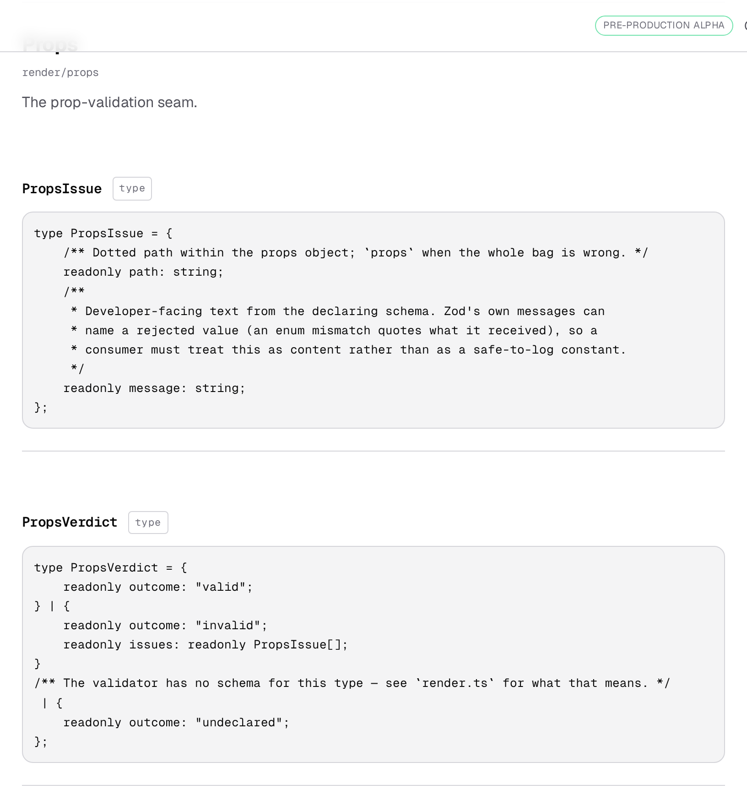
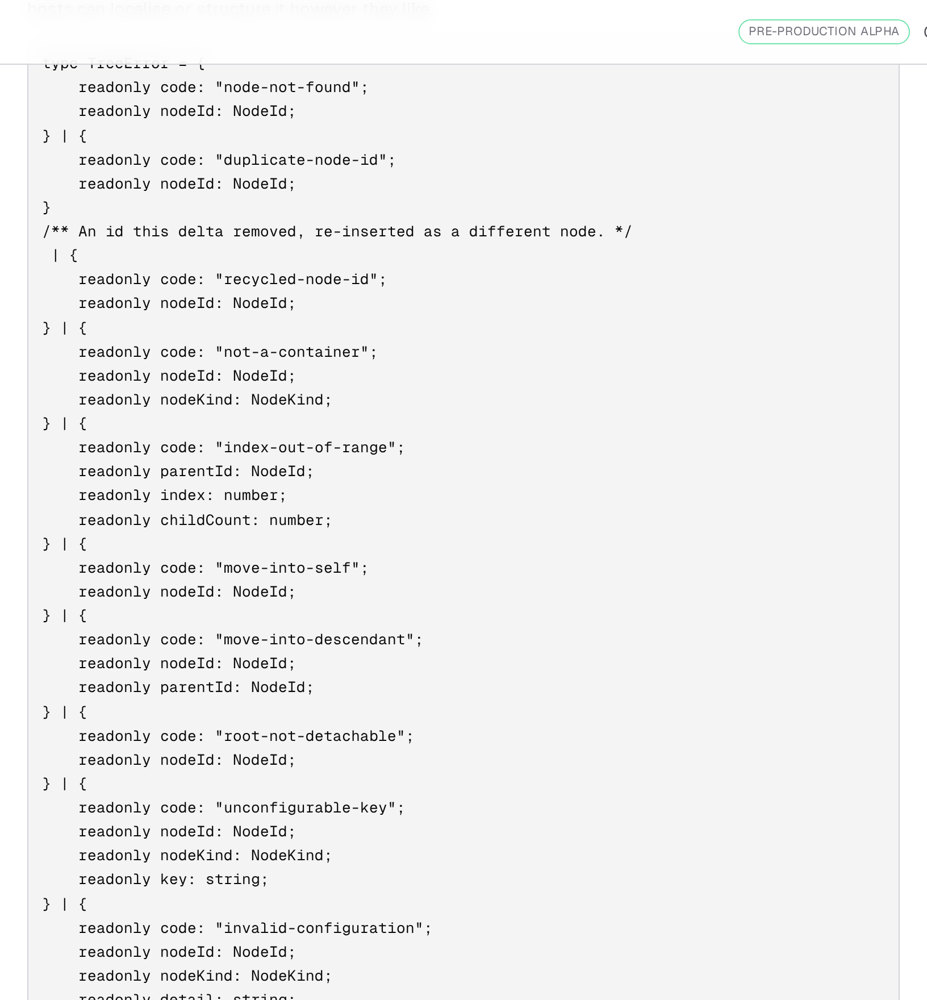

# 21 August 2026 — no decision numbers in front of a reader

**Routine:** `Loom docs` · **Branch:** `docs-05-no-decision-numbers` · **Section:** §4c

The maintainer, on the API reference that landed yesterday:

> *"I don't think docs should reference internal decisions (like "(0007)"). The
> casual reader would not know what those are."*

Correct, and it was worse than it looked. This run makes it impossible rather
than merely fixing today's instances.

## Where they were coming from

The reference is generated: its sentences are lifted from doc comments in
`src/`, where citing a record is normal and right — a comment is written for
somebody reading the repository, who can open `decisions/0007` in the next
tab. A reader of the site can do neither, so the same four digits arrive as a
defect in the sentence.

**Two channels, and I only saw one at first.**

1. **Prose.** 24 module paragraphs and export summaries carried a number.
2. **Signatures.** A union or object type carries doc comments against its own
   members, and those render inside the code block. **21 signatures** carried a
   number this way. I fixed channel 1, regenerated, and only caught channel 2
   by grepping the actual prerendered HTML — the JSON said zero leaks while
   eight pages still showed numbers. Checking the build output rather than my
   own model of it is the reason this is not still shipping.

## The rule, in two grades

**A citation is a footnote, so it is lifted out.** `(0014)`, `(0053, 0055)`,
`(see 0012)`, and the trailing `, inherited from 0009` all come out cleanly —
*"The prop-validation seam, inherited from 0009."* becomes *"The
prop-validation seam."* and says exactly what it said before. **14 texts** were
fixed this way at no cost.

**A sentence whose grammar needs the number is withheld.** There is nothing to
lift out of *"0049's three theme ids"* or *"the bar 0074 set"*. The tempting
move is to substitute a phrase — "a design decision's three theme ids" — and
that is the one thing this section must not do: **the only reason a generated
reference can be trusted is that the words are the package's own.** A page that
paraphrases is a page that can be wrong, and nothing would ever catch it. So
the summary is withheld, the export renders with its module's paragraph and its
signature, and the ten comments this affects are listed in `FINDINGS.md` for
the lanes that own them. Reword one and the sentence comes back at the next
regeneration with nothing to change here.

Inside a signature the same rule applies to the comments and **never to the
code**: a citation is lifted, a comment that cannot lose its number is dropped
whole, and the member it described stays exactly as declared.

## Two things I got wrong on the way, both caught before the commit

**A punctuation tidy that rewrote 63 summaries.** Removing " (0014)" leaves
" ." to clean up, so I collapsed whitespace before closing punctuation — and
included the em dash in the set. This codebase writes a spaced `" — "` on
purpose, everywhere, so that rule quietly tightened it to `"—"` in **63
summaries that had no citation in them at all**. The rule now covers `.,;:` and
leaves the dash alone, and a test asserts a spaced em dash survives both with
and without a citation beside it.

**Sentence-dropping, considered and rejected.** My first instinct for the
grammatical cases was to drop the offending sentence and keep the rest of the
paragraph. Measured, it emptied eight summaries anyway and left two others
dangling mid-thought — `telemetry/calibration` would have opened *"This is the
measurement half of that promise"* with the promise deleted. Withholding the
whole summary is less clever and much more honest.

## What holds it

A test that fails if a decision number reaches any page — walking every module
paragraph, every export summary **and every signature** in the generated
reference. There are none today; what keeps it that way is the check rather
than anyone remembering, because the text is lifted from `src/` and a comment
written next week can carry one in.

Beside it, seven unit tests pinning the behaviour: a parenthetical is lifted, a
list of two is lifted, `(see 0012)` is lifted, a trailing attribution clause is
lifted, a grammatical use is withheld, a spaced em dash survives, and a number
that is not a record — `0.05`, `1024` — is left alone.

## The rest of the build

I checked the whole prerendered site rather than only my own pages, which is
how the second channel turned up. After the fix, **every page under `/docs` is
clean**, and one page outside my lane is not: `/lessons/review/set-k` renders
*"the contract in 0033"*, from a lesson that cites records in running prose.
Filed for `Loom lessons`; not touched.

## Tests

`pnpm install && pnpm verify` at the repository root, **green**:

| Suite | Files | Tests |
| --- | --- | --- |
| `@loom/runtime` | 100 | 1473 |
| `@loom/app` | 81 | 898 |

Ten new tests, nothing failed, nothing skipped, no test weakened. The
regenerated `reference.generated.json` is committed with the change, so the
drift test stays green and the diff shows exactly which sentences moved.

## Findings

**Filed:** the nine withheld comments in `src/` for `Loom daily build`, with the
table of what each one says today and the convention that follows — cite in
parentheses and the site handles it; make the number the subject and the
sentence becomes invisible. **Filed:** the tenth, `loomQuoteGrid`, for
`Loom primitives`. **Filed:** `/lessons/review/set-k` for `Loom lessons`.

## Open questions

Whether the withheld sentences are worth ten small rewrites in `src/`, or
whether the module paragraphs above them are enough. My recommendation is in
the pull request comment: worth doing, not urgent, and cheapest done by
whoever is already editing that file for another reason.
