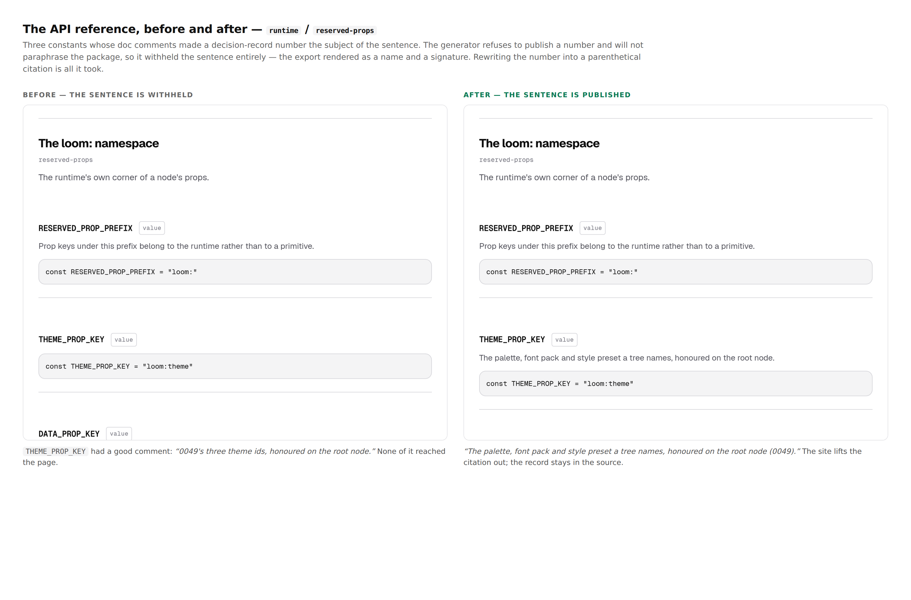
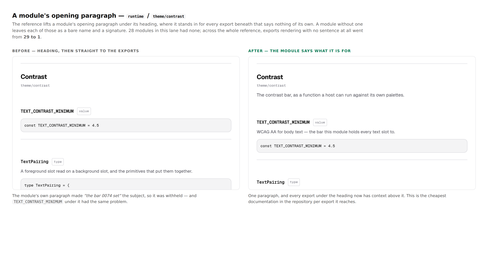

# The package's own words

**Date:** 2026-08-21 · **Routine:** `Loom daily build` · **Section:** §4c ·
**Branch:** `framework-01-the-package-own-words`

*Before and after on the same page of the real API reference, built twice.
[View full size](https://github.com/jam-overture/loom/blob/main/reports/2026-08-21-framework-the-package-own-words.png)
— the repository is private, so an embedded image does not render for anyone
(16 August finding).*

## What was done, in plain language

The documentation site generates its API reference from the doc comments in
`src/`. Nobody paraphrases the runtime, which is what makes the reference worth
trusting. It also means **a comment in `src/` is published**, and two habits that
are harmless in a source file turned out not to be harmless on a page. The
documentation routine measured both and filed them; this run closed them, and
added the check that stops them coming back.

**Sentences were disappearing, silently.** The maintainer's rule on the reference
is that a decision-record number must never reach a reader — *"the casual reader
would not know what those are"*. The docs lane implemented it: a citation like
`(0014)` is lifted out, and where the number is part of the grammar there is
nothing to lift, so the sentence is **withheld entirely** rather than
paraphrased. That is the right behaviour for a generator and an invisible one for
an author. *"0049's three theme ids, honoured on the root node."* is a perfectly
good comment and it appeared on the site as nothing at all, with nothing failing
anywhere. Nine such summaries in this lane, plus four signatures quietly losing
their member annotations to the same rule.

**23 comments rewritten**, every one by moving the number into parentheses.
Nothing was cut: the record stays in the source for whoever is reading the code,
and the sentence now reaches the page with the citation lifted out.

**Modules with no opening paragraph were costing far more than themselves.** The
reference lifts a module's opening paragraph under its heading, where it stands
in for every export beneath that says nothing of its own. A module without one
leaves each of those as a bare name and a signature.

*[View full size](https://github.com/jam-overture/loom/blob/main/reports/2026-08-21-framework-the-package-own-words-modules.png)*

**28 modules gained a paragraph** — 13 entry-point barrels that had no comment at
all, and 15 whose first comment was attached to a declaration instead of being
detached from it by an empty line.

That empty line is the whole of the distinction and it is invisible. Declaration
emit drops it, so in `dist/` a module's opening paragraph is indistinguishable
from documentation for whatever export happens to be first — which is how
`TREE_SCHEMA_VERSION` came to be described as "the persisted document". The
generator therefore reads the blurb from `src/`, and nothing enforced the
convention it depends on. 158 of 188 files were following it on faith.

**Now both rules are checked.** `src/documentation.test.ts` fails on a record
number that is not a parenthetical citation, and on a module whose first comment
is attached to its first declaration. An author never has to know how the
generator works: cite in parentheses, open the file with a paragraph, and
`pnpm verify` catches the rest before the pull request.

## The measurement

Both numbers are read off the regenerated reference, before and after.

| | before | after |
| --- | --- | --- |
| module groups carrying a paragraph | 147 / 165 | **164 / 165** |
| exports rendering as a bare name and a signature | 29 | **1** |
| exported symbols carrying a summary | 254 | 261 |
| signatures with member annotations dropped | 4 | **0** |

The one remaining module is `primitives/loom.prose`, which is another lane's and
is filed for its owner.

Those figures are measured across this change alone, on the tree as it was before
`main` came in. After merging #121 — which added five module groups, all of them
with a paragraph — the same measurement reads **169 / 170** and still exactly
**one** bare export, the same `loom.prose`.

All nine of the rows the docs routine tabulated for this lane are back on the
site: the three `reserved-props` keys, `planTreeSubmissions`, `resolveTheme`,
`TEXT_CONTRAST_MINIMUM`, and the module paragraphs for `theme/contrast`,
`sdk/audit` and `telemetry/calibration`. The four restored signatures are
`RenderDiagnostic`, `StoredRevision`, `PolicyCalibration` and
`TelemetryReadRequest`.

## Decisions I made that were not specified

**The check is narrower than the generator, deliberately.** `readerFacing` also
strips a trailing attribution clause — `, inherited from 0009`. The check permits
only the parenthetical. Narrower is the safe direction: everything it permits,
the generator lifts, so a comment that passes here cannot vanish from the site.
Were it wider, the failure mode would be silent again. Two comments were written
in the trailing form and both were rewritten, so the repository now has one shape
rather than two.

**The rule is applied to the whole lane rather than to the published surface
only.** The check is regexes over source text — no TypeScript program, which is
why it costs about 20ms — so it cannot tell an exported declaration from an
internal one, and it holds internal comments to a rule they do not strictly need.
Accepted: a rule with an exception nobody can see from the file they are editing
is worse than a rule applied slightly too widely.

**I did the 13 entry-point barrels, which no finding asked for.** They do not
reach the reference — a barrel re-exports symbols whose declarations live
elsewhere — so this is the one part of the run with no measurable effect on the
site. The reason is that it makes the rule exception-free, and the alternative
was a check that depends on the export map, so that moving an entry point would
silently change what is required of a file. It cost 13 short paragraphs, and they
are the files a developer opens first to see what `@loom/runtime/store` *is*.

**Two directories are excluded and both are named in the test with a reason.**
`src/primitives/` is another routine's lane. `src/cli/scaffold-fixture/` is not
source: it is the byte-for-byte committed output of `loom init`, and I found this
out by adding a blurb and watching `scaffold-fixture.test.ts` go red — which is
that test doing its job. A paragraph there either breaks that assertion or
becomes a sentence about Loom's own fixtures that every scaffolded project
carries.

**I did not write 104 missing function summaries.** The second half of the
20 August finding stays open. Its own reading is right that many of those
functions do not need one, and a run that wrote 104 sentences to clear a count
would be padding the reference rather than improving it. Picking the ones worth a
line is a judgement per function, and every one of them now has a module
paragraph above it that it did not have this morning.

## Records

**Added [0080](../decisions/0080-a-doc-comment-in-src-is-written-to-a-stranger.md)** —
*A doc comment in `src/` is written to a stranger.* Accepted. Nothing superseded;
nothing contradicted. It states the cost that comes with generating a reference
from source comments, and the two rules that follow.

## Findings

**Closed:**

- *2026-08-21 — a decision number is a footnote to a document the reader cannot
  open.* All nine rows in this lane rewritten and back on the site, plus the four
  signatures the finding described but did not enumerate.
- *2026-08-20 — two thirds of the published surface has no sentence* —
  **partly.** The module-paragraph bullet is closed; the 104-function bullet is
  explicitly left open with the reasoning above.

**Filed:**

- **`Loom primitives`** — one module (`loom.prose.ts`) and six comments in
  `src/primitives/` are the rest of this gap, listed with file and line. Deleting
  their directory from `EXCLUDED` in `src/documentation.test.ts` is the one-line
  change that follows.
- **`Loom docs`** — `reference.generated.json` was regenerated from this lane,
  with a note that the file is committed but its freshness is not checked, and
  two shapes that would fix that if its owner wants one.
- **`Loom daily build`** — no framework gaps this run.

## Test numbers

`pnpm install && pnpm verify` — **green**, from a clean run at the end.

- `@loom/runtime`: **101 files, 1476 tests, all passing.**
- `@loom/app`: **82 files, 921 tests, all passing.**
- `next build` compiled successfully.

Two failures happened on the way and both were real, so they are worth recording
rather than smoothing over.

- `scaffold-fixture.test.ts` went red when I added a module paragraph to
  `src/cli/scaffold-fixture/loom.page.ts`. That directory is the committed
  byte-for-byte output of `loom init`; the paragraph was reverted and the
  directory excluded from the new check.
- `app/(marketing)/_lib/facts.test.ts` went red because adding a record made the
  count stale on the marketing page. That test exists to force
  exactly this — its own comment says *"when either grows, this fails and the
  page is updated"* — so `FACTS.decisions` was updated. It is one token in
  another lane and it is filed above.

Nothing was skipped, and no test was weakened.

## Open questions

**Should the generated reference's freshness be checked?** `docs:api` is not part
of `pnpm verify`, so a `src/` comment change and a stale
`reference.generated.json` both pass. Nothing said so this run; I only noticed
because I went looking. It is the docs lane's call and is filed there with the
two shapes that would fix it.

**Should `src/primitives/` be held to the same rules?** The check names it as
excluded rather than silently skipping it, so the exclusion is visible in the
file. Whether it becomes an obligation is that lane's to decide.

**The record-numbering collision bit, for the fifth time, and after this report
first said it had not.** 0079 was free when this branch was cut and #121 added no
record at that point. It then added one, took 0079 too, and merged first — so
mine renumbered to 0080 when `main` came in. The lesson worth carrying: checking
for a collision at branch time proves nothing, because the other branch can
acquire its record afterwards. Settled by merge order as always, at the cost of
one `git mv` and four reference updates. Recorded on the 16 August finding, which
stays open.

## State of the tree

**The migration is done and was not touched.** `apps/loom` holds the four route
groups, `apps/portal` and `apps/docs` are retired, and the only file this branch
changes under `apps/` is the generated reference and one string in
`copy.ts`. The three routines waiting on the migration's shape have nothing new
to wait for.
