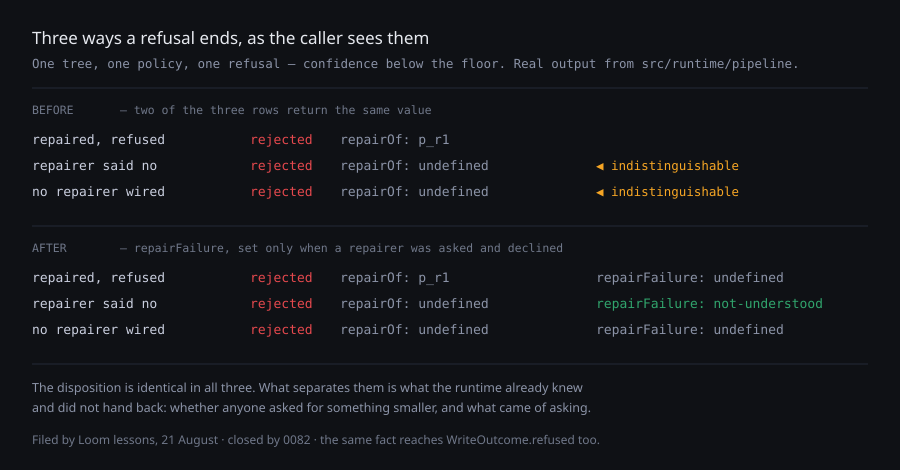

# The repair that declined

**Date:** 2026-08-21 · **Routine:** `Loom daily build` · **Section:** §2 ·
**Branch:** `framework-02-the-repair-that-declined`

*Real output from `src/runtime/pipeline`, three runs over the same tree with the
same policy.
[View full size](https://github.com/jam-overture/loom/blob/main/reports/2026-08-21-framework-the-repair-that-declined.svg)
— the repository is private, so an embedded image does not render for anyone
(16 August finding).*

## What was done, in plain language

When Loom refuses a change and the deployment has wired in a repairer, the
runtime asks for a smaller version — once. That ask has three endings, and until
today the value handed back to whoever called told **two** of them apart.

The lessons routine found it while writing lesson 13 and filed it. A refusal
where the repairer said *"I cannot find a smaller version"* came back looking
exactly like a refusal where no repairer existed and nobody asked anything. The
middle case is a real event and an interesting one — it is the difference between
*we did not try* and *we tried and there was nothing to try* — and the only place
it survived was the event journal.

**The fix is one optional field.** A refused outcome now carries `repairFailure`,
set only when a repairer was asked and declined, holding the error it declined
with. With the `repairOf` stamp the runtime already puts on a repaired proposal,
the three endings now return three different values — which is what the picture
above shows.

**It reaches the layer the surfaces actually hold.** The portal, the docs site
and the demo do not call `composeChange`; they call `commitIntent`, which returns
a `WriteOutcome`. Fixing only the pipeline would have left the fact one layer
short of everyone who needs it, so `WriteOutcome.refused` carries it too, and
`describeWriteOutcome` says it in the sentence: *"refused: … — asked for
something smaller, and the request was not understood: …"*.

That last part matters more than it sounds. The reason for putting the fact on
the return value at all is 0040's rule — a fact the runtime has in hand should
not be reconstructed downstream from a sentence. A host that had to replay the
event stream to learn why a change is not happening is doing the runtime's work
for it.

## Section

§2, the composition runtime. Nothing in §1's tree or delta model was touched, and
nothing about how a change is judged has changed — this is entirely about what
the runtime tells the caller afterwards.

## Decisions taken that nobody specified

**A field rather than a fourth outcome kind.** The finding offered both and
leaned the same way; this run agrees and 0082 records why. The change *was*
refused. A repair that could not be found is a detail of that refusal, not a
different ending, and a new kind would break every existing `switch` to say
something an optional field says without breaking anything.

**Two fields to read rather than one.** Telling the three endings apart means
reading `repairOf` as well as `repairFailure`. A single field covering all three
was considered and rejected: `repairOf` already records "this was a repair", and
a second field asserting it is a second thing that can disagree with the first.

**The field is optional and never defaulted**, in the spirit of 0045. Absent
means nothing was asked. No host has to build a "no failure" value to say so.

**No surface was changed to use it.** `(portal)/_lib/vocabulary.ts` is the file
that would benefit most — it is the shared table that stops one state being
called two things — and it belongs to another routine. The demo's record panel is
this lane's own, and it is mid-review in #128; a second pull request touching
those files would make both unreviewable. Both are filed rather than edited.

**The `renderDelta` asymmetry the same finding mentioned was deliberately left
alone.** A `configure` prints its prop keys without values while an `insert`
prints a node's props in full. The reading here is that this is right: the
projection exists to tell a model how broadly a change reached, and the values a
`configure` is about are already in the tree projection the model was handed.
Recorded in `FINDINGS.md` so the question is not rediscovered.

## Records

**Added:** [0082 — A refusal says what became of the repair](../decisions/0082-a-refusal-says-what-became-of-the-repair.md),
Accepted, §2.

**Superseded:** none. Nothing in 0040 or 0045 is contradicted; 0082 applies both
one layer down.

## Findings

**Closed:** *"a refusal that a repairer declined is indistinguishable from one
nobody tried to repair"* (filed by `Loom lessons`, 21 August). Accurate as filed,
and fixed the first of the two ways it proposed.

**Filed:**

- *"a refusal can now say a repair was declined, and no surface says it"* — for
  `Loom portal` and for this lane's own next run.
- *"two files in other lanes moved, both because their own tests said to"* — for
  `Loom marketing` and `Loom docs`. `FACTS.decisions` went `"81"` → `"82"`
  because the marketing site counts records on disk, and
  `reference.generated.json` was regenerated because the docs site holds it
  against the generator. Both tests are working as designed; both files belong to
  someone else.

## Open questions

**Every decision record any routine writes now edits a marketing file.** Four
routines write records, and each one fails `facts.test.ts` until the number on
the front page moves. The test is a good test — it is the reason that number is a
fact rather than something someone typed once — and the fix is one line with a
legible failure. Worth knowing that it is now a shared cost rather than a
marketing-lane detail.

**Should `describeWriteOutcome` be doing this at all?** It now composes two
sentences into one, which is the first time it has done more than pick one. It is
still the courtesy path — the field is the fact — but a third clause would be the
point to stop and give a host a builder instead of a string.

## Tests

`pnpm install && pnpm verify`, green, exit 0:

| suite | files | tests |
| --- | --- | --- |
| `@loom/runtime` | 101 | **1493 passed** |
| `@loom/app` | 86 | **1066 passed** |

Nothing skipped, nothing weakened, no test deleted. Four tests are new — three in
`src/runtime/pipeline.test.ts`, reading the three endings from the return value
alone, and one in `src/write/commit.test.ts` for the write path and its sentence.
The existing refusal test there gained two assertions: a refusal with no repairer
wired says nothing about one, in the outcome or in the sentence. The runtime
suite went 1489 → 1493; the app suite is unchanged, because the only app edit was
a number the marketing lane's own test dictates.

Two failures were hit on the way and both were regeneration, not breakage:
`app/(docs)/_lib/api/extract.test.ts` (the published surface moved, so
`pnpm --filter @loom/app docs:api` was re-run and committed) and
`app/(marketing)/_lib/facts.test.ts` (the record count moved). Both are recorded
above and filed.

**The live interpreter tests were not run** — they skip cleanly with no key, as
they are built to, and nothing in this change touches the model seam.
