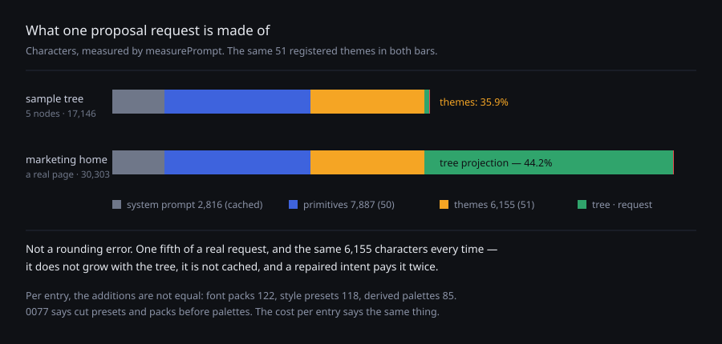

# What the prompt costs

**Date:** 2026-08-21 · **Routine:** `Loom daily build` · **Section:** §2 (interpretation) ·
**Branch:** `framework-03-what-the-prompt-costs`

*Measured with `measurePrompt` over the sample tree and over the marketing home
page as it actually renders.
[View full size](https://github.com/jam-overture/loom/blob/main/reports/2026-08-21-framework-what-the-prompt-costs.svg)
— the repository is private, so an embedded image does not render for anyone
(16 August finding).*

## What was done, in plain language

The primitives routine grew the starter theme sets from three of each to
twenty-one palettes, twenty font packs and ten style presets, noticed that every
one of them is described to the model on every single request, and filed a
finding that said the honest thing: **nobody has counted this.** If the theme
catalogue turned out to be a rounding error next to the primitives and the tree,
the finding would close itself.

It had never been counted because there was nothing to count it with. So this run
built the thing that counts it, and then counted.

**It is not a rounding error.** On a real page — the marketing home page as it
renders today — the theme catalogue is **6,155 characters, one fifth of the whole
request**. The primitive catalogue is 7,887 and the tree projection is the
biggest block at 13,404.

**The part that matters more than the share.** Those 6,155 characters are the
same 6,155 every time. They do not grow with the tree, they are not the constant
system prompt that a provider's cache can hold across intents, and an intent that
gets repaired sends them twice.

**No cut was made.** A fifth is real and it is not alarming; the range is the
whole point on the demo; and `createThemeRegistry` already lets a deployment that
ships one brand register exactly one theme. What has changed is that the next
person to ask this question gets a number instead of a feeling.

**0077's cut order turns out to be right for a second reason.** It says to cut
presets and packs before palettes, because the palette is what a viewer actually
sees. Measured per entry, those are also the expensive ones — a palette carries
more information per character than either, which is the opposite of what
"eighteen derived colour sets" sounds like.

| what | costs | per entry |
| --- | --- | --- |
| the 18 derived palettes | 1,537 | 85 |
| the 17 additional font packs | 2,082 | **122** |
| the 7 additional style presets | 827 | **118** |

**And it will not grow silently again.** Two ceilings hold the starter theme
block: under 8,000 characters — about eighteen more entries of headroom — and
never larger than the starter primitive catalogue. Both failures say in words
what the three answers are.

## Section

§2, interpretation. Nothing about what is sent changed: `buildUserMessage`
produces exactly the same string it did before, and the existing prompt tests are
what prove it.

## Decisions taken that nobody specified

**Characters, not tokens.** A token count depends on a tokenizer that belongs to
a model and changes with it, so a number measured here would be wrong somewhere
else and stale eventually — and the package would have to carry a tokenizer to
produce it. Characters are exact, free of dependencies, and proportional enough
for the question this answers: which block is the request made of, and what did
registering more of something cost.

**Assembly and measurement read from one place.** Both go through a private
`userMessageParts`. A measurement that rebuilt the blocks itself would be a second
assembly to keep in step, and the first thing to go stale.

**A ceiling rather than today's exact number.** A test that fails on every
legitimate addition is a test people learn to update without reading. 8,000 is
roughly 30% above what 51 entries cost.

**A relative ceiling as well as an absolute one.** A deployment is free to
register fifty themes and five primitives. Loom's own starter set spending more of
a model's attention on what a page can wear than on what can exist is a different
matter, and the moment to notice it is when it happens rather than when requests
get expensive.

**`measurePrompt` is exported rather than kept internal to the test.** The
finding's own second half — *consider a per-deployment subset* — is a host's
decision, and a host cannot make it without the number.

**A test in this lane now fails on a change in another.** The starter themes live
in `src/theme/`, which the primitives routine writes. That coupling is
deliberate: the finding is precisely that this grew fivefold with nothing
noticing.

## Records

**None, and not by choice.** This wanted one — a public export, a stated unit,
and a cross-lane tripwire are worth writing down. It could not be written:
`pnpm decisions:index` requires unbroken numbering, `0082` is claimed by this
lane's own open pull request #129, `0083` is refused as a gap, and stacking on
#129 is forbidden. The record was drafted and dropped; its reasoning is in this
report and in the test comments, and it should be written as `0083` once #129
lands.

Filed as a finding for the maintainer, because it is a governance question rather
than an engineering one: **a lane can only have one record-writing pull request
open at a time**, which is a limit nobody chose and which two individually
correct rules produce together.

## Findings

**Closed:** *"the theme catalogue is now fifty-one entries in every proposal
prompt"* (filed by `Loom primitives`, 21 August). Measured. It does not close
itself — 20% of a real request — and the numbers are in the entry.

**Filed:** *"a lane can only have one record-writing pull request open at a
time"*, for `@jonathanbravecredit`, with three ways out and a recommendation.

## Open questions

**The tree projection is 44% of a real request and nobody has looked at it.**
This run measured it and stopped there, because the finding was about themes. It
is the biggest block, it is the one that grows without limit, and unlike the two
catalogues it cannot be trimmed by registering less — a page is as big as it is.
Whether a scoped intent should project only the scope, rather than the whole tree
with the scope marked, is now a question with a number attached to it.

**A repaired intent pays for everything twice.** `buildRepairMessage` is
`buildUserMessage` plus the refusal, so a repair sends both catalogues again.
Whether a provider's cache absorbs that depends on how the two requests are
framed, which is an `anthropic.ts` question this run did not open.

## Tests

`pnpm install && pnpm verify`, green, exit 0:

| suite | files | tests |
| --- | --- | --- |
| `@loom/runtime` | 101 | **1493 passed** |
| `@loom/app` | 86 | **1066 passed** |

Nothing skipped, nothing weakened, no test deleted. Four tests are new, all in
`src/interpretation/prompt.test.ts`: the parts add up to what is actually sent, an
unregistered vocabulary costs nothing, and the two ceilings. The runtime suite
went 1489 → 1493.

**Both ceilings were checked by making them fail.** Lowering the budget to 6,000
produces the intended message — *"the starter theme catalogue has outgrown its
prompt budget: either the starter library has grown past what one deployment
should register all of, or 0077's cut order applies…"* — rather than a bare
number. A tripwire nobody has watched trip is a tripwire nobody knows is
connected.

`reference.generated.json` was regenerated, because `measurePrompt` and
`PromptMeasurement` are two new published exports. That is the docs lane's file
and the third time this has been necessary; it is already filed.

**The live interpreter tests were not run** — they skip cleanly with no key, as
they are built to. Nothing here sends anything to a model; that is the point of
the module being pure.
