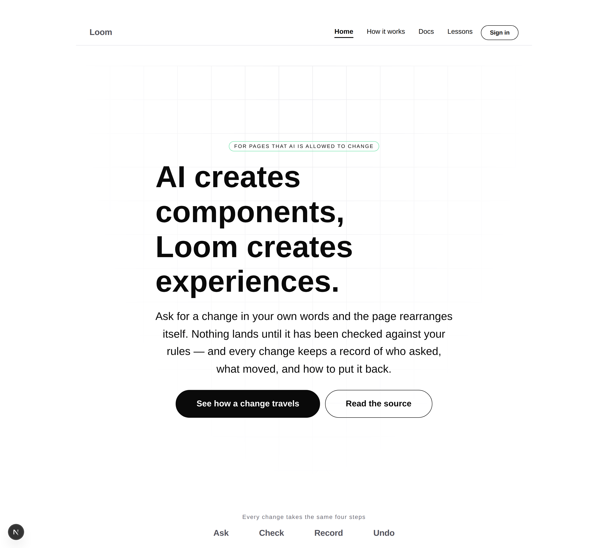
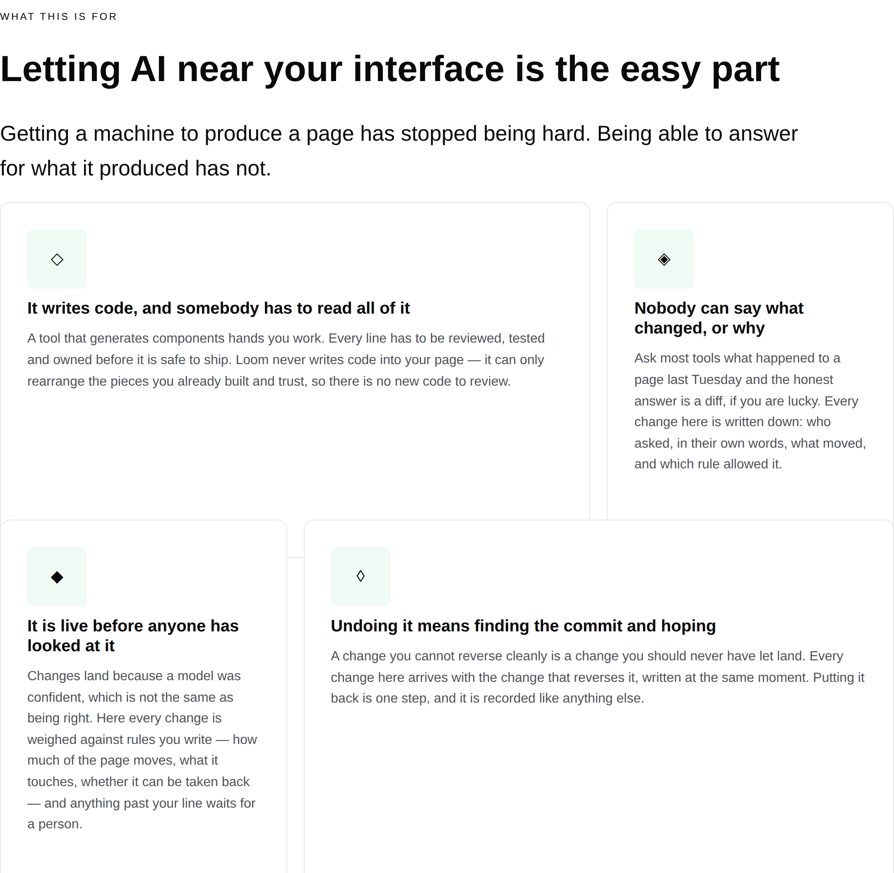
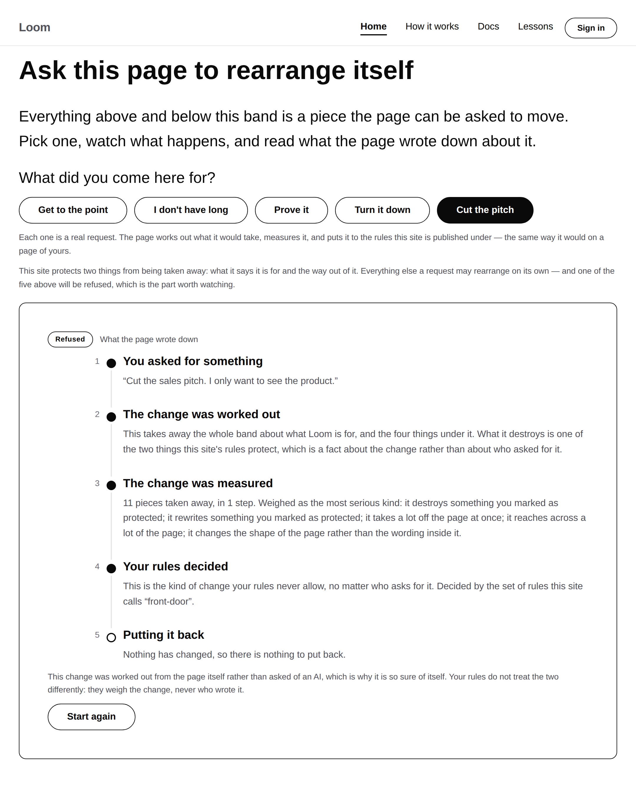
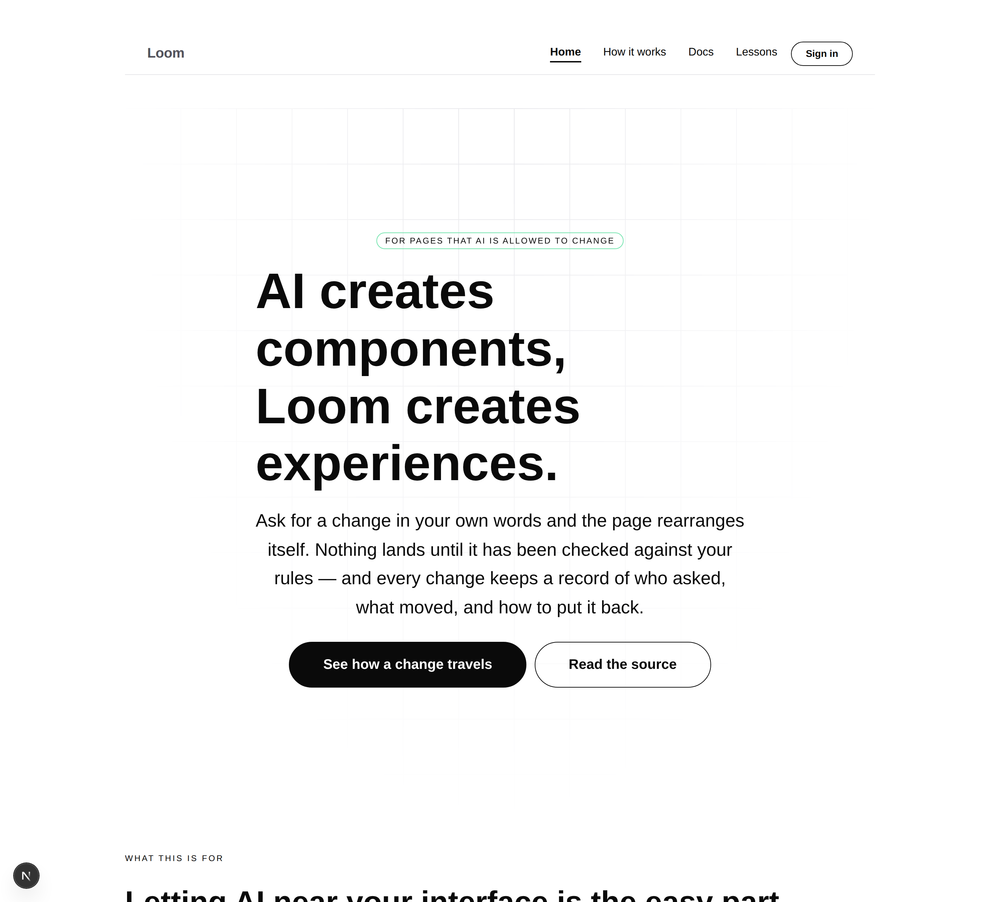
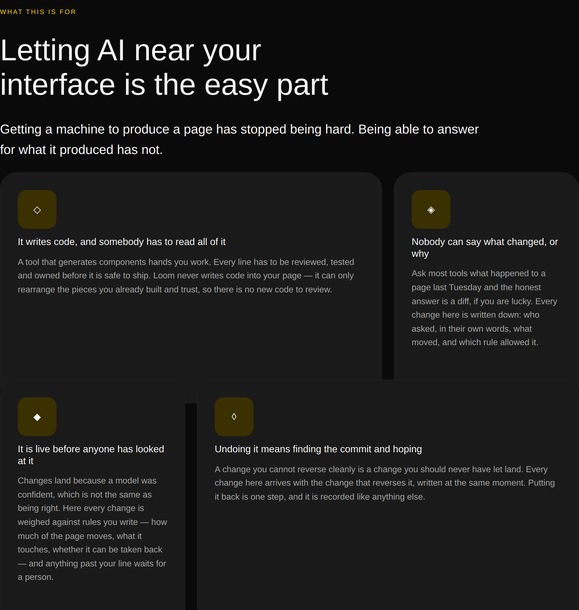

# 2026-08-21 — marketing: problems, not prices

Three instructions from the maintainer, given directly on #123 rather than
reached through the plan:

1. **Merge #123.** It had conflicted with `main` while it sat.
2. **Pricing comes off the front door.** The marketplace is a long way out and
   how to position it is undecided.
3. **The core of this site is the problems we are solving and how Loom solves
   them** — and a headline for it: *"AI creates components, Loom creates
   experiences."*

#123 is merged. This run is the other two.

---

## The headline

Used verbatim, comma and all. It is the first headline this site has had that
says what Loom *is* rather than what it does to a page, and the contrast is the
whole positioning: everything else with an AI in it hands you parts, and the
argument is that parts were never the hard bit.

Positioning is the maintainer's, so a routine that tidied the punctuation of a
line it was handed would be rewriting the one thing it is told not to invent.

## Pricing is gone rather than waiting

Seven of the site's eight placeholder strings were the pricing band — a notice
and three tiers with the numbers held open, built as structure so the shape could
be reviewed before the numbers existed. All seven are deleted, along with the
band, the `tier` and `perk` builders and the `loom.tier-table` it was made of.

**Deleting the shape rather than keeping it empty** is the call worth defending.
A band marked *placeholder* still occupies the most expensive space a page has,
and a visitor reading three empty tiers learns that this product has not decided
what it is. An absent band says nothing at all, which is a great deal better.

One placeholder is left: the footer's licence line. That is the right one to keep
— licensing is genuinely undecided, it gates whether this repository can be
public at all, and the footer is where a reader looks for it. The count assertion
went 8 → 1 and says so.

## What replaced the middle of the page

The band under the hero used to be four capabilities under *"Change, with a paper
trail"* — four true sentences about what the product has, which is the shape
every framework's landing page takes and the shape that persuades nobody.

It is now **the problem, and what Loom does about it**. Four pairs: the headline
is what is wrong today, the sentence under it is the answer.

| The problem | What Loom does |
| --- | --- |
| It writes code, and somebody has to read all of it | It never writes code into your page — only rearranges pieces you already built and trust |
| Nobody can say what changed, or why | Every change is written down: who asked, in their own words, what moved, which rule allowed it |
| It is live before anyone has looked at it | Every change is weighed against rules you write, and anything past your line waits for a person |
| Undoing it means finding the commit and hoping | Every change arrives with the change that reverses it, written at the same moment |

Every problem here is one this repository can actually speak to, and **none of
them is a claim about who has it.** Whether the people who care most are
regulated teams, agencies or hobbyists is positioning and is not mine; *that
un-reviewable AI output is a problem* is not a market claim, it is the reason the
Gate exists at all.

### It uses `loom.mosaic`, which closes a finding from yesterday

On 20 August this lane filed that `loom.feature-grid` lays every cell out
identically, so any feature band built from it comes out as a table of
specifications — and that the band saying what a product is *for* should be the
last thing on a page to look like a kit list.

`Loom primitives` shipped `loom.mosaic` on #121 for exactly that, with the
arrangement kept on the arranger rather than a `span` prop on the child. This is
its first use outside its own specimen page, and it is the right band for it.
Finding closed.

## The demonstration had to move with the pricing band

This is the interesting consequence, and it made the demonstration better.

`front-door` — the site's own rules — protected **what the site charges** and
**the way out of it**, and two of the five choices in the "See it happen" band
were aimed at the pricing table: one moved it (protected, so held for a person),
one deleted it (protected, so refused outright). Take pricing away and both
choices have nothing to point at.

They now point at the problem band, which is what the site protects instead:

| Choice | What it does | What the rules say |
| --- | --- | --- |
| **Turn it down** | Two settings on the opening band | Allowed |
| **I don't have long** | Takes the questions band away | Allowed |
| **Prove it** | Adds a band under the headline | Allowed |
| **Get to the point** | Lifts *what this is for* under the headline | **Held** — a person decides |
| **Cut the pitch** | Takes *what this is for* away entirely | **Refused** — saying yes does not help |

All three answers survive, with nothing staged to keep them. And the choice of
what to protect is better than it was: a business protecting its price list is
ordinary, and a business refusing to let a machine delete the statement of what
it does for people is the same instinct pointed at the thing that actually
matters.

## The sentence that went stale in one commit

The band tells a reader what this site protects *before* offering the button that
will be refused for exactly that reason — a refusal nobody saw coming reads as
the page breaking rather than as a rule holding.

For one commit that sentence still said **"what it charges"** while the rules had
stopped saying anything of the kind. It was caught by eye, in a screenshot, which
is not a mechanism.

So it is derived now. `PROTECTED_IN_PLAIN_WORDS` gives each protected type the
words a visitor would use, the band builds the sentence from the rules
themselves — the phrases *and* the count, deduplicated, because the menu and the
footer are two pieces of one promise — and a protected type nobody has named
throws while the page is being built. Three assertions hold it: every protected
type has plain words, the page prints them, and the page never prints a type
name.

That is the same failure `voice.test.ts` was written for in the first place: this
site's claims are only safe when something checks them.

## The record

[0081](../decisions/0081-the-front-door-demonstrates-statelessly-and-the-address-is-the-state.md)
merged this morning, and it names what `front-door` protects as an illustration
inside its argument. Rather than leave that factually wrong, it carries a dated
**amendment** saying what moved and why.

It is a note and not a superseding record because none of the decision changes —
the stateless shape, the address as the whole of the state, the two-pass render
are all untouched. `decisions/README.md` forbids editing a record to reflect a
*change of direction*; this is not one, and leaving a merged record describing a
band the site no longer has seemed the worse of the two. **Flagged in the pull
request in case the maintainer would rather I had not.**

## Tests

`pnpm install && pnpm verify` **green**: **1489 runtime, 1030 application**
(1025 before this branch). Nothing skipped, nothing weakened, `next build`
succeeded across all four surfaces.

Marketing suite **221 → 226**. The five new ones are the protection notice; the
rest of the suite needed no loosening, which is the useful signal here — the
verdict table, the reversal assertion, the two-pass agreement and the register
checks were all written against *behaviour* rather than against the pricing band,
so swapping what the rules protect changed five assertions and no structure.

## Findings

- **`loom.feature-grid` cannot vary a cell** (filed 20 August, `Loom
  primitives`) — **closed** by `loom.mosaic` on #121, and this is its first use
  in a real page.
- No new findings. `src/` was not opened.

## Open questions

- **The hero promises free text and the band still cannot offer it.** Unchanged
  from #123 and still the maintainer's — the recommendation there was to send
  people to the demo once it is public at `/demo` rather than put a model call on
  the highest-traffic page.
- **Audience.** The problem band deliberately makes no claim about *who* has
  these problems. The recorded guess is regulated teams, agencies and anyone with
  a compliance function; nothing on the page says so, and nothing will until the
  maintainer does.
- **Licensing.** Still the one placeholder on the site, still gating Phase 2.
