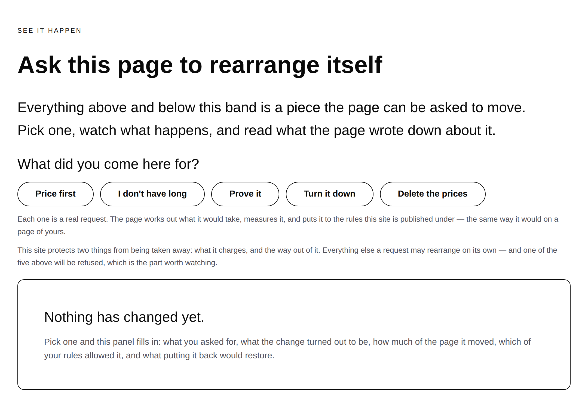
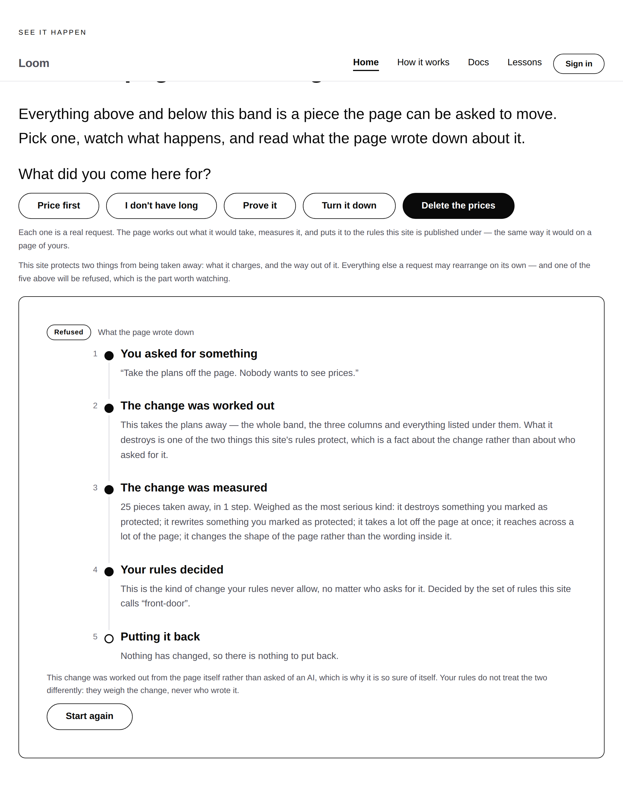
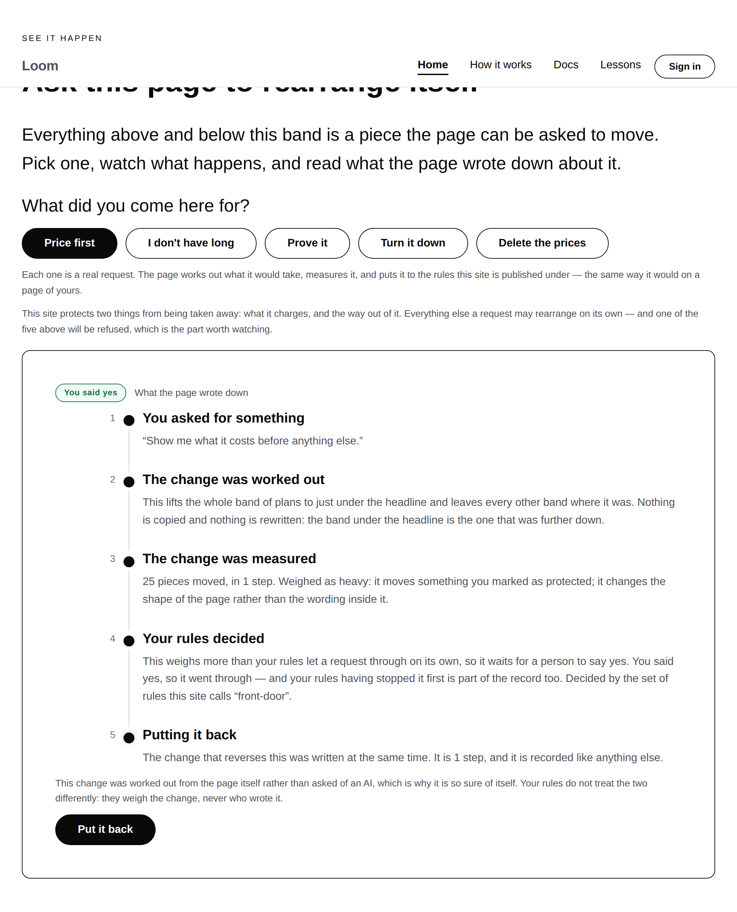
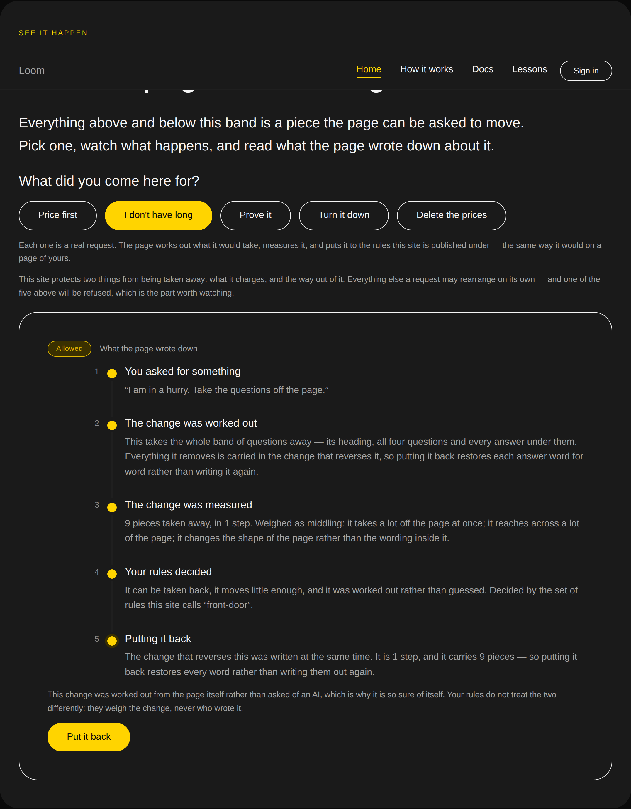

# 2026-08-21 — marketing: the front door stops describing it and does it

The landing page has been making one claim for five runs: *ask for a change in
your own words and the page rearranges itself, and every change keeps a record of
who asked, what moved, and how to put it back.* Everything else on the site is an
argument for that sentence.

Nothing on the site was the sentence being true. This run makes it true, on the
page making it, in front of the visitor.

---

## What shipped

A third band on `/`, directly after the hero and the four words, and before
anything that argues for the product. Five choices; each one a real request
through the whole sequence — worked out, measured, weighed against the site's
rules, applied or held or refused, and reversible — and a panel that says all of
it in words a stranger has never had to learn.

The first four are **one per kind of change**, which is not decoration. Three
bands further down the page says there are four kinds — add something, remove
something, move something, change a setting — and that this is the whole list.
Those four choices are that list, performed on the page making the claim.

| Choice | What it does | What this site's rules say |
| --- | --- | --- |
| **Turn it down** | Two settings on the opening band | Allowed — lands on its own |
| **I don't have long** | Takes the questions band away | Allowed — lands on its own |
| **Prove it** | Adds a band under the headline | Allowed — lands on its own |
| **Price first** | Lifts the plans under the headline | **Held** — a person decides |
| **Delete the prices** | Takes the plans away entirely | **Refused** — and saying yes does not help |

## The rules are a real set of rules

The three answers were not arranged. `front-door` protects **two things from
being taken away: what the site charges, and the way out of it** — the rule an
ordinary business would actually write, and the only thing added to the shipped
default. Writing it produces all three verdicts with nothing further contrived:

- Most requests are nobody's crisis and land.
- **Moving** something protected is not damage but is not a machine's call
  either, so it stops and asks a person — and the person is the visitor.
- **Destroying** something protected sits at the refusal floor. There is no
  button to override it, which is the difference between a rule and a suggestion.

A page that only ever demonstrates changes it is happy with demonstrates nothing.
Every product with an AI in it can show a page rearranging; the interesting claim
is that some things do not happen however emphatically they are asked for, and
the band says which two before offering the button that will be refused for
exactly that reason.

## Saying yes, and what the record says about it

A hold is a question, so answering it changes the outcome. "I say yes — go ahead"
puts the change a second time through `confirmChange`, which re-judges it against
the page as it stands rather than trusting the judgment made a moment ago.

The interesting part is what comes back. **The verdict still says held.** The
rules are asked again and they have not changed their mind, because a person
saying yes is not evidence about the change; what changed is that it applied
anyway. So the record carries both halves — *your rules stopped this, and you
overrode them* — and the panel says so. A page that showed only "allowed" would
be quietly erasing the more useful half.

Getting that right needed a small correction in the runner: whether a change
applied is passed separately rather than read off the verdict. The first version
read it off the verdict and reported "waiting for you" on a page that had already
moved.

## Nothing is kept, and the address is the whole of the state

Recorded as [0081](../decisions/0081-the-front-door-demonstrates-statelessly-and-the-address-is-the-state.md).

The portal's demo keeps a session per visitor — a tree, a hold store, a list of
records, a model budget, eviction — and that is the right shape for what it does,
because a visitor there builds up a *sequence* of changes. It is the wrong shape
for a landing page, which is the most-loaded, least-trusted and most-crawled
surface the project has. A session per visitor there is a memory leak with a
marketing budget.

So the front door keeps nothing. `/?ask=costs` **is** the page with the plans
lifted, rebuilt from scratch every time, the same page a week later. Four
properties follow and each is worth having:

- a rearranged page can be copied, shared and bookmarked;
- two visitors cannot move the site under each other;
- there is nothing per-visitor to exhaust, so no budget and no rate limit;
- "Put it back" is a link home — undo on a stateless page is the absence of a
  parameter rather than an operation.

### The one genuinely awkward part, and how it is handled

The panel that reports the change is *part of the page the change is made to*. So
the page has to exist before the change can be worked out, and the change has to
be worked out before the panel can be written.

The front door runs the sequence **twice**: once against a page whose panel is
still empty, to learn what happens, and again against the page with that answer
written in. What a visitor reads is the record of the change that produced the
exact page in front of them, rather than of a slightly different page nobody saw.

The two runs agree because nothing the rules weigh is a function of how big the
page is — breadth, removal size and depth are all counted absolutely. That is
true of today's rules rather than true by law, **so it is asserted**, per choice.
A stake factor that started measuring a *fraction* of the page would break it,
and it would break in a test rather than on the landing page.

## The words

Every sentence in the panel is held to [0078](../decisions/0078-the-front-door-speaks-the-visitors-language.md)'s
register, which turned out to be the constraint that improved it most.

Nothing the runtime produces is printed raw, because none of it can be. A
verdict's reason reads *"removes 11 nodes"*; a stake factor's reads
*"restructures at depth 1"*. Both are exactly right and both are unreadable to
the person this page is for. So the panel prints a **translation, keyed by the
code the runtime actually returned** — the sentence on the page is pinned to the
judgment rather than written beside it — and the maps are total by construction:
`satisfies Record<DispositionReasonCode, string>` fails the build if the runtime
gains a code nobody translated, which is the failure that would otherwise render
as a blank line on the landing page.

The whole vocabulary is tested, not just the part five choices happen to reach.
Most of the translations are for judgments this page cannot currently produce — a
change that discards later work, a redirected form — and the run that makes one
reachable will not think to come back here.

And the panel says plainly that the change was worked out from the page rather
than asked of an AI, which is a selling point rather than a caveat: **the rules
cannot tell the difference, because they weigh the change and never its author.**

## Fixed on the way past

**A palette switch threw away what the visitor had asked for.** The footer's
re-theme links rebuilt the address from scratch, so changing palette halfway
through watching a change snapped the page back to how it arrived — at the exact
moment the site is making two live claims at once, one of which is that it is the
*same page* underneath. The switcher now carries the ask. Held by a test, per
choice, per palette.

**Five band eyebrows became constants.** A change has to *find* the band it is
about to move, and every band on this page is a `loom.section`, so the eyebrow is
the only stable, visible, unique label. Two files now agree on it through
`bands.ts` rather than through two string literals — a literal spelled twice is
one that gets re-worded once, and the failure that follows is silent: the plan
finds nothing, returns nothing, and the choice quietly stops being offered. A
test holds all five against the real page.

## Tests

`pnpm install && pnpm verify` **green**: **1473 runtime, 1025 application**
(921 before this branch). Nothing skipped, nothing weakened, `next build`
succeeded across all four surfaces.

Marketing suite **117 → 221**. The ones worth naming:

- **The change that reverses a change puts the page back exactly as it was.**
  Applied to the changed page for every choice that lands, and held against the
  page the visitor arrived on. This is the single assertion the band's honesty
  rests on: on a page that keeps nothing, "Put it back" is a link home and the
  page is *rebuilt*, so the panel's claim that putting it back **restores** the
  page is only true if the rebuilt page and the reversing change's result are the
  same page.
- **The three answers, as a written-out table.** A change to the rules that
  quietly collapsed all five choices into "allowed" would leave the band
  demonstrating nothing while every other test still passed.
- **Saying yes to a refused change does nothing**, and the plans are still on the
  page afterwards.
- **Every reachable state of the front door** — untouched, each choice, each
  choice approved — renders with no diagnostics in all three palettes, keeps
  exactly one first-level heading, and meets nobody with a word they do not have.
- **The panel walks through as many steps as `/how-it-works` names**, counted off
  both pages, so a sixth step described there and not performed here is a failing
  test.

## Findings

- **`loom.split` cannot say how far apart its two regions sit** — `Loom
  primitives`, low priority. Every other arranger takes a `gap`; this one refuses
  it. Worked around by not using the primitive, and filed with the note that the
  question is not the same one `loom.stack` answers — a split that collapses on a
  narrow page has two gaps, and they are rarely the same number.
- **The front door cannot demonstrate somebody typing** — the maintainer's. The
  choices are buttons, which is the only affordable shape for this surface, and
  it leaves a gap between what the hero promises (*ask for a change in your own
  words*) and what the band offers. Three ways out are laid out in the finding;
  choosing is positioning. It collapses into the same question as the demo behind
  the sign-in and there being nothing to install.
- **No framework gaps this run.** `src/` was not opened. Recorded because its
  absence is worth as much as an entry: the band is composed entirely from what
  `@loom/runtime` already exports and from nine starter primitives.

## Open questions

Unchanged from 20 August and still only the maintainer's:

- **Positioning, audience, pricing and the licence line** (#96). The pricing band
  is still marked placeholder — and it is now the band the site's own rules
  protect, which is a nice accident and not a decision.
- **Should the front door say what *kind of thing* Loom is?** No category line,
  because `runtime` is on the reserved list and a plain-English replacement is
  positioning.
- **The demo is still behind the sign-in.** Less pressing than it was: the front
  door now demonstrates rather than describes. What it still cannot show is free
  text reaching a model, which is the finding above.
