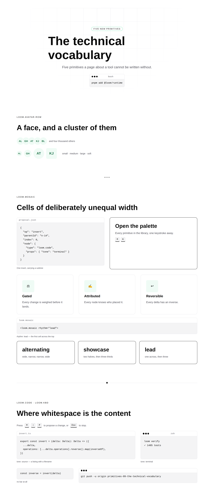
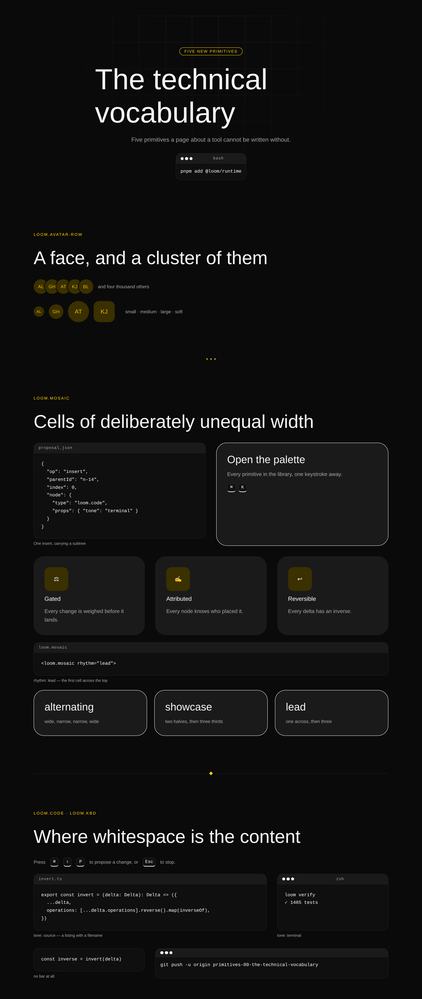
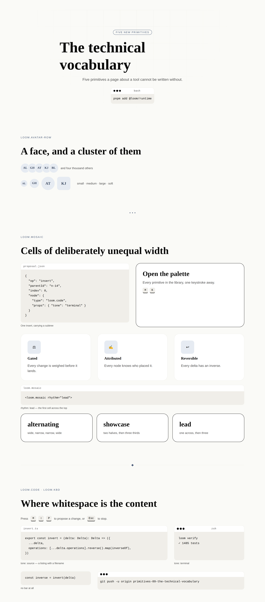
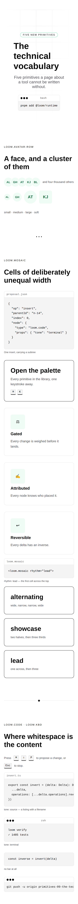

# 21 August 2026 — the technical vocabulary, and the band that is not a table

**Routine:** `Loom primitives` · **Section:** §4b · **Branch:** `primitives-09-the-technical-vocabulary`

Five primitives — `loom.code`, `loom.kbd`, `loom.avatar`, `loom.avatar-row`,
`loom.mosaic` — taking the library from **45 to 50**, plus one decision record,
plus three findings closed and four filed. One of the three was closed on the way
past because a screenshot showed it was still true.

## Which primitives, and why those

The port map's largest outstanding group is still *things booked* — seven Hermes
blocks behind a `loom.offering-list` pair — and this run did not build it either.
Two reasons, and the first is the one the brief asks for.

**The library could sell a service and could not describe a tool.** Forty-five
primitives, and no way to put a line of code on a page. That is not a gap in the
Hermes catalogue — Hermes was a creator-profile toolkit and its one `code-block`
is a footnote there. It is a gap in *what this library is for*: the demo is a
runtime, the marketing site is a framework's front door, and the thing a visitor
to either most wants to see is a snippet. The 20 August finding about
`nextjs.org` makes the point better than I can — their single most load-bearing
element is one copyable line of shell, and until today nothing in this library
could render one without lying about whitespace.

**The other three are the leaves the brief named.** `badge` and `icon` were
already here; `avatar`, `kbd` and `code` were the three that were not. `avatar`
turned out to be the interesting one: two primitives already draw a face, and
neither could be reached without claiming to be a person or a testimonial —
exactly the shape of the gap `loom.icon` closed when a glyph could only exist
inside a feature.

**`loom.mosaic` is the band, and it is the one that closes an open finding.** The
marketing lane filed on 20 August that every band this library lays out is a grid
of identical rectangles, so a feature section comes out as eight equal boxes
where the reference page mixes three sizes. That finding is why the run has a
decision record in it.

What this deliberately is not: a `loom.offering-list`. Six of the seven
outstanding pairs are a card in a grid and 0066 already settles the one question
they share, so they are the *mechanical* remainder — worth doing, and worth doing
after the library can express things it currently cannot express at all.

## Which Hermes fields became nodes, and which stayed props

Only one of the five has a Hermes ancestor.

**`code-block` → `loom.code`.** Hermes: `language`, `code`, `caption`.

| Hermes field | Becomes | Why |
| --- | --- | --- |
| `code` | **children** | One string that is the whole of what the node says is prose by 0052's third clause — the same call `loom.badge` and `loom.action` already make. A snippet gets an author, a history and an inverse of its own, and re-authoring it is a delta against the text rather than a `configure` replacing the node's props. |
| `language` | prop | Exactly one, it labels the snippet rather than being it, changing it is a `configure`. Left as free text: a closed enum would be every language anyone might paste, and a filename is as good a label as a language. |
| `caption` | prop | Same, and the same call `loom.media` makes. |

Added, and not from Hermes: **`tone: "source" | "terminal"`** and
**`density: "comfortable" | "compact"`**. Both are display modes — a closed set
of renderings the schema names — so 0052 keeps them as one enum each rather than
as separate primitives. Turning a snippet into a command is one `configure` the
Gate weighs as small and reversible; as two primitives it would be a `remove` and
an `insert` that throws the text node's history away to say something about
presentation.

The other four have nothing to port, and the port map now says so in its *What
Hermes never had* section beside the page chrome.

- **`loom.avatar`** — `name` required, `image` optional, both props. There is one
  name and one face, they are meaningless apart, and a monogram is what renders
  when the photograph is missing. `loom.logo`'s rule, for `loom.logo`'s reason:
  the fallback is the common case, not the error case.
- **`loom.avatar-row`** — one prop, `spacing`. The overlap is the *container's*,
  which is the one real design decision in this pair.
- **`loom.kbd`** — no props at all, and the only empty schema in the library. A
  chord is several of these in a `loom.stack`, not a `keys` array: an array would
  put both caps outside the delta model, and neither would have an author.
- **`loom.mosaic`** — `rhythm` and `gap`. Neither changes the set of nodes.

## The one that needed an argument: where the span lives

The finding suggested a `feature`-level `emphasis` that the grid reads, by
analogy with `loom.tier` inside `loom.tier-table`, and explicitly flagged the
obvious alternative — a `span` prop on the child — as *probably wrong*. That
instinct was right, and the reason is worth stating because it is not the same
reason as `loom.tier`'s.

`loom.tier`'s `emphasis` changes how **that tier paints itself** — its border,
its surface. A tier can do that alone. A span cannot: it means nothing without a
column count that lives on the parent, so `span: 4` in a tree whose parent is
three columns wide is simply a wrong number sitting in the tree. That is the
coupling `loom.split` avoids by keeping `ratio` on the arranger.

So the rhythm is the container's, expressed as a repeating cycle of `nth-child`
spans that fills a six-column row exactly, and the children are untouched. A
mosaic holds `loom.feature` cells, `loom.card` cells or a `loom.code` panel
without any of them knowing they are in one. `loom.article-grid`'s `lead` is the
same mechanic; this is the tidier instance, because nothing here reaches into a
sibling primitive's class names.

**What it costs, and I want this on the record rather than in a footnote:** a
varied feature band built this way is a `loom.mosaic` holding features, not a
`loom.feature-grid`. The node stops saying *this is the feature band*, which the
projection a model reads and the analysis the Gate weighs both key off. That is
the cost 0062 names for every general arranger. If the marketing site wants that
band **twice**, 0062's own rule says name the pair — `loom.feature-mosaic` over
`loom.feature` — and it is a small primitive now that `loom.mosaic` exists. Filed
for the marketing lane to ask for; not built on one use.

## The decision record

[**0079 — a layout only CSS can express belongs in the stylesheet, width query
and all**](../decisions/0079-a-layout-css-alone-can-express-belongs-in-the-stylesheet.md).
Accepted.

Every container in this library is responsive without asking how wide the page
is: `auto-fit` over a minimum, or `flex-basis`. That is what lets 0008 hold — a
render is a pure function of one node, so a primitive that branched on a viewport
would need to be handed one, and then the same tree would not be the same page.

`loom.mosaic` is the first primitive that cannot be built that way. Unequal spans
need a column *count* to be spans of, and six columns on a phone is six columns
of four characters. There is no `auto-fit` for "four across here, one across
there".

The record allows one width media query, in the static stylesheet, and nowhere
else. The three properties that make it safe are the ones 0055 already relies on
for keyframes: **the markup does not change** (byte-identical either side of the
breakpoint, which a test asserts), **nothing is interpolated** (no prop, no
theme, no palette reaches it), and **`prefers-reduced-motion` was already a media
query in that file** — the line was never "no media queries", it was "no viewport
in the render function", and a rule in a stylesheet is not in the render
function.

One breakpoint, `48rem`, named once. The bar for a second is the bar this one
cleared: an arrangement with no intrinsic form, not one that would look slightly
better with a query.

## The finding a screenshot re-opened

The phone screenshot for this run showed the h1 clipped at both edges — the
20 August finding *a level-1 heading does not fit on a phone*, still true, filed
by this lane against itself and left alone at the time because it was "a bigger
call than a run should slip in".

It is a smaller call once 0079 exists, because 0079 is exactly the precedent that
entry asked to have named out loud before anyone put a viewport unit in a
primitive. So: `min(var(--loom-scale-8), 11vw)` on level 1,
`min(var(--loom-scale-7), 9vw)` on level 2, and nothing below them — step 6 is
32px and fits a phone with room to spare, so capping it would shrink headings
nobody complained about. The ramp wins at every width that can hold it. Closed.

The better fix — a fluid `scaleRamp` in the font pack — is still `Loom daily
build`'s, and this does not block it: a pack whose step 8 is already a clamp is a
ramp that wins here at every width.

## Two things the screenshots changed

Both were caught by looking rather than by testing, which is the argument for
putting an image in the report.

- **A key cap on a card was nearly invisible under the dark palette.** Its face
  was `bg-surface` and so was the card's, so the cap was defined by its border
  alone. It is `bg-surface-muted` now, which reads as a raised key against both
  grounds a cap actually lands on.
- **A short snippet beside a tall card left its cell half empty.** The panel now
  takes the height its cell gives it. Where nothing imposes a height — a panel
  under a hero, a panel in a column — it does nothing at all.

## Findings

**Closed — three.**

- *One of those ten is in `src/primitives/`* (`Loom docs`, 21 August).
  `loomQuoteGrid`'s summary was withheld from the API reference because a record
  number was the subject of its opening clause. Reworded exactly as suggested,
  with the record as a parenthetical link.
- *A level-1 heading does not fit on a phone* (this lane, 20 August). Above.
- *The reference's feature grid mixes cell sizes* (`Loom marketing`, 20 August) —
  **answered rather than closed**, and answered with a different primitive than
  the one it proposed. The reasoning above is repeated in the findings file for
  the lane that has to use it.

**Filed — four.**

- **A font pack declares three families and none of them is monospace**
  (`Loom daily build`). `fontPackSchema` has `headingFamily`, `bodyFamily` and an
  optional `accentFamily`, and a code panel needs a fourth. Worked around with
  `monospace()` in `tokens.ts`, written as `var(--loom-mono-family, <system
  stack>)` — a `var()` whose *fallback* is the stack, so the day the theme emits
  that variable every code panel and key cap in every deployment picks it up with
  nothing in `src/primitives/` to change. Worth reading beside the 21 August
  finding that `accentFamily` is emitted and read by nobody: a font pack with an
  opinion about a display face and none about a mono face has the roles the wrong
  way round for a library whose next primitives are technical.
- **A code block cannot offer a copy button** (`Loom daily build`). Not a state
  problem, which is why it is separate from `tabs`: a copy control needs no state
  at all, it needs somewhere a *behaviour* can come from, and props are JSON.
  Three shapes ranked in the entry. Deliberately not faked — a button that looks
  like it copies and does not is worse for a visitor than no button.
- **`loom.mosaic` reads the viewport where it should read its container** (mine).
  A container query is the honest mechanism; it is not what shipped because where
  container queries are unsupported the *un-queried* rules apply, so a mosaic
  would render its narrow single-column layout forever on those clients,
  silently. A width query fails the other way — it composes, occasionally
  somewhere too narrow, which is visible the moment anyone looks.
- **The mixed-size band exists, and it is not `loom.feature-grid`**
  (`Loom marketing`) — the answer entry described above.

**21st.dev, a fourth time.** `WebFetch https://21st.dev` returned
`EGRESS_BLOCKED` again. Noted against the existing entry rather than filed as a
fifth. Worth saying that `docs/routines.md` states `21st.dev` is on the WebFetch
allowlist and it is not — a routine reading its brief has no way to learn the
reference it is told to consult is unreachable until it tries. This run's mosaic
is precisely the primitive that reference would have calibrated; it was built
against `loom.hero` and `loom.article-grid` instead.

## Two files in other lanes had to change, again

The same shape as 20 August, and for the same reason — the checked numbers.

- `apps/loom/app/(marketing)/_lib/copy.ts` — `primitives: "45" → "50"`,
  `decisions: "78" → "79"`. `facts.test.ts` counts the repository and fails
  otherwise, so any lane that adds a primitive or a record turns the marketing
  surface red until it edits that file.
- `apps/loom/app/(docs)/_lib/api/reference.generated.json` — regenerated with
  `pnpm --filter @loom/app docs:api`, which is what its own failure message asks
  for.

Neither is a judgement call and neither is mine to design differently. Flagging
so the owners know their files were opened.

## Real test numbers

`pnpm install && pnpm verify`, green.

| | |
| --- | --- |
| Runtime — `pnpm test` | **1486 passed**, 100 files, 0 failed, 0 skipped |
| App — `pnpm --filter @loom/app test` | **921 passed**, 82 files, 0 failed, 0 skipped |
| `src/primitives/library.test.ts` | **111 passed** (was 98) |
| Build | `tsc -p tsconfig.build.json` clean; `next build` compiled |

Thirteen new tests for the five primitives and one for the heading clamp, plus
one fixture (`technicalPage`) added to the coverage loop and to the
three-palette re-theme loop. Nothing was weakened to
get green, and nothing was skipped.

One install note that cost ten minutes and might cost someone else the same: the
root `pnpm install` did not place `apps/loom`'s `geist` dependency, so
`pnpm verify` failed on `Cannot find module 'geist/font/sans'` before any of this
run's code was reached. `pnpm install --filter @loom/app` fixed it. Not filed —
it looks like a local artefact rather than a repository fault, and it reproduced
once.

## Open questions

Three, all in the findings, none blocking:

1. **Does a font pack get a mono family?** My recommendation is yes and optional,
   the same shape `accentFamily` has. The workaround means nothing here changes
   when it lands.
2. **Does a code panel ever get to copy itself?** My recommendation is the first
   shape in the finding — the registered component owns it, the way the
   animations do — but it needs the render seam to permit a client boundary
   inside a primitive, which I cannot check from this lane.
3. **Does the marketing site want the varied feature band twice?** If so, that is
   `loom.feature-mosaic` and it is small. Say so and I will build it.

## Where the library stands

Fifty primitives. Against the Hermes catalogue: **45 of 70 settled**, with 20 in
seven pairs and three atomic blocks left. Against what a demo actually stands on,
the honest list of what this library still cannot express:

- **A comparison table.** One of the seven pairs, and the 21st.dev band this run
  came closest to building instead. It is genuinely two-dimensional — rows are
  nodes and so are cells — which is one more level of nesting than anything here
  and probably a decision record of its own.
- **Anything that moves continuously.** A marquee is a real gap and it is
  blocked on something specific rather than on effort: a seamless loop needs the
  track duplicated, and duplicating rendered children duplicates their
  `data-loom-node` ids, which 0051 calls worse than a gap. Not filed as a finding
  because I have not yet convinced myself it is the framework's problem rather
  than mine.
- **Anything the reader changes.** Tabs, carousels, accordions beyond what
  `
` gives `loom.faq`. Blocked on a state seam and correctly so.
- **A varied band that still says what it holds.** See the cost of 0062 above.
