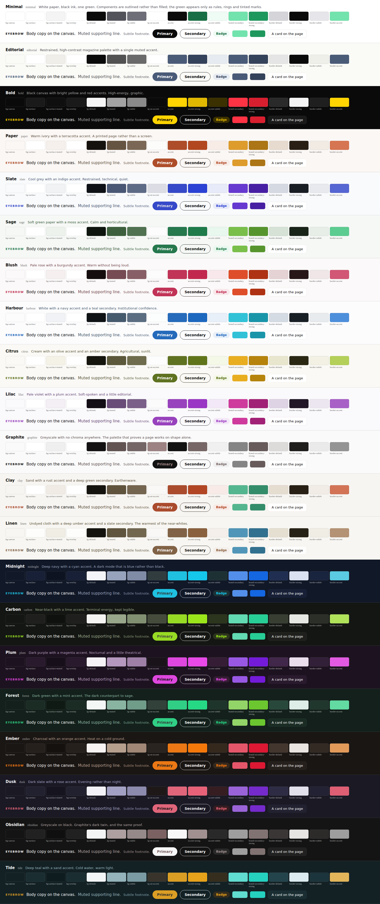
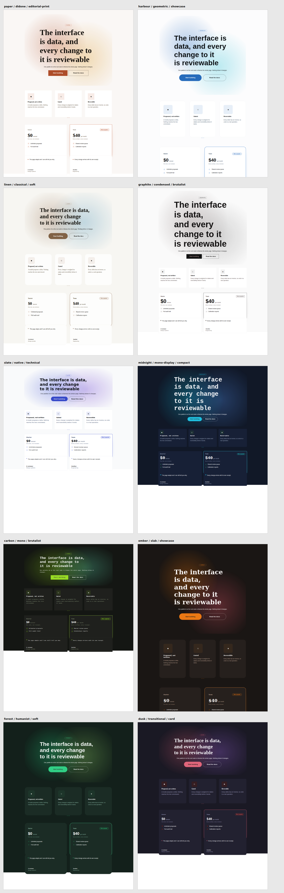

# 21 August 2026 — the starter themes, derived rather than picked

**Routine:** `Loom primitives` (crossing into the framework lane, at the maintainer's request) · **Section:** §4b · **Branch:** `theme-01-the-starter-themes`

The starter theme sets go from **three of each to 21 palettes, 20 font packs and
10 style presets**, plus `derive.ts` — the tool that produced the palettes, kept
as a supported part of the package rather than as the scratch file it started
as.

## Why this run happened at all, and in someone else's lane

The maintainer asked, in session, for "a robust library of themes for our
starter pack". `src/theme/` belongs to `Loom daily build`; this is
`Loom primitives` crossing that boundary because the person who set the
boundary asked for the work. It is one PR touching one directory, so it stays
reviewable on its own, and the framework routine loses nothing but a merge.

It began as a different question — *are 20 palettes worth it?* — and the answer
turned out to matter more than the count.

## The question underneath: should a model choose colours instead?

Asked directly during the run: *is it better to have presets a model chooses
from, or to have the model choose the colours?*

0049 already answers it for the runtime and `theme.ts` says why in its own
words — a bounded vocabulary, so "make it warmer" resolves to a palette a human
approved rather than to seventeen colours a model invented. What neither says is
where the seventeen colours come from in the first place, which is the question
a host with a brand actually has.
[0077](../decisions/0077-a-palette-is-derived-once-and-committed-as-literals.md)
is the answer this run wrote:

> **Derivation is a build-time tool. The committed literals are the source of
> truth. Selection at runtime stays a registered id.**

Those are not in tension — the first feeds the second. And it is what literally
happened here: a machine derived eighteen palettes, a person looked at a swatch
sheet, said *the monochrome primary button reads as disabled*, and the rule
changed. **That loop is the one worth having.** The same generation at proposal
time has no swatch sheet and nobody looking.

The four reasons a per-proposal palette is worse are in the record; the first is
the one that decides it. **Nothing could check the result.** A generated palette
would have to be audited per request, and the honest response to a failure is
refusing the change — a model that can propose an unreadable page and be told no
is strictly worse than one that cannot propose it.

## What "derived" means, and the constraint that makes it necessary

A palette is not seventeen free choices. Twelve pairings have to clear 4.5:1
(0074), and they interlock: darkening a canvas to make an accent legible moves
the three ink slots read on it, and `bg-surface-muted` is a *tighter* ground
than the canvas for two of them — which is the trap, because it is the one
people do not check.

`derive.ts` takes a mode and three hues, then binary-searches lightness per slot
against the worst of the three grounds it is rendered on, to 4.75:1 — a quarter
point of margin so a later nudge to a background does not silently drop one
under the bar. Two properties of the search are load-bearing:

- **It stops at the lightest colour that clears the bar**, not at the first one
  that does. A solver that overshoots returns near-black for every hue, and five
  palettes that differ only in a hue nobody can see are one palette. There is a
  test for it.
- **`brand-secondary` and `accent-strong` are never solved**, because nothing
  reads text on them and `loom.hero`'s aurora paints them as large fields. That
  is the aurora finding of 20 August encoded as a rule instead of a comment.

**The rule is tested at twenty-four hues in both modes** — forty-eight derived
palettes per run, all audited. That is what makes it a rule rather than
eighteen lucky instances, and it is the assertion I would keep if I could keep
only one.

## What each set actually varies

**Palettes — 18 new, 10 light and 8 dark.** A dark palette is not a mode:
nothing switches on `prefers-color-scheme`, it is a palette whose canvas is dark
and it is chosen by id like any other. Two are deliberately chromaless —
`graphite` and `obsidian` — and they are the pair that proves a page works on
shape alone. They also needed the one exception in the tool: solved normally, a
zero-chroma accent lands mid-grey and the primary button reads as *disabled*, so
those two take the extreme the way `minimal` does.

**Font packs — 17 new, and the important fact is that Loom does not load
fonts.** A pack names a literal stack; an unserved face renders the fallback and
looks entirely deliberate. So thirteen of the seventeen name only faces a
mainstream OS already has, and the four that name a webface say so in their own
description. Every stack ends in a generic family.

The half people skip is the **ramp**, and it is where a pack's feel actually
lives: `condensed` tops out at 104px and makes a poster, `native` at 48px and
makes an application. Three shapes recur — dramatic, editorial, functional — and
each pack's description names which it is.

**Style presets — 7 new, for 10 total, which is not the 20 that was asked for.**
Said out loud rather than quietly under-delivered, and the maintainer agreed to
the honest number before it was built. A preset is four radii, eight spacing
steps, three durations and a density word; past about ten, two of them differ by
two pixels and a model choosing between them is choosing noise it will be graded
on. The ten each move visibly on spacing, radius or motion.

One thing worth knowing about them: **`full` is a pill, not a circle.** Three
primitives read `--loom-radius-full` for their own shape, so `editorial-print`
and `brutalist` setting it to `0` squares off every control on the page. That is
their whole look, and it is the sort of thing that reads as a bug if nobody
says it is not.

## Real test numbers

`pnpm install && pnpm verify` — **green**, nothing weakened, nothing skipped.

| Package | Files | Tests |
| --- | --- | --- |
| `@loom/runtime` | 100 | 1473 |
| `@loom/app` | 81 | 889 |

`src/theme` went from 29 tests to **44**: the derivation swept across 24 hues
in both modes, the accent-is-ink rule asserted across all eighteen, distinctness
of canvas and accent so the catalogue is not one palette repeated, and
`hslHex` checked against the values a colour picker gives.

The catalogue test changed shape rather than growing: the **first three** ids of
each list stay pinned by name — they are what the four surfaces wear — and the
rest is asserted by count, so adding a palette is one number rather than a list
to re-type.

## Edited outside this lane, both regenerated rather than written

- `apps/loom/app/(docs)/_lib/api/reference.generated.json` — the docs site
  generates its API reference from the runtime's published surface and asserts
  it is committed. Exporting `derive.ts` moved it; `pnpm --filter @loom/app
  docs:api` regenerated it, which is what that test's own failure message
  instructs.
- `apps/loom/app/(marketing)/_lib/copy.ts` — one number, `decisions: 76 → 77`.

## What this leaves open

- **The catalogue is now 51 entries in every proposal prompt**, up from nine.
  Filed. 0077 signs the cost off and says which way to cut it if it needs
  cutting — presets and packs before palettes, because the palette is what a
  viewer sees — but nobody has *measured* it, and that is the finding.
- **`accentFamily` is emitted and no primitive reads it.** Found while writing
  seventeen packs, none of which set it. Filed with three ways to close it.
- **No automatic dark mode.** Eight dark palettes exist and choosing one is a
  host's job, per request. That is deliberate and it is worth someone deciding
  whether it stays that way.
- **A level-1 heading still does not fit on a phone**, and this run made it
  louder: `condensed` tops out at 104px. The finding from 20 August stands, and
  a fluid ramp in the font pack is now the better of its two fixes rather than
  the more expensive one.

No follow-up scheduled and no self-check-in armed.
