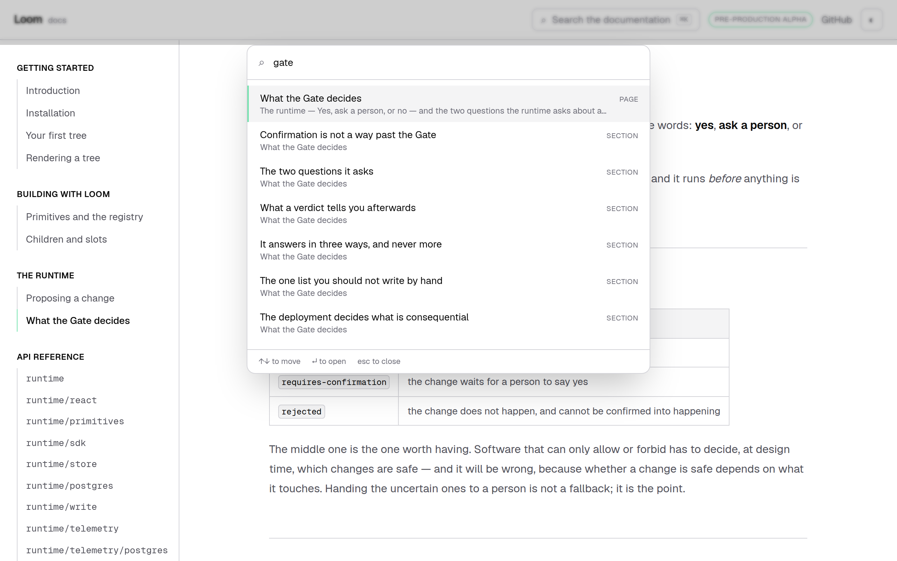
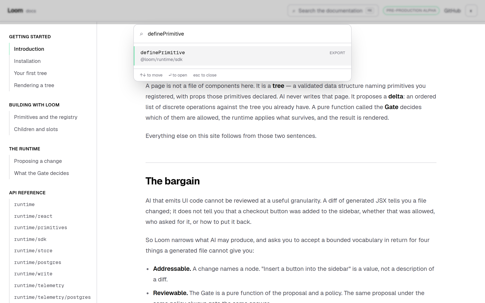
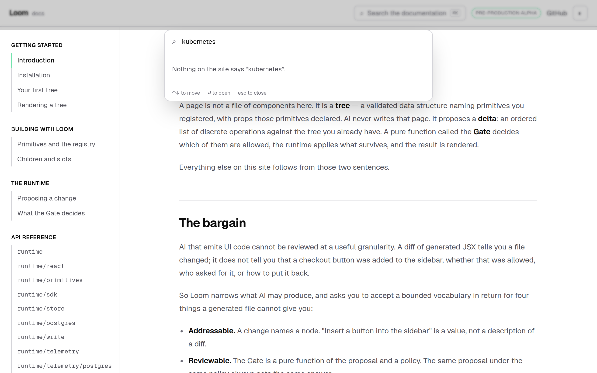
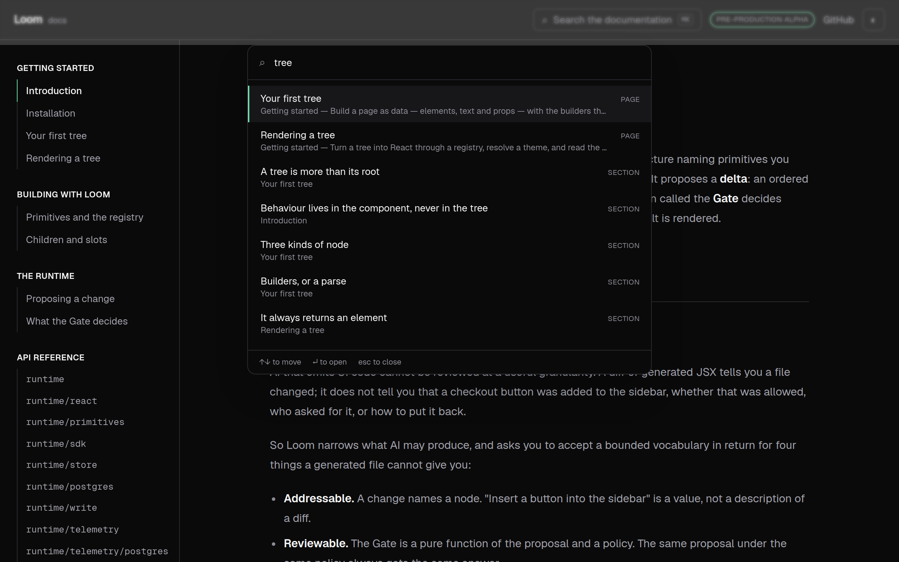
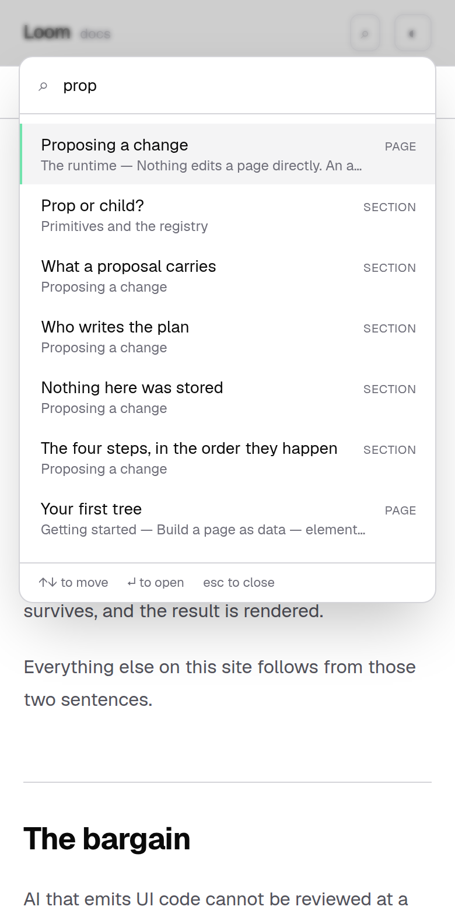

# 22 August 2026 — the site can be searched, and it answers a stranger first

**Routine:** `Loom docs` · **Branch:** `docs-07-search` · **Section:** §4c

The documentation site had a persistent rail, prose in MDX, callouts,
copy-paste code blocks, a pager at the foot of every page, and light and dark
themes. It had no search — the last item on the brief's list of what
`nextjs.org/docs` does, and the only one nothing had been built for.

It has one now: `⌘K`, a combobox over **813 findable things**, and a ranking
rule with an opinion.

## The one decision worth arguing about

The first version I built ranked by relevance and nothing else, and it was
wrong. Typing `gate` returned the exports `gate`, `GatePolicy` and
`gatePolicySchema` — one exact match and two prefix matches, all scoring higher
than a page whose title merely *contains* the word — and only then **What the
Gate decides**.

That is defensible arithmetic. It is the wrong answer for this site, and the
brief says why in a sentence:

> *"a reader arrives here knowing nothing"*

Somebody who types `gate` does not yet know what a Gate is. Making them scroll
past three symbol names to reach the page that tells them is the same failure as
opening a page with `TreeDelta` and `disposition`, arriving through the search
box instead of through the prose.

So the rule is a **band**, not a bonus, and it is one a person can repeat:

> **The site's own pages and sections come first. The API names follow.**

No relevance score can lift a name above a page, which is what makes it a rule
rather than a tuning. **Nothing is hidden by it**: a reader who wants
`definePrimitive` types `definePrimitive`, no page or heading is called that, and
the export is the first and only result.

I found this by looking at a screenshot, which is the second time in three runs
that a docs defect was invisible to every test and obvious in a picture. The
test that now holds it is written from the failure: *puts prose above a name even
when the name matches exactly and the page does not.*

## What is findable, and what is not

| | how many | where it comes from |
| --- | --- | --- |
| Pages | 21 | `nav.ts` — already the one statement of what the site contains |
| Sections | 41 | every `##` and `###` on a written page, read off the page |
| Exports | 751 | the generated API reference, which comes from the runtime's own declarations |

**Nothing in that table is typed by hand.** A page renamed, a heading rewritten
or an export removed changes what is findable *in the same commit that changes
the thing*. That is the same rule the API reference and the Architecture section
already run on, and it is why this is 813 entries rather than a list somebody has
to remember to update.

**No prose is indexed**, and that is a limit rather than an oversight. Searching
`vocabulary` finds nothing, because no page or heading is called that even though
the introduction's best paragraph is about it. Indexing the body means shipping
the site's words to the browser a second time and wants a posting list rather
than a list of strings — a different piece of work, filed rather than slipped in.

## Every result had to go somewhere real

Two things were needed before a search result could land on the paragraph a
reader wanted rather than at the top of a page they then have to scan.

**Headings had no `id`.** `rehype-slug` now runs in the MDX pipeline, declared
in `app/(docs)/_lib/mdx.ts` beside the remark list that has been there since GFM
landed. `/docs/the-runtime/what-the-gate-decides` now carries
`id="the-two-questions-it-asks"` and six more.

**Two slug algorithms had to agree.** `rehype-slug` mints the id on the page;
the index mints the id in the link. Nothing forces them to match, and a mismatch
does not fail — it loads the page and drops the reader at the top, which reads
as a search that is simply not very good. So they are held together by a test
that **compiles every one of the site's 41 headings through the real plugin
list, pulls the `id` back out and asserts it is the one the index wrote.**

## The index is free until somebody asks for it

`/docs/search-index` is a `force-static` route handler: assembled once by
`next build`, deployed as a JSON file, served from a CDN. The dialog fetches it
on the **first open** and keeps it.

This is the whole reason it is a route and not a prop. Handing the index to the
layout would put 117 KB in the payload of every page on the site for the sake of
the readers who open the search box. A reader who never searches now downloads
none of it, and a test asserts the fetch has not happened before the box is
opened.

The same accounting is why an export carries its **name and its entry point and
not its summary**. There are 751 of them; the summary is what a reader wants
once they have arrived, and arriving is a page load away.

## Keyboard first, because that is who searches a reference

`⌘K`, `Ctrl+K` and `/` open it; arrows move and wrap; `Enter` goes; `Escape`
closes and **returns focus to the button that opened it** rather than to the top
of the document. The active row is marked twice — `aria-selected` for a screen
reader and a mint edge for everyone else — which is the rail's rule applied to a
list.

Two smaller things, both caught by writing the test rather than by using it:

- The dialog claims `aria-modal`, so it has to mean it. Every result link is
  `tabIndex={-1}` and the scrim is not a tab stop, which leaves the field as the
  only one — and `Tab` is held there. Without it, tabbing walks out of an open
  modal into the page behind, which is the one thing `aria-modal` promises does
  not happen.
- A result is a real `<a href>`. Somebody who wants the reference in a second tab
  middle-clicks it, and a row that only answered a click handler would quietly
  not be one.

Loading, nothing-found and could-not-load are three different sentences. A box
that shows an empty list for all three teaches a reader that the site has
nothing on the subject.

## The build error worth writing down

`new URL("../../docs", import.meta.url)` — the idiomatic way for an ESM module
to find itself — **fails `next build` outright**. Turbopack reads it as an asset
import and tries to resolve `../../docs` as a module specifier, so the build
stops with a module-not-found naming a directory that plainly exists.

`architecture/source.ts` already avoids this by walking up from `process.cwd()`,
and its comment gives a different (also true) reason — that vitest and
`next build` run from different directories. So the repository had the fix
without the reason, and this run lost a build to writing the obvious line first.
Filed, with the suggestion that the next lane should not have to rediscover it.

## On a phone it matters more, not less

At 390px the trigger is the magnifier alone, and it is the only control in the
header that does not stand down — the alpha badge and the repository link both
do. That is deliberate: the rail is behind a menu at this width, so search is
the *only* way to reach a page without first opening something else.

## No decision record

Search is chrome. 0067 names the sidebar, the search and the pager together as
application furniture — the part of this surface that is explicitly *not*
composed from Loom primitives, because it is how a reader reaches the pages
rather than something a page is configured to have. Building the thing that
record already anticipated is not a new decision.

The ranking band is the one judgement in here that a maintainer might want back,
and it is the open question below rather than a record. It is a line of code and
a test, reversible in a minute.

## Tests

`pnpm install && pnpm verify` at the repository root, **green**:

| Suite | Files | Tests |
| --- | --- | --- |
| `@loom/runtime` | 101 | 1504 |
| `@loom/app` | 96 | 1177 |

**52 new tests in 4 new files** (application suite 1125 → 1177). Nothing failed,
nothing was skipped, no test was weakened. Everything above is from a clean
`rm -rf .next` build, and the screenshots are of that build being served.

What they hold, in the order they matter:

- **No result goes nowhere.** Every one of the 813 hrefs is decomposed and
  checked: the page against the navigation, the fragment against the headings
  really on that page, the export against the reference's own list of names.
- **The two slug algorithms agree**, on every heading on the site, compiled
  through the plugin list the build uses.
- **Prose outranks a name**, including the exact-match case that made it a band.
- **The index is not fetched until the box is opened**, and is fetched once.
- The index round-trips through JSON, refuses a body that is not one, and stays
  under 150 KB — asserted, because it is a bill every reader pays.
- No two headings on one page share an id, so the simple slugger stays correct
  or says so.

## Findings

**Filed:** the Turbopack `import.meta.url` failure, for `Loom daily build`.
**Filed:** the third consecutive run whose diff crosses into `next.config.ts`,
as an update to the 21 August entry rather than a new argument. **Filed:** that
the search sees no prose, mine, with what it costs and what it would take.
**Filed:** no framework gaps — `src/` was not opened and no `LoomTree` changed.

**Closed:** none. Nothing in the queue was owned by this lane.

## Open questions

Two, both in the pull-request comment with a recommendation. Whether the
prose-first band is the right call when it means a common word like `gate` fills
all ten slots with one page and its sections; and whether the next thing this
section gets is full-text search or the next written page.
