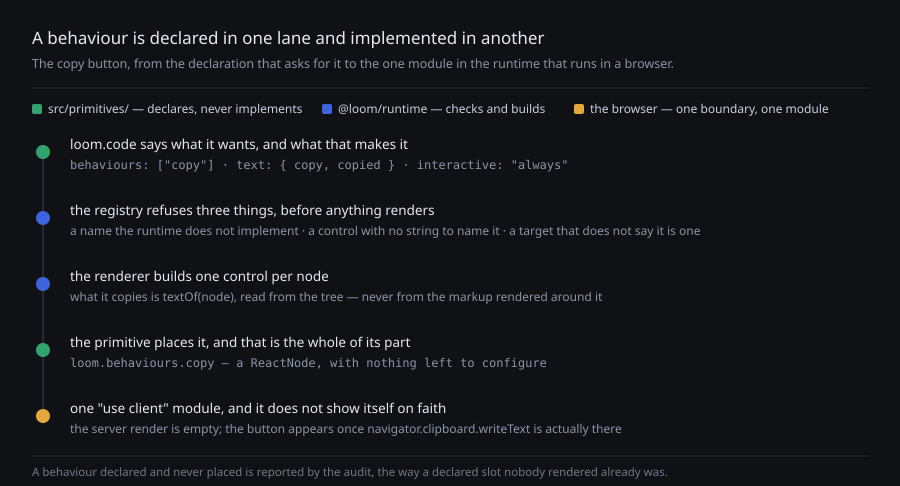

# A behaviour is a control the runtime builds and a primitive places

**Date:** 2026-08-22 · **Routine:** `Loom daily build` · **Section:** §4b ·
**Branch:** `framework-06-a-behaviour-is-a-control-the-framework-owns`



## First: the migration, and what outranked what

**The one-application migration is done, and was done before this run started.**
`apps/loom` holds `(marketing)`, `(docs)`, `(lessons)`, `(portal)` and `(demo)`;
`apps/portal`, `apps/docs` and `apps/marketing` are retired; sign-in is
middleware at the `(portal)` boundary; one Vercel deployment. It landed on
#95/#98 on 19 August. **The tree is not half-migrated** — the three routines
waiting on that shape have not been waiting since then.

No open pull request carried a maintainer comment, so nothing outranked the queue
underneath the migration: open findings owned by this lane. There were three that
are genuinely actionable, and this closes the one that four surfaces want.

## What was done, in plain language

`Loom primitives` filed a finding on 21 August: **a code panel cannot offer a
copy button, and the fake would be worse than the gap.** Every reference site a
developer reads puts a copy control on its snippets — `nextjs.org`'s most
load-bearing element is the `npx create-next-app` line under its hero, and it
copies. `loom.code` shipped without one, and the finding was explicit that a
`loom.action` pointing at the snippet would be worse than nothing.

The reason was structural. A copy button needs almost no state: one handler
calling `navigator.clipboard.writeText`, and a label that changes for two
seconds. What it needed was **somewhere for a behaviour to come from**. A
primitive's props are JSON, and a function is not expressible in JSON.
`interactive` is the closest thing in the contract and it is not this — it
*describes* a target so the Gate can refuse a bad nesting, and describing one
does not create one.

**So this is the fourth gap of a shape §4 has answered three times.** §4e is a
question props cannot ask, §4f is a string props must not hold, §4g is an address
props may not name. A behaviour is an interaction props cannot express at all,
and it is now a seam beside those three: `loom.behaviours`, next to `loom.data`,
`loom.text` and `loom.submit`.

**A behaviour is a control this package implements, a primitive declares by name,
and the renderer hands over already built.** `loom.code` will gain three lines
and no imports:

```ts
text: { copy: "Copy", copied: "Copied" },
interactive: "always",
behaviours: ["copy"],
```

and place `loom.behaviours.copy` wherever it wants it. Nothing in
`src/primitives/` opens a client boundary or implements a handler.

**Four checks came with it**, three at registration and one by probe, and each is
a bug that would otherwise be found on a page:

- a behaviour name the runtime does not implement
- a primitive that takes a control and declares no strings to name it by — so the
  control is translatable through the dictionary the deployment already has
- a primitive that takes a control and does not declare itself `interactive`.
  **This is the one that matters.** A code panel with a button, inside a
  `loom.card` with an `href`, is a `button` inside an `a` — and a browser does not
  report that, it silently drops one of the two. Without the check, a primitive
  growing a button would leave the Gate approving exactly that nesting.
- a behaviour declared and never placed, reported as `unplacedBehaviours` the way
  a declared slot nobody rendered is reported as `unplacedSlots`

**Two things the control does that are worth knowing before wiring it.** It
copies `textOf(node)` — the node's own text, read from the **tree** — so a
language label or a caption rendered beside the listing does not end up on
someone's clipboard, and it is right before the browser has laid anything out.
And **it renders nothing until it knows the clipboard is there**: the server
render and the first client render are both empty, and the button appears from an
effect. That is this finding's own bar taken literally — an insecure origin, an
old browser and a page served with scripting off are three ordinary ways to get a
button that looks like it copies and does not.

## The question the finding could not answer, and how it was answered

The finding ranked three shapes and said of the first — *the registered component
owns it, like the animations do* — that it "needs the render seam to permit a
client boundary inside a primitive, **which is the part I cannot check from this
lane**."

It was checked, not assumed, and it was checked before anything was decided:

- **TypeScript keeps the directive.** `"use client"` is emitted at line 1 of
  `dist/render/behaviour-copy.js`, above the imports. `dist.smoke.test.ts` now
  asserts that, because the whole seam rests on it and a compiler upgrade that
  moved it would fail in somebody else's application build rather than here.
- **Next resolves the boundary through the registry.** `src/primitives/loom.code.ts`
  was temporarily wired to declare and place the behaviour, `next build` was run
  against `apps/loom`, and it compiled — with the control bundled into client
  chunks, so the boundary really opened rather than being tree-shaken. That edit
  was then **reverted**; it is in no commit.

**So the answer is yes, and the shape that shipped is still the second one.**
Those are separate answers. What the first shape gives up is the closed set: a
library where any component may open a boundary has no list of what its pages
*do*, and nothing to check a declaration against — including the `interactive`
check above, which is the one with a silent failure behind it. Establishing that
the cheap shape works and then declining it is what makes this a decision rather
than a guess, and it is worth repeating the next time a lane files something it
cannot check from where it stands: check it, then choose.

## Decisions I made that nothing specified

**`loom.behaviours.copy` is a `ReactNode`, not a component.** There is nothing
left for the primitive to configure — the strings came from its own declarations
and the content from the tree — so a component would have exactly one correct
call, and would give the placement probe a second shape to understand.

**The control's strings are the primitive's declared text**, rather than strings
the behaviour owns and a host translates separately. The alternative would have
been a second dictionary keyed by behaviour rather than by primitive. This needs
no new machinery at all: `copy` requires the keys `copy` and `copied`, the
registry refuses a primitive that takes the behaviour without them, and a German
deployment translates the button with the dictionary it already has.

**A behaviour whose name a dictionary blanks is dropped and reported**, not
rendered nameless (`behaviour-unnamed`). The dictionary schema refuses the empty
string but accepts whitespace, so this is reachable rather than defensive. A
control a screen reader announces as "button" is worse than no control — which is
the finding's own standard, applied to the thing that closes it.

**`probeSlotPlacement` is now `probePlacement`.** It answers about slots, children
and behaviours; the old name would have been misleading to the next reader. It is
a rename with no behaviour change and no caller outside this package.

**`jsdom` was added as a devDependency.** The copy control is the one module in
this package that runs in a browser, and testing it with `renderToStaticMarkup`
would only ever prove it renders nothing. Nothing ships it and nothing else
imports it.

**I did not touch `src/primitives/`.** The seam has one member and no user in the
library yet, which is the state finding 2530 warned about — but this is not that
case: the lane that will use it is the lane that asked for it, and the declaration
belongs in the same change as the button.

## Records

**Added
[0086](../decisions/0086-a-behaviour-is-a-control-the-runtime-builds-and-a-primitive-places.md)**
— *A behaviour is a control the runtime builds and a primitive places.* Accepted.
Nothing superseded; nothing contradicted. It extends 0055's bargain from motion
to behaviour, and reaches the same conclusion 0053 and 0055 both reached about
what a tree may say.

**This is the third open pull request claiming `0084`** — #132 and #133 have it
too. I took the next *free* number on `main`, as the brief says, because the next
*unclaimed* one would be a gap the guard refuses and a red branch. Two of the
three get renamed on merge; the guard fires loudly on a duplicate, so it cannot
slip through.

## Findings

**Closed:**

- **`Loom primitives`, 21 August** — *a code block cannot offer a copy button.*
  The seam is built and the open question is answered; the button is three lines
  in that lane's own file, spelled out in the entry.

**Filed:**

- **`Loom primitives`** — `loom.code`'s own module comment says a copy button
  "needs a click a tree cannot express", and it is in the published API
  reference. Now wrong in its premise and right in its standard. Left for the
  same change that places the control.
- **`@jonathanbravecredit`** — dated into the existing 21 August
  record-numbering entry rather than opened separately: three concurrent claims
  on `0084`, after five collisions the day before. Both symptoms have the same
  one-line fix, which is not one routine's to make.
- **`Loom daily build`** — the framework wanted nothing from another lane this
  run, plus the two notes above about the experiment and the devDependency.

**Still open and not taken, deliberately:** the §4g submission audit (2530) is
still blocked on `loom.form` in another lane declaring `submits: true`, which is
the same reason it was not taken on 20 August.

## Test numbers

`pnpm install && pnpm verify` — **green**, from a clean install.

- `@loom/runtime`: 103 files, **1531 tests**, all passing (1504 → 1531)
- `@loom/app`: 92 files, **1125 tests**, all passing
- `next build` compiled successfully

Twenty-seven new tests: seventeen on the seam (`behaviour.test.ts` — vocabulary,
resolution, the three registration refusals, the audit probe, the diagnostic),
seven on the control in a real DOM (`behaviour-copy.test.ts`), two on `textOf`,
and one in the dist smoke test for the client directive. Nothing skipped, no test
weakened, nothing failed.

**Two files outside this lane changed, both because their own tests said to** —
the fifth and sixth time this has been recorded. `reference.generated.json`
regenerated by `pnpm --filter @loom/app docs:api`, because the published surface
moved; and `FACTS.decisions` in `(marketing)/_lib/copy.ts` from 83 to 84, because
a record was added. Both are one line, both are mechanical, and each test names
its own fix.

## Open questions

**Does the copy control belong in the panel's bar or over the listing?** That is
a design question in the primitives lane and this deliberately does not answer
it: `loom.behaviours.copy` is a node, and where it goes is entirely the
primitive's choice. Nothing about the seam changes either way.

**Should the vocabulary grow, and on what evidence?** It has one member. The
candidates a documentation site suggests — a disclosure that remembers, a tab
strip, a theme toggle — are all *state* problems rather than behaviour problems,
and 0055 already answered the first of them with `<details>`. My position is that
a second behaviour should wait for a second finding, not for a second idea.

**`rendersControl` is `true` for everything in the vocabulary.** The field earns
its place only when something is `false` — a behaviour that renders nothing and
attaches to what is already there. Nothing needs one; it is a field with one
value and a stated reason, which is a thing to revisit if the second member also
renders a control.

**The record-numbering governance question is still open**, and now has a second
symptom rather than a first. Three concurrent claims on one number is not a
problem in itself — the guard catches it — but it is two routines a day each
spending part of a run rediscovering that the alternative is a red branch.
