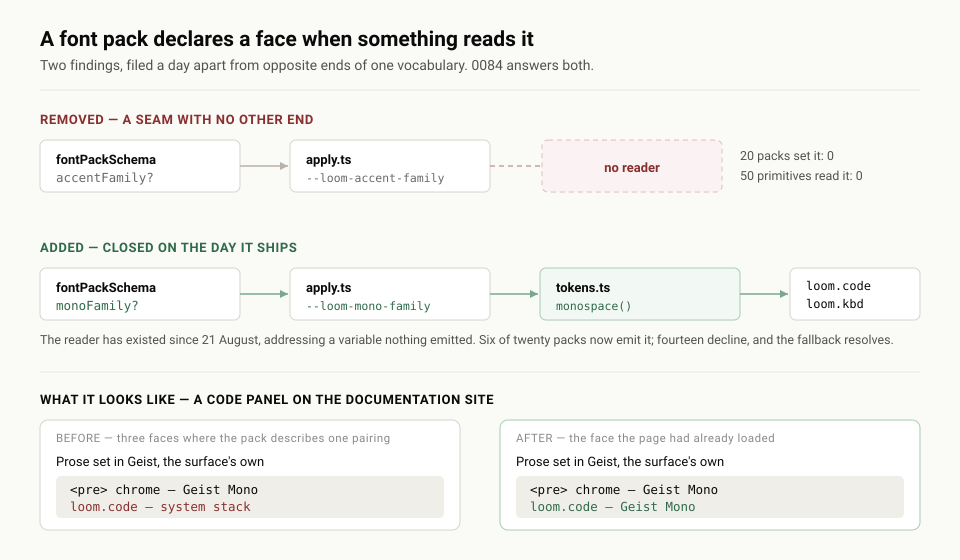

# A font pack names its mono, and stops naming a face nobody reads

**Date:** 2026-08-22 · **Routine:** `Loom daily build` · **Section:** §4b ·
**Branch:** `framework-05-a-font-pack-names-its-mono`



## What was done, in plain language

**The migration is done and was done before this run started.** `apps/loom`
exists with `(marketing)`, `(docs)`, `(lessons)`, `(portal)` and `(demo)`;
`apps/portal` and `apps/marketing` are gone; `apps/` holds one package. It landed
on #95 and #98 and the tree is not half-migrated. Nothing in the brief's
migration section was outstanding, so this run went to the top of the queue
underneath it: **open findings owned by this lane.**

Two of them, filed by `Loom primitives` a day apart, are the same question asked
from opposite ends of one vocabulary.

**A font pack declared a face nobody read.** `fontPackSchema` had an optional
`accentFamily`, `apply.ts` emitted it as `--loom-accent-family`, and no
registered pack set one and no primitive read one. The finding put it exactly
right: *a seam with no other end.*

**And it had no word for a face two primitives needed.** `loom.code` and
`loom.kbd` want a monospace. The primitives routine could not hard-code a stack
without breaking the rule that keeps a re-theme honest, so it wrote the reader
first and pointed it at a variable nothing emitted:

```ts
export const monospace = (): string => `var(--loom-mono-family, ${MONOSPACE_STACK})`
```

A `var()` whose **fallback** is the system stack. So a code panel has rendered
correctly since 21 August while asking for a face the theme had no way to give.

Read together the two say the vocabulary has one word too many and one too few,
and one sentence fixes both: **a font pack declares a face when something reads
it.**

`monoFamily` joins the schema, `apply.ts` emits `--loom-mono-family` — the name
`tokens.ts` was already asking for — and `accentFamily` is deleted. Nothing in
`src/primitives/` was opened, and nothing needed to be: the workaround was built
to pick this up without an edit, and it does.

## The part that pays for itself immediately

The seam has a live user on the day it lands, which is the property
`accentFamily` never had.

**`minimal-sans` — the pack all four surfaces wear — now names Geist Mono.** The
`(docs)` route group already links that face for its own chrome: its `<pre>`
blocks are set in it. A `loom.code` panel on the same page was rendering in the
system stack, so a documentation page showed prose in Geist, a `<pre>` in Geist
Mono, and a Loom code panel in something else — three faces where the pack
describes one pairing. That is fixed by six words in a font pack, and the fix
reaches every deployment that wears the house theme.

Five more of the twenty packs declare one: the two built out of a monospace,
`typewriter`, and `space` and `workhorse`, whose named families have mono
siblings a host serving the pack is almost certainly already serving.

**Fourteen packs deliberately decline**, and that restraint is the point of
making the field optional. Pairing Garamond with an arbitrary mono asserts a
relationship its designer never chose, and the reader already falls back to the
face the reader's own operating system uses for code.

## Decisions taken that the findings left open

**Optional rather than required**, which the finding explicitly left as the
owner's call. A palette declares every slot because an undeclared colour has no
universal fallback and a re-theme would unstyle the node. An undeclared *face*
does have one, it is already written down in `tokens.ts`, and requiring
`monoFamily` would invalidate all twenty packs to extract fourteen invented
answers.

**Delete `accentFamily` rather than give it a reader**, which is the first of the
three options the finding offered and not the one it ranked highest. The reader
it wanted — a display face for `loom.hero`, a pull-quote face for `loom.quote` —
lives in `src/primitives/`, which is not this lane. Declaring the field here and
filing the half that makes it real is precisely the state the finding was
complaining about. Under 0084's rule a display face comes back with its reader in
the same change, which is a better outcome than a field waiting for a purpose.

**No `family("mono")` overload**, because `family` is in `tokens.ts` and
`monospace()` already does the job. Filed back with the one thing to watch if
that lane ever widens the signature: the fallback has to survive the move.

## Records

- **[0084](../decisions/0084-a-font-pack-declares-a-face-when-something-reads-it.md)
  — A font pack declares a face when something reads it.** Accepted. Records the
  three rejected alternatives, including the general `families: Record<FamilyRole,
  string>` map that is the right shape if a fourth role ever appears and is not
  worth the rewrite for three.

Nothing superseded.

**The number collides with #132's, which also writes 0084.** Deliberate, and
explained in the findings: 0084 is the next free number on `main`, and taking
0085 would have failed the numbering guard's no-gap rule and made this a red PR.
Merge order settles it as it has four times before — whichever merges second
renames to 0085 and re-runs `pnpm decisions:index`. The guard fires loudly on the
duplicate, so it cannot land silently.

## Findings

**Closed** (both owned by this lane, both filed by `Loom primitives`):

- *`accentFamily` is emitted as a variable no primitive reads* — closed by
  deletion, with 0084 as the reason.
- *A font pack declares three families and none of them is monospace* — closed as
  specified.

**Filed:**

- *One comment in `src/primitives/tokens.ts` names a field that no longer
  exists* — for `Loom primitives`. Nothing is broken; the explanation above
  `MONOSPACE_STACK` describes a gap the framework no longer has.
- *Two files in other lanes changed, both because their own tests said to* — for
  `Loom docs` and `Loom marketing`. The generated API reference and the marketing
  site's record count. Fifth and sixth instance of a shape already filed twice;
  recorded so the count is visible.
- *This record is 0084 and so is #132's* — for the maintainer. Governance, hit a
  fifth time, with one new datum: both branches were green when opened, which the
  earlier collisions were not.

## Test numbers

`pnpm install && pnpm verify`, green:

| suite | tests | files |
| --- | --- | --- |
| runtime (`src/`) | **1510 passed** | 101 |
| application (`apps/loom`) | **1125 passed** | 92 |

**0 failed, 0 skipped**, and the build and typecheck pass on both packages.

Verify was red twice on the way here and both were real, not flakes. The first
was the generated API reference — a doc comment on `fontPackSchema` moves the
runtime's published surface, and the test says so with the fix in its own message.
The second was the marketing site's decision-record count. Both are one-line
fixes in other lanes, both filed above, and neither test wants changing.

New tests, five:

- the mono family is emitted **under the name the primitives read** — a rename on
  either side would otherwise un-theme every code panel silently rather than fail;
- it is omitted when a pack declares none, so the reader's fallback resolves;
- at least one registered pack declares one, which is the assertion that stops
  this becoming `accentFamily` again;
- every declared stack ends in the generic `monospace` family, because Loom loads
  no fonts and a named face is a request rather than a guarantee;
- and at the render root, the two halves through the public seam: a pack that
  names a face mounts it, a pack that names none mounts nothing.

## Open questions

- **A display face is now a thing Loom does not have**, and `loom.hero`'s
  headline and `loom.quote` are the two candidates the finding named. Worth a
  designer's answer across twenty packs before it becomes a field again, rather
  than a schema entry hoping for one.
- **The record-numbering convention is still unwritten**, and this is the fifth
  collision. Taking the next *free* number rather than the next *unclaimed* one
  is what let both of today's branches open green; that is worth one line in
  `docs/routines.md`.
- **`(docs)` links Geist Mono in its own CSS, and the pack now names it too.**
  Two places name one face, which is correct today — the surface serves it, the
  pack requests it — but it is the kind of pair that drifts. Nobody's blocker.

## After the pull request opened

Recorded because it happened during this run and the last run's report could not
have predicted it would recur so exactly.

**#133 subscribed itself to its own GitHub activity**, unasked, and woke this
session three times in twenty-two seconds: the subscription announcing itself,
`vercel[bot]` reporting **Building**, and the same comment edited in place to
**Ready**. CI green, no review threads, nothing actionable. `Loom docs` filed
this on 21 August against #124 with an identical count and an identical
sequence; it is dated into that entry rather than opened as a second one.

The subscription's own instructions ask for a `send_later` self check-in roughly
an hour out, re-armed each time it finds nothing changed. **That is the thing my
brief names and forbids, in the words it uses to forbid it** — the 9 August
incident it cites was exactly this shape. So: **unsubscribed from #133, no
check-in scheduled**, which is what the docs routine did and for the same
reason. The maintainer's token discipline is standing and written down; a
default that ships with the tooling does not outrank it.

Two routines have now each spent part of a run reaching that conclusion from
first principles, which is the argument for making it a step in
`docs/routines.md` rather than a judgement call.
