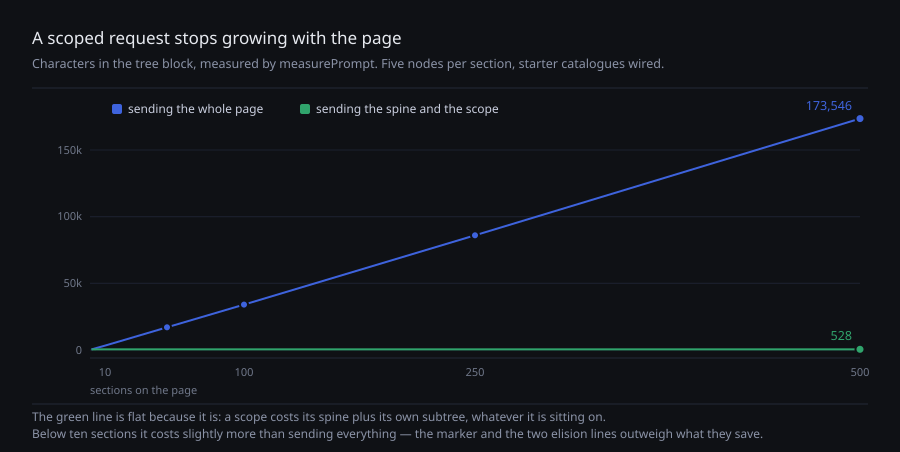

# A scoped request sends the scope

**Date:** 2026-08-22 · **Routine:** `Loom daily build` · **Section:** §2 ·
**Branch:** `framework-04-a-scoped-request-sends-the-scope`



## What was done, in plain language

The maintainer read #130's numbers and asked the question they invite: **is there
a performance concern as pages get bigger?**

There is, and it was not the one the table suggested. This is the answer and the
fix.

**The growth itself is fine.** Measured with `measurePrompt` — which #130 shipped
the day before, and which is the only reason this took minutes rather than a run
— the outline is linear at about 68 characters a node. No surprises. The
catalogue sizes that prompted #130 *invert* as pages grow: the theme block is a
fifth of a marketing page and a thirtieth of a large one.

**Two properties were already right**, and are worth naming so nobody
"simplifies" them away. The message is assembled constants-first — primitives,
themes, tree, request — so the 16,858 fixed characters form a **cacheable
prefix**. And context exhaustion is not the near wall: a 200k-token window is
roughly two thousand sections away.

**The problem is that the tree is the one block a cache can never hold.** It
changes with every revision, it is re-sent on every proposal, and
`buildRepairMessage` embeds `buildUserMessage` whole, so a refused-then-repaired
intent sends the whole page twice.

**And the lever that should have bounded it did the opposite.** `scopeNodeId`
says the change is confined to a subtree. `renderTree` rendered the **entire
tree** with a `<- scope` marker on one line — so scoping a change to one card on
a five-hundred-section page still shipped all 173,546 characters, and cost
**eleven characters more** than not scoping it. The affordance that looked like
the answer was, measurably, worse than nothing.

**Now a scoped render sends the spine and the scope.** Each ancestor contributes
its own heading; its other children collapse to one line per side:

```
tree t_1 revision 0
n_7 element loom.page title="Home"
  … 1 preceding child omitted
  n_5 slot main
    n_4 element loom.card elevation=1 variant="outlined"   <- scope
      n_3 text "Body copy"
  … 1 following child omitted
```

The spine stays because a delta names a parent id and a model that cannot see the
chain cannot write an operation that lands. There are **two counts rather than
one** because the preceding count *is* the scope node's index among its siblings,
which is what an insert beside it would have to name. And the elision is stated
rather than silent — a model shown a subtree with no sign that anything was
removed is being told this is the whole page.

## The measurement

Five nodes per section, starter catalogues wired, scope on a section in the
middle.

| sections | tree, unscoped | tree, scoped | whole request, unscoped | scoped | saved |
| --- | --- | --- | --- | --- | --- |
| 1 | 414 | 425 | 17,319 | 17,404 | −0.5% |
| 10 | 3,400 | 502 | 20,305 | 17,482 | 14% |
| 50 | 16,993 | 515 | 33,898 | 17,496 | 48% |
| 100 | 34,043 | 515 | 50,948 | 17,496 | 66% |
| 250 | 86,046 | 523 | 102,951 | 17,504 | 83% |
| 500 | 173,546 | **528** | 190,451 | **17,510** | **91%** |

**A scoped request is now the size of what it may touch, whatever it sits on.**
What remains is dominated by the constant catalogues — the half a cache can hold.

The first row is not a rounding error and is in the table on purpose: **below
about ten sections a scope costs slightly more than sending everything**, because
the marker and the two elision lines outweigh the siblings they save. A surface
that scopes unconditionally on small pages pays a few characters for nothing.

## Decisions I made that were not specified

**Two counts, not one.** A single "48 children omitted" would have been one line
shorter and would have destroyed the model's ability to name an index for an
insert beside the scope. The split costs one line and keeps the arithmetic
available.

**The elision is a sentence, not a silence.** The cheapest implementation just
drops the siblings. That produces a tree the model cannot distinguish from a
small page, which is the failure mode I would least like to debug from a
telemetry record.

**A scope that names a node the tree does not contain renders the whole tree.**
It is a caller error, and 0008 does not let a total projection throw. The old
behaviour for a bad id was the whole tree with an unmatched marker; this keeps
it, and there is a test that says so.

**I did not make anything set a scope.** Deciding a scope from an utterance is a
judgement about what the person meant, not a rendering concern, and a renderer
guessing at it would silently narrow what the model may propose. Filed for the
portal and the demo, both of which already know which node was clicked.

**I did not try to make the repair path cheaper.** It sends the page twice and
that is now the more expensive half. The obvious saving — send the tree once, refer
back to it — is a claim about a provider's conversation state, and 0005 keeps the
runtime on a seam that does not assume multi-turn state. Filed against my own lane
rather than reached for.

## Records

**Added [0083](../decisions/0083-a-scoped-request-sends-the-scope.md)** — *A
scoped request sends the scope, not the page it sits on.* Accepted. Nothing
superseded; nothing contradicted.

It is the number the 21 August governance finding said this lane was owed once
#129 landed, which it now has.

## Findings

**Filed:**

- **`Loom portal`, `Loom demo`** — a scope is now worth setting and no surface
  sets one, with the saving table and the two caveats (a scoped render cannot see
  a sibling; below ten sections it costs slightly more).
- **`Loom daily build`** — the repair path sends the page twice, and 0083 widens
  the gap between the scoped and unscoped paths rather than leaving it
  proportional.
- **`Loom daily build`** — no framework gaps this run.

**Nothing closed.** This did not come from a finding; it came from the maintainer
reading #130's numbers and asking a question.

## Test numbers

`pnpm install && pnpm verify` — **green**, from a clean run.

- `@loom/runtime`: 101 files, **1504 tests**, all passing (1497 → 1504; seven new)
- `@loom/app`: 92 files, **1125 tests**, all passing
- `next build` compiled successfully

Six new tests on the renderer and one on `measurePrompt`. The two that matter are
phrased as *"does not grow"* rather than as a number, so neither needs updating
when the outline changes shape. Nothing skipped, no test weakened.

## Open questions

**Should the omitted siblings be summarised rather than counted?** Types and
counts by type would let a model reason about the page it cannot see, at a cost
that grows with distinct types rather than with nodes. Nothing needs it yet and
it is additive to the line 0083 introduces, so it is recorded in the record's
alternatives rather than built.

**Is a scoped render too narrow for real instructions?** "Match the section
above" is not answerable from one, by construction. I believe that is correct —
it is what a scope *means* — but the first surface to wire scoping is the one
that will find out, which is part of why this is filed for the portal rather than
switched on centrally.

**The record-numbering governance question is still open**, untouched by this.
Today's instance cleared by the passage of time, which decided nothing.
