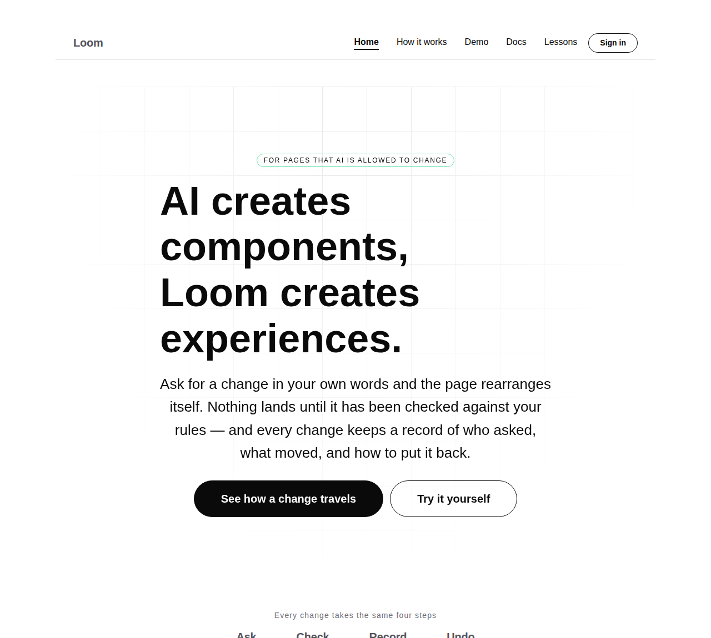
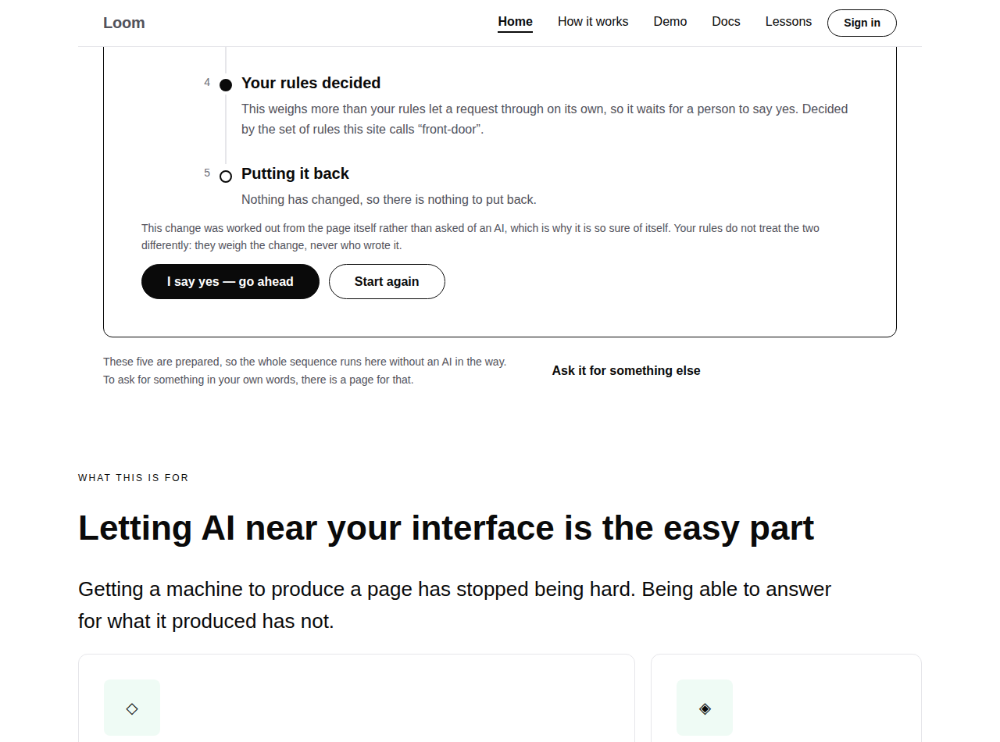
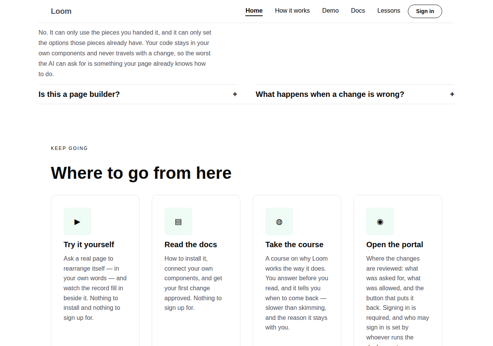
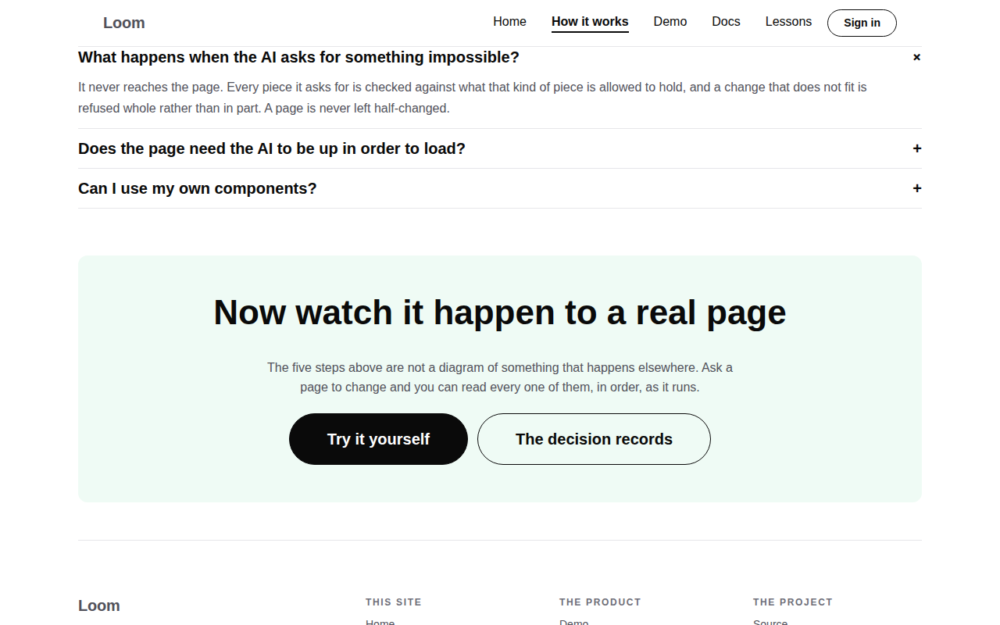
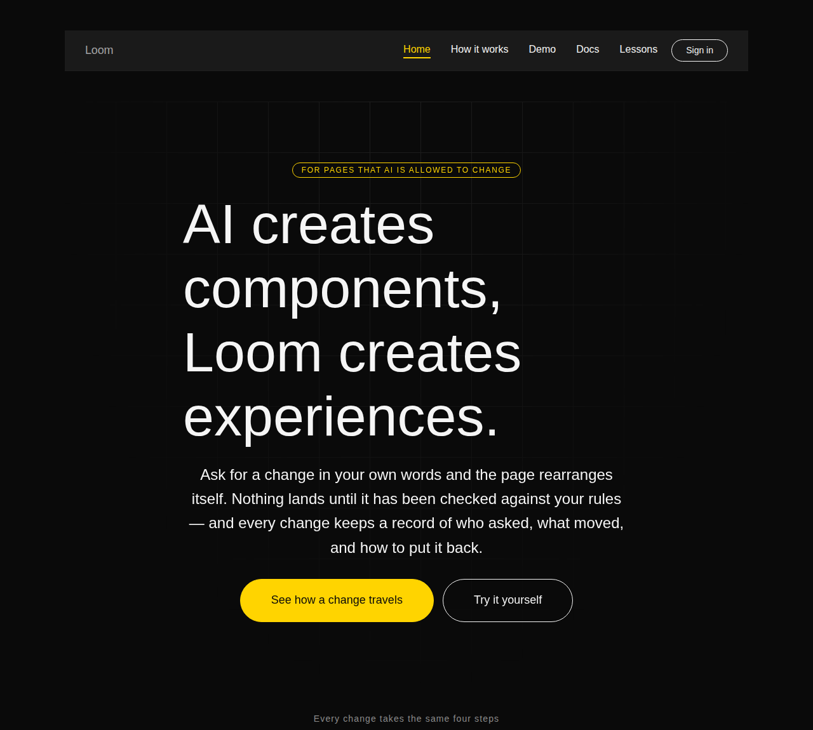
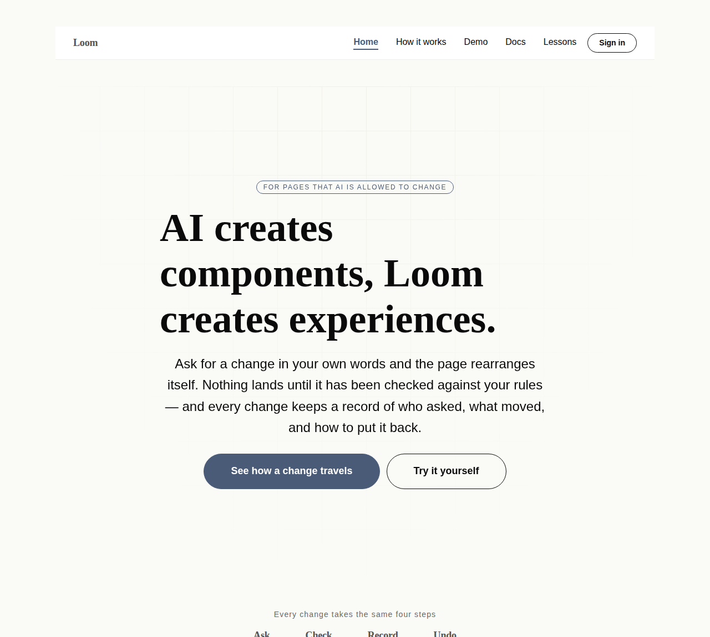
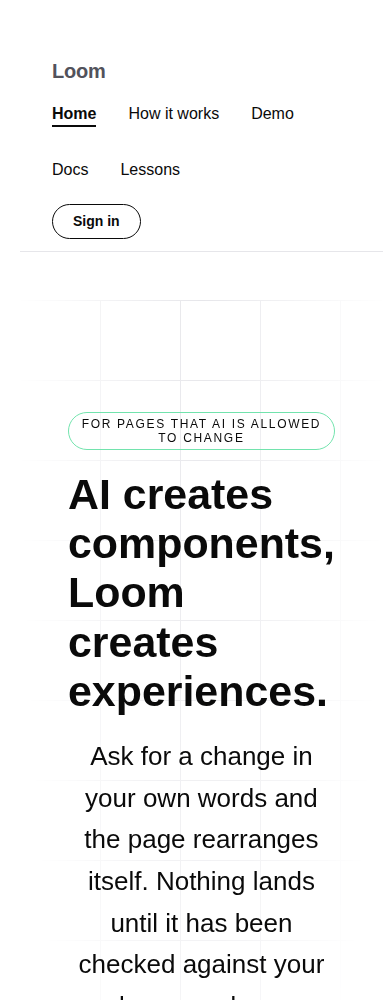

# 2026-08-22 — marketing: the front door leads to the demo

For five runs this site has argued for a claim, and for one run it has performed
a small version of it. The full version has existed since yesterday, at `/demo`,
public, and **nothing on this site linked to it from anywhere.**

`Loom demo` filed that finding when it moved the demonstration off `/portal/demo`
— a public page sitting at the one path that reads as private — and the finding
is worth quoting because it is larger than a stale href:

> It is also the single biggest gap between the demo and the people it exists to
> convince: the conversion artifact had no route from the front door.

This run closes it.

---

## What shipped

The demo is a `Surface` in `site.ts`, which is the whole of this lane's contract
with another one: a path, a label, a sentence, and whether a visitor meets a
door. Declaring it puts it in the header menu, the footer's map and the front
door's invitation band with no further edit — that is the design from #97 and
#117 paying off, and it is why this change is small.

Three placements are not automatic, and each is a different reader:

| Where | Who it is for |
| --- | --- |
| **The hero's second action** | The reader who is not going to scroll |
| **The foot of the band that demonstrates** | The reader who just watched a change happen and wants a turn |
| **The foot of `/how-it-works`** | The reader who has read all five steps and wants to see one |

Both of the places the finding suggested were taken, and the middle one is the
one this lane would have added anyway.

### The hero's second action was the repository

It is the demo now. The sentence directly above that button promises the reader
they can **ask for a change in their own words**, and the nearest thing this site
offered was a link to GitHub — answering *can I try it?* with *here is the code*.

Nothing was lost. The repository is still the closing band's second action, a
link in the facts band, and a named group in the footer: three ways from the
front door, none of them the first screen.

### The band's own limit, said out loud

This is the placement worth defending, because it turns a weakness into a route.

The band's five choices are buttons, and that is the only affordable shape for
this surface — a text box on the most-loaded page the project has is a model call
for every visitor and a dead button for every deployment with no key. It leaves a
real gap against the hero's promise, and that gap has been this lane's standing
open question since 20 August, with the same recommendation each time: *send
people somewhere built for typing rather than put the model here.*

There was nowhere to send them. There is now. So the band says why its choices
are prepared, and offers the page where they are not:

> These five are prepared, so the whole sequence runs here without an AI in the
> way. To ask for something in your own words, there is a page for that.

### The invitation band lost a card and reads better for it

"Where to go from here" held the three surfaces plus a fourth card pointing at
the repository. The demo made it five, and the grid wraps at four — so the odd
card would have sat alone on a second row, and it would have been the only card
in the band that is not a page of this product.

The repository card is gone and the band is now exactly `PRODUCT_SURFACES`.
That is asserted rather than left as an intention: the next thing tempted into
this band has to be a surface or has to change a test.

### The mechanism page's foot pointed at GitHub and at home

Someone who has just read five steps of how a change travels has one obvious next
question — *show me one* — and until yesterday this site had nowhere to send them.
The band is now **"Now watch it happen to a real page"**, with the demo primary
and the decision records secondary.

"Back to the start" is what the demo replaced, and it was the weakest of the
three: home is the wordmark, a menu item marked as current, and a link in the
footer's map. A fourth route to a page nobody is looking for is not a use of the
last band on a page.

## Decisions taken that were not specified

**The demo goes first in `PRODUCT_SURFACES`, not last.** The list is now ordered
by *what it asks of the visitor*: the demo costs a click, the docs a read, the
course an afternoon, the portal an account. The one that needs a door stays last
so everywhere a visitor *can* go is named before they meet one — which was the
old list's stated reasoning, extended rather than replaced. The demo went to the
front because it is the only one of the four that is the product working rather
than a description of it, and `rollout.md`'s own recorded position is that the
marketing site is the demonstration and not a brochure about it.

**No decision record.** Nothing here is expensive to reverse and nothing defines
what Loom is: a surface was added to a list that already existed for this, and
three link placements were chosen. 0067 and 0070 already say the four surfaces
are one application with this one at its root, which is the fact the whole change
rests on. Writing a record for "the front door links to the demo" would be
recording a consequence of a record that already exists.

**`src/` was not opened**, and no local component was written. Every node added
is a registered primitive.

## The test that was missing, and what it does not do

`site.test.ts` now asserts that **every `Surface` path is served by a `page.tsx`
in some route group.** A path is the entire contract between this lane and
another one, which makes it exactly the kind of agreement that rots silently:
the lane that moves a route is not the lane that links to it, and a marketing
page pointing into a 404 is invisible to every test either lane has.

It is checked against the route groups rather than by fetching anything, which
is sound because the four surfaces are one Next application and a route group
contributes nothing to a URL — `(docs)/docs/page.tsx` being on disk is the same
fact as `/docs` answering.

**Its limit, stated so nobody reads more into it.** It proves *a page answers*,
not that the right one does. Pointed at `/portal/demo` it passes, because that
path still exists as the `permanentRedirect` the demo lane kept deliberately. So
it catches a deleted route and not a demoted one. Verified by mutation both ways:
a path with no page fails it, `/portal/demo` does not.

## Tests

`pnpm install && pnpm verify` **green**: **1504 runtime, 1142 application**,
0 failed, 0 skipped, typecheck clean and `next build` succeeded across all five
route groups. Nothing was weakened.

Marketing suite **226 → 243**. The seventeen, by what they hold:

- **Every surface named here has a page on this deployment** — four, one per
  surface, and the guard described above.
- **The way to the demonstration**, ten: the hero offers it, the demonstrating
  band offers it, the mechanism page's closing band offers it, and it survives
  **every state of the front door** — untouched and each of the five choices.
  That last one is not ceremony: the band is rebuilt per choice, and a link that
  survived only the state nobody arrives at having used would be worse than no
  link, because the reader likeliest to want a turn is the one who has just had
  a change happen in front of them.
- **The invitation band is the surfaces exactly** — asserted as a sorted list of
  hrefs, so a card added to it has to be a surface.
- **The order of the list** — two: the first surface is one a visitor can try
  without an account, and every open surface comes before the guarded one.

Nine tests that already existed got stronger for free, because they iterate
`PRODUCT_SURFACES` rather than naming three destinations: the demo is now
required in the header, in the footer's map, on the front door's band with its
blurb, and on every page, in all three palettes.

## Both starter palettes, and a phone

No colour is named anywhere in the change, which the existing per-palette
assertions hold.

The phone screenshot is the one thing this run made worse, and it is filed rather
than hidden — see below.

## Findings

**Closed:** *the marketing site does not link to the demo at all, and now it can*
(`Loom demo`, 21 August). `linkUrlSchema` refusing relative URLs — which that
finding expected to get in the way — did not: `surfaceHref` has built absolute
origin-qualified hrefs since 19 August, so the existing workaround absorbed this
with no edit.

**Filed, for `Loom demo`:** *the demo has no way out of it*. `app/(demo)/`
contains exactly one `<a>` and it is the skip link. No `next/link`, no `href` on
anything else; the wordmark in `DemoBar` is a ``. That was survivable while
nothing linked in. As of this branch the front door offers `/demo` from **six**
places, and every one of them is a one-way door for the visitor who has just
decided they are interested. The bar's own comment says it says three things and
stops, and the third is *"where to go next"* — which it does not currently say.
Suggested, and none of it this lane's to write: the wordmark becomes a link home;
something at the end of the record rail for the reader who now wants `/docs`; and
**not** a full site header, because the bar exists precisely because the portal's
chrome was wrong here. **Not a blocker** — a cul-de-sac beats a demo nobody can
reach — and the links shipped without it.

**Filed, for `Loom primitives`:** *the wrapping nav is now three rows on a phone*.
The 19 August finding that accepted `loom.nav` wrapping priced the trade at a
menu of four to six links on **two** rows. Five items plus the sign-in action is
three rows at 390px, about a quarter of the first screen before any content. A
measurement against an existing decision rather than a bug, with the note that
this lane will not drop a surface from the menu to keep the bar short — every
surface reachable from every page is the property 0070 asks for.

**No framework gaps.** `src/` was not opened, and the change composes registered
primitives only.

## Open questions

- **Positioning, audience and licensing** — unchanged, still the maintainer's,
  still the one placeholder on the site.
- **The hero promises free text and now has somewhere to send people for it.**
  This is the closest that question has come to being answered by building rather
  than by deciding. What is still open is whether the *front door itself* should
  ever accept typing; this lane's recommendation remains no, and the demo is why.
- **`FACTS` still makes every other lane's run go red.** Not touched this run
  because the finding says the choice is not a routine's to make alone. Raised in
  the pull request with a recommendation.
