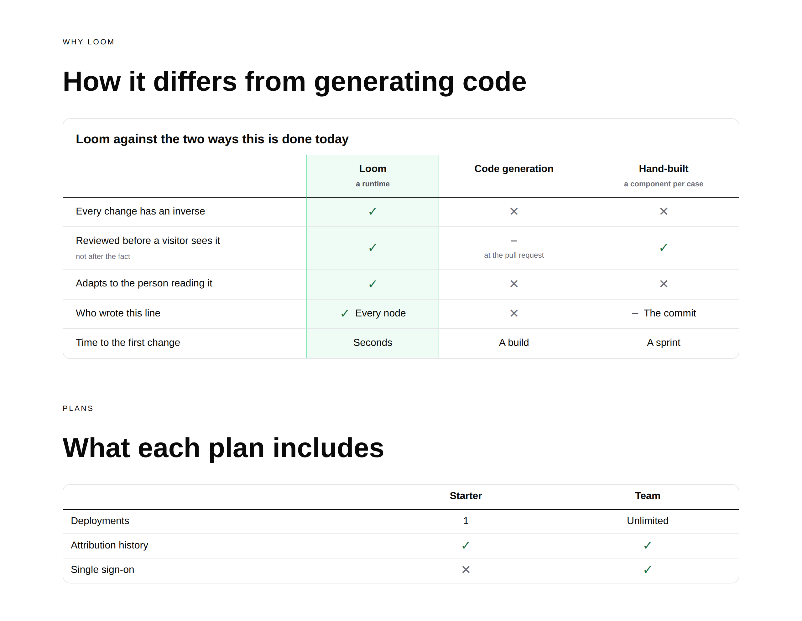
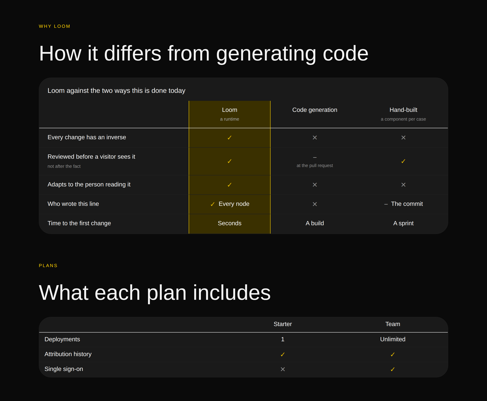
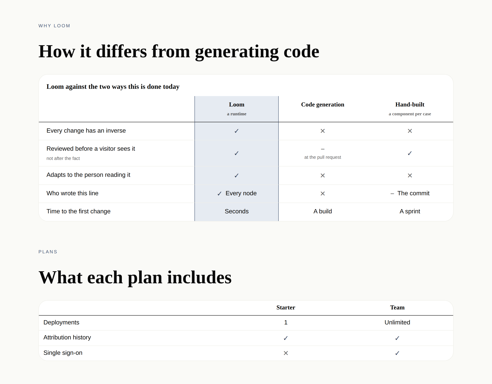
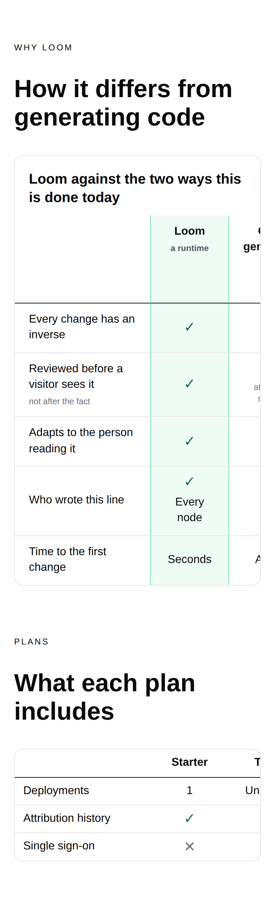

# 22 August 2026 — the comparison band, and the axis that does not get nodes

**Routine:** `Loom primitives` · **Section:** §4b · **Branch:** `primitives-10-the-comparison-band`

Three primitives — `loom.comparison-table`, `loom.comparison-row`,
`loom.comparison` — taking the library from **50 to 53**, plus one decision
record, plus one Hermes block and the last genuinely open question in the port
map. Eleven new tests. `pnpm verify` green.

## Which primitives, and why those

**The comparison table is the last band the brief names that the library could
not build.** Working down the brief's 21st.dev list — pricing tiers,
testimonials, comparison table, timeline, bento grid, nav, footer, gallery, CTA
— every one of them was already here or is a composition the port map says needs
no primitive, except this one. It is also what the 21 August report named as the
first of three things the library still could not express, and the one it came
closest to building instead of `loom.mosaic`.

It is the band a *framework's* front door cannot do without. A marketing site
for a runtime has one question to answer above all others — *how is this
different from generating code* — and until today the only way to put that on a
page was three `loom.card`s that do not line up, or a `loom.tier-table` pretending
plans are approaches. Neither compares anything line by line, which is the one
thing a comparison is for.

**What this deliberately is not: the six remaining Hermes pairs.** They are
`offering`, `credential`, `episode`, `book`, `listing` and `event`, they are all
a card in a grid, and
[0066](../decisions/0066-a-card-is-the-target-when-it-is-read-and-the-control-is-the-target-when-it-is-bought.md)
already settles the one question they share. They are the mechanical remainder
and they will go quickly. This was the one left that needed an argument, and the
port map said so in advance.

## Which Hermes fields became nodes, and which stayed props

Hermes' `comparison-table` block holds two fields, `columns` and `items`, over a
`ComparisonRow` shape of `{ id?, feature, values }`. Three lists, and under 0052
all three are `insert` and `remove` wearing a prop's name — so all three became
nodes, which is what makes this the library's first two-dimensional structure.

| Hermes field | Becomes | Why |
| --- | --- | --- |
| `columns: string[]` | **child nodes** in a region | The subject names are content — the words a visitor reads across the top. As an array they had no author, no history and no inverse. They are `loom.comparison` cells with `role: "subject"`, in the table's `columns` region so `<thead>` is somewhere the table *places* them (0051) rather than a rule about which child happens to be first. |
| `items: ComparisonRow[]` | **child nodes** | One `loom.comparison-row` per criterion. Adding a criterion was a `configure` carrying all thirty rows and is now one `insert`. |
| `ComparisonRow.values: string[]` | **child nodes** | The second axis. One `loom.comparison` per intersection, so "Partial" becoming "Yes, from v2" is a delta against that cell rather than a rewrite of the row. |
| `ComparisonRow.feature` | prop (`heading`) | Exactly one per row. This is the asymmetry worth reading twice — see below. |
| `ComparisonRow.id` | **gone** | Hermes' own comment calls it a "stable key for re-renders, index used as fallback". Every node in a Loom tree has an id already, and it is the thing attribution and inversion are keyed on. |

**Added, and not from Hermes.** `mark` (`yes`/`no`/`partial`) — Hermes' values are
free strings and the renderer draws no glyph at all, so a tick was something a
page author typed into a cell and no screen reader ever heard; `note` on both the
row and the cell, for the qualifier the answer should not carry; `caption`;
`density`; and `feature`, which is the decision record.

Two things I took from Hermes unchanged, having tried to improve on both: it is a
native `<table>` with `scope="col"` and `scope="row"`, and it scrolls inside an
`overflow-x` wrapper. A year of real pages reached the same two answers, and that
is worth more than my reasoning for them.

One thing I did not take: **the alternating row backgrounds.** Hermes stripes with
`bg-surface-muted`, which is the right call for a table that has no other
emphasis. This one has a tinted featured column, and zebra plus tint is four
background states in one band — the column stops reading as a column. Hairline
separators, and `bg-surface-muted` is spent on the row under the pointer instead.

And one thing Hermes' renderer does that this deliberately will not. `alignValues`
pads a short row with empty cells and truncates a long one, so the grid stays
rectangular "even when content drifts". That is the right defence when rows are
records in a props bag and nobody can address a single cell. Here a cell is a
node: a row with one answer missing is a missing node, which someone can insert
and whose absence is visible, and a renderer that quietly invented an empty cell
would be making the tree and the page disagree.

### The asymmetry, because reading 0052 quickly gets it wrong

Within one row there is **exactly one** criterion and **many** answers. So the
criterion is a fixed field and stays a prop — the call `loom.tier` makes with
`name` and `loom.stat` with `label` — while the answers are repeated content and
become nodes. A `heading` prop and a `cells` prop in the same schema would be one
right decision and one delta in disguise, and they look identical until you ask
0052's sharper question about each separately.

The header row is the mirror image: there the subjects *are* repeated content, so
they are nodes and the row's `heading` is absent. Which produces the one bug this
band could have shipped with, and the test that exists to catch it: **the row
emits its leading cell whether or not it has a heading.** A row that skipped the
empty corner would slide its answers one column left of the subjects they belong
to — a table that lies rather than one missing a label, and nothing that merely
rendered it would notice. The test counts cells per row.

## The decision record

[**0084 — in a two-dimensional band, rows are nodes and columns are
positions**](../decisions/0084-in-a-two-dimensional-band-rows-are-nodes-and-columns-are-positions.md).
Accepted.

0052 says repeated content becomes nodes, and every band ported so far has had
one axis of it, so the rule applied once and there was nothing to decide. This
band has two, and a tree is a tree: one axis gets nodes and the other gets
whatever is left.

Rows won, for three reasons, and the third would have decided it alone:
HTML's table model is row-major and a render is a pure function of one node
(0008), so nothing could transpose a column-major tree; a reader arrives
row-first, because a criterion is a question and the subjects answer it; and only
row-major markup can be navigated — `<th scope="col">` and `<th scope="row">` are
what make the fifteenth cell announce *Reversible, Code generation, No* rather
than *No*.

The consequence that matters is what happens to the axis that lost. **A column
has no node anywhere in the tree**, so a column-scoped decision — *tint the one
we are steering people towards* — has nowhere to live except the container.
`feature` is therefore an ordinal on the table, `first` through `fourth`, each a
static class whose rule is already written in the stylesheet. Enumerated rather
than interpolated because 0055 keeps that file free of anything a proposal
chooses, and four because that is where a comparison stops being readable —
which is where Hermes landed too: its `columns` field validates `min: 2, max: 4`.

The alternative worth naming is `emphasis` on every cell of the column, which is
the same mistake the 21 August report rejected for a mosaic's `span`: a value
that means nothing without knowing what its siblings are doing does not belong on
a child. Here it is worse than a span, because one decision would be written into
six nodes with nothing connecting them, and removing a row would leave the column
half-tinted.

**0054 needed no amendment**, which I checked because I expected it to. The
naming test failed on my first pass — `loom.comparison-table` stripped of its
arrangement word named nothing registered — and the fix was not an exemption but
the right name: the singular is **`loom.comparison`**, one subject measured
against one criterion, and the other two are two arrangements over it. A row of
comparisons and a table of them, exactly as `loom.faq-list` sits over `loom.faq`.
That the rule reached three levels deep without being extended is worth knowing
before the next nested band.

## The accessibility work, which is the part I would not have found by looking

**Two colour pairings this band wanted fail AA, and both are what a reasonable
person reaches for first.** Measured across all 39 registered palettes rather
than eyeballed under three:

| Pairing | Worst of 39 | |
| --- | --- | --- |
| `accent` on `accent-subtle` | 4.43:1 | fails |
| `fg-subtle` on `accent-subtle` | 3.76:1 | fails |
| `accent-strong` on `accent-subtle` | 4.75:1 | passes |
| `fg-muted` on `accent-subtle` | 4.99:1 | passes |

The featured column is tinted `accent-subtle`, so the tick inside it and the
notes inside it are exactly those pairs. A tick painted `accent` — the obvious
choice, and what the first draft did — comes out at 4.43:1 on the plum palette,
which is under the bar
[0074](../decisions/0074-a-palette-slot-that-carries-text-meets-aa.md) holds a
text slot to and close enough to it that nothing would look wrong.

Two things follow, and the second is the one I would keep:

- The tick is `accent-strong` **everywhere**, not `accent` outside the column and
  `accent-strong` inside it. One slot clears the bar on both grounds, and a tick
  that changed colour with its column would be saying something about the answer
  that is not true.
- **No mark and no note sets a colour inline**, because an inline style beats a
  rule and the column has to be able to re-ink what it tints. That is the first
  trap `stylesheet.ts` names, and here it is an accessibility failure rather than
  a cosmetic one — which is a sharper reason for that rule than the file
  currently gives.

The three passing pairings this band introduces are not in
`PALETTE_TEXT_PAIRINGS`, and neither are the two failing ones. Filed for
`Loom daily build`, whose file that is.

## Three things the screenshots changed

All three were caught by looking, which is the argument for putting an image in
the report and is now the third run in a row where it earned itself.

- **The partial glyph was a hairline.** `◐` says *some of this* better than
  anything else, and it is a *geometric shape* where `✓` and `✕` are dingbats —
  so it resolved from a different fallback face and drew at a third their weight.
  It is `−` now, a mathematical operator, which is the family those two sit
  beside in every face that has them. Beside a tick and a cross it reads as
  *neither*, which is what partial means.
- **The subject names did not share a line.** With `vertical-align: middle` a
  subject that has a note is centred as a two-line block, so the one without a
  note sits *between* its neighbours' two lines. Subject cells align to the top
  now; answers stay centred in the row they answer.
- **The caption was clipped on a phone, which is where a caption matters most.**
  A `<caption>` takes the width of the table it captions, and this table is
  deliberately wider than a phone — so it rendered as half a sentence cut off by
  the panel's edge, and scrolling to read it scrolled the answers away. It is a
  `
` outside the scrolling region now, named by `aria-labelledby` from an id
  minted the way `loom.field` mints its hint's. It wraps to the band's width and
  stays put while the columns move under it.

## What the band does about a phone, and what it does not

Four subjects are wider than a phone and no arrangement fixes that, so the band
**overflows itself rather than the page** — `loom.code`'s answer to the
20 August scrollbar finding — and the criterion column is `position: sticky` on
the leading edge, because a row of ticks whose question has scrolled away is the
phone rendering of every comparison table nobody tried on a phone.

It needed **no media query**. The widths are `min-width` floors on the two kinds
of cell — 12rem for a criterion, 7rem for an answer — so a three-subject table
fits a phone and a five-subject one scrolls, decided by the content rather than
by a breakpoint. 0079's bar for a second width query is unchanged and unmet.

## Findings

**Filed — five.** Nothing closed; nothing in the queue was owned by this lane.

- **Three palette pairings the band renders are not in the contrast list, and two
  more were designed around because they fail** (`Loom daily build`). The table
  above, with the measurements. The recommendation is to add the three passing
  rows, and to consider recording the two failures beside them — a list that says
  what was tried and rejected would have saved this run an hour.
- **A comparison table can name a column that does not exist** (mine). `feature:
  "fourth"` on a two-subject table renders nothing tinted and nothing can catch
  it: the render is a pure function of one node, so the table cannot count cells
  in a row it did not render. Three candidate shapes ranked in the entry; my
  recommendation is to leave it until someone hits it, because the blast radius
  is one untinted column an author sees immediately.
- **`21st.dev` blocked a fifth time.** `EGRESS_BLOCKED` again, and
  `docs/routines.md` still says it is allowed. Noted against the existing entries
  rather than filed as a sixth. Five is the count at which either fixing the
  allowlist or removing the line from the brief would do — a brief naming an
  unreachable reference costs every run in this lane the same call.
- **Two files in other lanes had to change**, both because their own tests said
  to. Third consecutive run in this lane to file it.
- **No framework gaps.** Two expected gaps that were not gaps: `loom.nodeId` was
  already available for the caption's id, and a two-dimensional band needed no
  new slot mechanics — `<thead>` is a region the table places, which is 0051
  working as written for a case it was not designed against.

## Real test numbers

`pnpm install && pnpm verify`, green.

| | |
| --- | --- |
| Runtime — `pnpm test` | **1515 passed**, 101 files, 0 failed, 0 skipped |
| App — `pnpm --filter @loom/app test` | **1125 passed**, 92 files, 0 failed, 0 skipped |
| `src/primitives/library.test.ts` | **122 passed** (was 111) |
| Build | `tsc -p tsconfig.build.json` clean; `next build` compiled |

Eleven new tests and one fixture (`comparisonPage`), added to the coverage loop
and to the three-palette re-theme loop. Nothing was weakened to get green and
nothing was skipped.

Four tests failed on the first run and all four were worth having. Three were
bookkeeping — the registration count, the fixture-coverage list, a row count I
got wrong by one. The fourth was the naming rule described above, and it caught a
name the port map itself had proposed.

## Open questions

Two, both in the findings, neither blocking.

1. **Do the three passing pairings go into `PALETTE_TEXT_PAIRINGS`, and do the
   two failures get recorded beside them?** My recommendation is yes to both. The
   second is the more valuable: the two that fail are the two anyone building on a
   tinted panel will reach for.
2. **Is a silent no-op prop worth catching?** My recommendation is no, for now.

## Where the library stands

Fifty-three primitives. Against the Hermes catalogue: **46 of 70 settled**, with
19 in six pairs and three atomic blocks left — and every one of those six is a
card in a grid that 0066 already answers, so the port has no open design
questions remaining.

What the library still cannot express, unchanged from 21 August minus the one
this run closed:

- **Anything that moves continuously.** A marquee is blocked on something
  specific: a seamless loop needs the track duplicated, and duplicating rendered
  children duplicates their `data-loom-node` ids, which 0051 calls worse than a
  gap. Still not filed, because I have still not convinced myself it is the
  framework's problem rather than mine.
- **Anything the reader changes.** Tabs, carousels, accordions beyond what
  `
` gives `loom.faq`. Blocked on a state seam and correctly so.
- **A varied band that still says what it holds** — the cost 0062 names, recorded
  on 21 August and unchanged.
