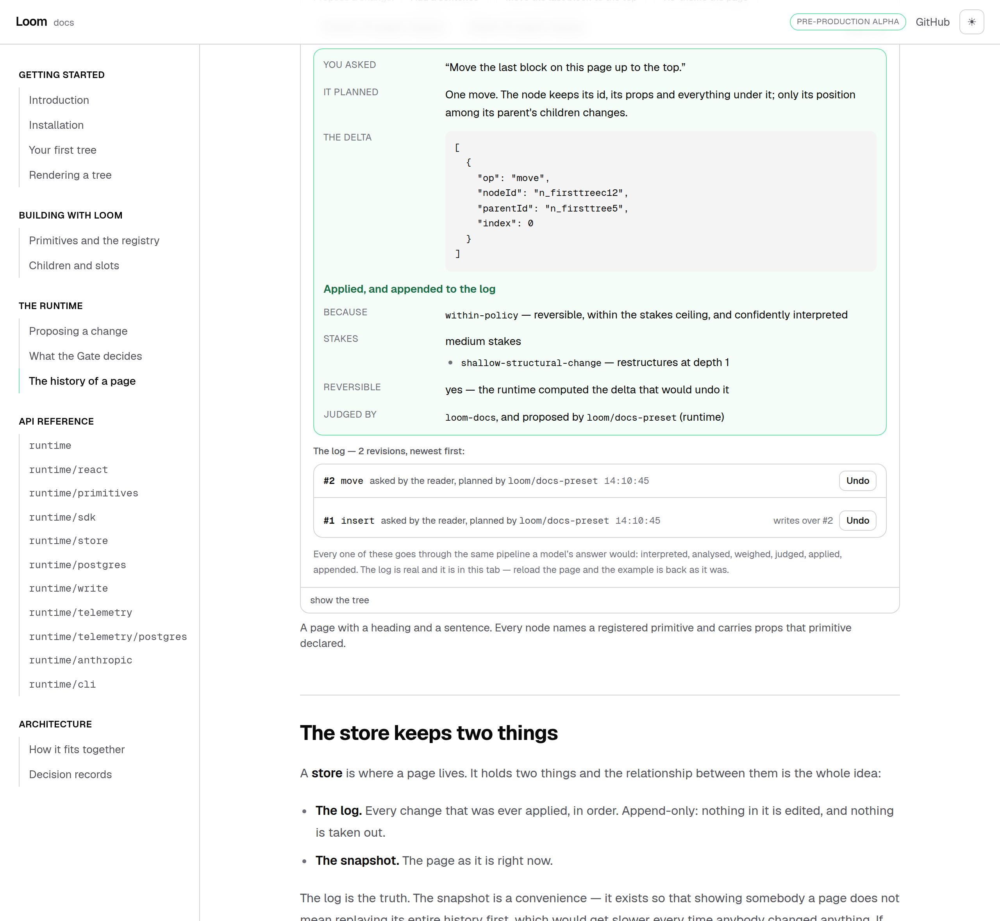
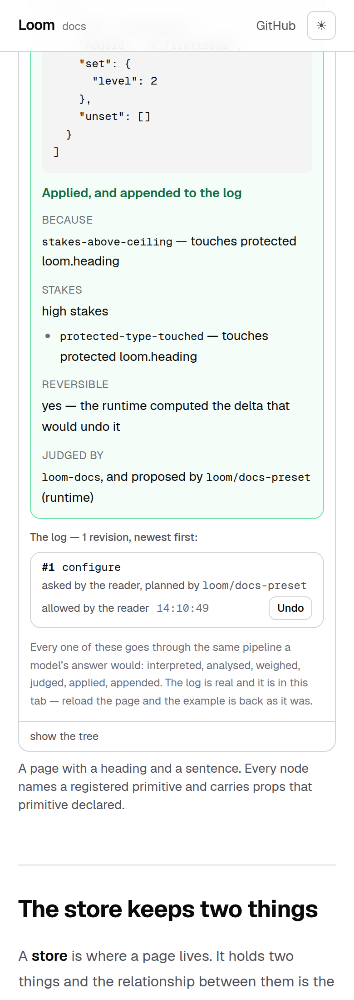

# 23 August 2026 — the history of a page

**Routine:** `Loom docs` · **Branch:** `docs-08-history` · **Section:** §4c

The site's own page on proposing a change used to end like this:

> *"A real deployment appends every applied change to a log… That is a chapter
> this site has not written yet."*

It is written. And writing it meant the site had to stop pretending, because the
one thing §4c will not allow is an example that demonstrates something the site
is not actually doing.

## What was actually wrong

Every example on this site ran `composeChange` and kept the tree it got back in
React state. That is the runtime deciding **whether a change may happen**. A
deployment goes through `commitIntent`, which decides **that it did** — reading
head, refusing a stale ask before spending anything, and appending the delta and
its provenance to a log.

The site was doing the first half and calling it the pipeline. Which meant it
could not show a log, could not attribute anything to anybody, and could not
offer an undo — because an undo in Loom is a proposal against a stored history
(0032), and there was no history to propose against.

So every example now opens a store. `memoryTreeStore` and `memoryHoldStore`, in
the reader's browser tab, gone on reload. Both are the implementations the
runtime ships, and both are behind the interfaces a deployment swaps.

**Nothing about it is a mock.** Every field in every row was written by the
runtime's own write path, and the tree rendered on the page is the one the store
handed back rather than the one the pipeline applied in passing — there is a test
asserting those two agree.

## The four things a reader can now do that they could not

**See the log.** Rows under the verdict: revision, the verbs in the delta, who
asked, what planned it, when. Read out of the store on every change rather than
accumulated in the component, because the whole argument for a log is that there
is one of it.

**See a refusal leave nothing behind.** Press *delete the page's heading*, watch
the Gate refuse it, and there is still no log. The page says what that means: a
log is not a transcript, and a change that did not happen has nothing to record.

**See who allowed something.** Answer the hold on *demote the page's heading* and
the row says *asked by the reader* **and** *allowed by the reader* — two fields,
because the entire value of holding a change is putting a second person in the
way of it, and a record with one field would make every confirmed change look
like somebody waving through their own request (0029).

**Undo, and watch the number go up.** This is the one worth the page.

## The undo is the argument

The obvious way to build undo is to reverse the last entry. It is quick, and it
makes undo the one operation that changes a page without being judged, and the
log the one record with a hole in it.

`revertRevision` takes the long way: read the log, compute the inverse, wrap it
as an ordinary proposal from an interpreter called `loom/revert`, and hand it to
`commitIntent`. Judged by the same policy, refusable, holdable — and appended as
a **new revision**. The page looks like it did; the history is longer.

The reader can see the whole of that. Press Undo and the verdict panel says
*proposed by `loom/revert` (runtime)*, and the row that appears is `#2 remove`.
Press Undo on **that** and you are back where you started at revision 3.

### And it says what it would cost, first

Undoing revision 1 when revision 2 built on the same node throws away what
revision 2 did. That is not a bug and not a reason to refuse — it is a cost, and
somebody may want to pay it (0035).

`planReverts` answers for every row of the history from one walk of the log,
which is exactly the read a page of history makes. Where the answer is *revertable
but contested*, the row prints **writes over #2** beside the button, before it is
pressed. Where there is no undo at all, the row prints the runtime's own sentence
via `describeRevertPlan` rather than the site's paraphrase.

## One decision that was not specified

**The assessment is read off the events, not the outcome.**

`CompositionOutcome` carries the whole `ChangeAssessment`. `WriteOutcome` does
not — it carries the proposal, the disposition and the inverse. So moving to the
write path would have cost the box its stakes factors, its reversibility line and
its analysis, which is most of what makes the Gate page worth reading.

They are on the `change-assessed` event, and `events.ts` says that is deliberate:
*"these events are the runtime talking to itself within one request, so they carry
whole assessments."* The box already collected envelopes. It now reads the last
`change-assessed` out of them, which is four lines and no new surface, and it
takes the **last** rather than the first because answering a hold produces a
second assessment against the tree as it stands.

Filed as a finding — not as a gap, because a return value carrying a second copy
of the assessment would be the wrong fix. What is worth recording is that nothing
in the types points at the sink, so the next surface that persists will look for
a field and not find one.

## What I got wrong, and what caught it

**Two tests that passed alone and failed in the full suite.** Every control in
the box now stands down while a change is in flight, and a change settles over
more than one commit — the log appears, then the transition ends. Two of my new
tests clicked as soon as they saw the previous result, which under load meant
pressing a disabled button: nothing happens, silently. They passed on their own
and failed twice in `pnpm verify`.

The fix is a `press` helper that waits for `disabled` to clear, which is what a
reader does without thinking about it. Three pre-existing tests had the same
shape and were only safe because those buttons had not been disabled before; they
use it now too. Worth naming because the failure was invisible in the file and
only appeared under the whole suite, which is an argument for running it rather
than the file you changed.

**A browser's own list markers beside my own.** The log is an `<ol>` and the
revision number is the marker, so the rows were indented by forty pixels of user
agent padding sitting next to `#1`. Invisible to every test and obvious in the
first screenshot — the third time in four runs a docs defect has been found that
way.

## What the pages say now

One new page, **The history of a page**, at the end of *The runtime*: the store's
two halves and why the log is the truth; what an entry carries and what it
deliberately does not; who asked versus who allowed; undo as a proposal; what a
contested undo costs; the stale-ask refusal; and where this actually runs.

**Proposing a change** lost its *"Nothing here was stored"* ending, which had
become false, and gained a four-line handoff to the new page.

Both are written to the brief's rule: the plain version first and the precise one
a scroll later. The page says *"a page is not just its current state — it is the
list of changes that produced it"* before it says `StoredRevision`, and it never
says `baseRevision` at all.

## Tests

`pnpm install && pnpm verify` at the repository root, **green**:

| Suite | Files | Tests |
| --- | --- | --- |
| `@loom/runtime` | 101 | 1504 |
| `@loom/app` | 93 | 1151 |

Nothing failed, nothing skipped, nothing weakened, and `next build` succeeded
across all five route groups. The app suite went 1125 → 1151, so **26 new tests**
in three files.

The ones worth naming, because they are the claims the page makes:

- a refused change leaves the log empty, and the head at revision 0
- a held change leaves the log empty until it is answered
- an answered hold records `answeredBy` **and** `provenance.actor`, and a change
  the Gate accepted outright records no approver at all
- a hold cannot be answered twice — custody ends on the first answer
- an undo advances the revision and restores the tree to the seed
- an undo is in the log, planned by `loom/revert`, and is itself undoable
- undoing revision 1 after revision 2 touched the same node declares `discards: [2]`,
  and undoing revision 2 declares nothing
- an ask written against a revision head has passed comes back `not-written`
- and, through the component rather than around it: the row renders, the
  approver renders, **writes over #2** renders on the row that would do it, and
  an undo makes the log grow rather than shrink

## Findings

**Filed for `Loom daily build`** — `HoldStore` has exactly one implementation and
it is a `Map` in process memory, while its own comment says a hold must survive
the request that created it. On the serverless hosts §3 targets it does not. Two
shapes suggested; the cheaper one is a contract suite, which turns "write your
own" from advice into a checkable instruction.

**Filed, mine** — where the assessment went, above.

**No framework gaps.** First run in which this site consumed
`@loom/runtime/store` and `@loom/runtime/write` rather than describing them, and
nothing was wanted that the published entry points do not expose. No deep import,
no new primitive, `src/` not opened.

## Open questions

Whether the log belongs in the propose-a-change box on **every** example or only
on this page. It is in every box today, which is the honest default — the store
is real everywhere, so hiding the rows elsewhere would be the site choosing not
to show something true. But a reader on *Children and slots* is being shown a
history they did not come for. My recommendation is in the pull request comment:
leave it, and revisit if a page starts feeling crowded.
