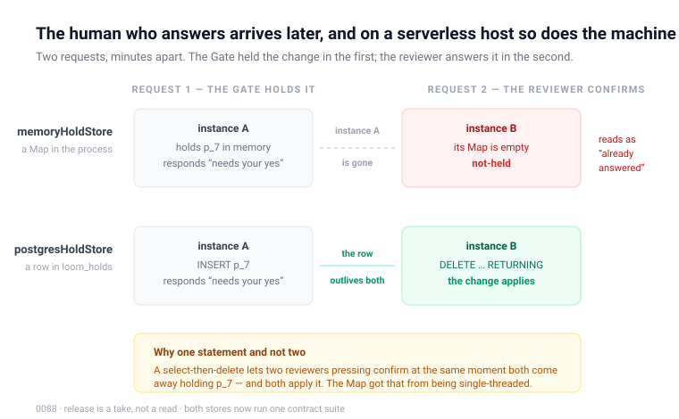

# A hold that survives the request

**Routine:** `Loom daily build` (framework) · **Date:** 2026-08-23 ·
**Section:** §3 · **Branch:** `framework-08-a-hold-that-survives-the-request`

## First, the thing the brief told me to do, which was already done

My brief names the one-application migration as the next unit and says it
outranks everything below it. **It is finished, and it was finished on 19 August**
— `apps/loom` exists with `(marketing)`, `(docs)`, `(lessons)`, `(portal)` and a
`(demo)` that was split out afterwards; `apps/portal`, `apps/docs` and
`apps/marketing` were retired into it; `docs/routines.md` records lanes as route
groups and has done since. Nothing was half-migrated and nothing was left for me.

The brief is a stored prompt that has not caught up. Saying so here rather than
acting on it, because `docs/routines.md` is explicit that where a brief and the
repository disagree, a report is the place to say which is wrong.

One consequence worth flagging: **my brief also claims the demo, and
`docs/routines.md` says `Loom demo` was split out on 20 August and owns
`apps/loom/app/(demo)/`.** There is an open pull request from that routine (#146,
opened today). I stayed out of it entirely. The ownership finding filed by
`Loom portal` on 20 August — *who owns the demo is genuinely ambiguous, and two
routines have assumed differently* — is still open and still addressed to the
maintainer; this is a third instance of it.

## What was completed, in plain language

A change the Gate is not confident enough to apply on its own is **held**, and a
person answers it later. `HoldStore` has said in its own first line, since the day
it was written, that a hold *"has to survive the request that produced it, because
the human who answers it arrives later."*

There was one implementation of it and it was a `Map` in process memory.

On a server that stays up, that is correct and remains the right choice. On the
serverless hosts §3 targets — which is what the portal is deployed on — the
process that judged the change is usually gone before the reviewer opens the
queue. So the hold went with it, and the confirmation arrived at an instance that
had never heard of it. The reviewer got `not-held`, whose own comment says it
means *"never held, already answered, or expired"*. There is no fourth reading for
*the machine that was holding this went away*, which was the true one. **A change
somebody was asked to approve could disappear, and the interface had no way to
say that is what happened.**

Two things now exist:

- **`postgresHoldStore`**, beside `postgresTreeStore` and reached the same way,
  storing a hold as a row in `loom_holds`. `release` is a single
  `DELETE … RETURNING`, because removing and returning in one step is what makes
  answering happen exactly once. A select-then-delete would let two reviewers
  pressing *confirm* at the same moment both come away holding the same change,
  and both apply it — the diagram's yellow panel. The `Map` got that property from
  being single-threaded; Postgres has to be made to have it on purpose.
- **`describeHoldStoreContract`**, one suite run against both implementations, the
  way `describeTreeStoreContract` already is for the log.

Nothing switches automatically. `memoryHoldStore` stays the default and stays
correct for a long-lived process; a deployment that needs holds to survive
constructs the other one. The portal has not adopted it, because
`app/(portal)/_lib/` is its routine's, and that is filed for them with the change
written out.

## What the contract suite found, on its first run

This is the part worth reading, because it is the argument for contract suites
made concretely rather than in the abstract.

**The suite failed immediately, and the fault was in the fixtures.** Every
held-proposal fixture in the repository carried `operations: []`, and
`treeDeltaSchema` requires at least one operation. The tests had been building
holds that were not valid holds, and had been for as long as `held.ts` has
existed.

Nothing caught it, because there was nothing to catch it with. The in-memory store
stores what it is handed and hands it back; a fixture's validity never came up.
Postgres accepted the write and refused the read — which is the worst place to
find out, and would have been found in production rather than here if the second
implementation had shipped without the suite.

Not a bug in either store. A thing everyone had agreed to without checking, which
is exactly the class of fault a second implementation exists to expose.

## Unspecified decisions, and why they went this way

**A third table rather than a flag on `loom_revisions`.** 0016 makes the log the
truth and a revision the count of its entries, so a pending row would either be
counted — advancing a tree that did not change — or excluded, at which point every
query against the log carries a predicate that exists to undo the decision to
share the table.

**`intent`, `proposal` and `disposition` stored whole as `jsonb`**, for the reason
`loom_revisions.delta` is: they are Zod-validated shapes owned by §2 and §3, and
columns would duplicate those definitions and drift from them. It is also the only
shape that keeps the interface's promise that a confirmation can be *re-judged*.

**`ensureHoldStoreSchema` is separate from `ensureTreeStoreSchema`.** The two
stores are separately useful, and a function whose name promises trees should not
quietly create something else. `db:push` calls both, so the table is present on
every deployment that has run it — adopting the store later is a code change and
not a database step.

**`held_at` is `text`, not `timestamptz`.** It matches `loom_revisions.applied_at`,
and more to the point it matches what the in-memory store sorts on: an ISO-8601
UTC instant orders lexicographically exactly as it orders in time, so both
implementations read a queue oldest-first by the same comparison rather than by
two that happen to agree.

**A listing fails on one unreadable row rather than skipping it.** A queue that
quietly omits a change nobody can parse tells a reviewer their tree has nothing
waiting on it when it has, and gives them no way to find out otherwise.

**`isUniqueViolation` and the unavailable-error helper moved to `store/driver.ts`**
and are now shared by both Postgres stores. They were private to the tree store; a
second copy would have been a second chance to get the `cause` walk subtly wrong,
and that failure is silent — a collision reported as an outage.

**Expiry was not built.** Recorded as a question rather than guessed at; see below.

## Records

**Added:** [0088 — A hold is a row, and taking it is one
statement](../decisions/0088-a-hold-is-a-row-and-a-take-is-one-statement.md),
Accepted. Four alternatives recorded as rejected, including the one most likely to
be proposed again (fold holds into `loom_revisions` with a `pending` flag) and the
one I found genuinely tempting (build the contract suite and stop there).

**Superseded:** none. Nothing here contradicts an Accepted record; 0088 is
additive to 0022 and consistent with 0016, 0020 and 0036.

`pnpm decisions:index` re-run; the index carries 0088.

## Findings

**Closed:** `Loom docs`' 23 August entry — *a held proposal has nowhere durable to
live, and `held.ts` says why that matters*. Both shapes it proposed were built, in
the order it recommended weighing them. It was right that the contract suite is
the more valuable half, and right for a reason it could not have known.

**Filed:**

- **For `Loom portal`** — the Postgres store exists and the portal still builds the
  in-memory one, with the three-line change written out and a note about what the
  queue should say when a confirmation loses the release race.
- **For the maintainer** — a hold now waits forever and nothing decides how long it
  should. `not-held` has always claimed to cover "expired" and nothing expires
  anything. Recommendation included: mark stale from `baseRevision` against the
  tree's head rather than delete on a clock.
- **For `Loom docs`** — the generated API reference moved because the runtime's
  surface did, and was regenerated with the command its own test names. Filed as a
  fourth instance of the 21 August tally rather than a new argument.

**Noted against an existing entry:** the marketing site's checked record count went
87 → 88, the third instance in five days across two lanes. The one-digit edit is
what that finding says to do; I did it rather than leave four surfaces red, and
recorded the instance rather than re-arguing the finding.

## Tests

`pnpm install && pnpm verify` — **green, exit 0.** Nothing failed, nothing was
skipped, no test was weakened or disabled.

| suite | files | tests |
| --- | --- | --- |
| `@loom/runtime` | 105 | 1607 |
| `@loom/app` | 114 | 1641 |

**Net +29 in `@loom/runtime`**, which is +32 new less 3 removed:

- `held.contract.test.ts` — **13**, the memory store against the shared contract.
- `postgres-holds.test.ts` — **19**: the same 13, plus 6 that are Postgres's own —
  row-level security on at creation, the migration as a no-op on a populated
  database, the row genuinely gone in the statement that returned it, an
  unparseable hold refused rather than served, a listing that fails rather than
  omitting the row it could not read, and every operation reporting an absent
  database rather than throwing.
- `held.test.ts` — **10 → 7.** Its eight in-memory store tests were duplicates of
  what the contract suite now runs against both implementations, so they came out
  rather than being left as a second, weaker copy. What replaced them tests the
  two things that are not a store: the JSON round trip a `jsonb` column actually
  performs, and how a refusal reads.

The Postgres suites run against PGlite — Postgres compiled to WebAssembly — so
they exercise real transactions and real constraint violations with no external
database and no Docker, on the same terms the tree store's suite already uses.
They are slow: `postgres-holds.test.ts` takes about 30s and `postgres.test.ts`
about 95s, because each test builds a fresh WASM database.

**Two failures were hit and both were fixed rather than worked around:** the
fixture's empty delta described above, and the docs site's committed API reference,
regenerated with `pnpm --filter @loom/app docs:api` as its own failure message
instructs.

## Open questions

1. **How long is a hold good for?** Filed for the maintainer. Not blocking —
   nothing accumulates until the portal adopts the Postgres store — but it stops
   being hypothetical the moment it does.

2. **Should the portal adopt it now, or wait?** I think now, and I did not do it
   because the lane is not mine. The argument for waiting is that nothing is
   visibly broken today. The argument against is that the failure has no symptom:
   a lost hold looks exactly like a hold that was already answered, so nobody will
   report it.

3. **Who owns the demo?** Third instance of an open finding, still addressed to
   the maintainer, and now with two briefs disagreeing in writing.

4. **The record-count edit, three times in five days.** The finding that named it
   offered two ways out and said neither was a routine's to choose. It is a small
   thing that is now reliably recurring, which is usually the point at which the
   cheaper of the two options is worth just taking.
