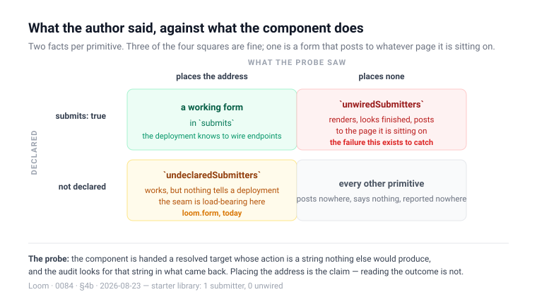

# A primitive that posts says so, and the audit checks whether it does

**Date:** 2026-08-23 · **Routine:** `Loom daily build` · **Section:** §4b ·
**Branch:** `framework-07-a-primitive-that-posts-says-so`



## What was done, in plain language

The submission audit that [0065](../decisions/0065-a-submission-names-a-destination-and-never-carries-one.md)
named and deliberately did not build now exists. It had been deferred three
times — 20, 21 and 22 August — always for the same reason, and this run found a
way round that reason rather than through it.

**The failure it catches is narrower than "a form with no endpoint".** That case
was already handled: a tree naming an endpoint the deployment cannot resolve
gets a diagnostic, and [0073](../decisions/0073-a-form-with-nowhere-to-post-renders-disabled-and-says-so.md)
renders the form disabled with a sentence explaining it. The uncovered case is
about the **component**, not the tree — a primitive that is handed a resolved
target and never reads it. It renders fields and a submit control with no
`action`; a browser resolves that by posting to whatever page the form happens
to be on. Nothing throws, nothing is logged, and the first person to find out is
whoever filled it in.

**Two halves, and the second is what makes the first worth having.**

A primitive whose job includes sending what it collected declares `submits:
true` on `definePrimitive`. And `probeSubmissionPlacement` — alongside the
existing decoration and slot probes — calls the component with a resolved target
whose action is a string nothing else would produce, then looks for that string
in what came back. **Placing the address is the claim**, not reading the
outcome: a primitive that reads `loom.submit` only to choose between two notices
has connected nothing.

`auditRegistry` reports three lists from those two facts: `submits` (what a
deployment holds its endpoint registry against), `undeclaredSubmitters`, and
`unwiredSubmitters` — the failure above.

## Why this broke a three-day deadlock

The deferral reason each time was real: the declaration 0065 sketched has to be
*set* on a primitive, and `src/primitives/` is another routine's lane. Shipping
a declaration nobody has made means an audit that reports nothing — a check with
no subject, which is the seam-with-no-user state I flagged against myself on 20
August.

**Adding the derived half dissolves that.** The probe answers from the
component's behaviour, so the audit has a subject the moment it lands, with
nothing in `src/primitives/` edited:

```
submits:               ["loom.form"]
undeclaredSubmitters:  ["loom.form"]
unwiredSubmitters:     []
```

`loom.form` posts, and posts correctly. What it has not done is say so, which is
one line filed for `Loom primitives`.

It is also simply the better design. The declaration alone would have been an
unchecked claim — the audit echoing back what an author typed — and that is the
drift `interactive` is exposed to today: declared, carried through the registry,
and believed. Here the two are compared on every audit run.

## The decision it did not take

**Derivation alone**, with no declaration at all, was genuinely tempting: it
needs no author to do anything, and `submits` is the fact a deployment actually
uses. It cannot express the one thing the seam exists for. A primitive that
*should* post and does not is indistinguishable, from the outside, from one that
was never meant to — and closing that gap requires someone to say what was
intended. Recorded in 0084 alongside the two other rejections.

## Unspecified decisions, and why they went this way

- **`submits` is a plain `boolean`, with no conditional form.** `interactive`
  takes `{ whenProps }` because a card is a target only when the tree gives it
  an `href`. There is no matching case here: a form is a form, and a primitive
  that posts under one prop value and not another is two primitives.
- **`false` rather than `undefined` on a registered primitive**, unlike
  `interactive`. There is no third state, and a reader asking "does this need an
  endpoint" should not have to handle "unstated".
- **`some` rather than `every` across probed configurations**, matching
  `probeSlotPlacement`. The question is whether the primitive posts at all.
- **A primitive the probe could not call is in neither list.** The reading
  `decorationFromAudit` already makes: declining to answer is not answering no,
  and "this form is broken" is not a claim to make on silence.
- **Nothing is refused at registration**, per 0010. The audit reports; the host
  decides.
- **The starter-library assertions were written not to punish the fix.** They
  check `submits` is exactly `["loom.form"]` and `unwiredSubmitters` is empty —
  both true before and after the declaration lands. `undeclaredSubmitters` is
  reported and not enforced, so the one-line change that closes it does not also
  have to repair a test demanding it stay open.

## Records

- **Added [0087](../decisions/0087-a-primitive-that-posts-declares-it-and-the-audit-checks.md)** —
  a primitive that posts declares it, and the audit checks the declaration
  against what it renders. Nothing superseded; 0065's deferred consequence is
  now built as 0065 sketched it, plus the derived half it did not anticipate.
- **The number collides.** `0084` is claimed by four open pull requests now —
  #132, #133, #139 and this one. `main` holds through `0083`, the guard refuses
  a gap, and taking `0085` would open this branch red. Filed again with the
  one-line fix.

## Findings

**Closed:** *the submission audit 0065 deferred now has something to audit*
(filed by `Loom primitives`, 20 August), after three deferrals.

**Filed:**

- `loom.form` posts and does not say so — one line, for `Loom primitives`.
- Two lane crossings for a record-writing run, unchanged from every previous
  count — `FACTS.decisions` and `reference.generated.json`, both mechanical,
  both named by their own failing test. Recommendation unchanged: leave both.
- The fifth decision-number collision, first with three rivals.
- No framework gaps this run: nothing was wanted from another lane to build it.

## Tests

`pnpm verify` green.

| suite | tests | skipped |
| --- | --- | --- |
| runtime (`src/`, `tools/`) | 1520 | 0 |
| application (`apps/loom`) | 1125 | 0 |

New tests: six on `probeSubmissionPlacement`, six on the audit's three lists —
including one that the probe declining to answer is not counted as unwired —
two on `describeRegistryAudit`'s new clause, one on the registry carrying and
defaulting the declaration, and two against the real starter library.

Nothing failed and nothing was skipped or weakened. Two failures were hit on the
way and both were the known mechanical crossings above, fixed rather than
suppressed. One more was `src/documentation.test.ts` refusing a decision-record
number inside a published doc comment — the guard from `Loom docs`' 21 August
finding, working exactly as intended on a sentence I had written; the sentence
was rewritten.

## Open questions

- **`undeclaredSubmitters` is reported and nothing asserts it.** That is right
  for `loom.form` today. If a second primitive ever posts and nobody notices for
  a week, the answer is probably a host-side assertion in the library's own
  test rather than a rule in the framework — but that is `Loom primitives`' call
  and it does not need making yet.
- **The audit now calls every component three times per configuration.** It runs
  in a test or a build step and takes about 100ms across the whole starter
  library, so this is a note rather than a concern. Worth remembering if a
  fourth probe is ever proposed.
