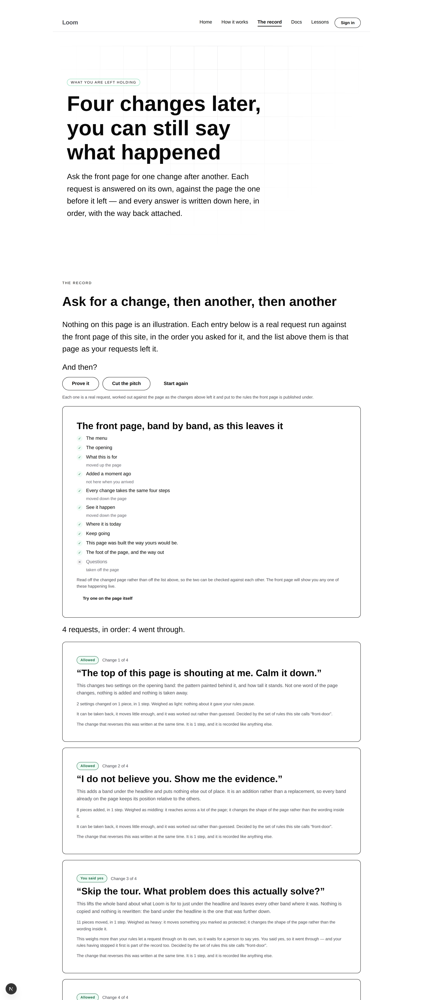
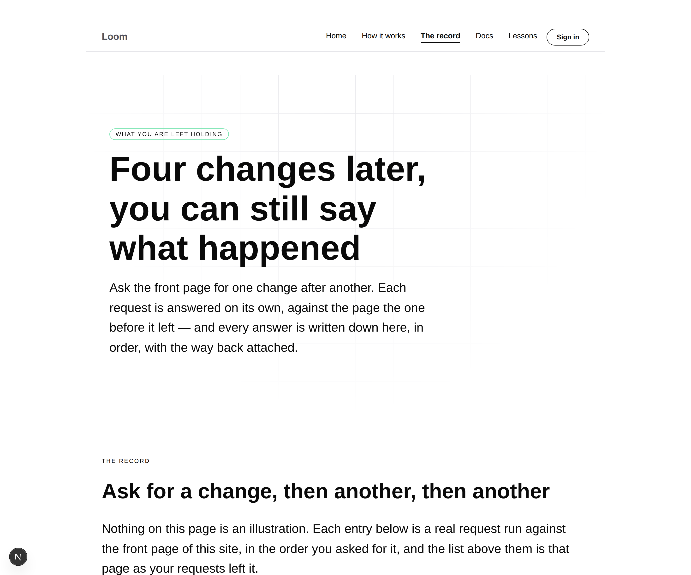
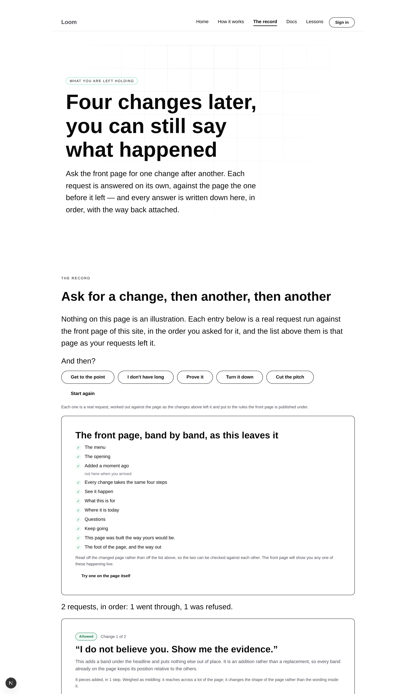
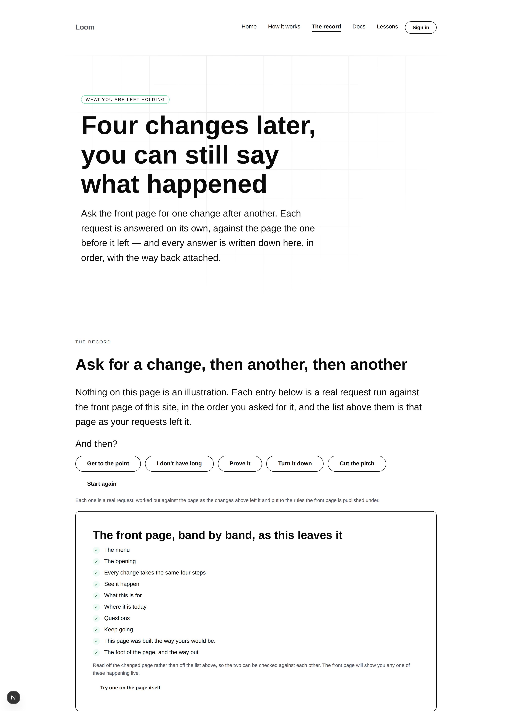
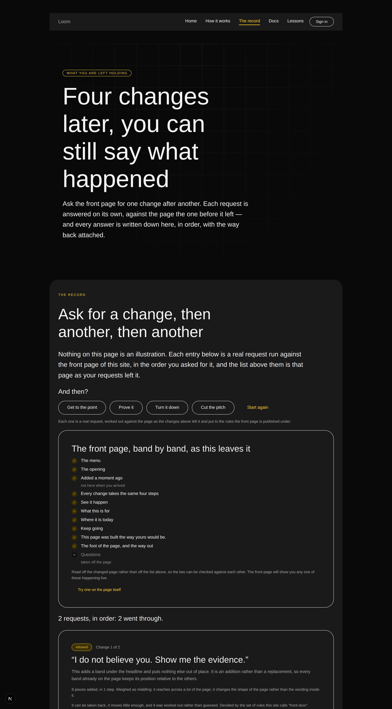
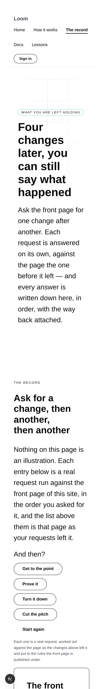

# 2026-08-23 — marketing: one change is a demonstration, four is the product

The front door proves a change can be explained. It has done since 21 August:
pick one of five requests, watch the page move, read what it wrote down.

That is the smaller half. Ask anyone who has to answer for a page what they
actually need and it is not *what happened to this page just now* — it is **what
happened to this page last Tuesday, and in what order, and which of those is the
one to put back.** This run is the page that answers that.

---

## What shipped

**`/the-record`** — the site's third page, and the first one that is about a
*sequence* of changes rather than a change.

A visitor stacks up requests against the front door: pick one, pick another, pick
a third. Each is a real request through the whole sequence, worked out against
the page the one before it left, and the page prints two things, the second under
the first —

- **the list**, one entry per request, saying what was asked in the visitor's own
  words, what that turned out to mean, how much of the page it moved, which rule
  answered and what putting it back would restore;
- **the outline**, the front page band by band as those requests left it, read
  off the changed page rather than off the list, with what moved, what arrived
  and what was taken away marked on it.

The two halves are computed from different things on purpose. A record that only
lists requests can be wrong about the page; an outline that only lists bands
cannot say why. Together they are checkable against each other, and
`the-record.test.ts` checks them.

## It keeps nothing, and that is the interesting part

[0081](../decisions/0081-the-front-door-demonstrates-statelessly-and-the-address-is-the-state.md)
said the front door demonstrates statelessly and the address is the state. A
*history* is the most tempting thing on a marketing site to put in a session, and
this page does not: the run is a list of requests in the query string —
`/the-record?changes=calmer.proof.problem-yes.shorter` — replayed from the front
door as it is published, on every load, from scratch.

Four properties follow and every one of them is worth having on the most-crawled
surface the project has:

- a history can be **sent to somebody**, and they read exactly what you read;
- the same address a week later is the same history;
- there is nothing per-visitor to exhaust, so no budget, no eviction, no rate
  limit;
- two people cannot move the site under each other.

No decision record for this — it is 0081 applied to a second page rather than a
new position, and the entry above already argues it.

### The one thing a run of changes needed that a single one did not

**A ceiling.** This page's work is a function of its query string, so an address
is an instruction about how much of the deployment's afternoon to spend. Six
changes at a time, which is more than the point needs — the argument lands by the
third. Anything past the sixth is dropped rather than refused, because a mangled
address should be a page and not a 400, and a test asks for forty.

## What the front door could not show

**A request that was fine on arrival and is not fine any more.** The rules are
asked again for every change, against the page as it stands, and the entries say
so in the visitor's own language rather than in ours:

| in the run | what came back |
| --- | --- |
| *Take the questions off the page* | Allowed — 9 pieces taken away, in 1 step |
| the same request again | **Nothing to do.** "Your rules were never consulted. A request that works out to no change never reaches them." |
| *Cut the sales pitch* — three changes in | **Refused**, still, and the entry names the rule |

The refusal is the one worth watching. Three changes in, on a page that has been
rearranged twice, the floor holds and the entry says which rules it was and what
they protect. A history is where "the rule holds every time" stops being a claim
about one button.

## Putting it back, and the sentence that says what this page cannot do

The most recent change has a **Put this back** button, and it is a link to the
same address with the last request taken off — which rebuilds the page from
scratch. So the promise every entry makes, that the change reversing it was
written at the same moment, is only true if the rebuilt page and the reversed
page are the same page.

That is the single assertion the page's honesty rests on and it is tested at
depth, for every request that lands, with two other changes already stacked
underneath it: apply the entry's own reversing change to the page the run
produced, and hold the result against the page built from the run minus that
request.

**Only the most recent one is offered**, and the page says why in a sentence
rather than quietly offering a button for both cases: taking a change out of the
*middle* re-runs everything after it against a page that never existed, which is
a different question from undoing it. The place built to answer that one is the
portal, and the page says so and links there.

## Only what still has somewhere to go

The front door offers all five choices whatever state it is in, which is right on
a page nobody has touched. Three changes in, a button whose only possible outcome
is "nothing happened" wastes the one click it gets — so this page asks each
request whether it would still change anything, against the changed page, and
offers what says yes. Asking for the removal twice takes it off the list; saying
yes to the move takes the move off the list, because the band is now where it was
asked to be.

## Fixed on the way past

**The same request twice added nothing the second time.** One request is one run
and a run draws its ids from a factory that starts at one, so the second *Prove
it* asked the page to hold a piece it was already holding — and the page refused
it, correctly. What a visitor read was "the change did not fit this page", which
is true and useless: the change was fine and the request had been made badly.
`runAsk` now takes the namespace its ids are drawn from, the front door's default
is unchanged, and a history says which run it is. Held by a test that names the
failure.

**The register is now read from one place.** `voice.test.ts` knew which props
hold sentences and which hold settings; nothing else did. The list has moved to
`_lib/words.ts` and both test files read it, which is what makes the record
page's states checkable against the same rule — and it gained `note` on the way,
a prose prop nothing had used before and the outline uses on every row.

## Tests

`pnpm install && pnpm verify` **green**. Nothing skipped, nothing weakened,
`next build` succeeded across all four surfaces and `/the-record` builds.

| suite | on this branch |
| --- | --- |
| runtime | **1504**, 0 failed, 0 skipped — `src/` was not opened |
| application | **1369**, 0 failed, 0 skipped |
| marketing, within it | **470** — 226 on `main`, measured |

The ones worth naming:

- **Putting the most recent change back restores the page exactly**, for every
  request that lands, three changes deep, held against the page rebuilt from the
  shorter run.
- **Each request is judged against the page the one before it left** — the same
  removal twice, where the second time the rules are never consulted at all.
- **Every reachable state of the page renders clean**: nothing asked for, one
  change, a held change, a held change answered, a refusal, the same request
  twice, a run of four, an address nobody meant, and one asking for twelve. Each
  in all three palettes, with no diagnostics, one first-level heading, no colour
  named anywhere and **not one word of our vocabulary** — the front door's strict
  standard rather than the mechanism page's, because most of the words here are
  assembled from what the rules answered rather than written by hand.
- **The outline has a row for every band except the rules between them**, so a
  band added to the front door with no eyebrow, no label and no heading fails
  here rather than vanishing from a page that claims to be complete.
- **Every card sits in a column of its own**, with the reason attached. See
  below.

## Findings

- **`loom.card` cannot be stacked** — `Loom primitives`. It sets `height: 100%`
  and `overflow: hidden` on itself, so three cards in one band came out the same
  height and the tallest **lost 154 measured pixels** off its bottom, with no
  diagnostic and no scrollbar. Right for a card in a grid row, wrong for a column
  of them, and invisible on the front door because the front door has one card.
  Worked around per the rule — each card in a single-child `loom.stack`, held by
  a test so a tidy-up cannot silently undo it — and filed with the measurement.
- **The menu is six links now, and the phone header is three rows** — `Loom
  primitives`. A measurement against their 19 August decision to accept the nav
  wrapping rather than an argument with it: that entry priced the trade at four
  to six links on *two* rows, and a third site route has passed it. Nothing was
  dropped to keep the bar short, because 0070 asks for every surface to be
  reachable from every page.
- **No framework gaps.** `src/` was not opened. Everything on the page is
  composed from what `@loom/runtime` already exports and from the twenty starter
  primitives the page and its chrome resolve to — and `loom.perk-list`, built for a pricing table, turned out to be
  exactly the right shape for a page's outline: a tick for a band that is there,
  a cross for one that was taken away, and a note for what happened to it.

## Open questions

All the maintainer's, and all standing:

- **Positioning, audience and the licence line** (#96). The licence line is still
  the site's one placeholder and still gates Phase 2.
- **The front door still cannot demonstrate somebody typing.** Unchanged by this
  run — the requests here are buttons for the same reason they are buttons there.
  A history makes the gap slightly wider, because a list of five prepared requests
  is more obviously prepared than one.
- **#134 is still open**, and this branch is deliberately independent of it. The
  strongest link into this page is from the front door's own record panel — *see
  the whole record* — and adding it would have meant editing the two files #134
  rewrites. The header and the footer carry the page on every route meanwhile,
  which is what 0070 asks for; the deeper link is one line once #134 merges.

