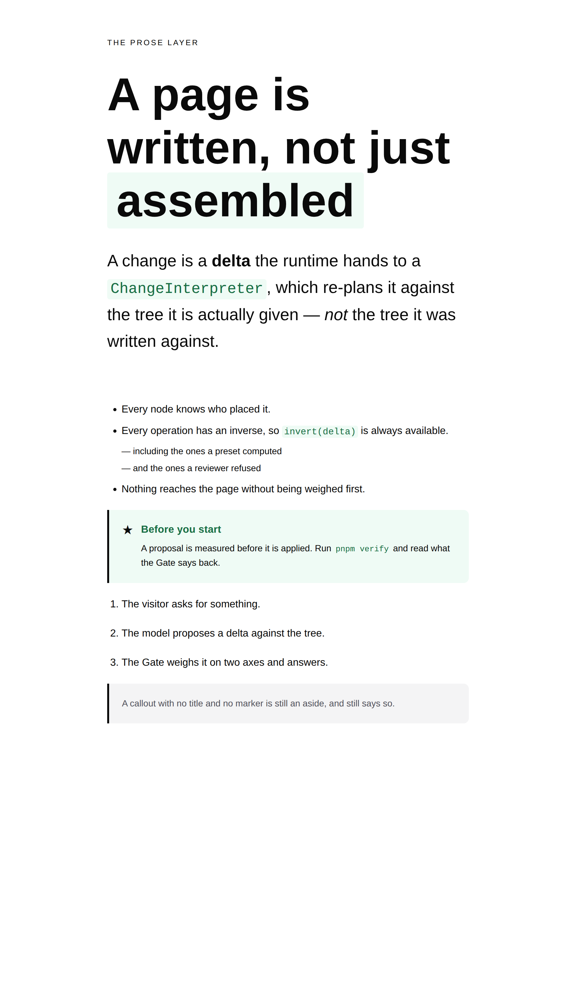
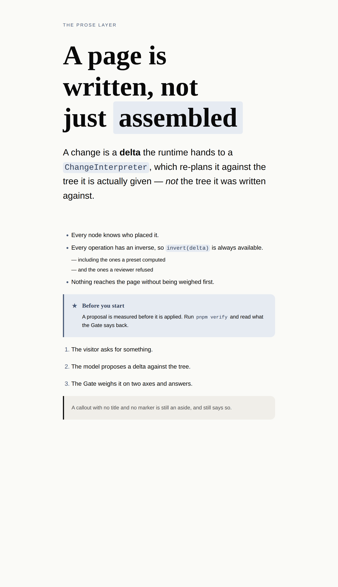
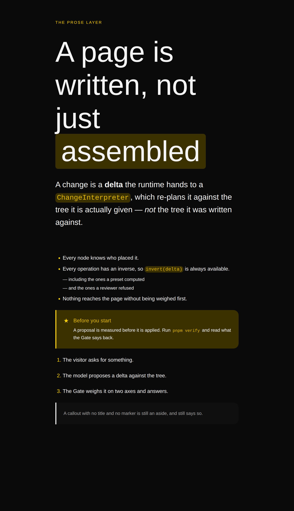
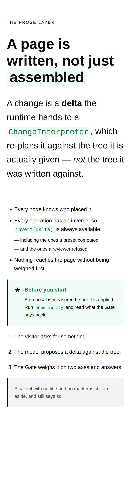

# 23 August 2026 — the prose vocabulary, and the emphasis that was invisible

**Routine:** `Loom primitives` · **Section:** §4b · **Branch:** `primitives-11-the-prose-vocabulary`

Five primitives — `loom.list`, `loom.list-item`, `loom.emphasis`, `loom.code-span`,
`loom.callout` — taking the library from **50 to 55**, closing one cross-lane
finding that had been open since 19 August, and filing four. No decision record,
for a reason the report explains and does not think is fine.

## Which primitives, and why those

**Because fifty primitives could sell a plan and none of them could write three
bullet points.**

That is the whole argument, and it took a while to see because the library's
gaps are not where the port map looks. The port map counts *Hermes blocks*, and
by that measure the remaining work is six pairs of a card in a grid — offerings,
credentials, episodes, books, listings, events. Twenty blocks, all mechanical,
all settled by 0066. Three runs in a row have looked at that list and built
something else, and each time the reason has been the same: **the missing
things are in the layer Hermes had no blocks for**, because Hermes' lists were
`features: string[]` inside a struct and its prose was a string.

So the library could draw a pricing table, a timeline, a wall of testimonials, a
mosaic and a comparison band — and could not put one word of a sentence in bold,
make a numbered list, name a symbol inline, or stop a page to give a caveat.
Every surface in `apps/loom` has been working around that: the lessons surface
strips markdown's `` ` `` and `**` and says so in `_lib/text.ts`; a run of
`loom.prose` nodes in a `loom.stack` is what has been standing in for a list, and
it renders as paragraphs, announces itself as paragraphs, and is paragraphs.

These five are what a page is *written* in, as opposed to what it is built from:

| Primitive | What was impossible without it |
| --- | --- |
| `loom.list` / `loom.list-item` | A bulleted or numbered list with no marker meaning attached |
| `loom.emphasis` | Stressing a word inside a sentence — bold, italic, or highlighted |
| `loom.code-span` | Naming a symbol inside a sentence |
| `loom.callout` | The aside a page steps out of its flow to make |

**Two of them close an open finding.** `Loom lessons` filed on 19 August that
*nothing in the library can say `ChangeInterpreter` inside a sentence*, and the
evidence was the course's own text: review set N names six runtime types and
every question turns on the difference between two of them. Set L italicises the
word carrying the distinction. Both were lost, because the three fates available
to that surface were to print the backtick, strip it, or wrap the span in a
`loom.badge` — a pill in the middle of a sentence. `loom.emphasis` and
`loom.code-span` are the two spans that finding asked for.

**What this deliberately is not:** the six remaining Hermes pairs. They are still
mechanical, still settled, and still worth doing — and they are creator-toolkit
bands, where this run is the layer that every surface, every band and the demo
itself is written in. The port map's count is *of the Hermes catalogue*, and it
has now been the wrong ruler three runs running.

## Which Hermes fields became nodes, and which stayed props

**None of the five has a Hermes ancestor**, which is the second time this lane
has reported that and the same reason both times — `loom.kbd`, `loom.avatar`,
`loom.avatar-row` and `loom.mosaic` had no row in the port map either. There are
no Hermes fields to turn into nodes here. What there is instead is the same
question asked of five new content models, so the table is of the props that were
*proposed and rejected*:

| Candidate | Verdict | Why |
| --- | --- | --- |
| `loom.list.rows: string[]` | **nodes** | The shape Hermes used everywhere, and 0052's opening clause read literally. Reordering two bullets would be a `configure` replacing the whole list, and neither row would have an author or an inverse. |
| `loom.list.marker` | **prop** | Three renderings of one set of nodes. Changing it moves no row in or out, which is the sharper question the granularity doc says to ask. |
| `loom.list.density`, `size`, `measured` | **props** | Facts about the *run*, not about any row. A list whose third row was numbered and whose fourth was not is not a list. |
| `loom.list-item` — anything at all | **no props** | Every candidate belonged one level up. It is the second empty schema in the library, after `loom.kbd`, and for a different reason: a cap has one thing printed on it, a row has nothing that is not the list's. |
| `loom.list-item.text: string` | **children** | 0052's third clause, and the thing that lets a point hold a `loom.link`, a `loom.emphasis` or a `loom.code-span` rather than only a string. |
| `loom.emphasis` as three primitives | **one enum** | One content model, three renderings. Three primitives would have made a swap a `remove` and an `insert`, and the sentence would forget who wrote the word. |
| `loom.code` with an `inline` flag | **a second primitive** | A flag that switches four other props off is a schema saying two things. `loom.perk` / `loom.perk-list-item` set the precedent under 0061: the element a primitive *is* can be what separates it from its twin. |
| `loom.callout.title` | **prop** | Exactly one of it, and it labels the content rather than being it. |
| `loom.callout` marker | **slot** | 0051's test: the callout places it in a gutter where the flow of children does not go, so "the first child is the icon" is a rule no schema states and every `move` breaks. It also means the marker is anything the library draws, rather than a closed glyph list this primitive would have to keep in step with `loom.icon`'s. |

## The bug the screenshots caught, and the one the tests could not have

`loom.emphasis` with `tone: "strong"` was written the way every other primitive
in this library writes a weight — `fontWeight: weight("heading")`, which is
`var(--loom-heading-weight)`. Every test passed. It renders **nothing** under
`bold-sans`, whose font pack declares `headingWeight: 400` beside
`bodyWeight: 400`.

That is not a broken pack. It is a legitimate one — that family carries its
emphasis in size and colour rather than in weight — and the failure is that the
token came out *equal* to its surroundings rather than wrong. A stressed word
inside a paragraph rendered identical to the words on either side of it, under
one of the three registered packs, and no assertion about tokens could have
noticed: the markup was correct, the variable was real, the re-theme guarantee
held. Only the third screenshot showed it.

The fix is `fontWeight: "bolder"`, which is relative to the inherited weight by
definition and is therefore heavier than whatever it is set in under every pack,
including one nobody has registered yet. It is the argument `loom.kbd` already
makes for `em` over a ramp step, one axis across — **and it is a general
warning about this library's tokens that is worth stating plainly: a token
guarantees the value comes from the theme, and guarantees nothing about the
value being different from the one beside it.** Filed.

Two smaller things also came from looking rather than testing, and both are in
the images above:

- **A code span put a visible space before the comma after it.** `padding-inline:
  0.3em` lands *between the name and its punctuation*, and at lead size
  "`ChangeInterpreter` ," reads as a typesetting error. Cut to `0.22em`, which is
  the smallest tint that still reads as a tint. It is not zero and cannot be —
  every documentation site in the world has this and lives with it.
- **An icon tile in a callout gutter disappears into the callout.** A
  `loom.icon` with `shape: "soft"` and `tone: "accent"` draws an `accent-subtle`
  tile, which is exactly the callout's own ground, so the glyph arrives inside an
  invisible box with a border. Nothing is wrong with either primitive — it is
  the composition — and the fix is `shape: "bare"`, which is what the fixture and
  the specimen now use. Worth knowing before anyone builds a starting
  composition with one in it.

## The record that is not here

The naming question this run had to answer is real and is not obvious: **what do
you call a container whose child has no noun?** 0054's rule takes the child's
singular name and adds the arrangement, and a bulleted list repeats *whatever the
page happens to be saying*. The rule's input is missing rather than its output
being wrong.

The answer is `loom.list` over `loom.list-item`, and it is two accepted records
composing rather than a third rule: 0062 names a container for the arrangement
alone precisely when there is no child word (`loom.stack`, `loom.grid`,
`loom.mosaic`), and 0061 lets a suffix name the markup — extended here by one
step, from a primitive with a twin to a primitive where the element is the only
thing there is to name. The alternative, `loom.point` under `loom.point-list`,
satisfies 0054 with no amendment at all and was rejected because *point* is
invented: nothing calls a numbered step a point, so a model has to read the
catalogue to find it, and 0054's whole argument is about the name a model
guesses when it has not.

**That was written as `0085` and then deleted**, because `0084` is on this lane's
open pull request #132 and `pnpm decisions:index` refuses a gap. This is the
21 August governance finding — *a lane can only have one record-writing pull
request open at a time* — hit now by a second lane. The precedent set the same
day by `framework-03-what-the-prompt-costs` is to fold the reasoning into the
code and the report rather than to stack, and that is what this does: the
argument, the alternatives and the rejection are all in `loom.list-item.ts`'s
doc comment, in full, where the next person to read the primitive will find them.
The finding's own recommendation still looks right — *a missing number on `main`
is a record in flight, a repeated number is the real error* — and it is one
condition in `tools/decisions/build-index.ts`.

## What the library still cannot express

- **A callout cannot be red.** Every callout system has a warning tone and this
  one has two neutral ones, because a Loom palette declares an accent, a
  secondary brand and a set of neutrals and *none of them means danger*. A hex
  here would survive a re-theme, so a palette designed around red would get a
  warning that vanishes into it. Filed for `Loom daily build`; a caveat is an
  accent callout whose marker and title say what it is, which is honest rather
  than approximate.
- **A list cannot be a definition list.** `<dl>` is a third list shape with two
  kinds of child, and nothing here is it. Not filed — no surface has wanted one,
  and the docs lane's markdown pipeline would hit it first.
- **A sentence still cannot hold a footnote, a citation or an abbreviation.**
  The inline tier is two spans deep now rather than zero, which is enough for the
  finding that prompted it and is not the whole vocabulary.
- **The four list-shaped pairs can only be told apart by reading.** `loom.list`,
  `loom.perk-list`, `loom.link-list` and `loom.milestone-list` are one shape with
  four marker meanings, and a model picking between them has the catalogue
  sentence and nothing else. `loom.list`'s doc comment carries the table; whether
  the catalogue a model actually sees carries it is another lane's call.

## Verification

`pnpm verify` green from the repository root: **1518 runtime tests, 1125
application tests, 0 skipped**, exit 0. Nothing was weakened to get there.

Two files outside `src/primitives/` had to change and both are counts held
against the registry by another lane's own test:

- `apps/loom/app/(marketing)/_lib/copy.ts` — `FACTS.primitives`, `"50"` → `"55"`.
  The marketing site checks its own claims against the repository, which is the
  right design and means every primitive run turns that lane red until the number
  moves.
- `apps/loom/app/(docs)/_lib/api/reference.generated.json` — regenerated with
  `pnpm --filter @loom/app docs:api`, as its test instructs. Three new class
  names on `LIBRARY_CLASS` moved the published surface.

Both are recorded in `FINDINGS.md` so each owner knows their file was opened.

## 21st.dev

**Blocked for the sixth time.** `docs/routines.md` still lists it under
`permissions.allow` as a `WebFetch` domain; the call returns
`EGRESS_BLOCKED · Access to 21st.dev is blocked by the network egress proxy`.
Every run in this lane spends a call learning the same thing, and the previous
run recommended either fixing the allowlist or dropping the line from the brief.
Recorded again rather than quietly skipped, so nobody assumes the visual standard
was consulted: this run was calibrated against `loom.hero`, `loom.code`,
`loom.badge` and `loom.kbd`, which is the floor the brief names as its second
reference.
