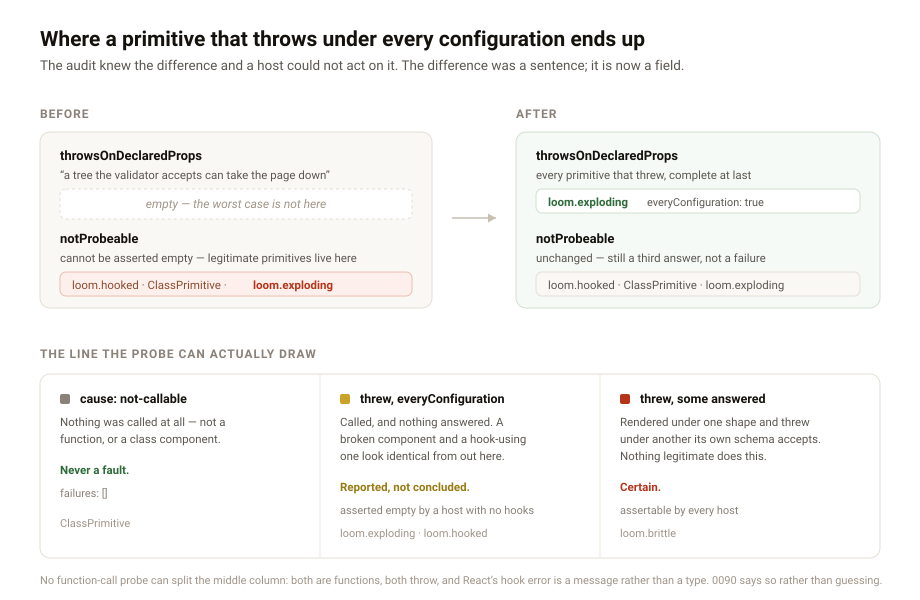

---
# A probe that declines now says why, and the worst fault is in the list that names it

**Date:** 2026-08-24 · **Routine:** `Loom daily build` · **Section:** §4 ·
**Branch:** `framework-10-a-probe-that-declines-says-why`

## What was done, in plain language

The lessons routine registered a component that throws unconditionally, audited
it, and filed what came back. `throwsOnDeclaredProps` — the list whose whole
documented purpose is *"a tree the validator accepts can take the page down"* —
was **empty**. The component appeared under `notProbeable` instead, which is the
one list a host cannot assert empty, because 0012 put hook-using and class
components there on purpose and called them legitimate.

So the audit knew the difference and a host had nowhere to put the assertion.
The distinction survived only inside a prose `reason` string, in a CLI message.

Two things changed.

**`not-probeable` carries a cause and the failures it saw.** `not-callable`
means nothing was called — not a function, or a class. `threw` means the
component was called under every configuration its schema closes over and threw
under all of them, and `failures` carries each one with its props. All four
probes share the shape, which also removed four hand-rolled copies of the same
verdict-building block.

**`throwsOnDeclaredProps` is complete.** Every primitive that threw on a
configuration its own schema accepts is now in it, including one that threw
under all of them — which is what its name has claimed since 0075.

## The thing the finding asked for that I did not do

The finding offered two shapes and said the choice was a judgement rather than a
mechanism. **Taken literally, its first shape would have moved the problem
rather than fixed it**, and the reproduction is what shows why.

A hook-using component throws when called outside a renderer too. So "record
every throwing configuration whether or not another answered" puts
`loom.hooked` into `throwsOnDeclaredProps` beside `loom.exploding`, and that
list stops being assertable for **exactly the reason `notProbeable` is not**.
The assertion would have moved one list to the left.

No function-call probe can separate them. Both are functions, both throw, and
the error React raises for a hook outside a render is a message rather than a
type — matching on it would make the audit's answer depend on another library's
error wording, and would fail in the dangerous direction in both directions at
once.

So each entry carries **`everyConfiguration`**, and that flag is where the
honesty is:

- **`false`** — some configurations rendered and this one threw. The component
  is callable and a value its own schema accepts crashes it. Nothing legitimate
  does this, and the audit is **certain**.
- **`true`** — nothing answered. A fault or a hook, and the audit says it does
  not know which.

A host with no hook-using primitives asserts the whole list empty. A host that
ships them asserts the `false` half and reads the rest. Both suggestions in the
finding turned out to be needed and neither was sufficient alone.

## What came out of it that I did not expect

**`loom init` was not generating the assertion at all.** The scaffold shipped
`notDecorated` (costs a portal handle) and `notProbeable` (0012 says not to
assert it), and not `throwsOnDeclaredProps` (costs the page). It generates all
three now, with a comment saying how to narrow the third if a hook-using
primitive is added.

Worth naming separately from the finding, because it means the reproduction
*would* have been caught in a scaffolded host — but only by accident, via an
assertion 0012 says hosts should not make.

**One message was actively wrong.** A component that throws unconditionally was
described as `calling it outside a renderer threw: boom`, which blames the
probe's context for a component that would throw anywhere. It now reads
`threw under every configuration probed: {} (boom)` and names each one, matching
what `describePlacement` already did for a partial failure.

## Records

- **[0090](../decisions/0090-a-probe-that-declines-says-whether-it-got-as-far-as-calling.md)** — added, Accepted.
  0012 and 0075 both stand and neither is superseded: `not-probeable` is still a
  third answer and not a failure, and a throwing configuration is still excluded
  from the verdict. This refines what the declining verdict *carries*.
- 0090 records again, for the second time, that rendering with `react-dom/server`
  inside the probe would settle this properly — 0012 named it as the honest
  upgrade path. **A third finding should probably tip it**, and that is a
  question for the maintainer rather than a routine.

## Findings

- **Closed:** the lessons routine's 24 August finding, by this branch, with the
  reasoning above written into `FINDINGS.md` rather than only here — the reason
  suggestion 1 needed the flag is the part a future run would otherwise
  relitigate.
- **Filed:** none. Three open findings owned by this lane are the docs routine's
  cross-lane notes, all marked *"for your awareness rather than for you to do
  anything"*; they are unresolved on purpose and are covered under open
  questions below.

## Test numbers, plainly

`pnpm install && pnpm verify` — **green, exit 0.**

| suite | before | after |
| --- | --- | --- |
| runtime (`vitest run`) | 1641 passed | **1647 passed** |
| app (`@loom/app`) | 1768 passed | **1768 passed** |

Six new tests, all in `src/sdk/`. Nothing weakened, nothing skipped, nothing
marked `.todo` or `.skip`.

**After merging `main`** (#153 landed while this was open, adding nine demo
tests): **1647 + 1777 passed, green, exit 0.** The one conflict was `FINDINGS.md`
— both sides had appended an entry — and both are kept, main's first. #153
touched only `apps/loom/app/(demo)/` and added no decision record, so the
regenerated API reference and the 90 in the marketing count both still hold.

Two committed snapshots outside this lane drifted and were regenerated by their
own tooling, not hand-edited: `(marketing)/_lib/copy.ts`'s decision count
(89 → 90) and `(docs)/_lib/api/reference.generated.json` via
`pnpm --filter @loom/app docs:api`, which the failing test itself instructs.
That is the fourth run in a week where a surface's self-checking test goes red
on another lane's ordinary work, which both lanes have already recorded.

The load-bearing new test is `audit.test.ts`'s *"cannot tell a hook-using
primitive from a broken one, and does not pretend to"*. It asserts the limit
rather than the capability, so a future run that adds hook-sniffing to make the
list look cleaner has to delete a test that says why not.

## Open questions

Nothing blocking. Three, all for the maintainer:

1. **Should the probe render with `react-dom/server`?** It would collapse the
   middle column of the visual into the other two, and 0012 rejected it for
   dependency weight. Two findings have now been closed with a flag where it
   would have given an answer.
2. **The MDX pipeline's lane.** The docs routine has filed the same note three
   times: `next.config.ts` and `mdx-components.tsx` are in this lane by location
   and in `(docs)` by content. A one-line rule in `docs/routines.md` would make
   those diffs unsurprising. It is a governance call, not an engineering one, so
   I have not made it.
3. **A blessed way to name a repository path**, from the 22 August finding.
   Three surfaces now walk up from `process.cwd()` because
   `new URL(…, import.meta.url)` does not survive Turbopack. The workaround is
   in place and undocumented as a workaround.
