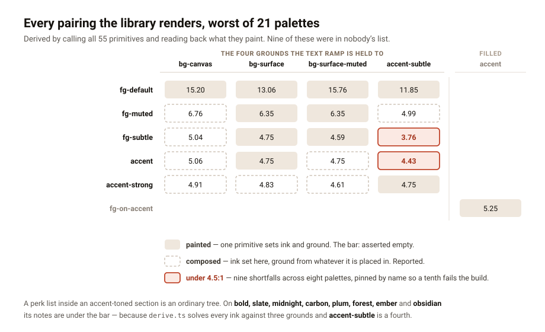

# The contrast list is read off the components, and two pairings do not clear it

**Date:** 2026-08-24 · **Routine:** `Loom daily build` · **Section:** §4b ·
**Branch:** `framework-09-the-pairings-are-read-off-the-components`

## What was done, in plain language

`auditPalette` measures a list of foreground-on-background pairings, and that
list was written by hand. Its own comment says it is *"read off `src/primitives`
rather than imagined"*, which was true on the day somebody read them off, and by
this morning it was **nine pairings short of a fifty-five primitive library**.

It is now derived. A fourth conformance probe calls every registered component,
walks what it returned, and reads back every `var(--loom-…)` the component put
in `color` and `background`. A test fails if the declared list is missing
anything the library renders, or carries a row nothing renders.

**The failure this closes is one an audit is uniquely bad at showing you.** A
pairing nobody listed produces no failure, and no failure is exactly what a
passing palette produces. A host asserting `failures` empty was getting a green
tick that partly meant *nothing here was measured*.

## What came out of it that I did not expect

**Two pairings that a page can reach are under the bar on eight of the
twenty-one palettes.** `fg-subtle` on `accent-subtle` is 3.76:1 at worst;
`accent` on `accent-subtle` is 4.43:1 on `plum`.

The 22 August finding named both and said they had been *designed around*. That
was true of the comparison band, which chose other slots, and it is not true of
the library. `loom.perk`, `loom.milestone` and `loom.footer` set `fg-subtle` and
paint no ground under it. `loom.section` with `tone: "accent"`, `loom.card` and
`loom.callout` put children on `accent-subtle`. **A perk list inside an
accent-toned section is an ordinary page**, and nothing prevents it — 0008
leaves parentage to the tree on purpose.

The cause is one line, and it is a good line. `derive.ts` solves every ink
against *"the worst of the three grounds it is rendered on"*, and its comment
says exactly why: *"Solving against the canvas alone is how a palette passes the
eye and fails the audit on two pairings nobody was looking at."* It was right
about the shape and one short on the count. `accent-subtle` is a fourth ground
children land on. In a dark palette it sits at lightness 16 with the muted well
at 8, which makes it **the tightest ground in the palette**, and no ink has ever
been measured against it. Seven of the eight failures are dark palettes.

## The decision I made, and the one I did not

A check that ships red is worthless and a check narrowed until it passes is
theatre, so the split between them needed to be somewhere defensible.

**Each pairing now carries a basis.** `painted` — one primitive sets both ends,
no tree can avoid it, and it is the bar: `failures`, asserted empty, exactly as
0074 has it. `composed` — an ink placed on a ground the ramp is held to,
reachable in a legal tree, and reported in `composedFailures` rather than
asserted.

That split is where an inconvenient failure would go to be forgotten, so three
things hold it honest:

- the nine shortfalls are **pinned by name** in `contrast.test.ts`, so a ninth
  palette or a third pairing fails the build rather than lengthening a paragraph;
- `describePaletteAudit` **prints composed failures**, said to be composed, so an
  empty description still means a clean palette;
- a test fails if the declared list calls a pairing `composed` that any primitive
  **paints** — the softer tier cannot be reached by relabelling, which is the
  edit that would be hardest to catch by reading a diff.

**What I did not do is recolour eight palettes.** Both cheap fixes were measured
across all twenty-one and both cost something real — moving the panel puts
`carbon`'s tint at lightness 10.4 against a canvas at 10, and moving the ink
drops `fg-subtle` against `fg-muted` from 1.34:1 to 1.05:1, which is the
23 August "a token promises provenance, not difference" finding caused on
purpose. There is a third and better fix, and it is bigger: light mode puts
`accent-subtle` at the muted well's own lightness and dark mode puts it eight
points the other side of the canvas, so the dark branch does not follow the
light branch's rule. Making them agree changes the look of every dark palette.

Choosing between three visual answers unattended is a routine making a design
decision on the maintainer's behalf, under a brief that says not to redesign
what works. The numbers are in the record and the question is in the pull
request.

I also left `derive.ts` alone. The one-line fix is right for a palette derived
tomorrow and would silently disagree with the twenty-one literals committed
today, which 0077 makes the source of truth. Rule and literals move together or
the rule is a comment.

## Unspecified decisions

**Where the probe stops.** Only `children` is walked, matching the decoration
probe, and only `background`, `backgroundColor` and `color` are read, and only
where the value is exactly the form `colour()` produces. A gradient or an
interpolated longhand answers *nothing* rather than a guess — the same move
`contrastRatio` makes on a colour it would have to parse, for the same reason: a
probe that read `linear-gradient(…)` as its first colour would report a pairing
the page never renders.

**Union across configurations, not intersection.** The decoration probe takes
the intersection because decorating is a promise that has to hold however the
primitive is configured. A colour pairing is a fact about one configuration, and
a `loom.section` that paints `accent-subtle` only under `tone: "accent"` renders
that pairing on a real page whatever its other tones do.

**The four grounds are declared, not derived.** Two derivation rules were tried
and both are wrong in opposite directions — *the primitive that paints it also
sets an ink there* marks `bg-canvas` filled, because `loom.page` sets a default
ink, and `fg-subtle on bg-canvas` is a pairing the footer genuinely renders;
*any primitive leaving the ink inherited makes it open* marks `accent` open,
because `loom.icon` has a bare tone. Two plausible rules disagreeing is the
signal that the question is not answerable from the components, so it is a
declared list of four with a record behind it.

## Records

- **0088** — *the text ramp is held to four grounds, and a pairing is measured
  whether one primitive paints it or two compose it.* Accepted. Nothing
  superseded. Index regenerated.

## Findings

**Closed:** the 22 August pairing finding, by derivation rather than by adding
the three rows it asked for — the class is shut, and its two "rejected"
pairings turned out not to be safely rejectable.

**Updated:** the 23 August token-difference finding. The call it asked for was
made and it is *not yet*: contrast between two inks is a different question from
legibility of one on a ground, and its bar would be invented rather than
borrowed. What this run adds is evidence the shape is real — one candidate fix
was rejected partly because it collapses `fg-subtle` into `fg-muted`.

**Filed three:**

- the two composed failures, with all three candidate fixes measured, for the
  maintainer and me;
- `loom.field` floats `accent-strong` as an ink on three page grounds, and
  `palettes.ts` documents that slot as an *area*. It passes in all
  twenty-one — by luck rather than by rule, since `derive.ts` never solves it
  against those grounds. For `Loom primitives`;
- the record-count edit in the marketing lane, the fourth in six days.

## Open questions

**Should `accent-strong` join the ramp?** It would be a `derive.ts` change and a
re-derivation, and it is the honest answer if primitives keep using it as ink.
The cheaper answer is `loom.field` reading `accent`, which is already solved
against all three page grounds.

**Is `composedFailures` a bucket or a queue?** It is a queue today, with two
entries and a pinned count. It becomes a bucket the moment something lands in it
and nobody looks, which is why the pinning matters more than the reporting.

## Test numbers

`pnpm verify` green, exit 0. **1597 runtime tests** (up from 1578, +19) and
**1641 app tests**, all passing. Nothing skipped, nothing weakened.

Four existing tests changed, none of them loosened:

- *"passes every palette Loom ships"* now asserts `failures` and `unmeasured`
  empty rather than the description empty, and a **new** test pins the nine
  composed shortfalls by name — strictly more than it asserted before, since the
  composed pairings were not measured at all;
- the *"a subtle nobody can read"*, *"a fill colour in the text slot"* and
  *"could not measure"* tests now assert against **both** lists, because a fix
  that quieted one and left the other would still be a page of unreadable
  kickers.

One duplicate row in my own list — `fg-default on bg-canvas`, declared painted
and then composed — was caught by the demotion test while I was writing it,
which is the first thing that check found and a fair advertisement for it.

## Files outside `src/`

Two, both because their own tests said to: `reference.generated.json`
(regenerated with the command its failure message names, four new exports) and
`FACTS.decisions` in the marketing lane, 87 → 88.
