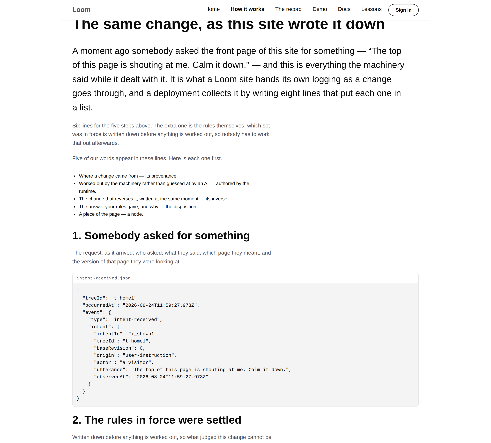
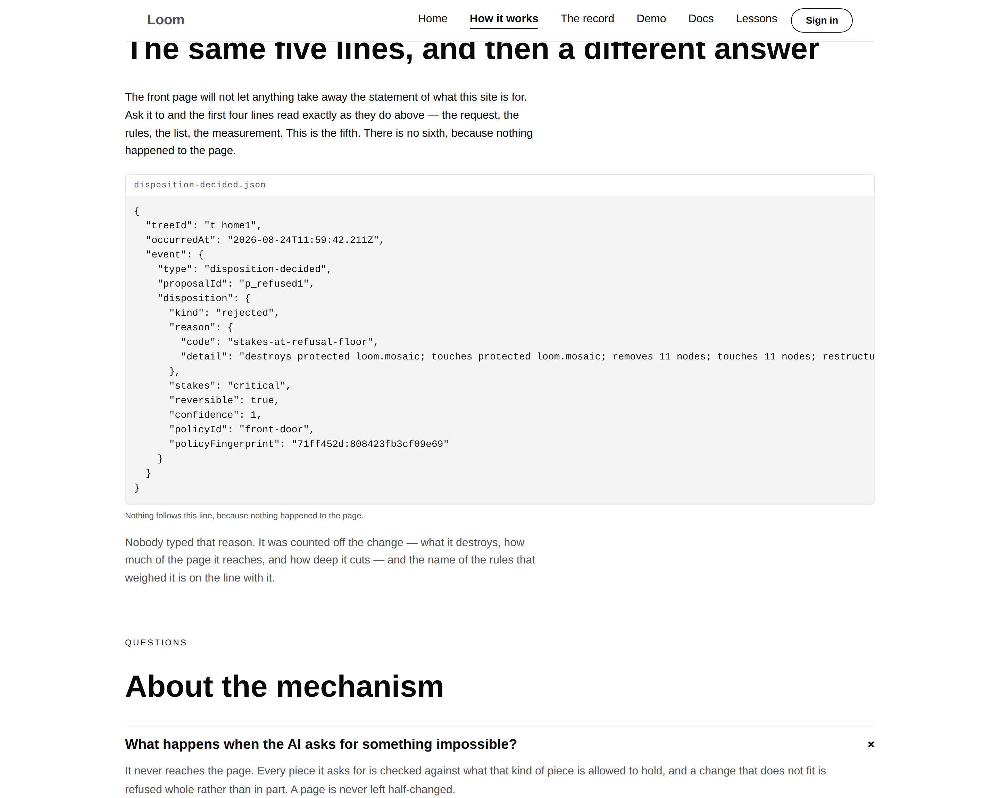
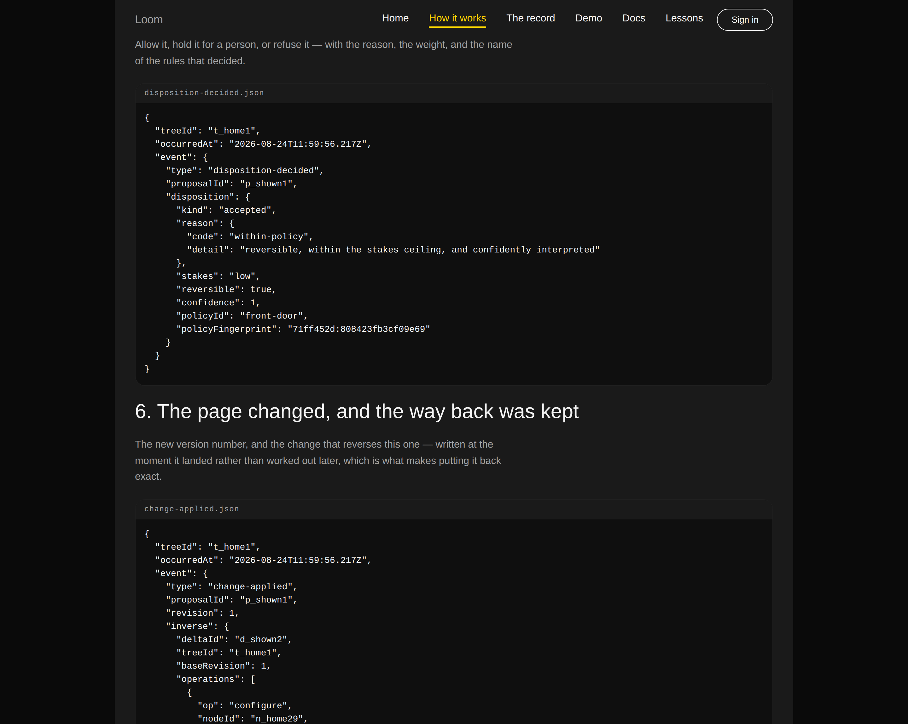
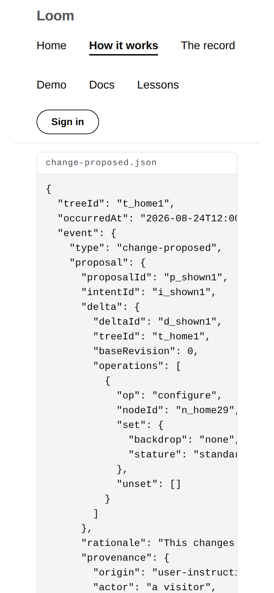

# 2026-08-24 — marketing: the record, printed rather than described

Every page of this site has an argument that rests on the same claim: **Loom can
say what changed, who asked, which rule allowed it, and how to put it back.** The
front door demonstrates it. `/the-record` demonstrates it four changes deep. The
mechanism page explains the five steps it takes.

All three *describe* the record. None of them had ever shown one.



---

## What shipped

**Two bands on `/how-it-works`**, and between them the thing no competitor can
put on a marketing page: the run itself.

A listener is attached to a real request against the front door as this site
publishes it — *"The top of this page is shouting at me. Calm it down."* — and
the page prints **every line the runtime emitted while it dealt with it**, whole,
in order, unedited. Six lines: the request as it arrived, the rules that were in
force, the exact list of changes, the measurement, the answer, and the new
version with the change that reverses it.

Then the second band prints **one line of a second run**: the same request
sequence for the change this site refuses, stopping at the answer.

```
"kind": "rejected",
"reason": {
  "code": "stakes-at-refusal-floor",
  "detail": "destroys protected loom.mosaic; … removes 11 nodes; …"
},
"policyId": "front-door",
"policyFingerprint": "71ff452d:808423fb3cf09e69"
```

Nobody typed that reason. It was counted off the change, and the rules that
weighed it are named on the same line with a digest of what they contained.



## Why the whole envelope, and why it is long

Two decisions worth arguing with, both taken deliberately.

**Nothing is summarised.** A record you can fit on a slide is a record that left
something out, and the audience `docs/rollout.md` names — people who cannot ship
un-reviewed AI output — are exactly the ones who will read the fourth line
carefully. `change-assessed` repeats the whole list from the line before it, and
the page says why rather than trimming it: every line stands alone, so a system
that missed one has still lost nothing.

**Six lines for five steps.** The extra one is `policy-resolved`, and it earns
the sentence it costs: which rules were in force is settled and written down
*before* anything is worked out, so what judged a change is never something
anybody reconstructs afterwards.

## The one assertion the band rests on, and how it is held

The band's only claim is that these lines are the run rather than a picture of
one. So that is what the tests are about, and they are pointed at the run rather
than at a fixture:

- **Character for character.** A listener is attached in the test, to the same
  ask through the same runner, and what it hears is held against what the page
  prints — as *text*, not as parsed objects. Comparing objects would pass a page
  that re-indented the lines or sorted the keys into a nicer order, and both of
  those are edits. Verified by mutation: changing the indent from two spaces to
  four fails this test and nothing else.
- **The way back really goes back.** The change printed on the sixth line is
  taken off the page, applied to the page the run produced, and the result held
  against the page the run started from. The claim a reader can copy off the
  screen is the claim that is checked.
- **A stage nobody has words for fails the build.** The plain sentence above each
  line is keyed by the event type the runtime actually emitted; an unrecognised
  one throws while the page is being built rather than rendering as a hole in a
  record that claims to be complete.

## The register, and the five words that had to arrive

This is the one place on the site where our vocabulary appears whether anybody
chose it or not: the lines are written for a logging system.

[0078](../decisions/0078-the-front-door-speaks-the-visitors-language.md) allows
that on a mechanism page **once the word has been earned** — the plain phrase
doing the work, the name after it. So the band opens with five entries, and each
one is now a *requirement* rather than a courtesy: `voice.test.ts` reads the
glossary off the page rather than keeping a second copy of it, and fails if a
line is deleted, if a plain phrase stops coming first, or if the record ever
prints a sixth reserved word nobody introduced.

**One test was changed and it was strengthened.** `voice.test.ts` read the page
as its *builder* left it, which is the page before the route supplies anything
gathered per request. That was adequate while every such addition was itself
written in the register, and stopped being adequate the moment a band started
printing the runtime's own lines. It now reads the page as it is **served**.

## Found on the way, and it was ours

The first version of this band **made the whole site 1,120px wide on a 390px
phone** — every band, not just the new one: text columns three times the screen,
and a page you read by scrolling sideways.

The cause was one line in `(marketing)/globals.css`, and it had been there for
weeks:

```css
body { display: grid }
```

A grid item's automatic minimum size is its *min-content* size, so the single
implicit column was sized by the widest unbreakable thing anywhere on the page.
Invisible while every band is prose, because prose wraps. A 190-character line
in a code panel is not prose.

It was measured rather than guessed at — `min-width: 0` applied to the page root
alone restored 390px, and `loom.code` turned out to be innocent: it already
scrolls inside its own edge and could not, because it was never the thing being
asked to shrink. The fix is `grid-template-columns: minmax(0, 1fr)`, which is
the column saying it may be smaller than what is in it.

**The front door was already 13px over at 390px** and nobody had noticed. That is
fixed too, by the same line.

`globals.test.ts` is new and holds the stylesheet to both things it is capable of
getting wrong: sizing the page by its contents, and declaring anything the theme
owns.



## Tests

`pnpm install && pnpm verify` **green, exit 0.** Nothing failed, nothing skipped,
no test weakened.

| suite | on this branch |
| --- | --- |
| runtime | **1578**, 0 failed, 0 skipped — `src/` was not opened |
| application | **1688**, 0 failed, 0 skipped |
| marketing, within it | **534** — 492 on `main`, measured |

The forty-two new ones divide as: 20 on the record itself, 10 on the register,
9 on the page as served, 3 on the stylesheet.

The ones worth naming, beyond the three above:

- **The served page carries the band at all.** A page whose central band quietly
  vanishes when a caller forgets to supply it is the failure this site keeps
  finding, and it is silent every time. The route always supplies it, and that is
  now asserted rather than assumed.
- **Seven panels, counted.** Six for the run and one for the refusal, counted
  rather than looked for — a stage the page stopped printing would otherwise show
  up as a slightly shorter page and nothing else.
- **It is a record of the published front door**, checked by the tree id on the
  lines matching the tree the site builds at `/`.
- **The plain half stays plain.** Every title, sentence and caption we write for
  the band is held to the front door's strict standard, not the mechanism page's.
  The lines themselves are the runtime's and are exempt by construction, which is
  what the glossary exists for.

## Decisions and findings

**No record written.** This is 0078 applied to a band rather than a new position,
and the one call that might have wanted one — printing the whole envelope rather
than a digest of it — is argued in `paper-trail.ts` and does not constrain
anything outside this lane.

**No findings filed and none closed.** `src/` was not opened and nothing was
wanted from it: the band is composed from `loom.section`, `loom.heading`,
`loom.prose`, `loom.list`, `loom.list-item` and `loom.code`, all registered, all
starter library. Worth knowing for the lane that owns them: **this is the first
tree in the repository to use `loom.code`** — the lessons surface has a builder
for it and no lesson currently renders one — and it behaves correctly under all
three palettes and at 390px once the page above it stops being sized by it.



## Open questions

All the maintainer's, and all standing:

- **Positioning, audience and the licence line** (#96, restated on #134 and
  #142). The licence line is still the site's one placeholder and still gates
  Phase 2.
- **`FACTS` still turns other lanes' runs red**, and this is the fourth
  consecutive report to say so — #148 hit it again yesterday, on the record
  count, from the primitives lane. The recommendation is unchanged and unanswered.
- **The phone header is three rows**, filed with the measurement on 23 August and
  unchanged by this run.
